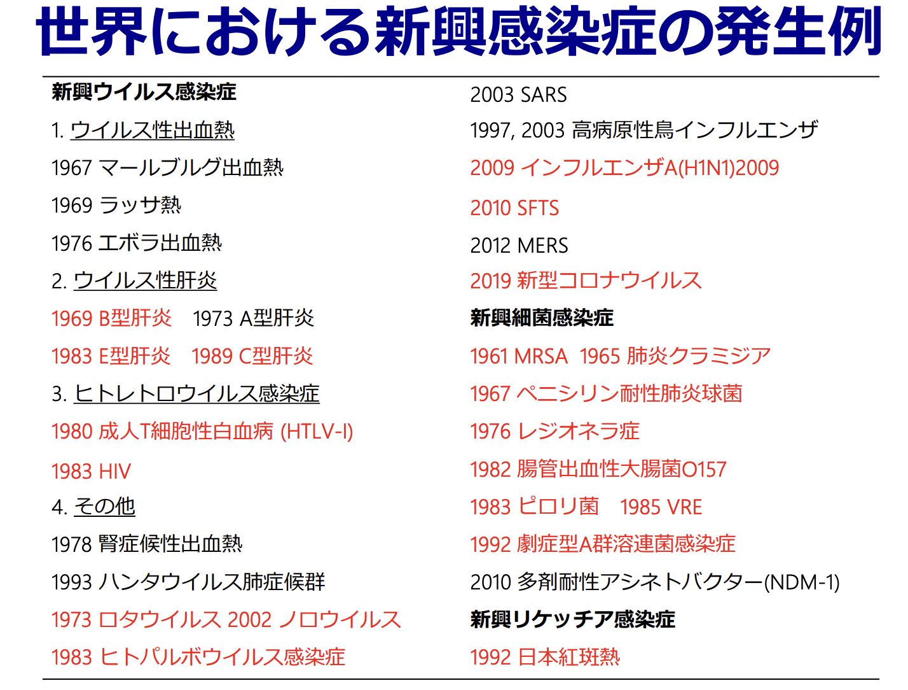
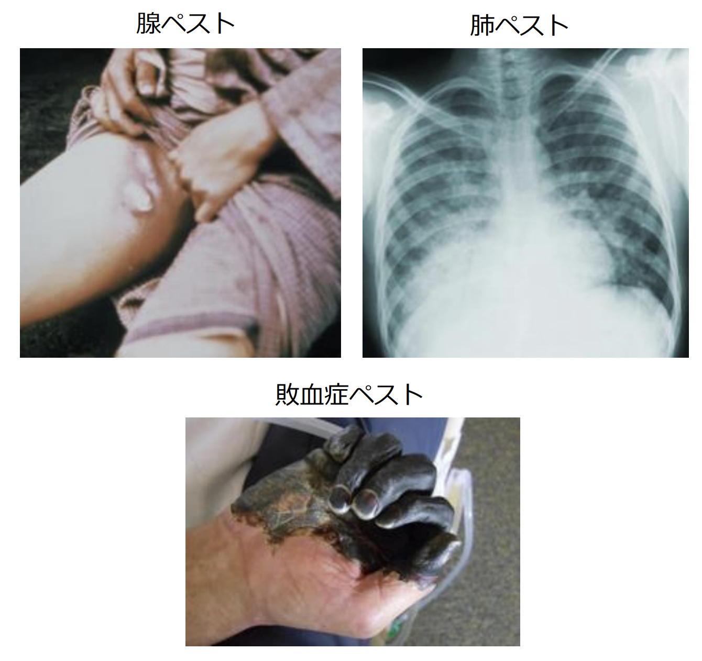
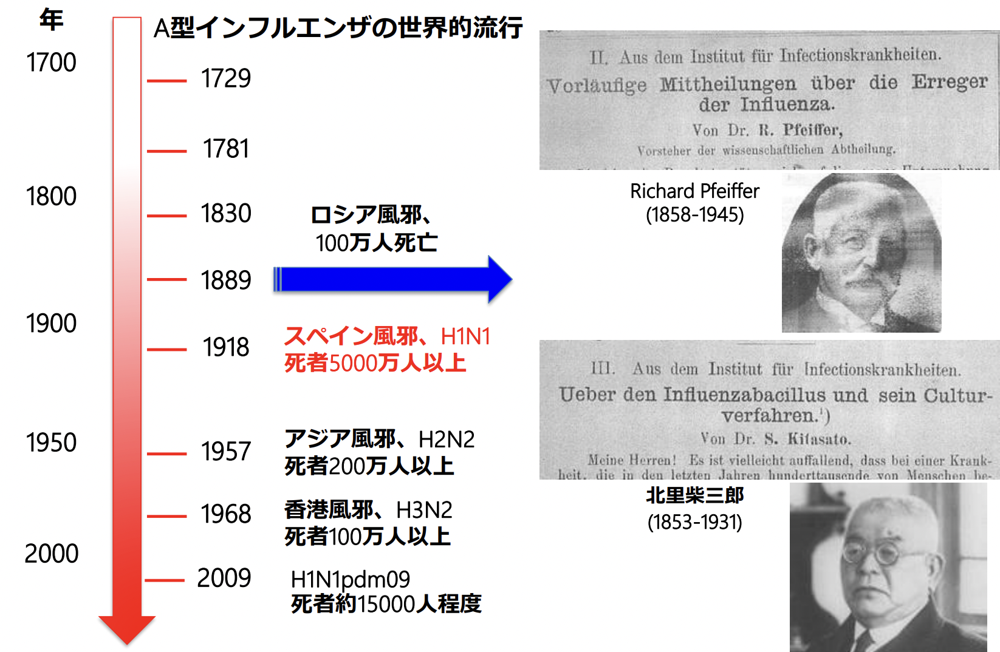
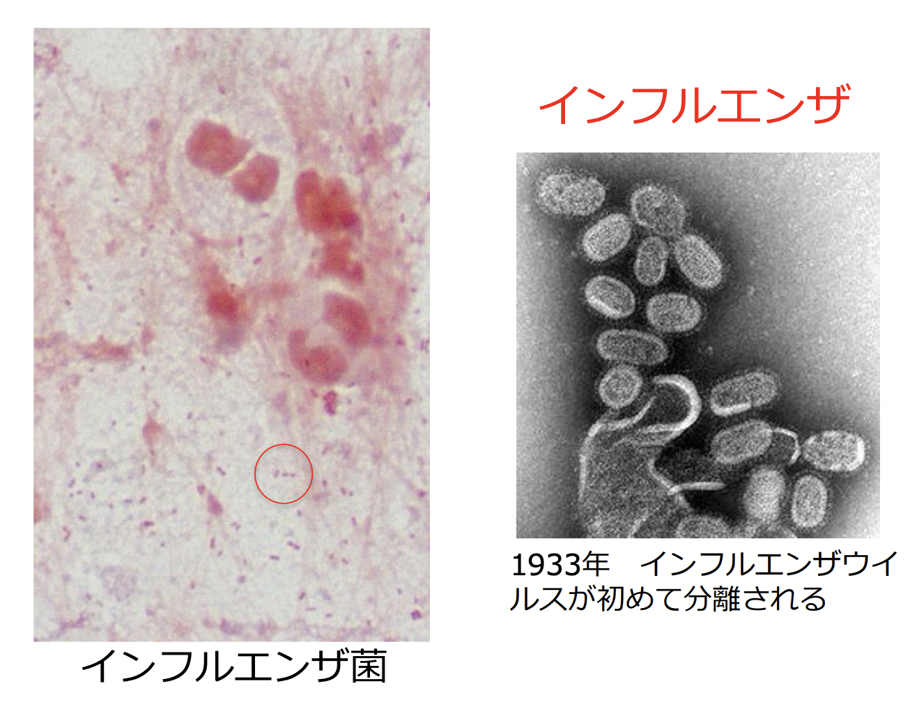
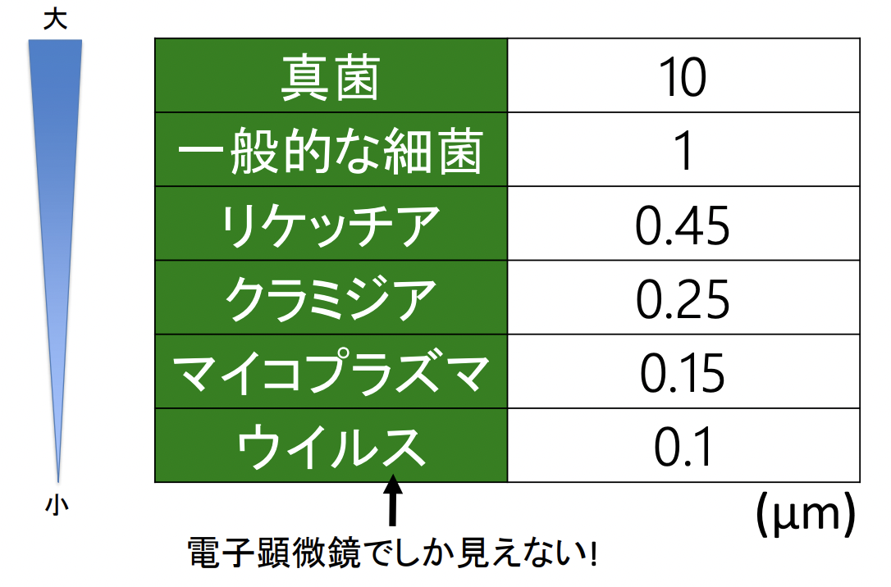
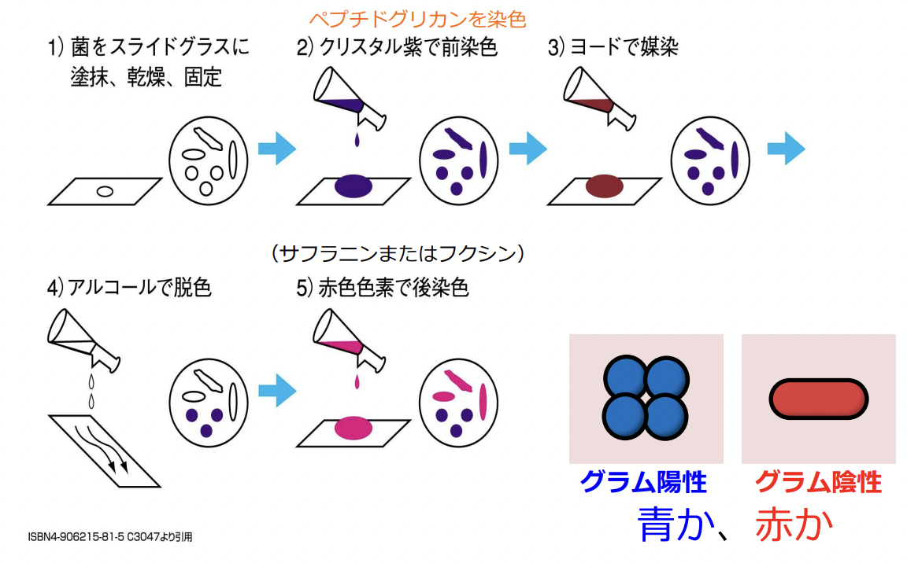
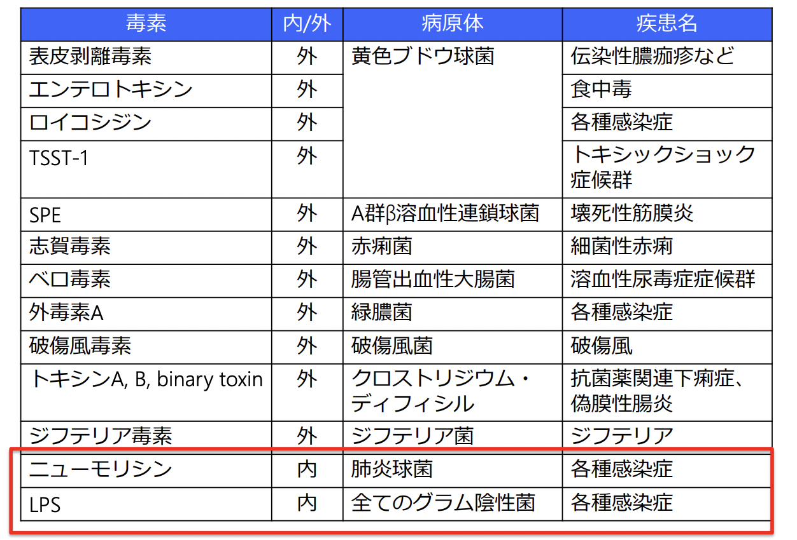
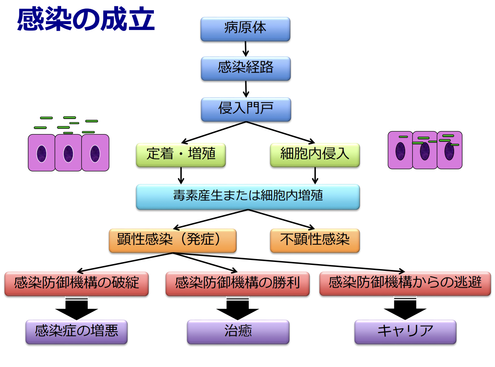
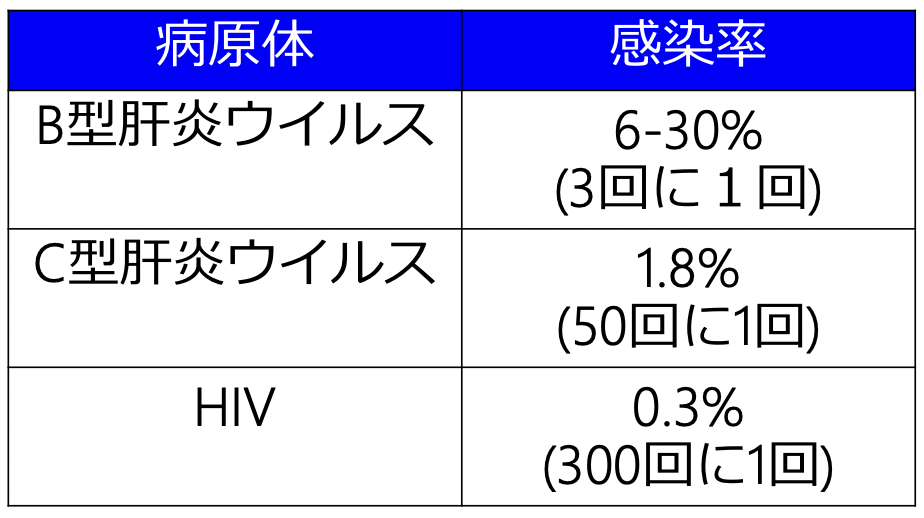

# 0902 総論 
## 感染症の現状
耐性菌の増加、強毒株の出現、菌種の多様化等、病原体は手強さを増している。また、宿主側を見ても、高齢化や基礎疾患の多様性等により感染しやすさを増している。さらに昨今のグローバル化により、感染症の輸出入も増加している。  
にも関わらず、新薬開発は停滞傾向にある。感染症は数日〜数週間で完治してしまうので、製薬会社は儲けを得にくい。そのため、製薬会社が手を引き始めている。  
しかし、感染症は全ての診療科と関連しているため、勉強する意義あり。

## 感染症とは
病原体が体内に侵入し何らかの症状が出現した疾患のこと。  
感染症は身近に存在するものから、そうでないものまで多彩。身近なもので言えば、風邪、食中毒、水虫など。身近でないものでは、輸入感染症、日和見感染症など。  
## 感染症は常に変化している
主な変化要因は、以下の4つ。
1. 爆発的な人口増加に伴うヒトの移動と大規模な森林開発
2. 急速なグローバル化による輸入感染症の増加
3. 地球温暖化と感染症を媒介するベクターの地域拡大
4. 抗菌薬の乱用による耐性菌の増加

### 1. 爆発的な人口増加に伴うヒトの移動と大規模な森林開発 
これにより、新興感染症が出現。これは、それまで明らかにされていなかった病原体に起因した公衆衛生学上問題となるような新たな感染症のことである。  
対義語は、再興感染症。これは、すでに認知されていた感染症で、過去に公衆衛生学上、問題となるほど流行しなかった物や、一旦は下火になり近年再び増加し始めた感染症のことである。  
また、人獣共通感染症の数も増加している。  

#### 代表的な再興感染症
- 狂犬病
- デング熱
- ジカ熱
- マラリア
- ペスト
- ジフテリア
- 結核
- サルモネラ感染症
- コレラ
- 黄熱
- リーシュマニア症
- エキノコックス症

### 2. 急速なグローバル化による輸入感染症の増加
2019年の訪日外国人客数は3188万人、出国した日本人は2008万人。  
これにより、国内で感染症が発生した例として、2014年のデング熱が挙げられる。2014年8月に海外渡航歴なく、代々木公園で蚊にさされた人からデング熱患者が発生。最終的に都内で108名。9月3日に公園内10カ所の蚊を採取し4カ所でウイルスが確認された。当時代々木公園ではアジアンフェスティバルが開催されており、それに伴い多くの外国人がアジア地域から来日していた。  
cf. 2018年度のデング熱報告201例中渡航地はアジア・オセアニアが177例 (88%)
###

## 感染症の歴史
- 紀元前4世紀頃：ヒポクラテスは感染症を「miasma（瘴気）」と唱え、古代の人々はこれを信じていた。  
- 16世紀：ジローラモ・フラカストロが「contagion（伝染）」という概念を発見。  
- 17世紀：レーウェンフックが微生物を発見。
- 19世紀
  - パスツールが、白鳥の首フラスコを使った実験により、感染症が自然発生しないことを証明した。
- コッホが感染症の基本を次々と明らかにした。

### コッホ(1843-1910)
ドイツ人医師、細菌学者。北里柴三郎の恩師。
- 1876年 炭疽菌の発見
- 1882年 結核菌の発見
- 1883年 コレラ菌の発見
- 1905年 ノーベル生理学・医学賞を受賞  

#### コッホの4原則（感染症の基本）
- ある一定の病気には一定の微生物が見出されること。
- その微生物を分離できること。
- 分離した微生物を感受性のある動物に感染させて同じ病気を起こせること。
- そしてその病巣部から同じ微生物が分離されること。
  
cf. 世界初の抗結核薬ストレプトマイシンは、1943年に米国の微生物学者ワクスマンによって発見された。(1952年ノーベル賞)  

## 感染症パンデミックの歴史
主な人類を脅かした感染症パンデミックとしては、以下の3つ。 
- 天然痘
- ペスト
- インフルエンザ
### 天然痘
#### 天然痘ウイルスの特徴
- ポックスウイルス科2本鎖DNAウイルス
- 感染力は100%で、死亡率は20-40%
- 全身性発疹、蜂窩織炎、敗血症、肺炎、脳炎、出血傾向など
- 熱、乾燥に抵抗性
- ヒトのみに感染
- 急性感染のみ
#### 天然痘はどこからきたのか
紀元前1157年 エジプトのラ
ムレス5世が天然痘で死亡
 古代ローマ帝国衰退の要因
 アステカ・インカ帝国滅亡の
要因
 インディアンが50年間で8000
万人→1000万人に
 日本では奈良時代737年に猛
威を振るい、藤原氏4兄弟が
天然痘で死去
 明治にも6回の大流行
#### 治療法
天然痘ワクチンをエドワード・ジェンナーが開発した。  
ジェンナーは、牛痘にかかった搾乳婦が天然痘にかかりにくいことに気づいた。8歳の少年に牛痘の膿を接種し、その6週間後に天然痘を接種したが感染しなかった。この結果をもとに彼は種痘法を確立し、ワクチンを作った。これは世界最初のワクチンである。
#### 天然痘克服までの道のり
- 1926年 世界検疫会議で日本代表が天然痘をペスト、コレラ、黄熱と同様に届け出伝染病に指定するよう提案したのが最初。
- 1958年 WHO総会で「世界天然痘根絶計画」
- 1963年 根絶計画開始の開始
- 1977年 ソマリアにて最後の患者。(日本では1955年の患者が最後)
- 1980年 撲滅宣言

### cf. サル痘
#### サル痘の特徴
- ポックスウイルス科2本鎖DNAウイルス
- 初めてのヒト感染例は1970年
- 感染症法では4類感染症
- 現在患者数は世界で4万人以上。2022/07/23にWHOが緊急事態宣言。(患者の大部分は男性）
- 感染経路
  - 自然宿主はアフリカに生息するリスなどの齧歯類が疑われている
  - 感染したヒトや動物の皮膚病変・体液・血液との接触（性的接触も含む）
  - 患者と対面での飛沫の長時間暴露
  - 患者が使用した寝具などとの接触
#### サル痘の臨床症状
- 潜伏期：通常、7〜14日
- 発熱・頭痛・リンパ節腫脹
- 発熱1〜3日後に発疹
- 発疹は顔面や四肢に多い (海外流行例では性器病変)
- 西アフリカ型 (致死率1%未満)、コンゴ盆地型(致死率10%)
- 多くは2〜4週で自然治癒するのだが、皮膚の二次感染、気管支肺炎、敗血症、脳炎、角膜炎などの合併症が問題となっている。
- 天然痘ワクチンが85%の発症予防効果

### ペスト
ペストとは、ペスト菌 Yersinia pestisによる感染症。  
治療しなければ死亡率は30-100%。  
１週間程度の潜伏期間後、インフルエンザ様の症状が見られる。
#### ペストの種類
- 腺ペスト：最も一般的
- 肺ペスト：最悪の病態。感染者の咳などから分泌された飛沫を介して二次感染。
- 敗血症ペスト：血流感染    
  

#### 西洋でのペストの大流行
最大の流行は、14世紀に起きた。  
当時のヨーロッパ全人口の約3分の1が死亡。
通常、ネズミ → ノミ → ネズミと感染していくが、ここにヒトが介在してネズミ → ノミ → ヒト → ノミ → ヒトとなることで大流行が起きた。  
この流行の原因は、モンゴル帝国のヨーロッパ侵攻と、その支配下でのユーラシア大陸東西交易の活発化であると考えられている。
#### ペストの現在
1990年以降、ほとんどの患者はアフリカで発生している。2013年には世界で783例（126人が死亡）。2019年に中国で肺ペストが発生したとして、衝撃を呼んだ。

### インフルエンザ
  
過去には、インフルエンザはインフルエンザ菌に感染することで発症する、と考えられていたが、1933年にインフルエンザウイルスが同定された。    
#### 毎年流行するにもかかわらず、ワクチンの有効性が100%でない理由
抗原不連続変異が起きることにより、これまでの流行株とは全く異なる構造を持つウイルスへ変化してしまう。そのため、注意深くスクリーニングされている。

tobasiha

## 微生物の特徴
### 生物分類
以前の生物分類は、ホイッタカーによって提唱された5界説に基づいていた。  
しかし、現在は3ドメイン説が強く提唱されている。  
### 原核生物と真核生物
表　重要
### 微生物の種類
- 原核生物
- 真核生物
  - 真菌
  - 
### 何が違うの？
- 大きさ
- 構造
- 感染様式
- 治療法
#### 大きさ
  
#### 構造
##### ウイルスの構造
- ウイルスの構成要素
  - カプシド：核酸を取り囲むタンパク質の殻
  - エンベロープ：脂質と糖蛋白から成る膜状の構造物
  - DNAまたはRNAのどちらかしかもたない
##### 真菌の構造
真菌の細胞壁、細胞膜
#### 感染様式
##### ウイルスの感染様式
ウイルスの感染様式の特徴は、生きた細胞の中でしか増殖できないことだ。RNAウイルスの一例として、新型航路なウイルスの増殖機構を説明する。
##### 細菌の感染様式
体内で定着して細胞分裂で自己増殖しながらヒトの細胞に侵入するか毒素を出して細胞を障害する。
##### cf. 真菌の増殖様式
画像

#### 治療方法
- ウイルス → 抗ウイルス薬
- 細菌 → 抗菌薬
- 真菌 → 抗真菌薬

## 細菌の構造と特徴
### 細胞壁
菌の最外層を覆い、形態を保つ、強固な構造。動物細胞にこの構造はない。真菌や植物細胞には、類似構造がある。  
細胞壁を染める方法として、グラム染色法が知られる。
   
#### グラム陽性菌の細胞壁
分厚いペプチドグリカンの層を持ち、内外の浸透圧から菌を保護する。
#### グラム陰性菌の細胞壁
外膜とその内側にある薄いペプチドグリカンの層からなる。  
外膜は、リポ多糖・リン脂質・リポタンパクを成分として持つ。  
外膜は、グラム陰性菌にのみ存在するとして重要である。  
リポ多糖は、リピドAという高分子の脂質と、それに結合した多糖部分からなる。  
外膜タンパクは20種類ほど存在し、外部からの物質を取り込むために機能する。代表的なものはポーリンと呼ばれるものであり、外界の物質のうち、低分子（分子量900程度）のものを取り込む機能を持ち、薬剤耐性にも関与する。
### 細胞膜
脂質と蛋白で構成される（60-70%は蛋白）。リン脂質の二重層（外：疎水性、内：親水性）を成しており、物質の輸送、エネルギー産生、蛋白合成と分泌、細胞壁の合成に関与する。  
菌種によって膜を構成する脂質に差
がある。なお、動物細胞に含まれるコレステロールは含まれない。
I 〜VII型の分泌装置を持っている。特にII型は、各種タンパクや
酵素を細胞質から輸送する。  
### 細胞質
DNA、リボソーム、プラスミドを含む。プラスミドは環状DNAであり、病原因子や薬剤耐性遺伝子を伝播する。

### リボソーム
リボソーム蛋白とrRNA
(ribosomal RNA)の複合体である。rRNAは菌体内で最も大量に
存在する。  
mRNAからの遺伝情報を読み取ってタンパク質へと変換する役割を担う。  
大サブユニット(50S)と小サ
ブユニット(30S)が会合した70S
・30S内に16S rRNAが含まれ、
細菌の分類に用いられる

### 鞭毛
鞭毛繊維：フラジェ
リンと呼ばれる。
単一のタンパク質。
らせん状に積み重な
り、長さは数μmほど
に達する。
容易に脱落し、良好
な抗原となる。
H抗原と呼ばれる。

### 線毛
鞭毛より細く短い繊維状の構造物（8-3nm)。
直線状で波状構造を示さない。  
線毛には以下の2種類が存在する。
- 付着線毛：細菌感染を成立させる。
- 性線毛：細菌の接合や伝達性プラスミドの運搬に関与。

### 莢膜

### 芽胞

### 外毒素
菌体内で合成され、菌体外に分泌される毒素。  
例として、ボツリヌス菌が分泌するボツリヌストキシンが挙げられる。これは神経毒で、1gで約100万人を殺傷するほどの最強の毒素を持つ。  
  
内毒素

### 細菌の形態

### 細菌の分類
グラム染色と形態に基づいて分類される。
#
## 特殊な細菌と原虫
### リケッチア
リケッチア科（リケッチア属、オリエンチア属、コクシエラ属)。  
細胞内寄生細菌で人工培地では増殖できない。  
大きさは0.2〜0.5μmとかなり小さい。  
感染伝播には、ベクターとなる節足動物（ノミ・シラミ・ダニ）が必要。  
本邦の代表的な感染症として、ツツガムシ病、日本紅斑熱、Q熱がある。

### マイコプラズマMycoplasma
自己増殖可能な最小の微生物 (大きさ0.3μm程度)  
200種類以上存在し、家畜感染症として問題となっている。  
ヒトにはMycoplasma pneumoniae（肺炎マ
イコプラズマ）を原因とする肺炎を引き起こす。  
固形培地（PPLO培地）で目玉焼き状コロニーを形成する。  
細胞壁がないためグラム染色には染まらず、多形性である。

### クラミジア
 グラム陰性桿菌
 細胞内寄生細菌で人工培地では増殖できない
 病原性クラミジアと環境クラミジアに分類
 病原性クラミジアの中でヒトに感染症をきたすもの
• Chlamydia trachomatis (性感染症やトラコーマ)
• C. pneumoniae (肺炎クラミジア)
• C. psittaci (オウム病クラミジア)
 病原性クラミジアは哺乳類・鳥類・両生類・爬虫類などか
ら検出

### 抗酸菌 Mycobacterium
酸やアルコールに脱色されにくい。  
細胞壁に大量の脂質が含まれているため、グラム染色には染まりにくい。そのため、抗酸菌染色（チール・ネル
ゼン染色）を用いる。これで染めると、赤く染まる。  
細胞内寄生菌で、サイズは大きく、結核菌群、非結核
性抗酸菌群、培養不能菌
（らい菌）に分類

### 結核菌の細菌学的性状
 グラム陽性桿菌
 無芽胞、非運動性、遅発育性
 至適環境
偏性好気性 37℃、pH6.4-7.0
 培地：小川培地(液体)とMGIT(固形)の両方を用いる。
 熱には強いが、UVには弱い
 ナイアシンテスト陽性(ナイアシンの産生が抗酸菌の中で結核菌が格段に多い）

総論2
## 感染とは？
病原体(寄生体)が何らか経路で生体(宿主:host)の防御を破って進入し、そこで増殖し、生体が反応すること。
### 感染のプロセス
- 定着：病原体(寄生体)が存在しても増殖しない
- 潜伏期間：感染から発病までの期間
- 内因感染：宿主に常在している微生物による感染
- 外因感染：外来微生物による感染  
    

### 経気道感染
p6zyuuyou
|          | 拡散方式                         | 主な疾患                                                         | 主な対策                                                                       | 
| -------- | -------------------------------- | ---------------------------------------------------------------- | ------------------------------------------------------------------------------ | 
| 空気感染 | 蒸発し、空気の流れにより拡散する | 結核 麻疹ウイルス 水痘ウイルス 帯状疱疹ウイルス         | ・空気予防作（陰圧室隔離、N95マスク） ・標準予防策 ・清掃                | 
| 飛沫感染 | 水分を保ち、約1m程度で落下する   | マイコプラズマ インフルエンザウイルス 風疹 おたふくかぜ | ・飛沫予防策（サージカルマスク、ゴーグル、個室推奨） ・標準予防策 ・清掃 | 

### 経粘膜感染
（性感染症;sexually transmitted disease: STD）
- 梅毒
- 淋菌感染症
- 性器クラミジア感染症
- 性器ヘルペス
- 尖圭コンジローマ（HPVウイルス）
• 膣トリコモナス症
• 細菌性膣炎
• ケジラミ症
• 性器カンジダ症
• 非クラミジア性非淋菌性尿道炎

### 針刺しでの感染率

### 垂直感染する病原体
- 経胎盤感染
  - 風疹ウイルス
  - サイトメガロウイルス
  - ヒトパルボウイルスB19
  - 梅毒
  - トキソプラズマ
- 経産道感染 
  - B型肝炎ウイルス
  - 単純ヘルペスウイルス
  - HIV
  - B群溶連菌
- 母乳感染 
  - HTLV-I
  - HIV

#### 妊婦の感染症検査と対策
妊娠初期に調べる感染症

## ウイルス
###　サイトメガロウイルス肺炎
ヘルペスウイルス科に属するヒトヘルペスウイルス5。  近年、低下傾向にはあるが、乳幼児期にほとんどが感染してしまう。  
先天性サイト
メガロウイルス感染症に注意
・感染様式は、初感染、潜伏感染の再活性化、再感染の３つ
・CMVは通常、幼少期に不顕性感染の形で感染し、生涯その
宿主に潜伏感染する
・免疫抑制患者の肺炎は潜伏感染の再活性化にて生じる
・肺炎以外に腸炎、網膜炎などをひき起こす
・症状は発熱、咳嗽、呼吸困難
・治療はガンシクロビルが第一選択