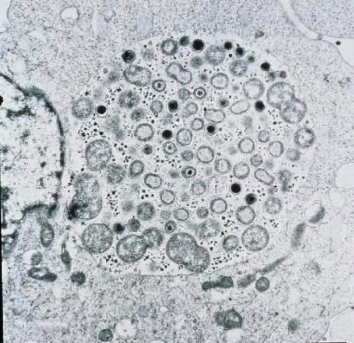
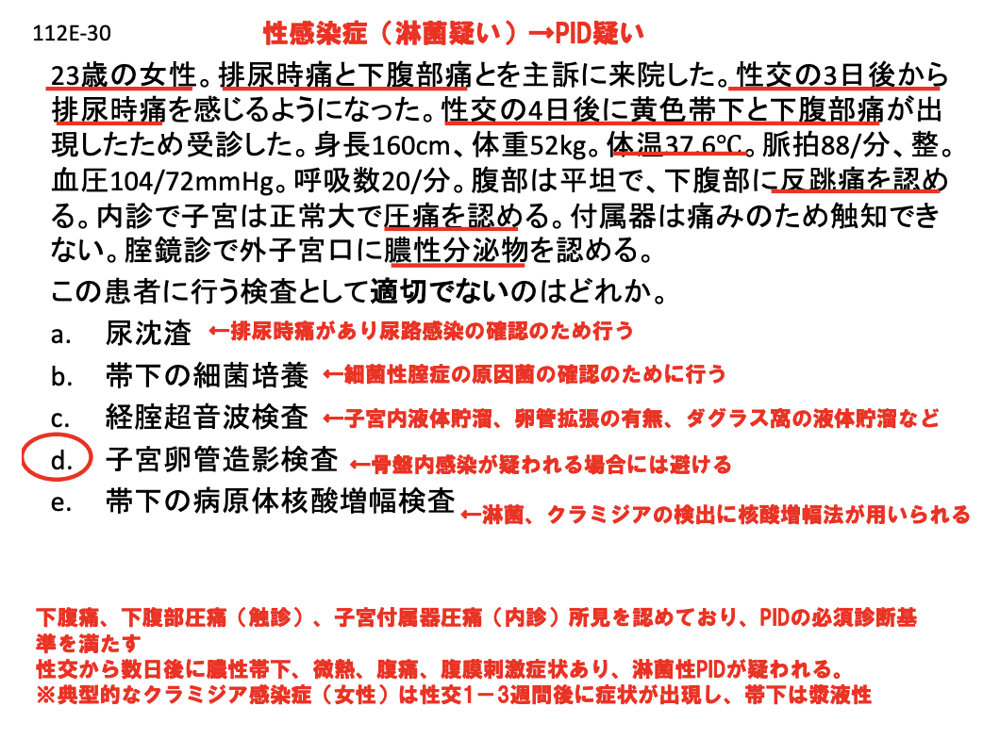
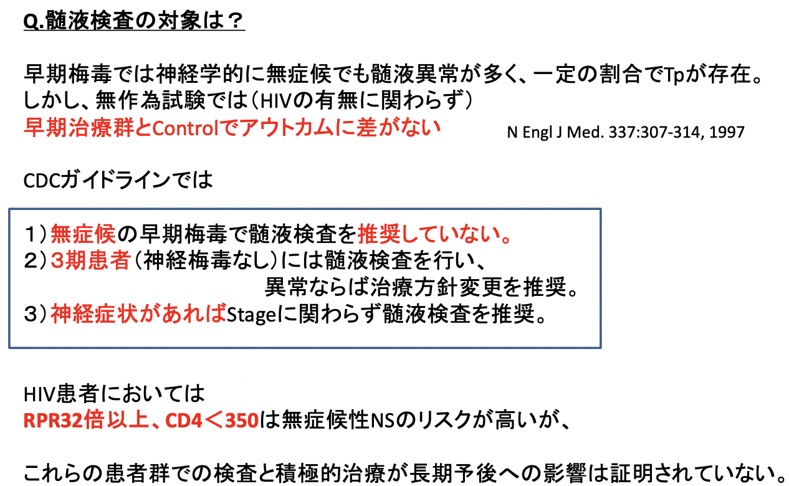

# 0915 特別講義 性感染症
## 性感染症の背景と歴史
### 梅毒の歴史
15Cの大航海時代、コロンブスが1493年にハイチ諸島から梅毒をヨーロッパにもたらし、それが大流行。バスコ・ダ・ガマの東洋探検航海により欧州から東洋へ。さらに、インド、中国を経て、日本には1512年に到来という説がある。

### 性感染症とはどんな病気なのか？  
性行為またはそれに類似する行為で感染する病気の総称。  
**粘膜と粘膜の接触**・**体液の交換**で感染が成立。

### 性に関する病気の名称の変遷
日本では性にまつわる病気の名称は、**花柳病**（S2〜）➡︎**性病**（S23〜）➡︎**性感染症**（S63〜）と変遷。  
WHO（世界保健機構）においては、**VD venereal diseases** ➡︎ **STD sexually transmitted disease**（S50〜）➡︎ **STI sexually transmitted infections**（H10〜）と提唱を変遷。  
この背景には、**性感染症の概念の拡大**がある。

### STI病原微生物の大きさの変化
病原微生物の大きさを比較すると、かつての性病時代は**マクロ・ミクロ**レベルの**寄生虫**が主体だったが、今日では**ウイルス性**に変化してきており、**ナノメーター**オーダーの病原微生物が主体となっている。

  

### STI症状の変化
**症状の有る**性感染症 **STD Sexual Transmitted Disease** ➡︎ **症状の無い**性感染症（**無症候性性感染症**） **STI Sexual Transmitted Infection**

## 性感染症の種類
梅毒、淋菌感染症、性器クラミジア感染症、性器ヘルペス、尖圭コンジローマ、性器伝染性軟属腫、腟トリコモナス症、細菌性腟症、ケジラミ症、性器カンジダ症、非クラミジア性非淋菌性尿道炎、軟性下疳、HIV感染症/エイズ、A/B/C型肝炎、赤痢アメーバ症  
### 四大/六大性感染症
|                            | eg.                                                                                  | 
| -------------------------- | ------------------------------------------------------------------------------------ | 
| 五類感染症 定点把握疾患 | 性器クラミジア感染症 淋菌感染症 性器ヘルペスウイルス感染症 尖圭コンジローマ | 
| 五類感染症 全数把握疾患 | 梅毒 後天性免疫不全症候群（HIV/エイズ）                                           | 

## 性器クラミジア感染症
- 病因：**クラミジア Chlamydia trachomatis** による感染。
- 病態：**男性尿道炎**、**精巣上体炎**、**子宮頸管炎**、**骨盤内感染症**、**咽頭感染**
- 主な病態と特徴：漿液性の分泌物など、気づきにくい症状が多い。　　 

|          | 男性尿道炎                                                                                                               | 子宮頸管炎 骨盤内感染症                                                                                 | 
| -------- | ------------------------------------------------------------------------------------------------------------------------ | ---------------------------------------------------------------------------------------------------------- | 
| 潜伏期間 | 1〜2, 3週間                                                                                                              | 1〜2, 3週間                                                                                                | 
| 症状     | ・**漿液性～粘液性の分泌物**（少量～中等量） ・軽度の排尿痛 ・軽度の尿道掻痒感 ・軽度の不快感 ※無症候感染も多い | ・**漿液性の帯下**増量感 ・不正出血 ・下腹痛ときに上腹部痛 ・性交痛 ・内診痛 ※無症候感染も多い | 
| 検査方法 | EIA法 核酸増幅法（PCR、SDA、TMA）                                                                                     | 核酸増幅法（PCR、SDA、TMA）                                                                                |   

     
  
  
  
    
  
  
オーラルセックスの頻度は高い一方、それによる感染もよく見られる。しかし、**喉の感染は治りにくい**という実態がある。

## 淋菌感染症
2019年**抗菌薬耐性の脅威**レポートで列挙された細菌および真菌の一つ。   
- 病因：淋菌 Neisseria gonorrhoeae による感染。  
- 病態：男性淋菌性尿道炎、淋菌性精巣上体炎、女性性器淋菌感染症（子宮頸管炎、骨盤内炎症性疾患、肝周囲炎、尿道炎及びバルトリン腺炎）、淋菌性咽頭感染、播種性淋菌感染症、淋菌性結膜炎
- 主な病態と特徴  

|          | 男性淋菌性尿道炎                                                                                                | 子宮頸管炎                                                                                                      | 
| -------- | --------------------------------------------------------------------------------------------------------------- | --------------------------------------------------------------------------------------------------------------- | 
| 潜伏期間 | 2～3日間                                                                                                        | 判然としない                                                                                                    | 
| 症状     | 排尿痛 尿道分泌物（黄白色、**膿性**） 尿沈渣白血球（多数）                                                    | 膿性帯下の増量や不正出血 一般的に女性は感染しても無症状の例が多い                                            | 
| 検査法   | **グラム**染色（**陰性双球菌**）・鏡検法（但し、子宮頸管、咽頭、直腸などでは推奨しない） 淋菌培養 核酸増幅法（PCR, SDA, TMA法） | **グラム**染色（**陰性双球菌**）・鏡検法（但し、子宮頸管、咽頭、直腸などでは推奨しない） 淋菌培養 核酸増幅法（PCR, SDA, TMA法） | 

  

### 淋菌感染症の治療法  
注射薬が基本。  
例えば、セフトリアキソンやスペクチノマイシンが使われる。ただし後者は、咽頭感染には使えない。  

  

### 国試例題
  

## 尖圭コンジローマ
### ヒトパピローマウイルス HPV
HPVは**パピローマウイルス**属のウイルスであり、**エンベローブを有さない球**状の**外皮**（**カプシド**）内に**2本鎖DNA**を持つ比較的**小**型のウイルスである。  
ヒトに感染する型は100種類以上が特定されており、30～40種類の型が性的接触によって感染する。これらのうち、約15種類が**発癌**性であり、**子宮頸癌**を引き起こす可能性がある。発癌性のHPVのうち、**16**型と**18**型が最も検出頻度の高い発癌性HPVで世界的には約70％の子宮頸癌から検出される。

### 尖圭コンジローマの病因   
HPV型が**6**型 or **11**型の感染による**良**性で**粘膜**型のイボを、尖圭コンジローマという。
  

#### HPV Infection and Life Cycle

### 尖圭コンジローマ：病態
**乳頭**状あるいは**鶏冠**状の**イボ**が特徴。  
- 感染部位：外陰部、肛囲、肛門内尿道口、腟、子宮頸部
- 自然消失率：20～30％（再発を繰り返す）
- 自覚症状：一般に自覚症状はない
- 潜伏期間：3週間～8ヵ月（平均2.8ヵ月）
- 再 発：3ヵ月以内に約25%は再発する

### 尖圭コンジローマの診断
尖圭コンジローマの診断は、通常**視診**で行われる。  
男性例は**視診のみ**、女性例では**視診と細胞診**を実施。  
確定診断を行う際は、病理組織学的検査（生検）を実施。  
腟内や子宮頸部では、3%酢酸溶液、外陰部では5%酢酸溶液で処理後、コルポスコピーまたは拡大鏡にて観察する。  
研究機関では、HPVのDNA型判定を行うこともある。

### 尖圭コンジローマの治療法
- 凍結療法（液体窒素）
  - メリット：麻酔が不要、瘢痕が残りにくい
  - デメリット：治療期間が長い、中程度～大きな病変には不可、侵襲（強い疼痛）を伴う
- 電気焼灼、レーザー蒸散、外科
  - メリット：治療期間が短い
  - デメリット：侵襲（頭痛）を伴う、局所麻酔が必要、瘢痕が残りやすい
- ポドフィリン、5-FU軟膏
  - 医師による塗布が必要
  - 塗布部位に、びらん・潰瘍等を生じることがある
- IFN-α局注
  - 治療費が高額
  - 発熱など、全身性の副作用を催す  

#### 尖圭コンジローマの治療ガイドラインの変遷  
**イミキモドクリーム**がファーストラインになっている。  
  
  

## 性器ヘルペス
- 潜伏期：性的接触から2～10日。  
- 症状
  - 外性器に水疱ができ、それが破れて潰瘍になる。  
  - 脚の付け根のリンパ節が腫れる。
  - 痛みがある。特に女性では痛みが強い。
  - 再発を繰り返す。
- 病因：単純ヘルペスウイルス1型または2型による感染
- 主な病態と特徴  

|              | 初感染初発                                                                                                                                                 | 再発                                                                                                       | 
| ------------ | ---------------------------------------------------------------------------------------------------------------------------------------------------------- | ---------------------------------------------------------------------------------------------------------- | 
| 潜伏期間     | 2～10日間                                                                                                                                                  |                                                                                                            | 
| 症状（男性） | 性器にかゆみや違和感を伴った複数の水疱 円形の有痛性の浅い潰瘍 鼠径リンパ節腫脹 尿道分泌物                                                         | 水疱性あるいは浅い潰瘍性病変（軽度） 全身倦怠感、下肢の違和感などが1週間 程度続くこともある          | 
| 症状（女性） | 浅い潰瘍性または水疱性病変が多発 強い疼痛、排尿困難、ときに歩行困難 ほとんどの症例で鼠径リンパ節の腫脹、圧痛がみられ、38℃以上の発熱を伴うこともある | 小さい潰瘍性あるいは水疱性病変（軽度） 再発前に、外陰部の違和感、大腿から下肢への疼痛を訴えることもある | 
| 検査法       | HSV分離培養法 蛍光抗体法によるHSV抗原の証明                                                                                                             | HSV分離培養法 蛍光抗体法によるHSV抗原の証明                                                             | 

### 性器ヘルペスの治療法
  
#### 再発頻度
年間再発数が**5**回以上の患者が12%を占める。そのため、再発抑制療法の需要が高まっている。  

## 梅毒
近年、梅毒患者が急増している。 
### 免疫応答正常者における梅毒の自然経過 

### 梅毒の分類
  
### 第1期梅毒
感染**数時間**で**リンパ管**や**血液内**に到達し、**初期病変が出現する**前に**全身感染**を起こす。  
- 初期病変：無痛性。通常3＝6週間を超えずに消退する。
  - 初期硬結：感染部位に生じる。潜伏期間は接種されたTreponemaの数と比例。すぐに潰瘍化。
  - 硬性下疳
    - 男性➡︎冠状溝、包皮内板、陰茎
    - MSM➡︎肛門、直腸、口唇、口腔内
    - 女性➡︎陰唇、子宮膣部、乳頭、口唇
  - 無痛性の鼠径リンパ節腫脹（無痛性横痃）。数ヶ月持続
  - 早期神経梅毒 
    - 中枢神経浸潤 25-60%
    - 無症候
    - 症候性(5%)：髄膜炎、脳神経炎、髄膜血管梅毒、眼症状

### 第2期梅毒
- 全身症状：発熱(5-8%)、咽頭痛（15-30%)、倦怠感(25%)、頭痛(10%)、体重減少（2-20%)、食欲不振(2-10%)、全身リンパ節腫脹(85%)
- 皮膚粘膜病変：梅毒性バラ疹、丘疹性梅毒、梅毒性乾癬、扁平コンジローマ、梅毒性アンギーナ、梅毒性脱毛
- 髄液異常 40%
- 肝炎：1/4にみられる
- 免疫複合体による糸球体腎炎
  
症状としては、ばら疹が有名だが、頻度が高いのは**丘疹**や**乾癬**。  

### 神経梅毒の診断
髄液検査は、1,2期では神経症状がない限りは行う必要はないが、3期以降は必須。（1,2期も中枢神経浸潤は見られる。）  
  

### 第3期梅毒
- 症状
  - ゴム腫（良性肉芽腫病変）
  - 心血管梅毒（上行大動脈栄養血管の侵襲→動脈瘤）
  - 症候性晩期神経梅毒（髄膜血管型）中大脳動脈の損傷により脳卒中症候群
  - 進行麻痺 2-5%
  - 脊髄癆 2-9%
  - 無症候 25%

### 梅毒の診断
| STS ガラス板法、RPR、VDRL | TPHA 特異的抗体 |                            | 
| ---------------------------- | ------------------ | -------------------------- | 
| ＋                           | ＋                 | 活動性感染（治療を要する） | 
| ＋                           | ー                 | 感染初期 or 偽陽性         | 
| ー                           | ＋                 | 治癒                       | 
| ー                           | ー                 | 未感染 or 感染初期         |  
   
STSは、治療効果の評価に使える。

### 梅毒の治療薬
治療は基本ペニシリンを用いるが、Jarisch-Herxheimer反応に気をつける必要がある。  
この反応は、初回治療開始6-8h後に生じる、抗菌薬による菌体破壊から生じる
Lipoprotein、PAMPsによって惹起されるCytokine stormの一種。  
症状としては、悪寒、高熱、頭痛、全身倦怠感、薬疹様の発疹。  
ペニシリン使用例に多く、２期に多いがどの病期でもありうる。  12-24h程度持続し、重症度は様々。  
眼梅毒、神経梅毒、心血管梅毒などは局所で反応をおこし得る。特に心血管梅毒では動脈瘤破裂や肝動脈閉塞から突然死を起こし得るので注意が必要。  
抗炎症薬を4h毎に24-48h程度使用することで予防できる。  
  
  
  

## HIV
死者、新規感染者は減少傾向にあり、HIVを持ちながら生きながらえる人が増えてきた。  
なお、「梅毒の陰にHIVあり」とのこと。  
### HIVの治療法
抗HIV薬は、HIVが増殖するための過程および酵素を阻害して、新たなウイルス粒子を作ることができなくする。  
原則、以下に示したBackbone drugとKey drugの多剤併用療法を行う。
- Backbone drug 
  - 核酸系逆転写酵素阻害薬 NRTI 2剤
- Key drug
  - 非核酸系逆転写酵素阻害薬 NNRTI
  - プロテアーゼ阻害薬 PI
  - インテグラーゼ阻害薬 INSTI  

以降、国試問題が載っていたのでチェック。