# 0915 特別講義 HIV
HIVは、レトロウイルス科レンチウイルス属。＋1本鎖RNAを持つ。  
構造タンパク質をコードするgag, pol, env、調節タンパク質をコードするtat, rev、アクセサリー遺伝子vif, vpu, vpr, nefが有名。  
逆転写酵素をもち、ヒトゲノムに組み込まれる。
## HIVの感染・増殖
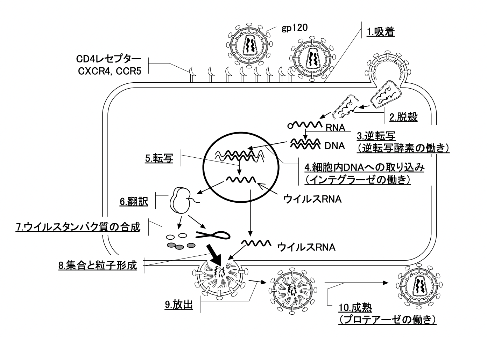  
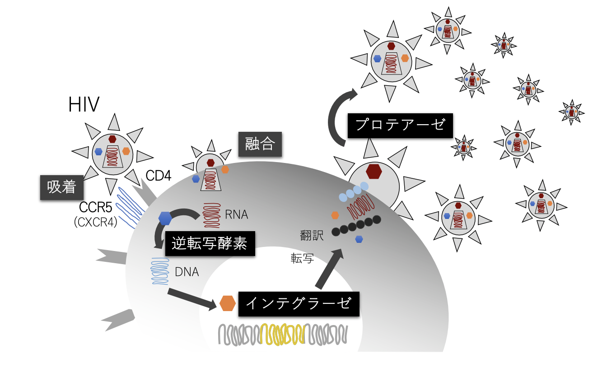  
### 粘膜を介したHIVの感染
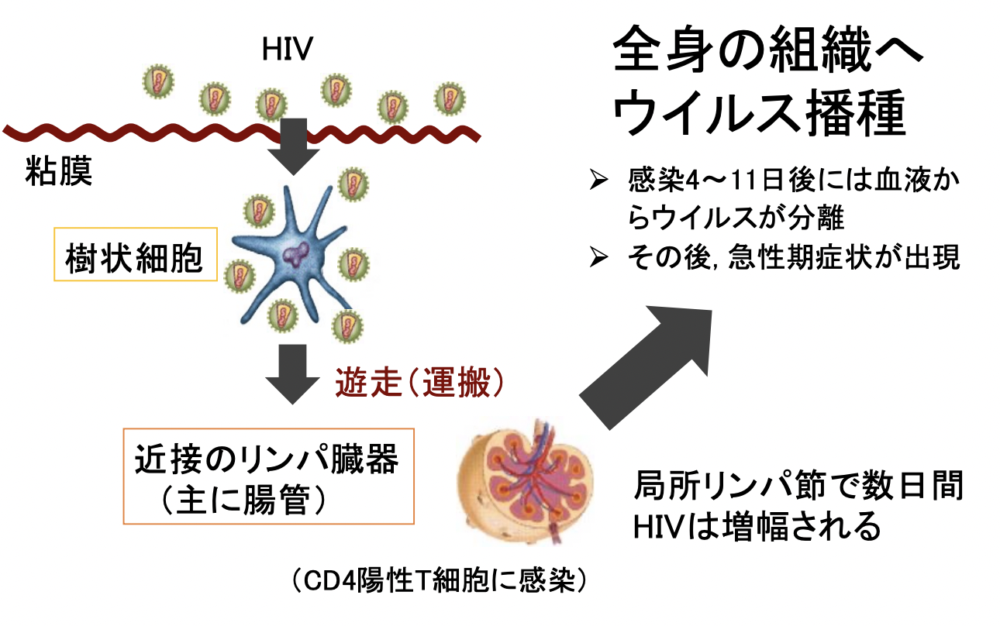
### AIDSとは？
AIDSとは、病気が進行したHIV感染症のこと。
### HIV感染症の経過と臨床病期
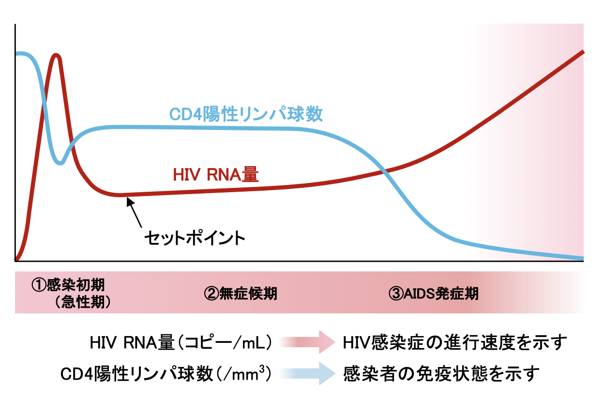  
### HIV感染者/AIDS患者における感染経路の割合
案外異性間によるものも多い。   
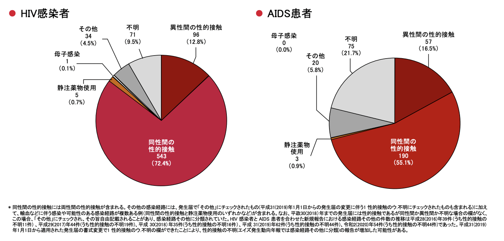
### HIV感染の自然歴
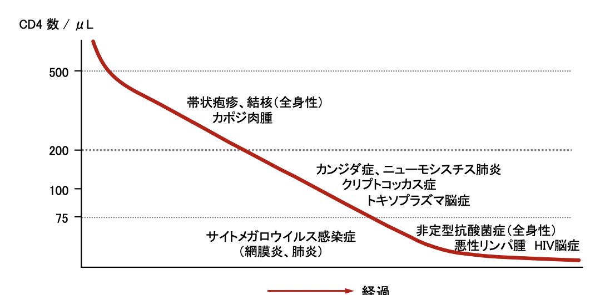   
#### ニューモシスチス肺炎（PJP）
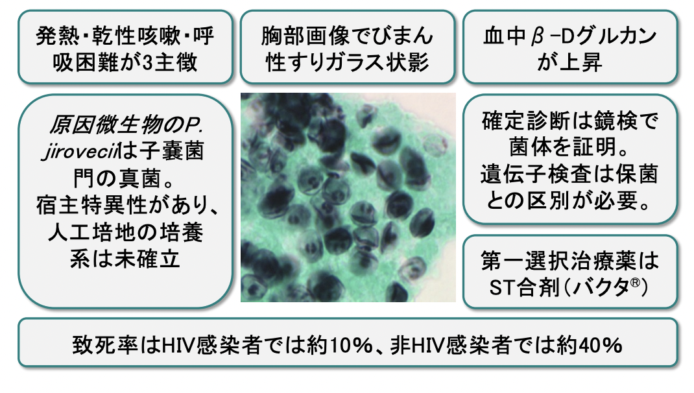  

  

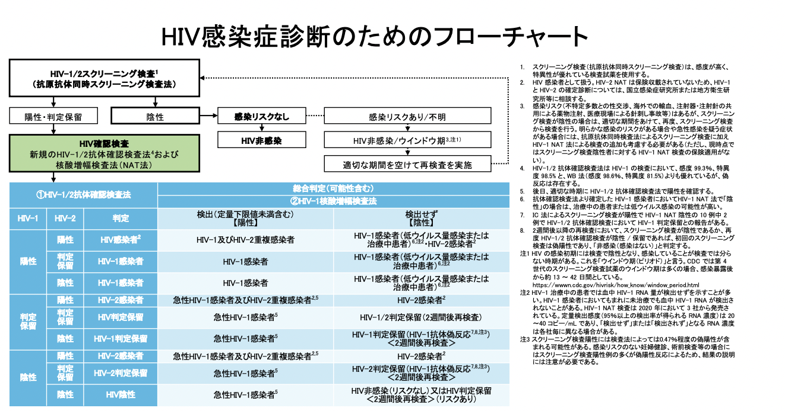  
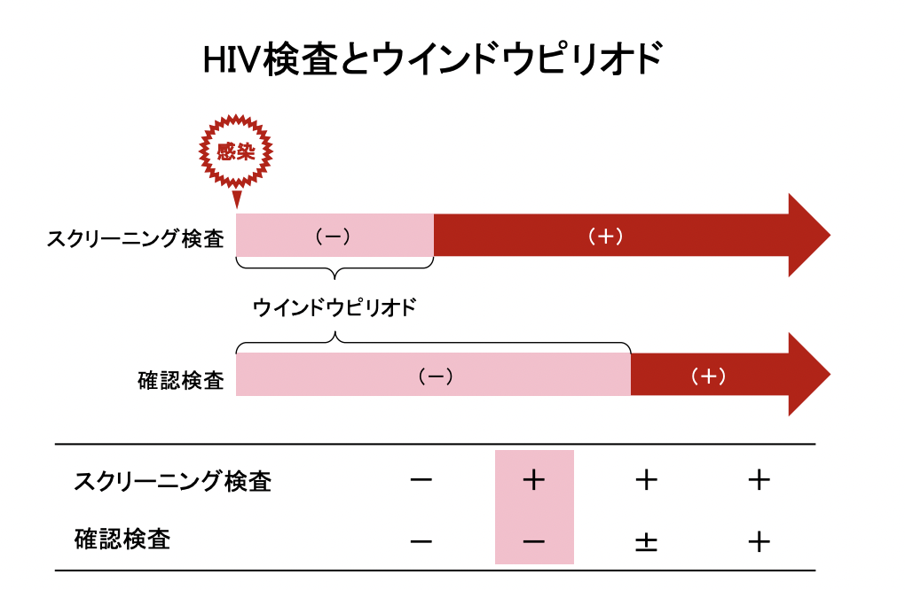  
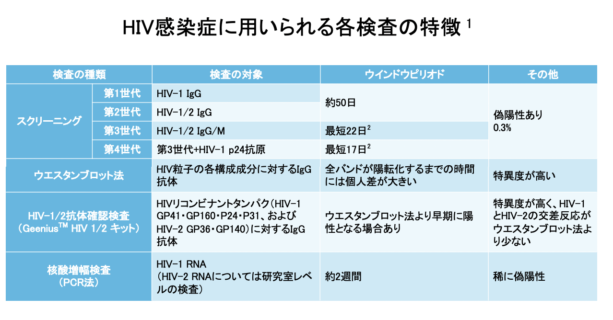  

#### HIVスクリーニング検査の偽陽性率0.3 ％とは？
国内の妊婦検診の集計で、1万人に31人（約0.3%）が陽性と判定されている。しかし、日本国内の妊婦のHIV感染率は多く見積もっても1万人に1人なので、陽性と判定されx31人中30人は偽陽性であり感染していないということになる。

### HIV感染症の治療
HIV治療は、昔は日和見疾患の予防と治療にとどまったが、治療の進歩を経て、現在は抗HIV療法ARTが行われている。  
また、抗HIV薬治療の開始時期も昔と異なり、現在はCD4の数に限らず、全てのHIV感染者に治療開始が推奨されている。  
抗HIV療法 ART; Anti Retroviral Therapyとは、抗HIV薬を組み合わせた多剤併用療法のことである。  
1996年から本格的に始まった抗HIV薬による多剤併用療法は、英語での表記を略し
てHAART Highly Active AntiRetroviral Therapyと呼ばれるようになった。最近ではARTと表記されることが多くなっている（アメリカではcART combined
AntiRetroviral Therapyと呼ばれることもある）。  
#### ARTの目標
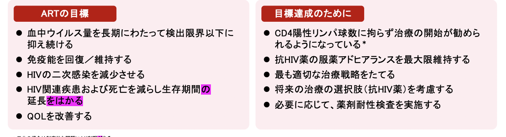  

また最近では、月に1回の注射による治療やHIV予防薬も出てきている。

### アドヒアランスの重要性 
HIV-1感染症は、感染成立からAIDS発症まで多くの場合、数年間ほとんど症状がない症状期があることから、HIV-1はあまり活発なウイルスではないように思われるが、実は、感染者の体内で1日に10億～100億個が新生される活動性の高いウイルスである。また、HIV-1の逆転写酵素は精度が低いため、1日に生み出される変異ウイルスの数は3〜30万と考えられている1,2。このように、HIV-1はもともと変異を獲得しやすいことから、不十分な治療は多くの薬剤耐性ウイルスを生み出す。

