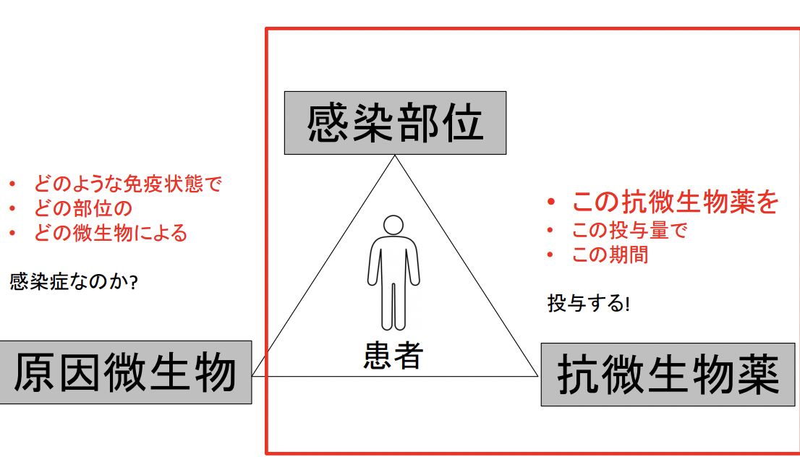
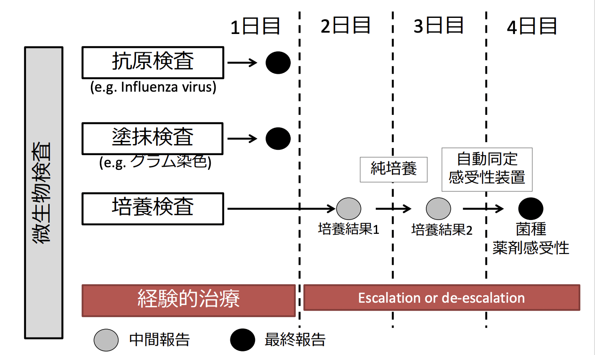
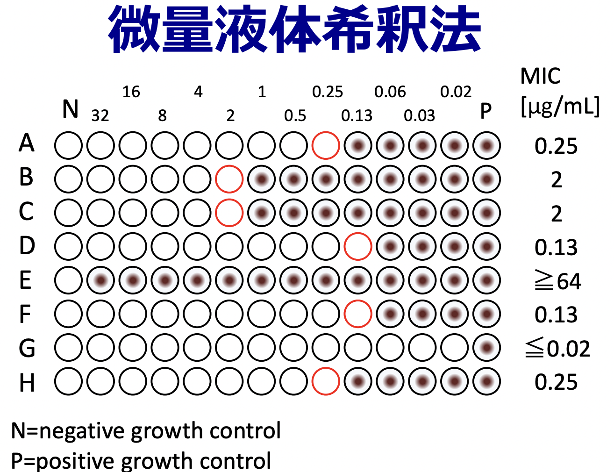
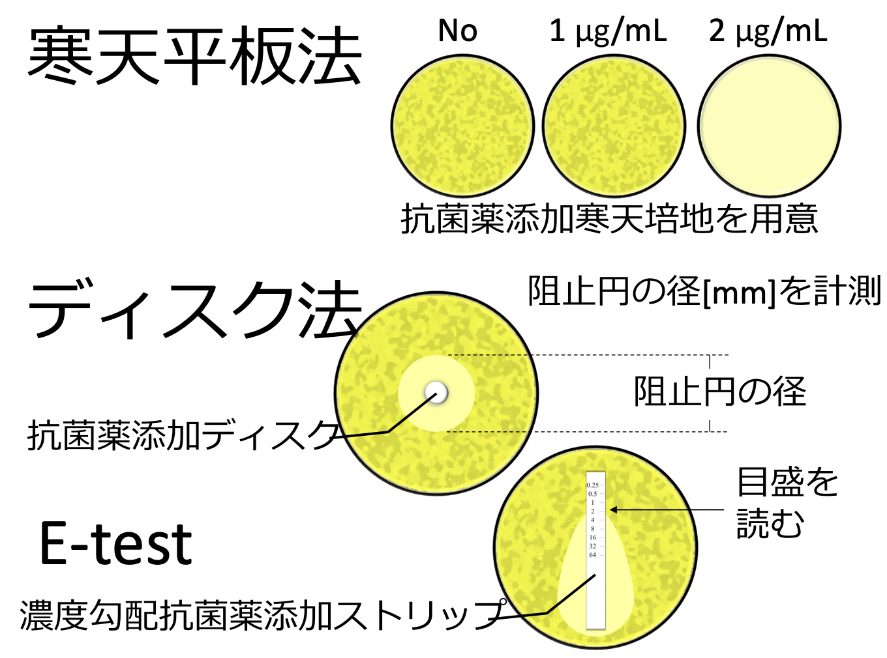
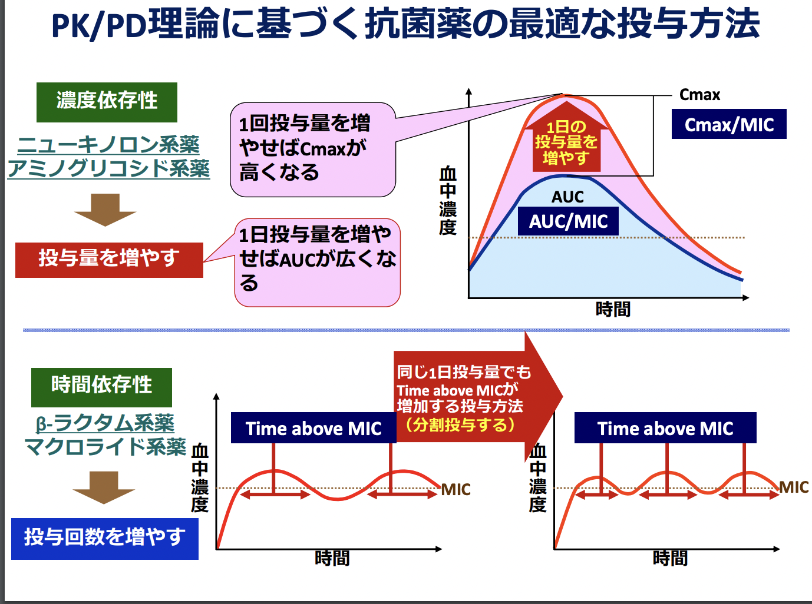
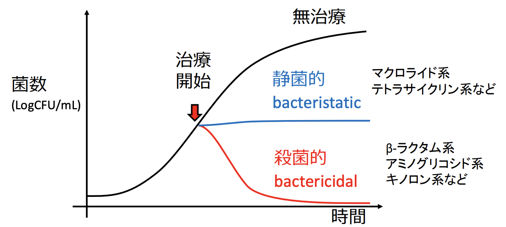
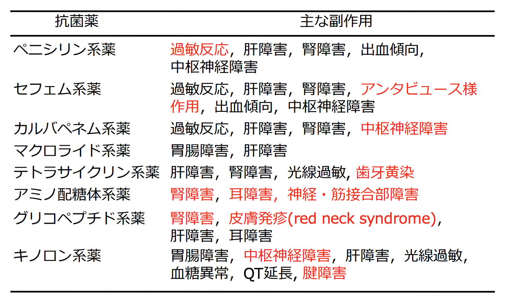
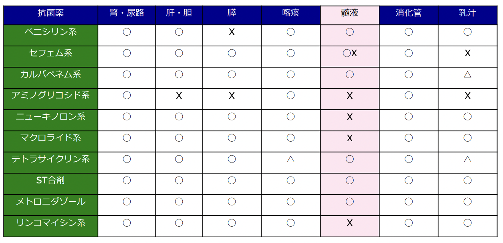
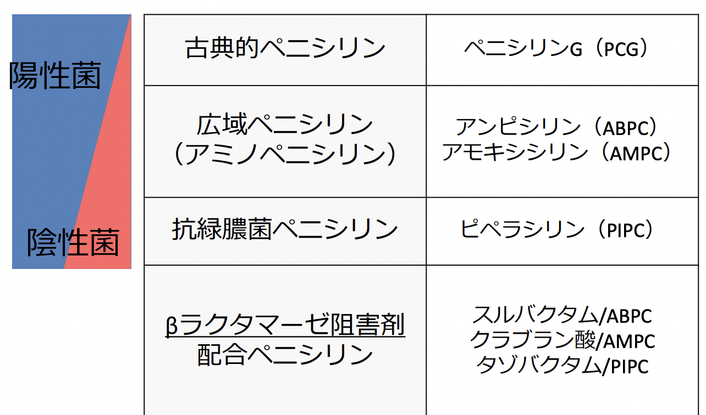
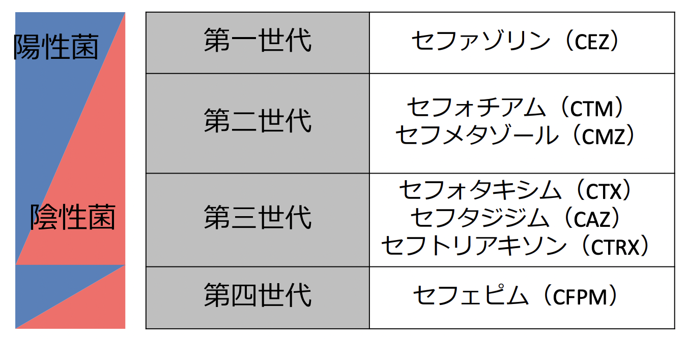

# 0916 抗菌薬総論 中村
## 感染症診療のトライアングル
  
## POINT1 薬剤によって作用機序が異なる
多様な作用機序が存在。
- 核酸合成阻害
- タンパク質合成阻害
- 細胞壁合成阻害
- 葉酸合成阻害
- 膜電位脱分極

## POINT2 薬剤によってカバーできる細菌が異なる
### グラム染色による細菌の分類
- グラム陽性菌
  - 球菌
    - ブドウ球菌
    - 連鎖球菌
    - 腸球菌
  - 桿菌
    - 抗酸菌
- グラム陰性菌
  - 球菌
    - モラクセラ・カタラーリス
    - 淋菌
    - 髄膜炎菌
  - 桿菌
    - 緑膿菌
    - 大腸菌などの腸内細菌科細菌

### 抗菌薬の選択
様々な種類の菌をカバーできる広域抗菌薬も存在する。一見これを投与すれば楽なのでは？と思うが、以下のデメリットがあるため乱用は推奨されない。  
- 耐性菌の増加
- Clostridioides difficile腸炎に代表される菌交代現象
- 医療コストが高い
  

  

De-escalationという考え方がある。  
重症患者、免疫不全状態などで原因菌不明の場合は、考えられる病原体を全てカバーできる広域抗菌薬または抗菌薬の併用（＝経験的治療）を行うが、微生物検査で原因菌が特定できる場合は、狭域抗菌薬または抗菌薬単剤治療を行う。

### 抗菌力の評価法　感受性試験
以下の方法により、最小発育阻止濃度 Minimum Inhibitory Concentration MIC（菌の増殖を抑制する最小の濃度）を求められる。
- 微量液体希釈法：MICがわかる。
- 寒天平板法：MICに加えて、菌を殺菌できる最小の濃度までわかる。
- ディスク拡散法：あくまで簡単な方法だが、MICまではわからない
  。
- E-test法：簡便かつMICまでわかる。

  
  

#### 培養検査結果が戻ってきたら
ブレイクポイントで判断する。  
- S：Susceptible(感受性)≒抗菌薬が効きそう
- I:Intermediate（中間）
- R:Resistance（耐性）≒抗菌薬が効かなそう  
  
ブレイクポイントとは、薬剤感受性検査結果から、抗菌薬の治療効果を予測するためにしようする基準値である。米国のCLSI (臨床検査標準委員会)などで定められた基準が存在。菌種ごとに異なる。

## POINT3 薬剤によって投与法が異なる
### PK/PDとは
生体内で薬剤がどれだけ有効に利用され、また作用しているかを考えたもので、投与量に対する作用と時間の関係を示すもの。
- PK Pharmacokinetics（薬物動態）：生体内における薬物の吸収，分布，代謝，排泄。
- PD Pharmacodynamics（薬力学）：感染巣内の病原体に対する生体内での抗菌作用。  
    
重要

## POINT4 薬剤によって殺菌力が異なる
### 静菌的・殺菌的の違い
最小殺菌濃度 Minimum Bactericidal Concentration MBC（菌の殺菌する最小の濃度）で決まる。

## POINT5 薬剤によって副作用が異なる
### 抗菌薬の主な副作用
  

## POINT6 薬剤によって組織移行性が異なる
抗菌薬の組織移行性は薬剤によって異なる。  
  

## β-ラクタム系薬
- 作用：細胞壁合成阻害  
- 種類
  - ペニシリン系
  - セフェム系
  - カルバペネム系
  - モノバクタム系
- 構造：β-ラクタム環と呼ばれる共通の4員環構造を有する。
- 作用原理：Penicillin binding protein; PBPに結合することで、機能を阻害。

### β-ラクタマーゼとは？
加水分解によってβ-ラクタム環を開裂する。  
### β-ラクタム薬に共通の特徴
- 細胞壁合成を阻害する➡︎非定型病原体には無効。
- 殺菌的でかつ比較的安全➡︎頻用される。
- 時間依存性でかつ半減期短い➡︎複数回投与が有効。（例外：セフトリアキソン）
- 細胞内移行性が極めて悪い➡︎細胞内寄生菌に無効。
- 腎排泄が多い➡︎腎不全、腎障害に注意する必要がある。

### ペニシリン系薬
   
β-ラクタマーゼ阻害剤を配合することで、β-ラクタマーゼ産生菌 (ペニシリナーゼ）に有効、嫌気性菌にも有効ゆうこう。
#### ペニシリン系が第一選択薬になる疾患
- 肺炎球菌
- レンサ球菌
  - 細菌性咽頭炎
  - 感染性心内膜炎
  - 壊死性筋膜炎
- 梅毒
- リステリア
#### ペニシリン系使用上の注意点
- ペニシリナーゼ（βラクタマーゼの一種）産生菌には無効。
    – 黄色ブドウ球菌とモラクセラ・カタラーリス
のほとんどが産生している。
- 伝染性単核球症でアミノペニシリンを投与すると皮疹が出る。
- アナフィラキシーショックを起こすことがある。
  - I型アレルギー
0.01〜0.001%程度で極めて稀
投与15分以内に口腔粘膜の腫脹、皮疹、
下痢、腹痛、呼吸困難、血圧低下など
ペニシリンショックと呼ばれる
治療はまずはエピネフリンの注射
抗菌薬使用前はきちんと病歴の聴取を!

### セフェム系
  
ただし、腸球菌と嫌気性菌には原則無効。

#### 第一世代セフェム
薬名：セファゾリン  
グラム陽性球菌と感受性大腸菌に有効で、レンサ球菌属やメチシリン感受性黄色ブドウ球菌 MSSAによく使われる。特に後者では第一選択薬。ただし、髄液移行に乏しい。
#### 第二世代セフェム
- セフォチアム  
  - 第一世代よりG(＋)菌に弱いが、第一世代よりG(ー)菌に強い。   
  - インフルエンザ菌・モラクセラ・肺炎桿菌までカバーする。
  - ただし、髄液移行に乏しい。
- セフメタゾール
  - セファマイシン系
  - ぺニシリナーゼ型βラクタマーゼに安定
  - 第二世代＋嫌気性菌
  - 髄液移行に乏しい

ああああああああああああああ
### カルバペネム系
最後の切り札として重症感染症の初期治療薬として使う
（de-escalation）
• 基質拡張型βラクタマーゼ（ESBL）など薬剤
耐性菌が原因の場合

### モノバクタム系薬
アズトレオナム
- 有効：グラム陰性菌のみ
- 無効：グラム陽性菌、嫌気性菌
メタロβラクタマーゼに分解されない
他のβラクタム薬との交差耐性なし

## マクロライド系薬
細菌のリボソーム(70S）は、小サブユニット（30S）と大サブユニット（50S）からなり、マクロライド系はこの大サブユニットに効く。
### マクロライド使用上の注意
- 下痢・軟便など消化器症状の副作用が比較的多い（モチリン作用）
- 併用薬剤に注意 (代謝酵素CYP3A4と結合→CYP3A4で代謝される薬剤の血中濃度が上昇する恐れ）
- 耐性化が進んでいる（肺炎球菌やマイコプラズマ）
  - WHY？：マクロライドの少量長期投与のびまん性汎細気管支炎患者（原因：緑膿菌）に対する有効性が確認され、みんながやった。

## テトラサイクリン系

## ニューキノロン系
II型トポイソメラーゼ酵素であるDNAジャイレースとトポイソメラーゼ IVの活性を阻害し、DNA複製を止める。

ST合剤

メトロ二ダゾール
 嫌気性菌や原虫特有の代謝機序によって還
元され、活性酸素を形成しDNAを破壊
 静菌的
 細菌感染症；
• Clostridioides difficile 腸炎
• ピロリ菌の除菌（併用薬の一つ）
• 嫌気性菌感染 (バクテロイデス属など）：主
に腹腔内感染症
 原虫感染症；トリコモナス症、アメーバ赤
痢・肝膿瘍、ジアルジア症

## 抗MRSA薬
グリコペプチド系のバンコマイシンが有名。ただしTDMが必要。

# 耐性菌
## 薬剤耐性菌 とは
これまでよく効いていた抗菌薬が効かなく
なった細菌で、病原性は必ずしも強くない
ものの医療関連感染などの原因となる。

## 耐性メカニズムのスライド重要
