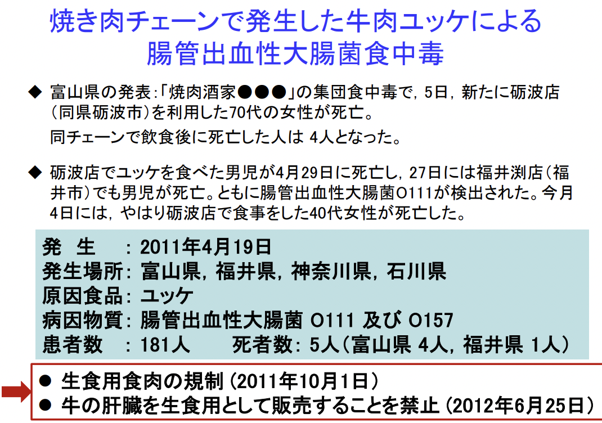
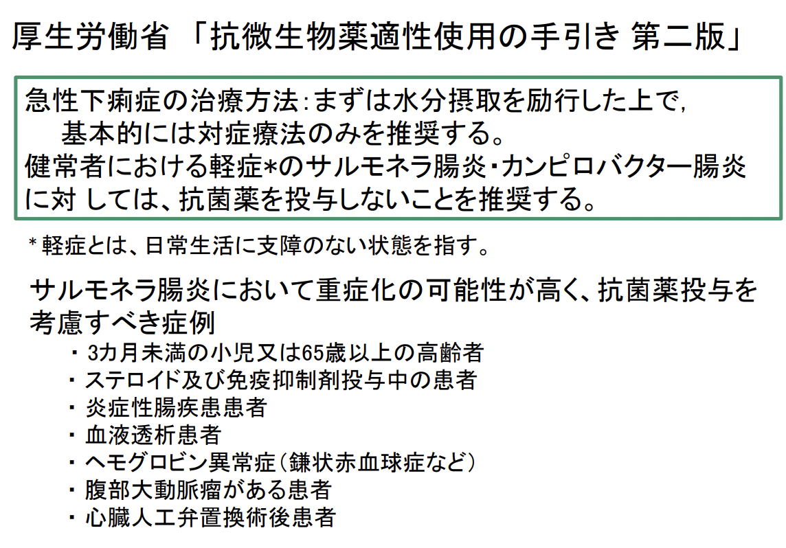

# 0916 腸管感染症・食中毒 特別講義
## 感染性腸炎
- 1. 細菌性腸炎
  - 感染症法における三類感染症：赤痢菌、コレラ菌（O139も含む）、チフス菌、パラチフスA菌、腸管出血性大腸菌（O157等）
  - 細菌性食中毒（食品衛生法）：カンピロバクター、サルモネラ属菌、病原大腸菌（下痢原性大腸菌）、腸炎ビブリオ、黄色ブドウ球菌、ウェルシュ菌、ボツリヌス菌など
  - 抗菌薬関連性腸炎：偽膜性腸炎 Clostridioides difficile、MRSA Methicillin-resistant Staphylococcus aureus腸炎、出血性腸炎Klebsiella oxytoca
- 2. ウイルス性腸炎：ノロウイルス、ロタウイルスなど
- 3. 虫性腸炎：クリプトスポリジウムなど
- 4. 寄生虫性腸炎：クドア、サルコチスチス・フェアリー、アニサキス

## 感染症法
感染症の予防及び感染症の患者に対する医療に関する法律（1999年4月施行）
- 患者の人権の尊重
- 感染症の監視体制の強化
- 伝染病予防法，性病予防法の廃止
- 検疫法，狂犬病予防法の改正
- 感染症を類型化
  - 一類感染症、二類感染症、三類感染症、四類感染症、五類感染症、新型インフルエンザ等感染症、指定感染症   
  
2003年に一部改正（同年11月施行）  
2006年12月に再改正（2007年4月施行）：結核予防法の廃止，感染症法に統合  
2008年に一部改正

### 「感染症法」による感染症の分類 （１）
- 一類感染症：エボラ出血熱，クリミア・コンゴ出血熱，痘そう，南米出血熱，ペスト，マールブルグ病，ラッサ熱
- 二類感染症：急性灰白髄炎，結核，ジフテリア，SARS，MERS，鳥インフルエンザH5N1とH7N9、新型インフルエンザ等感染症
- 三類感染症：コレラ，細菌性赤痢，腸管出血性大腸菌感染症，腸チフス，パラチフス
- 四類感染症：A型肝炎，E型肝炎，ウエストナイル熱，黄熱，オウム病，狂犬病，つつが虫病，デング熱，日本脳炎，鳥インフルエンザ（Ｈ5Ｎ1とＨ7Ｎ9を除く），ボツリヌス症，マラリア，ジカウイルス感染症など
- 五類感染症
  - 全数把握疾患：AIDS，梅毒，風しん，麻しん，侵襲性髄膜炎菌感染症, バンコマイシン耐性腸球菌感染症など
  - 定点把握疾患：小児科定点，インフルエンザ定点，眼科定点，性感染症定点，基幹定点
- 指定感染症：一, 二, 三類以外の既知の感染症で，一, 二, 三類に準じ
た対応が必要なもの。1年間に限定して指定 (さらに1年延長可能)する。2022年9月14日現在該当無し。
- 新感染症：病原体が不明，危険性が極めて高い感染症。一類と同様の扱い。

cf. SARS : 重症急性呼吸器症候群（病原体がベータコロナウイルス属SARSコロナウイルスであるものに限る）  
cf. MARS：中東呼吸器症候群（病原体がベータコロナウイルス属MARSコロナウイルスであるものに限る）

  

## 食中毒とは？
食品衛生法上の規定はない。  
食品衛生法施行規則第72条では、「食品等に起因した中毒」とされている。  
通常は、有毒有害な物質が付着、混入もしくは含まれている飲食物に起因する健康被害を食中毒という。ただし、食品中に異物として混入したガラス、金属などを原因とする物理的な衛生上危害については，通常は食中毒として扱わない。   
主な症状は、腹痛，下痢（水様便，泥状便，血便）, むかつき・吐き気，嘔吐
発熱， 頭痛， のどの痛み, しぶり腹（便をしたいけれど便がほとんど出ない状態）, 膨満感（腹が張り，ゴロゴロする）, 倦怠感（だるい）， 脱力感
寒気， 震え， けいれん， しびれ， 発しん, 物が二重に見える，まぶたが下がるなどの眼の異常。

### 食中毒の分類
|                  |                |                                                               | 
| ---------------- | -------------- | ------------------------------------------------------------- | 
| 細菌食中毒       | 感染型         | サルモネラ カンピロバクター 腸炎ビブリオ 病原大腸菌  | 
| 細菌食中毒       | 毒素型         | ブドウ球菌 ボツリヌス菌                                    | 
| ウイルス性食中毒 |                | ノロウイルス サポウイルス                                  | 
| 寄生虫           |                | アニサキス                                                    | 
| 化学物質         |                |                                                               | 
| 自然毒           | 動物性、植物性 |                                                               | 
| その他           | アレルギー様   | ヒスタミン                                                    | 

### 食中毒の原因となる微生物の特徴
- 細菌性食中毒
  - 多くの菌は食品中で増殖し、高温多湿の環境で増殖が盛んになる。
  - 夏に多くなる。
- ウイルス性食中毒
  - 食品中では増殖せず、ヒトの腸内で増殖する。
  - 食品に付着するだけで食中毒をおこす。
  - 冬に多くなる。
- 寄生虫食中毒：寄生虫で汚染された食品の生食で感染する。

  
  

## 細菌性食中毒
以下の3typeに分けられる。
- 感染型 （感染侵入型）
  - 食中毒菌に汚染された食品を食べることにより体内に入った食中毒菌が、腸管の粘膜に入り込み食中毒症状を惹起する。
  - 潜伏期間は2〜3日間。主症状は、発熱・腹痛・粘血便など。
  - 代表的な食中毒菌：サルモネラ，カンピロバクター，組織侵入性大腸菌, 赤痢菌など。
- 感染型 （感染毒素型）
  - 食中毒菌に汚染された食品を食べることにより、体内に入った食中毒菌が腸内で増殖し、産生した毒素によって食中毒の症状が起こる。
  - 潜伏時間は24時間以内。主症状は、下痢，腹痛など。
    - ※腸管出血性大腸菌Ｏ157のように、3～5日後に症状が起こる場合もある。
  - 代表的な食中毒菌：腸炎ビブリオ，腸管出血性大腸菌，ウェルシュ菌など
- 毒素型
  - 食品に付着した食中毒菌が食品中で増殖し、食品中に毒素を産生する。食品と共にこの毒素を摂取し食中毒を起こす。なお、食品中に原因菌が残っているとは限らない。（加熱によって菌が死滅しても耐熱性毒素は残る）
  - 潜伏時間は１～５時間程度と短い。主症状は嘔吐。（ボツリヌス食中毒は除く）
  - 代表的な食中毒菌：黄色ブドウ球菌，セレウス菌，ボツリヌス菌

## 食中毒の病因物質と主な原因食品
- 腸管出血性大腸菌：食肉（牛肉），野菜類
- サルモネラ：鶏肉，鶏卵
- カンピロバクター：鶏肉（生，加熱不足）
- 黄色ブドウ球菌：素手で作った食品
- ウェルシュ菌：煮込み料理（前日調理）
- セレウス菌：チャーハン，スパゲティ
- ノロウイルス：二枚貝，あらゆる食品（二次汚染）
- アニサキス：サバ，イワシ等の生食
- クドア：ヒラメ等の刺身
- サルコチスチス：馬肉

### 発症菌量
- 10個➡︎腸管出血性大腸菌O157，赤痢菌，ノロウイルス
- **800**個➡︎**カンピロバクター**
- 10,000個➡︎コレラ菌
- 100,000個➡︎大腸菌, 腸炎ビブリオ, サルモネラ属菌

## 下痢症起因病原体
1. 赤痢菌
2. 下痢原性大腸菌
3. 腸管出血性大腸菌
4. サルモネラ属菌
5. カンピロバクター
6. ビブリオ属菌
7. 黄色ブドウ球菌
8. ウェルシュ菌
9. ボツリヌス菌
10. ノロウイルス
11. A型・E型肝炎ウイルス
12. アニサキス

## 1. 赤痢菌
別名Shigella は、赤痢菌の発見 (1898年）者である志賀潔にちなんだ名称。  
注）アメーバ赤痢(Amebic dysentery)は、原虫Entamoeba histolytica による感染症。  
漸減傾向ではある。  
- 菌の分類：グラム陰性桿菌，腸内細菌
  - 以下の4菌種がある。
    - A 亜群：S. dysenteriae
    - B 亜群：S. flexneri
    - C 亜群：S. boydii
    - D 亜群：S. sonnei
- 汚染源：魚介類，下水，汽水，糞便
- 媒介食品：海産物（特に貝類），水，生野菜
- 病 状：激しい下痢，腹痛，嘔気，嘔吐，発熱
- 潜伏期間：1〜7日間 （通常4日以内）
- 発症期間：4〜7日間
- 対象感染者：健康人，幼弱者・高齢者，免疫不全者，胃酸減少者海外旅行者下痢症（特に西南アジア等）
- 発症菌量：<10
- 死亡率：乳幼児は高い
- 三類感染症：診断した医師の届け出義務有。
- 感染形態  
  - ヒト → ヒト
  - ヒト → 食品・飲用水・氷 → ヒト
  - 水（氷） → 食品 → ヒト
  - 食品 → ヒト

  
赤痢菌 → M細胞から粘膜下に侵入 → マクロファージに侵入・殺菌されず → 細胞質で増殖 → 細胞破壊 → 周囲の吸収上皮細胞内へ侵入 → 細胞内で増殖・分裂を繰り返す → マクロファージと上皮細胞からIL-1β，IL-18 が産生され、粘膜固有層に炎症・下痢

## 2. 下痢原性大腸菌 Diarrheagenic Escherichia coli
- 分類
  - 腸管出血性大腸菌 EHEC Enterohemorrhagic E.coli
    - 志賀毒素産生性大腸菌 STEC Shiga-toxin producing E.coli
    - Vero毒素産生性大腸菌 VTEC Verotoxin-producing E.coli
  - 腸管毒素原性大腸菌 ETEC Enterotoxigenic E.coli
  - 腸管侵入性大腸菌 EIEC Enteroinvasive E.coli
  - 腸管病原性大腸菌 EPEC Enteropathogenic E.coli
  - 腸管凝集付着性大腸菌 EAggEC Enteroaggregative E.coli

  
### 腸管毒素原性大腸菌が産生するＬＴ（易熱性毒素）の作用機序

## 3. 腸管出血性大腸菌 Enterohemorrhagic E.coli
食中毒や感染症を起こす大腸菌の一つ。動物（牛）の腸管等に広く分布する。  
- 代表的な血清型：O157:H7, O26:H11, O111:H-
- 原因毒素：ベロ毒素（志賀毒素）
- 潜伏期間：2〜7日間（平均3,4日間）
- 発症期間：2〜9日〜数週間
- 症状：激しい腹痛，水様性下痢，血便，発熱は低いか無い，嘔吐は稀
- 重症化：小児や高齢者は重症化しやすい 
  - HUS hemolytic uremic syndrome 溶血性尿毒症症候群：幼弱者の0〜15%がHUSを発症。
  - 急性脳症
- 死亡率：2%（HUS発症者の5～10%）
- 発症菌量：ヒトでは数百個
- 感染症届出数：3,000〜4,000人/年
- 三類感染症：診断した医師の届出義務有
- 主な原因食品・感染源
  - レバ刺やユッケ等の生肉 ← 規制(2011, 2012）
  - 加熱不十分な食肉：焼肉，ハンバーガー（牛挽肉），ローストビーフなど
  - 食肉等から二次汚染した食品
  - 野菜，その加工品：サラダ，浅漬け等
  - 飲用水：滅菌装置の完備されていない井戸水，沢の水
  - 子供用ビニールプール
  - トイレや風呂を介した感染
  - 動物への接触（観光牧場等）  

以上のように、肉の生食に対する規制が行われたが、内臓肉などの加熱不十分による食中毒は依然発生している。肉類に限らず、野菜や漬物（浅漬けなど）等を原因
とする食中毒も発生している。予防には、十分な加熱と二次汚染（交差汚染）防止が重要。

### 大腸菌の構造
- O抗原
  - 細胞壁：リポ多糖体(LPS)
  - 種類：O1～O187
- H抗原
  - 鞭毛：フラジェリンタンパク
  - 種類：H1～H56  

  
  
  

### Diffuse outbreak 散発的集団発生，散在的集団発生
各地で発生している散発事例が、実は同一の感染源（食品等）を原因とする集団発生であること。   
分子疫学的手法（PFGE法, MLVA法, WGS法）を用いることで、散在的集団発生の探知や汚染源の特定を目指す。  
cf. MVLA Multilocus variable-number tandem-repeat analysis法   
ゲノム上に存在する数bp程度の繰り返し配列の反復回数の多様性を利用して行う解析方法。繰り返し配列の外側にプライマーを設計してPCR反応を行い、増幅断片長の大きさからリピート数を推測する。複数の遺伝子座についてリピート数を算出し、リピート数のプロファイルから菌株の比較を行う。  

## 4. サルモネラ属菌 Salmonella
ヒト及び動物（家畜，淡水魚）の腸管，水，土壌等の自然界に
広く分布している。   
グラム陰性桿菌、腸内細菌科。  
- 血清型：O抗原（リポ多糖）とH抗原（鞭毛）の組み合わせによって決まり2,500種以上が報告されている。 
  - S. Enteritidis
  - S. Thyimurium
  - S. Infantis
- 媒介食品：畜産食品（肉・卵・乳），魚介類，香辛料，野菜類，これらを原料とした広範囲の食品
- 菌は乾燥に強い
- 急性胃腸炎・サルモネラ食中毒を引き起こす。
  - 臨床症状：腹痛，下痢，発熱，頭痛，悪心，嘔吐，寒気，脱水，敗血症（小児，新生児では特に敗血症になりやすい）
  - 潜伏期間：6〜48時間（平均15時間）
  - 発症菌量：<1,000,000（年齢，健康状態，菌株により異なる）
  - 注意事項：無症状病原体保菌者が3ヶ月以上排菌することがある。

  
  
   

## 5. チフス菌，パラチフスA菌
三類感染症である腸チフスとパラチフスの原因菌。（パラチフスは腸チフスと比較して軽症の場合が多い）
- 感染源：患者・保菌者の便，尿（胆嚢に保菌している場合あり）
- 食品を媒介とした場合には食中毒として対応する。（※保菌者によって汚染された飲用水や食品を媒介食品という）
- 臨床症状：全身性熱性疾患，39℃を超える高熱（1週間以上），比較的徐脈，バラ疹（皮膚にバラの花に似た発疹），脾腫，下痢，腸出血，腸穿孔，（重症例では意識障害，難聴）
- 潜伏期間：7〜14日間
- 多くが輸入事例。  

  
  

## 6. カンピロバクター Campylobacter jejuni / coli
- 菌の分類：グラム陰性S字状桿菌，微好気性，コルクスクリュ－運動
- 汚染源： 動物の腸管（特に家禽，牛の胆のう：C. jejuni，豚：C.coli），湧水
- 媒介食品：鶏肉(鳥刺し，レバ刺し），牛レバ刺し, 生乳，飲用水
- 病 状：下痢（水様便，時に血便），腹痛，発熱（38～39℃）
- 潜伏期間：2〜5日（平均2～3日）
- 発症期間：2～10日
- 後遺症：関節炎，溶血性尿毒症性症候群 HUS，髄膜炎，
Guillan-Barre症候群 (無熱，筋痛，運動減弱，腱反射消失)対象
- 感染者：健康人，幼弱者・高齢者などすべて
- 発症菌量：数百個（年齢，健康状態，菌株により異なる）
- 感染経路
  - 1. 食品媒介感染症（食中毒）
    - 生や生に近い食肉の喫食：とりわさ，ささみ刺，とり刺，牛レバ刺等
    - 加熱不十分な食肉の喫食：焼き鳥，鶏鍋，親子丼，バーベキュー等
    - 二次汚染（調理器具、手指）した食品の喫食：サラダ，お浸し，野菜の和え物 等
    - 2. 水系感染：沢水，湧水，井戸水 等
    - 3. 五類感染症「感染性胃腸炎」 として扱うことは稀
    - 4. ヒト-ヒト 感染は，ほとんどみられない。

### カンピロバクターによる健康危害や食品寄与の推計
国内の食中毒調査（2007～2018年）のデータ：2007～2018年は，「鶏肉及びその加工品」と「牛肉及びその加工品」が90%以上を占めたが，生食用の牛肉等に関する規制強化後の2013年以降は90%以上の食中毒事例が鶏肉由来と推計された。

### Guillan-Barre症候群 
C. jejuni感染症の一般的な予後は、一部の免疫不全患者を除き死亡例も無く良好な経過をとる。しかし、C. jejuni 感染後1～3週間（平均：10日間）を経て，ギラン・バレー症候群 GBSを発症する事例が知られている。GBSは、フィッシャー症候群など複数の亜型があるが、基本的には急性に四肢脱力を主徴とする。運動神経障害優位の自己免疫性末梢神経障害である。急性に四肢脱力を主徴とする運動神経障害(足の麻痺，歩行困難，顔面の神経麻痺，呼吸困難等）を起こす。C.jejuniとヒト末梢神経構成成分との間の分子相同性のため，抗体が誤って自己の神経（GM1 ガングリオシド）を攻撃してしまうのだ。 
日本での推定患者数は，年間 2,000人(数人/10万人）。  

  
  

## 6. ビブリオ属菌
- 腸炎ビブリオ
- コレラ菌 （O1, O139 ： CT+）
- ナグビブリオ
  - ビブリオ・コレレ（非O1, 非O139, CT-）
  - ビブリオ・ミミクス
- ビブリオ・フルビアリス（ビブリオ・バルニフィカス）
### 腸炎ビブリオ V. parahaemolyticus
- 菌の特徴：グラム陰性桿菌，ビブリオ属，好塩性，真水や酸に弱い。発育温度域は10～42℃，世代時間は約10分間（大腸菌の1/2）
- 病原因子
  - 耐熱性溶血毒 Thermostable direct hemolysin; TDH
  - TDH類似溶血毒 TDH-related hemolysin; TRH
  - エフェクター（3型分泌装置から分泌されるタンパク）
- 汚染源：沿岸海水・汚泥
- 媒介食品：魚介類（特に汽水域）
- 病状：激しい腹痛，下痢（水様性，粘血便），嘔気，嘔吐，脱水（死亡率１％）
- 潜伏期間：4～96時間（平均12時間）
- 発症期間：4～7日間
- 対象感染者：健康人，幼弱者・高齢者などすべて
- 発症菌量：>1,000,000（年齢，健康状態，菌株により異なる）  

  
  

### コレラ菌 Vibrio cholerae
- 発生状況
  - 1937年セレベス島に発生したエルトール型コレラは、1961年頃から第7次の世界的流行となり現在に至る。
  - 1992年には新型コレラO139が発生。
- 病原体：コレラ毒素産生コレラ菌（V.ｃholerae O1, V.ｃholerae O139）
- 感染経路
  - 患者の便や吐物で汚染された飲食物
  - 海外旅行者下痢症
  - ヒトからヒトへの直接接触感染は殆どない
- 臨床症状
  - 健康者では無症状や軽度の下痢が多い。
  - 胃切除，胃酸欠乏，基礎疾患のある人では重症化する。典型例では突然の下痢で発病、次いで嘔吐が出現。
  - 大量の水分, 電解質の喪失による脱水症状（コレラ顔貌，米のとぎ汁様便，乏尿，筋肉の痙攣）。
  - 通常発熱，腹痛は見られない場合が多い。
- 治療方針
  - 脱水に対し水分と電解質補給（点滴あるいは経口輸液)
  - 抗菌薬（テトラサイクリン，ニューキノロンなど）の投与は、菌の増殖を抑制、排菌の期間を短縮し、毒素産生量を減少させる。
- 行政対応：コレラ毒素産生性あるいはコレラ毒素遺伝子の保有菌を確認・診断した医師は直ちに保健所に届出（三類感染症）。

## 7. 黄色ブドウ球菌 Staphylococcus aureus
- 症状
  - 悪心，嘔吐（1, 2回～数10回），腹痛，下痢。
  - 一般的に一過性で、1〜3日で回復し予後は良好。
  - 食物を喫食してから3～5時間後に急激に発症する。
- 潜伏期間：１～5時間（平均約3時間）
  - 代表的な毒素型の食中毒。本菌が食物中で増殖し、産生した耐熱性のEnterotoxin (SEs)が起因物質。
    - 古典型 SEs; Staphylococcal enterotoxins：SEA～SEE
    - 新型 SEIs; SE-like toxins：SEG～SEY
- 治療：感染症ではないので、抗菌薬治療の必要はない。十分な補液や血圧低下等の管理に注意する。
  
  
  
  

## 8. ウェルシュ菌 Clostridium perfringens
- 菌の分類：グラム陽性桿菌，偏性嫌気性，芽胞形成大桿菌。腸管内で菌が増え，エンテロトキシンを産生。
- 汚 染 源：動物の腸管，土壌等自然界に広く分布。
- 媒介食品：畜産食品（食肉・加工品），肉汁
- 病 状：下痢，腹痛，嘔気，嘔吐は希，膨満感
- 潜伏期間：8～22時間
- 発症期間：< 24時間，1〜2週間持続の可能性あり
- 対象感染者：健康人，幼弱者・高齢者
- 発症菌量：> 1,000,000
- 死亡率：< 0.1%
- 発育可能温度域：10～52℃（41〜47℃で最速）。
- 増殖速度：速い
- 1世代時間は10分以内➡︎短時間で大量菌量に達する。
- 食中毒事例数：年間20～40事例。1事例あたりの患者数が多いのが特徴。
- 原因食品：カレー，シチュー，煮物等の大量調理食品
- 発生要因：長時間保存，常温放置，前日調理，加熱不十分，再加熱不十分
- 病因物質： エンテロトキシン産生性ウェルシュ菌
  
  
  

## 9.  ボツリヌス菌 Clostridium botulinum
- 菌の分類：グラム陽性桿菌，嫌気性菌，芽胞形成
- 毒素型：A〜G（最近は，A型，B型中毒が多い。）
- 汚染源：自然界に広く分布（土壌，海，川，動物等）
- 媒介食品：瓶詰，缶詰，容器包装詰め食品，はちみつ, 穀類，香辛料，食肉，野菜等
- 病状：吐き気，嘔吐，便秘，倦怠感，脱力感，めまい, 視力障害（複視），呼吸障害
- 潜伏期間：8～36時間
- 対象感染者：健康人，幼弱者・高齢者
- 死亡率：30〜40％（高い）  
- 食餌性ボツリヌス中毒の発症機序
  1. 食品中で産生された神経毒素は，無毒成分と結合した複合体として存在する。
  2. 複合体として，胃を通過し，小腸上皮から吸収される。
  3. 血中に移行した神経毒素は，無毒成分から解離して，標的細胞である神経-筋接合部や副交感神経のシナプス前膜にある特異的レセプターに結合する。
  4. 神経細胞内に侵入し，神経伝達物質の放出を抑制する。
- 治療法：抗毒素血清
cf. 乳児ボツリヌス症（1歳未満の乳児に，はちみつを与えない）  
  
   
  

## 食中毒に関与する主なウイルス
10. ノロウイルス
11. サポウイルス
12. A型肝炎ウイルス
13. E型肝炎ウイルス

## ノロウイルス Norovirus
- サイズ：ウイルスの中でも小さく、大きさは直径30～38nm。  
- 汚染源：河川，沿岸海域，ヒトの腸管，カキ等二枚貝に分布。
- 媒介食品
  - 二枚貝（カキ，大アサリ，シジミ，ハマグリ等）
  - 調理従事者等を介して汚染された食品（サラダ，ほうれん草の磯和え，ケーキ，パン等）
  - （患者の嘔吐物の飛散等による直接感染）
- 病状：吐き気，嘔吐，腹痛，下痢，発熱，頭痛
- 潜伏期間：24〜48時間（平均33時間）
- 感染経路  
  - 食品を介した感染 Foodborne
  - 水を介した感染 Waterborne
  - 人から人への感染 Person to Person
  - 糞便や嘔吐物などの汚染物質の微粒子化　aerosolized vomitusによる飛沫感染
  - 空気感染 Airborne particles(大気浮遊微粒子)
  - 媒介物による感染 fomites contamination
- 発症量：100個以下
- 対策：85～90℃・90秒間以上の加熱
- 殺菌剤：次亜塩素酸ナトリウム溶液等 200ppm・5分間，100ppm・10分間
- 特徴
  - 感染力が強く，年齢を問わず，少量で人に感染する。
  - 人だけに感染し，人の腸管内で増える。
  - 食品中で増殖できないので，食品の鮮度とは関係しない。
  - 消毒用アルコールや逆性石けんによる消毒効果は低く，従来の衛生対策が通用しない。しかし，最近，エタノール系消毒剤の中にはノロウイルスに対して不活化効果を期待できるものがあるとの知見が得られている。
  - 治療薬は無く，何回でも感染する。
- 生存性
  - 一般のウイルスは環境に弱く，早期に死滅する。
  - ノロウイルスは低温の環境に抵抗性が高く，冬期では数ヶ月生存する。
  - 食品や調理器具などに汚染したノロウイルスも低温下では１週間程度，生存する可能性がある。

### ノロウイルスの症状
ノロウイルスに感染（菌数：10個～100個）すると、ウイルスが小腸にて増える。  
24～72時間後には、吐き気，嘔吐，腹痛が催され、吐物の中にウイルスが検出される。  
30〜40時間後には、38℃以下の発熱, 下痢が催され、便の中に多量のウイルスが検出される。  
便中にウイルスが排出されることで、3日後には症状が消失する。

### 細菌性食中毒との違い
- 吐物が感染源となる
- 冬に活発に活動する
- アルコール消毒の効果がない
- 汚染範囲が広い
- 食品中では増殖しない
- もともとの感染源は牡蠣を中心とした二枚貝
- 調理従事者を介した食品への二次汚染を原因とする食中毒が増加している。
- 三大予防対策「つけない」「増やさない」「やっつける」の内、「増やさない」は適応外で，残り２つが重要，特に「つけない」が重要 ＋ 「手洗い」 ＋ 「健康管理」。

## 12.13. 肝炎ウイルス

## 12. A型肝炎ウイルス Hepatitis A virus (HAV)
- 症状：発熱，倦怠感，食欲不振，おう吐，黄疸，肝腫脹，褐色尿
- 潜伏期間：2～6週間➡︎原因食品を特定することが困難
- 四類感染症。毎年数100例の届出があるが，食中毒と判明した事例はまれである。
- 患者のふん便中に排泄されたウイルスが感染源となり，汚染された手指，水，食品を介して経口的に感染する。

## 13. E型肝炎ウイルス Hepatitis E virus (HEV)
  

## 14. アニサキス Anisakis
- 体長：約2～3cm，半透白色の寄生虫
- 寄生先：サバ，サンマ，カツオ，イワシ，イカ，アジなどに寄生。多くは，内臓部。一部のアニサキスは筋肉部分に移行する。
- 食中毒
  - 胃アニサキス症：喫食2～８時間後に，激しい腹痛，嘔気，嘔吐
  - 腸アニサキス症：喫食10時間以降に，激しい腹痛，腹膜炎症状
  - アレルギー：アニサキスの再感染によるアレルギー反応
  - 予防方法
    - 加熱：60℃で数分，70℃以上では瞬時に死滅
    - 冷凍：-20℃で24時間以上で死滅
    - 新鮮な魚を選び，速やかに内臓を除去する。生の内臓を食べない。目視で確認して，アニサキス幼虫を除去する。

## 下痢症の診断の基本
  
  
### 感染性下痢症の検査法
1. 細菌培養検査：細菌性の感染性下痢症では，確定診断となる
2. 直接塗沫染色検査：カンピロバクター腸炎では，簡易迅速診断が可能
3. 糞便中の毒素（遺伝子）の検出  
    - 毒素そのものを検出する方法（RPLA法，ELISA法）  
    - 毒素産生遺伝子を検出する方法（PCR法等）
4. 糞便からウイルス（遺伝子）の検出
5. 血清中の抗体価の測定  
   - 菌体のリポ多糖体(LPS)に対する抗体価
   - 腸管出血性大腸菌，エルシニア等では可能
6. 血清中の毒素の検出：ボツリヌス毒素

### 細菌学的検査の重要性
1. 菌の分離・同定による確定診断：迅速性が重要。簡易検出キット, 遺伝子診断(PCR)，MALDI-TOF MS
2. 治療薬剤の選択：薬剤感受性試験
3. 感染原因の究明：疫学的解析，分子疫学解析

### 下痢症（感染性腸炎）の治療の基本
#### 感染性腸炎の治療方針
- 一般的に自然治癒傾向が強い
- 治療では，輸液，食事療法が最優先
- 患者背景，症状に応じて短期間抗菌薬療法（病原体が判明した時点で抗菌薬を調整する）
- 投与期間をいたずらに長くしないこと（抗菌薬は患者の症状緩和と周辺への二次感染
防止のために用いる）  

注）腸チフス・パラチフスでは対症療法とともに抗菌薬療法が必須。血液培養あるいは便培養で菌を確認してから抗菌薬投与を開始する。

### 食中毒の治療
- 原則として止痢剤，抗菌剤は使用しない。
  - 止痢剤使用は体内に毒素を留めることになる。
  - ノロウイルス食中毒での抗菌剤使用は症状を遷延させる。
- 下痢による脱水を防ぐための補液を行う。スポーツドリンクなどミネラルを含んだものが良い。
- 原因微生物によっては原因療法を行う。
  - ボツリヌス食中毒の場合は，早期に抗毒素血清療法
  - 腸管出血性大腸菌による食中毒の場合は，早期に抗菌薬を使用する（異論あり）。

  
  
  

### HACCP による衛生管理
#### ハザード（危害要因）分析 HA
ハザードとは，食品内に人の健康に被害を及ぼす（食中毒）可能性のある生物的物質，化学的物質あるいは物理的物質である。あらゆる食品には少なからずハザードがある。
1. 生物的危害要因  
   - 食中毒起病性微生物（細菌，ウイルス，原虫），寄生虫
   - 微生物が産生した有毒物質（毒素）
2. 化学的危害要因：洗剤・殺菌剤の残留, 植物性自然毒（ソラニン）, ヒスタミン, 食物アレルゲンなど
3. 物理的危害要因 ：金属（機械・器具の破損物），ガラス片，プラスチックなど

  
