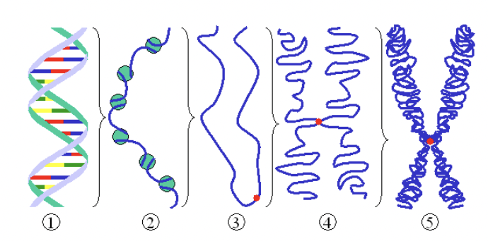
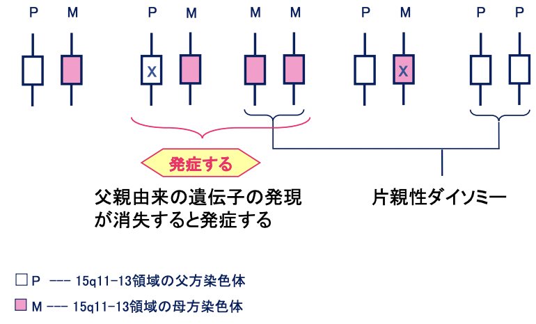
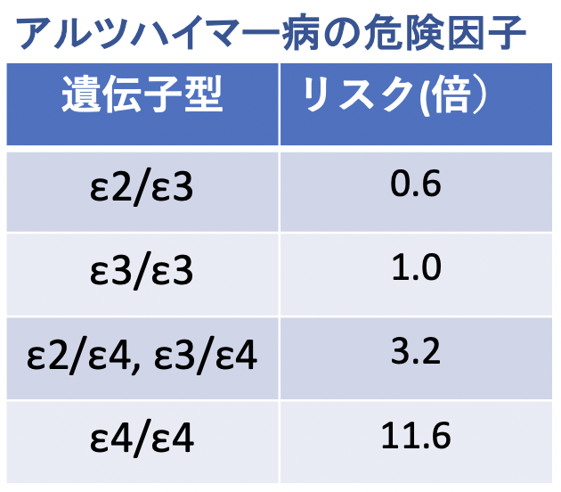

# 0831 疾患と遺伝子
感染症や外傷以外の疾患はほぼすべてDNA(genome)の異常、epigeneticの異常で起こる。  
ゲノム＝染色体 46XY (22 + XY)  
細胞周期の**間期**では、染色体は**固有**の位置に存在する。  
2倍体の⽣物では、２組のゲノムが⼀つの細胞に存在する。  
1888年にヴィルヘルム・フォン・ヴァルデヤーHeinrich Wilhelm Gottfried von
Waldeyer-HartzがChromosomeと命名した。  

## ヒト遺伝子  
Genome = gene + chromosome。  
ゲノムは、**⽣殖細胞における染⾊体**、**DNAの塩基配列全体**、**遺伝情報全体**を⽰す。  
ヒトゲノムは、**32億**塩基対から成る。   
ヒトゲノムの⻑さは、
`3.2x109bp = 3.2Gbp X 0.34nm/bp = 1.088m` である。2倍体の⽣物では、２組のゲノムが⼀つの細胞に存在するため、1細胞あたり**2.176m**のゲノムが入っていることがわかる。  

### DNAの凝縮の各段階

1. 裸の⼆本鎖 DNA
2. クロマチンの鎖: DNA（⻘線）とヒストン（緑丸）
3. 間期の凝縮したクロマチン（⻘線）とセントロメア（⾚点）
4. 分裂前期の凝縮したクロマチン
5. 分裂中期の染⾊体

### 染色体異常
- 数の異常：**G2**期の**チェックポイント**における異常によるものが多い。
  - **トリソミー**
  - **モノソミー**
- 欠失 Detection
- 重複 Duplication
- 逆位 Inversion
- 挿入 Insertion
- 転座 Translocation

### 遺伝子異常
- **ミスセンス変異**：コドン内の塩基の置換、⽋失、挿⼊により、アミノ酸の変異が⽣じる変異。
- **ナンセンス変異**：アミノ酸のコドンを終⽌コドンにする変異。
- **フレームシフト**：塩基の挿⼊、⽋失によってオープンリーディングフレームにずれが⽣じる変異。
  
ガンに多いのは、**ナンセンス変異**。

### 疾患と遺伝
DNA変異による疾患は、2種類に分けられる。
- **先天性疾患**
  - 変異が入るのは**生殖細胞と体細胞**であるため、遺伝**する**　。つまり、**germline変異 + Somatic変異**。
  - 原因
    - 1. **染色体異常**　
      - **ダウン症候群**
      - **ターナー症候群**
      - **クラインフェルター症候群**
    - 2. **単一遺伝子の欠陥による異常**
      - **常染色体優性**
        - **遺伝性乳癌卵巣癌症候群 (HBOC)**
        - **ハンチントン舞踏病**
      - **常染色体劣性**
        - **フェニルケトン尿症**
        - **鎌状赤血球症**
        - **嚢胞性線維症**
      - **X染色体劣性**
        - **血友病**
        - **筋ジストロフィー（デュシェンヌ型）**
        - **伴性無γグロブリン血症**
      - **ゲノムインプリンティング**
        - **Prader Willi症候群（PWS)**  　
- **後天性疾患**
  - 変異が入るのは**体細胞のみ**であるため、遺伝**しない**。つまり**Somatic変異**。
  - 原因
    - 1. **複数の遺伝子の欠陥による異常**：代表例は**癌**。
    - 2. **遺伝子多型による病気**：**環境**が誘因となる。
        - **ALDH2**
        - **アドレナリン受容体**
        - **ApoE**
        - **CYP(p450)**

## 先天性疾患
## 1. 染色体異常
###　1.1. **ダウン症候群**
#### 定義
**体細胞**の**21**番染色体が**トリソミー**になることで発症する先天性疾患群である。
#### 原因
**第1減数分裂、第2減数分裂に起こる染色体不分離**。
#### 症状
知的障害、**先天性心疾患**、低身長、**肥満**、**筋力低下**、**閉塞性睡眠時無呼吸**、**眼科疾患**（**先天性白内障**、**眼振**、**斜視**、**屈折異常**）、**難聴**
#### 治療
**ゲノム編集** (**CRISPR-Cas9**など)  
CRISPR-Cas9の問題は、遺伝子変異を抑えられたとしても、それは100%ではない。ただし一部の疾患(遺伝性アミロイドパチー)では、数10%落とせば疾患が治るというようなものもあるため、有効。

### 1.2. **ターナー症候群**
#### 定義
**X染色体の遺伝子が1本分しかない**ことによって発生する症候群。  
典型的な核型：**X0**（**45,X**）
#### 原因
**第1減数分裂、第2減数分裂に起こる染色体不分離**。
#### 症状
- **第二次性徴の遅滞**。
- **SHOX遺伝子（X・Y染色体の短腕に存在）の低下**による**低身長**、軽度の**精神発達遅滞**、**学習障害**。
- **リンパ管形成遺伝子（X・Y染色体の短腕に存在）の不足**による**リンパ管低形成**による**うっ滞**で起こる**体型**や**内臓奇形**。
#### 治療
- **低身長**に対する**成長ホルモンの補充**。
- **性腺機能不全**に対する**ホルモン補充**。

### 1.3. **クラインフェルター症候群**
#### 定義
**男性の性染色体にX染色体が一つ以上多い**ことで生じる先天性疾患群である。  
典型的な核型：**XXY**（**47,XXY**）、**XXXY**（**48,XXXY**)
#### 原因
**第1減数分裂、第2減数分裂に起こる染色体不分離**。
#### 症状
- **性分化異常**（**外性器・内性器共に男性型**になる）。
- **SHOX遺伝子の過剰**による**高身長化**、軽度の**精神発達遅滞**、**学習障害**
#### 治療
- **男性ホルモンの補充**
- **女性化乳房の手術**

## 2. 単一遺伝子の欠陥による異常
### 2.1. 常染色体優性
#### 2.1.1. **遺伝性乳癌卵巣癌症候群 (HBOC)**
**BRCA1** または/かつ **BRCA2**遺伝子（いずれも**癌抑制**遺伝子）に変異が生じる。  
日本人では200〜500人に一人。  
- BRCA1（breast cancer susceptibility gene 1 ) 17q21
- BRCA2 （breast cancer susceptibility gene 2) 13q12.3  

DNA損傷の中でも最も細胞に対する毒性が強いのは、**DNA⼆本鎖切断(double-strand break:DSB)**である。その**修復過程**にBRCA1/2が重要な役割をはたす。乳がんの他にも、**卵巣がん**、**膵癌**、**前立腺癌**のリスクファクターとして知られる。  
HBOCの患者は、非遺伝性乳癌の患者と比較して乳がん発症が**早い**。HBOCの患者は**1度の体細胞突然変異**により**両側**性になってしまう一方で、非遺伝性乳癌の患者は**2度の体細胞突然変異**が必要であるからだ。

#### 2.1.2. **ハンチントン舞踏病**
原因は、**大脳線条体尾状核の神経細胞の変性**。
遺伝子異常としては、**第4染色体短腕上（4p16.3）**にある**ハンチントン**遺伝子に変異が見られる。これにより、**CAGリピート**（**グルタミン**をコード）がエクソン1に過剰に存在してしまう。正常ならば11〜34のところ、病原性では37〜800コピーになる。

### 2.2. 常染色体劣性
#### 2.2.1. **フェニルケトン尿症**
原因は、**フェニルアラニンヒドロキシラーゼ**の反応における**酵素または補酵素の機能的欠損**。  
患者数は、8万人に1人の割合で存在する。
#### 2.2.2. **鎌状赤血球症**
原因は、**ヘモグロビンβ鎖**の**６**番目のアミノ酸の**グルタミン**→**バリン**への変異。
#### 2.2.3. **嚢胞性線維症**
第**7**染色体**CFTR**遺伝子（**パンクレアチン酵素**をコードする）の**点変異**。  
日本では10,000人に1〜2人、白人では2,500人に1人の割合で存在する。

### 2.3. X染色体劣性遺伝
通常**男性だけ**が影響を受ける。疾患遺伝子は**娘**を通じて次世代に伝えられる。
#### 2.3.1. **血友病**
原因は、 **X**染色体上にある**血液凝固因子の第VIII因子、第IX因子をコードする**遺伝子の変異による**血液凝固因子のVIII因子とIX因子の欠損or活動低下**。 
#### 2.3.2. **筋ジストロフィー（デュシェンヌ型）**
原因は、**X染色体短腕上のジストロフィン遺伝子欠損**。
#### 2.3.3. **伴性無γグロブリン血症**
原因は、**X染色体上のBTK遺伝子の変異**。

### 2.4. ゲノムインプリンティング
ヒトをはじめとする哺乳類はすべて父親と母親に由来する一対のゲノムを持っている。従って、常染色体上のすべての遺伝子座に一対の対立遺伝子があり、通常それらはともに発現して個体の発生や生体の営みを調節して
いる。正常発生には父親、母親由来の両方のゲノムが必須である。哺乳類の常染色体には**一方の対立遺伝子だけが発現する遺伝子座**があり、これが**父親、母親由来ゲノム間の機能的な差**をもたらしている。
#### 2.4.1. **Prader Willi症候群（PWS)**
**染色体15q11-13領域のパターナル発現遺伝子が作用しなくなる**ことで発症する。メンデル遺伝ではない。  
  
**遺伝子のどの部分に変異が起きているか**によって症状は多岐にわたり、**年齢**に応じて変化する。
- 新生児期：**筋緊張低下**、**色素低下**、**外性器低形成**
- 幼児期：**肥満**、**低身長**
- 学童期：**精神発達遅滞**、**性格的にはやや頑固**
- 思春期以降：**肥満**、**糖尿病**、**性格障害・行動異常**

## 後天性疾患
## 1. 複数の遺伝子の欠陥による異常
## 2. 遺伝子多型
### 2.1. **ALDH2 アセトアルデヒド脱水素酵素**
**エチルアルコール**の代謝によって生成される**アセトアルデヒド**を**酢酸**に分解する代謝酵素。  
12q24.2に位置し、1551塩基(517個のアミノ酸）からなる蛋白質。  
ALDH2の変異自体には以下の2種類ある。
- ALDH2＊1（Normal型）：エクソン12に位置する487番目のアミノ酸が**グルタミン酸（CAA)**のもの。
- ALDH2＊2（Deficient型）：エクソン12に位置する487番目のアミノ酸が**リシン(AAA)**のもの。  
  
接合の仕方には以下の3種類ある。
- ホモ接合体**NN**型：分解能**100**%
- ヘテロ接合体**ND**型：分解能 **6**%
- ホモ接合体**DD**型：分解能 **0**%

### 2.2. **ApoE　アポリポ蛋白E**
アポリポ蛋白E（ApoE）は**VLDL、LDL、HDLなどのリポ蛋白**を構成している主要なアポリポ蛋白の一つである。  
ApoEは第19番染色体上に遺伝子がコードされ、951塩基（317個のアミノ酸）からなる蛋白質として合成される。  
ApoE遺伝子には**ε2、ε3、ε4**の**３**つの**対立遺伝子**があり、それぞれに対応する**E2、E3、E4**の**３**つの**アイソフォーム**が存在する。  
ApoEは主として**肝細胞**で産生され、**全身の他の臓器へのコレステロールや脂肪酸の運搬**に関与している。  
ApoEは、**アルツハイマー病**における**老人斑**や**神経原線維変化**に**沈着**することで知られ、ADの危険因子である。  

## SUMMARY
1. 染色体異常について
2. 遺伝性疾患の遺伝形式
3. 遺伝子多型とは