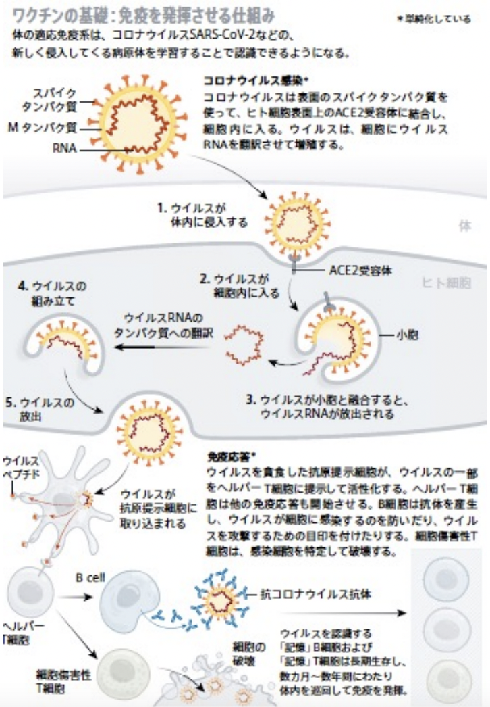
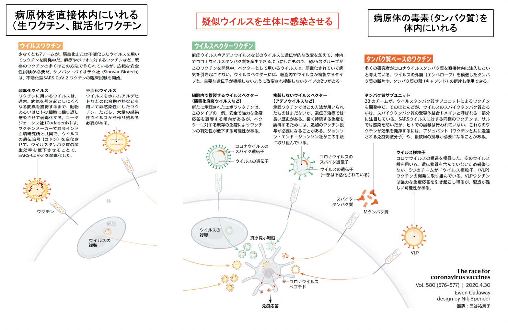
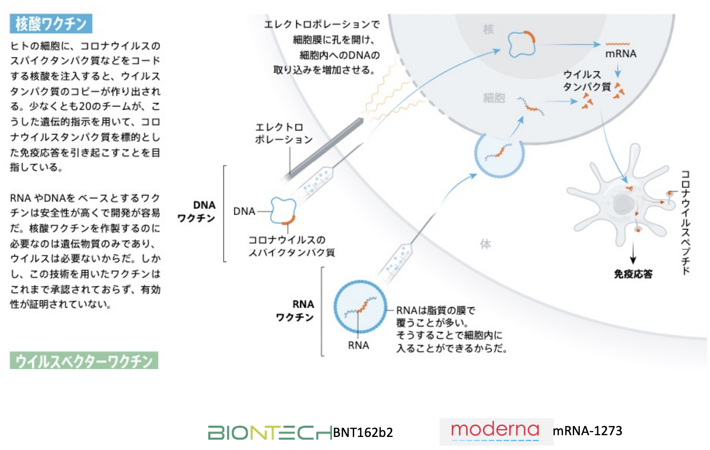
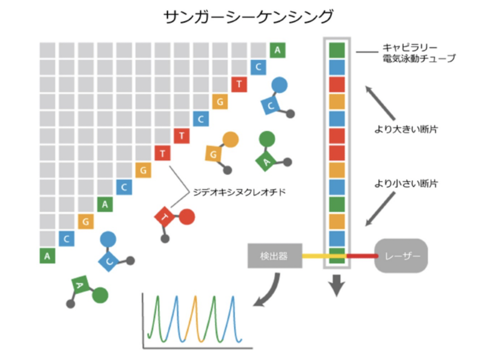
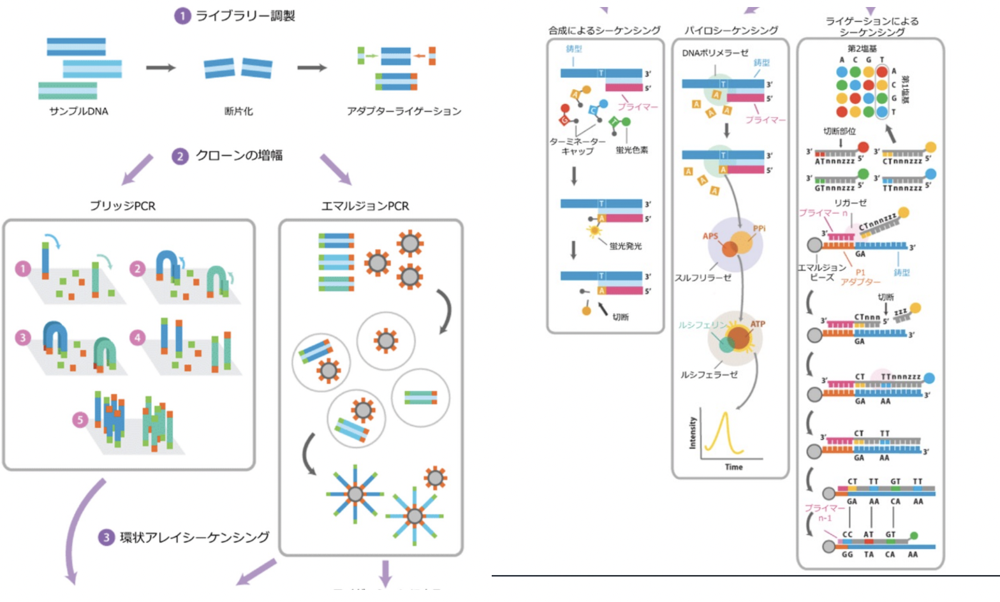
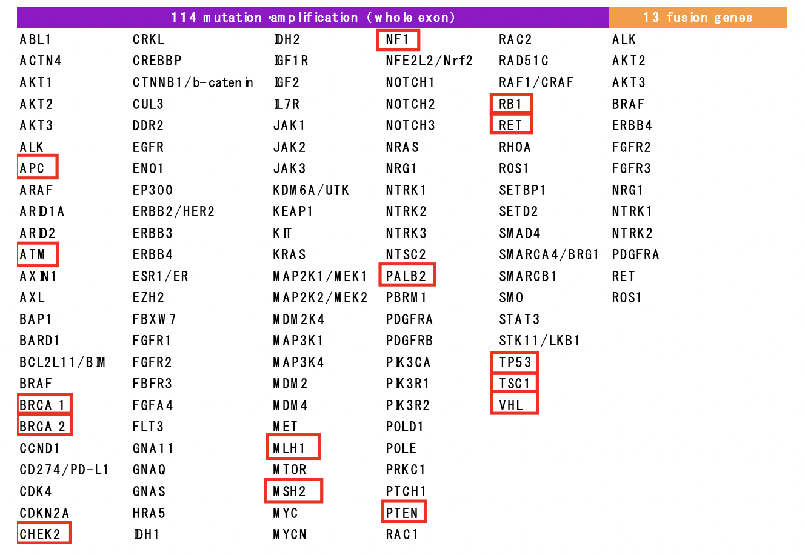

# 0831 分子病理学概論
## 病理学の研究, サイエンスとは？
病理医 ＝ 全ての科の病理、生命現象を理解している。  
その結果、多くの患者をすくうことができる。

### Researchによる革新的な治療（医薬品）
1. CAR-T療法：がん患者の末梢血由来T細胞に体外でがんを認識する遺伝子CARを導入して増やし、がん細胞を攻撃できるようにしてから患者へ再び戻す治療法。白血病の治療に用いられる。
2. 免疫Check point阻害剤
3. ゲノム編集
4. mRNA医薬品

### 新型コロナウイルスワクチンの原理
Dr Karikó Katalin の研究成果。  
SARS-CoV2は、RNAウイルスで約30,000bp。   
mRNAを導入してタンパク質を発現させるという点において新しい手法を取り入れている。  
  

cf. ワクチンの種類  
1. **生ワクチン、賦活化ワクチン**：病原体を直接体内にいれる。
2. **タンパク質ベースワクチン**：病原体の毒素（タンパク質）を体内にいれる。
3. **ウイルスベクターワクチン**：擬似的なウイルスを感染させる。  

  

#### RNAワクチンの問題点
長鎖RNAを体内に入れると、**分解**されたり、**炎症反応**が起きてしてしまう。  
核酸投与による**炎症性サイトカインの産生**は核酸の長さに強く依存する。

遺伝子変異量（TMB）は、がん細胞のゲノムに生じた遺伝子変異のおおよその量
TMBが最も高いのは、悪性黒色腫。
## 臨床における分子病理学 
### ゲノム医療とは
**Precision Medicine**の根幹で、ゲノム検査とそれに基づく治療。  
「個⼈のゲノム情報をはじめとした各種**オミックス検査**情報をもとにして、その⼈の体質や病状に適した医療を⾏うこと」
次世代シーケンシング技術を⽤いて、数⼗〜数百の遺伝⼦における変異を⼀度に検査可能な「**がん遺伝⼦パネル**」が臨床導⼊され、複数のパネルが保険適⽤されている。

### がんとゲノム医療
分子生物学の発展、次世代シークエンサーによって、癌の遺伝子異常が明らかになってきた。  
**遺伝子変異量TMB**は、がん細胞のゲノムに生じた遺伝子変異のおおよその量を意味するが、これが最も高いのは、**悪性黒色腫**。  
また、**ドライバー遺伝子**は、その変異の本体ががん化に直接かかわっている遺伝子のことであり、これも徐々によくわかってきている。

### NGS
#### 前身：古典的DNAシークエンス(1980)  

#### NGS

### がん遺伝⼦パネル検査の現状
2018年12⽉に2種類の次世代シーケンサーを⽤いた遺伝⼦パネル検査薬事承認。  
- OncoGuide NCCオンコパネル
  - 保険医療：56,000点
  - by 国⽴がんセンター、シスメックス株式会社
  - 114遺伝⼦の変異を検出する。
  - 体細胞遺伝⼦変異と⽣殖細胞系列（胚細胞）遺伝⼦変異を区別できる・
- FoundationOne CDx がんゲノムプロファイル
  - 保険医療：56,000点
  - by 中外製薬株式会社
  - 324遺伝⼦の変異を解析。
  - 腫瘍の遺伝⼦変異量（Tumor Mutational Burden：TMB）やマイクロサテライト不安定性（Microsatellite Instability：MSI）などのバイオマーカーを検出する。  

#### NCCオンコパネルによる114遺伝子プロファイリング   
**腫瘍組織FFPEと正常組織のペア解析**を行う。

#### クリニカルシーケンスとバイオインフォマティクス
クリニカルシーケンスを行うと、ゲノムの変異（SNP等を含む）は数千〜数万個見つかる。  
それぞれの変異に対する解釈・翻訳が必要である。現状では、この部分がボトル
ネックになっている。  
そのため、「**バイオインフォマティクス**の重
要性」が問われている。