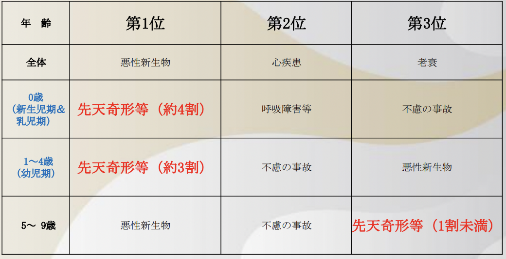
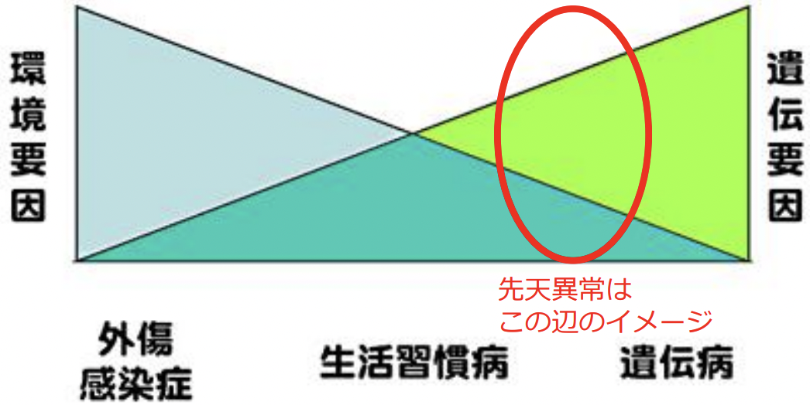
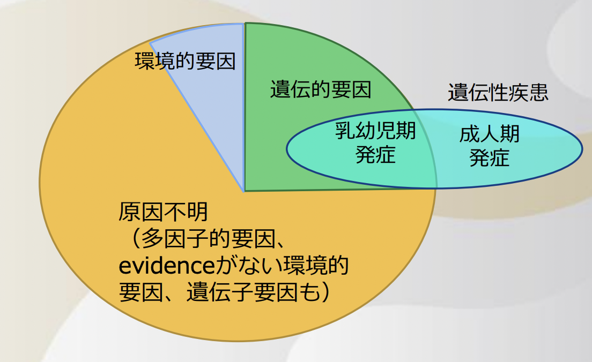
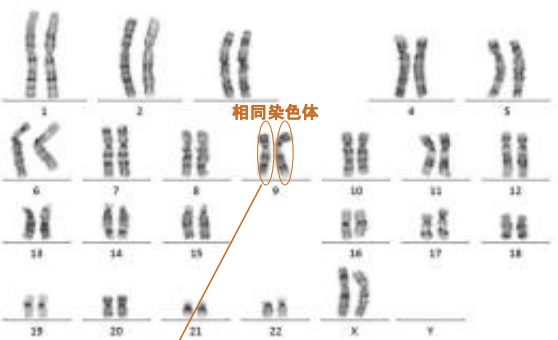
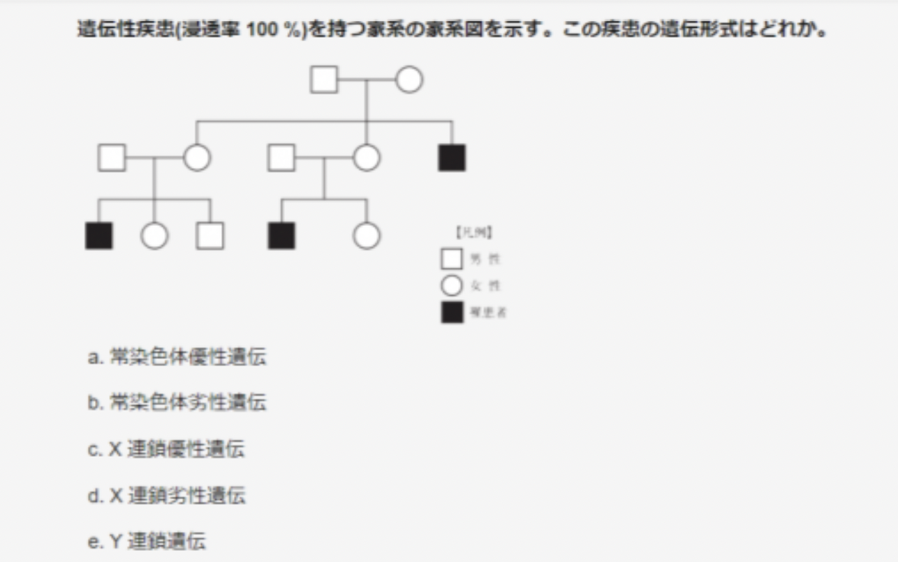
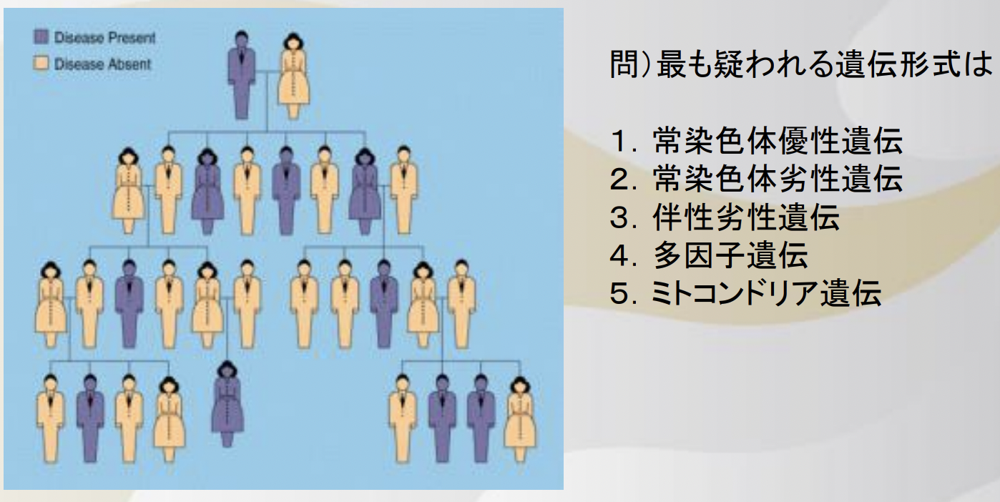

# 0907 先天異常
# 1. 先天異常とは
## 先天異常の定義と疫学
定義：出生時 or 胎児期からみられる異常のこと。  
先天異常のうち、形態学的な異常を「先天奇形」という。  
新生児の先天異常の頻度は約5%。実はこれより多いが、重篤な先天異常の場合には、胎児期に流産・死産してしまうため、この値に落ち着いている。（妊娠早期の自然流産では、少なくとも半数に染色体異常がみられる）  
先天異常は、乳幼児の死亡原因第1位となっている。（途上国では感染症・栄養障害が95%）

### 日本の小児の死因順位(2019)

### 先天奇形の形式（古典的、覚えなくて可）
- 発育抑制：低形成、無形成
- 発育過剰：末端肥大症、半身肥大症など
- 癒合不全：口唇裂、口蓋裂、重複子宮など
- 異常癒合：四肢や指の癒合、馬蹄腎など
- 位置異常：内蔵逆位、異所膵など
- 遺残：動脈管開存、卵円孔開存、尿膜管遺残など
- 単体奇形：単独奇形、多発奇形
- 重複奇形：一卵性双胎でみられる奇形

# 2. 先天異常の原因
病気は、遺伝要因と環境要因の複合で生じる。例えば、一卵性双生児でも同一の病気に罹る確率は30％程度。  
先天異常では、成人ほどの環境要因はないはず。しかし原因がはっきりと
わかっているものは案外少ない。  
   

- a. 遺伝的：内因性。頻度約25％。
  - a-1. 染色体異常：常染色体異常、性染色体異常
  - a-2. 遺伝子異常：常染色体優性/劣性遺伝、伴性遺伝
- b. 環境的：外因性。頻度約10％。
  - b-1. 感染：TORCH症候群など
  - 物理的：放射線、胎盤血行障害、羊水過少など
  - 化学的：薬物、有機水銀、ホルモンなど
-  C. 多因子的：頻度不明
  - 遺伝的＋環境的：一つの因子では説明できない。

以下、補足。
- 遺伝的要因は、必ずしも遺伝性を持つわけではない。その個体だけにみられる場合や、特定の臓器の細胞だけにみられる場合もある。  
- 染色体や遺伝子の異常があっても発病するとは限らない。
  - 関連words
    - 表現型：実際に現れる形態変化や症状
    - 浸透率：遺伝子異常がある場合に実際に発病する率
    - 遺伝子多型：疾患への関与が不明なら個性。関連があるなら疾患感受性となる（predisposition, susceptibility）。
- 遺伝子自体ではなく、遺伝子発現における異常もある。
  - トリプレットリピート病（異常の蓄積）
  - エピジェネティクス  

## a. 遺伝的原因
### a-1. 染色体異常
**Gバンド染色法**  
1. **末梢血より白血球を単離**し、**PHA**等で刺激して培養する。
2. コルセミド添加等で分裂を止める。
3. 乾燥、トリプシン処理、ギムザ染色。
4. 分裂期中期細胞がよくある写真みたいに見える。  

  
バンド名は、国際基準のもと、**セントロメアからテロメアに向かって**番号が付けられている。

- 染色体異常
  - 染色体の数の異常：減数分裂時の不分離が主な原因。
    - 異数体 aneuploidy（トリソミー、モノソミー）  
    ※ 体細胞すべてが異数性を示す個体で、出生まで生存可能な常染色体の異常は、13トリソミー、18トリソミー、21トリソミー（ダウン症候群）の３種のみ。
    - 多倍数体 polyploidy：染色体数が基本数の3倍以上の個体。ヒトでは妊娠早期で流産になるため出生に至らない。
- 染色体の構造異常
  - 欠失：eg. 5p-(猫なき症候群、5pモノソミー)
  - 重複：copy number gainの原因となる。 eg. がん細胞
  - 逆位
  - 環状染色体
  - 転座
    - 均衡型転座：断片が入れ替わるのみで遺伝子の量的変化を来さない。よって、表現型には変化ないが、不妊や流産の原因になる。  
    eg. ロバートソン型転座：染色体不分離以外のダウン症の原因として重要。
    - 不均衡型転座：挿入や欠失も同時に生じるため、遺伝子の量的変化が起こる。白血病や軟部腫瘍でよくみられる。
  - 染色体不安定性：間隙や断裂、狭窄などが頻繁にみられ、培養すると転座や逆位が高頻度に出現する。 DNAの修復過程に異常あること多く、高発癌性。  
  eg. Fanconi貧血、リンチ症候群など
  

cf. モザイクとキメラ
- モザイク：1つの個体が染色体構成の異なる細胞系から成る。
（1つの胚に由来）
例）正常と21トリソミーのモザイク・・・46,XX / 47,XY,+21
胎盤モザイク・・・胎児と胎盤で異なる核型
キメラ：異なる配偶子由来の胚細胞が分化し混在して1つの個
体をつくる
例）ヒトとブタのキメラ臓器、二卵性双生児の血液キメラ

### a-2. 遺伝子異常
Genome ＝ gene + chromosome  

生殖細胞におけるDNAの塩基配列全体で、ヒトで2組のゲノムが1つの細胞に存在する（2倍体）。  
ヒトゲノムの数： 32億塩基対 （3.2x109bp=3.2Gbp）。  
みられる異常は、染色体の構造異常と似ているが、分子レベルなので、染色体解析では正常でも遺伝子レベルで変化が検出されること有り。  
- 点変異：1つの塩基が別の塩基に変わること
  - ミスセンス変異：点変異により、そのコドンが変わり、正常とは異なるアミノ酸をコードする。
  - ナンセンス変異：点変異により、終始コドンに変わり、通常より短いタンパク質（Truncated protein）が合成される。
  - サイレント変異：コードされるアミノ酸は変わらない。
- 挿入変異・欠損変異：1個以上の塩基が挿入または欠損する。
  - フレームシフト変異：ずれが生じて、そこからは違うアミノ酸配列となる。大抵は、しばらくすると終始コドンとなって止まる。
  - インフレーム変異：挿入または欠失が3の倍数個のとき。そのアミノ酸以外は正常と同じ配列となる。

#### 変異蛋白の機能からみた遺伝子変異
・機能喪失変異 loss of function mutation：その変異により、本来のタンパク質の機能が失われること。
片アレルだけの場合（ヘテロ）：もう一方のアレルからの正常タンパ
クにより補われる場合と、十分に補われない場合がある（ハプロ不全）
両アレルの場合（ホモ）：そのタンパクの働きが全くない
・ドミナントネガティブ変異（優性阻害変異）：その変異によって
出来る異常タンパクが対側アリルから出来る正常タンパクを抑える。結果
的に機能喪失となる。cf. ハプロ不全
・機能獲得変異（gain of function）：その変異により、本来以上ま
たは恒常的に活性化したタンパク質が作られるようになること

#### 遺伝形式
- 常染色体優性遺伝
  - 保因者はいない
  -  片親が患者➡︎1/2の割合で患者
- 常染色体劣性遺伝
  - ヘテロは保因者、ホモは患者。
  - 両親が保因者➡︎50%が保因者、25%は患者
  - 片親が保因者➡︎50%が保因者なだけ
- 伴性（X連鎖性）遺伝
  - 伴性優性遺伝
  - 伴性劣性遺伝：発症は男性のみ。eg. 血友病  

#### 例題01
  
解答：d

#### 例題02
  
解答：a

## b. 環境的原因
### b-1. 感染
#### TORCH症候群  
妊娠中の感染によって胎児に奇形または重篤な母子感染症を引き起こす恐れのある疾患の総称。
- Toxoplasmosis トキソプラズマ症：生肉の摂取、ネコ糞などから感染。妊婦の抗体保有率は10％以下。
- Rubella 風疹
- Cytomegalo virus サイトメガロウイルス：多くの人が乳幼児期に自然感染するウイルスだが、近年、妊婦の抗体保有率は70％程度。
- Other
  - 梅毒
  - パルボウイルスB19
  - 水痘
- Herpes simplex virus（単純ヘルペスウイルス）  
  
各々、年間数人程度～100人程度
パルボウイルスB19が最多であるが、推定では、サイトメガロウイルスが最多と考えられて
いる（年間1000人程度と推定も、検査・診断法が確立されていないため把握できない）

### b-2. 物理的因子
#### 放射線
動物実験および原爆後調査により、器官形成期に母親に照射すると、受精後12～41日頃が最も敏感に影響を受けて奇形になる（それ以前は流産となる）。100mGy付近が閾値。  
妊娠8週～25週の被爆では、胎児に精神発達遅滞を生じるという報告もある。

#### 圧迫等による発育不全
- Potter症候群
両側腎の無形成 or 異形成のため、尿
が産生できない
→ 羊水過少
→ 肺低形成（羊水は肺の形成促進）
・ 平たい老人様顔貌
・ 四肢の変形
予後不良 （肺低形成のため）
羊膜索症候群
羊膜が何らかの理由で強靱な索状物と
なり、胎児の体に絡み付き、発達を阻
害し、奇形を起こす

### b-3. 化学的因子 
- 薬物
  - サリドマイド（制吐剤や睡眠薬に含まれていた、アザラシ肢症）
  - 炭酸リチウム（躁うつ病薬、心血管奇形）
  - テトラサイクリン（抗生剤、歯牙色＝テトラサイクリン歯）
  - ワーファリン（抗凝固薬、軟骨形成不全、中枢神経系異常）
  - ビタミンA（レチノイン酸、過剰摂取で様々な奇形）
有機水銀 （水俣病/マグロ等の過剰摂取、脳性まひ、視力障害）
葉酸（ビタミンBの一種、不足で神経管閉鎖不全）
・ホルモン：黄体ホルモン（流産防止目的、大量で女性器の男性化）
副腎性器症候群（21水酸化酵素欠損症（常染色体劣性遺伝）
によるものが最多、女性器の男性化）
甲状腺ホルモン（欠乏で、知的障害（クレチン病））
環境ホルモン（ダイオキシン）
・タバコ：ニコチンの血管収縮作用で血流不全→低出生体重児
・大量アルコール：発育障害、知的障害

## c. 多因子的原因
多くの先天奇形は、発生の障害により生じると考えられるが、特定
の遺伝子変異や環境要因がみられない。一つの因子で説明できない、よって多因子的とよばれる。
しかし最近は、発生異常を起こすメカニズムが分子レベルで
明らかになってきている。   
eg. 鶏胎児の前脳では、発生9日頃より、ソニックヘッジホッグSHH蛋白の存在下で、眼の元になる細胞が遊走する。発生4～9日の間、SHH遺伝子の発現を抑えると、単眼症が生じる ＝ 単眼になる臨界期

# 発生時期による分類
先天異常は、病因の作用する時期に従って、従来以下のように分類されてきた（暗記不要）
- 遺伝子病 genopathy
- 配偶子病 gametopathy : 配偶子形成～受精
- 胎芽病（胚子病）embryopathy : 受精～10週頃
- 胎児病 fetopathy : 胎芽期以後～出生まで

## 奇形成立の臨界期
各器官の催奇形性感受性が最も高い時期をいう
多くの器官では、胎芽期（胚子期）で、受精後3～８週
（文献により少し異なる）
★ それまでは、致死するか完全修復される（０か１か）
臨界期を過ぎれば、奇形発生は少なくなる。
一般に、発生の早い時期ほど、より重篤な奇形となる。