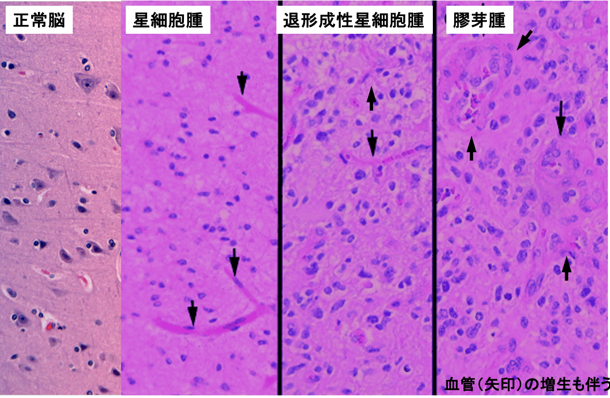
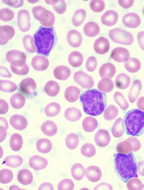
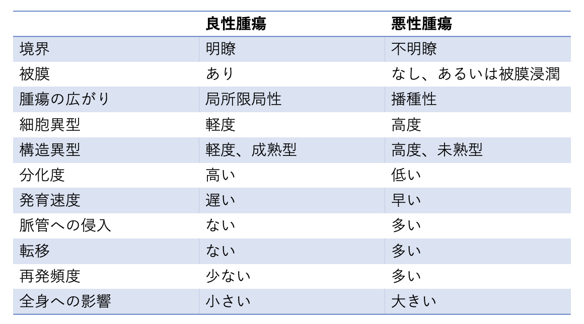

# 0907 組織学の復習
## 1. 病理学概説
- 概念としての病理学
- 病理診断学
- 学問としての病理学  

上記の3者は連動する。教科書では「学問としての病理学」を偏重しすぎる。良い医療従事者となるためには、「概念としての病理学」を学ぶ。医療現場では、「病理診断学」が活躍するが、 病理医に委託している。

## 1.1. 病名を決めるまでの例
病名の決定は、特に腫瘍では病理医に委託される。  
  

## 1.2. 病理医の組織の診断基準

  
レジュメp13-34は組織像等であるため、飛ばす。

# 2. 腫瘍の発生母地と分化について
分化とは、成熟して役割を獲得すること。

## 2.1. がんの病理診断のアルゴリズム
由来組織と分化度から決める。  
脱分化している状態が腫瘍化している状態である。  
 
## 2.2. 腫瘍名の表記
- 良性腫瘍の場合
  - 由来組織名 + 腫
- 悪性腫瘍の場合 
  - 上皮の場合：由来組織名 + 癌
  - 非上皮の場合：由来組織名 + 肉腫 
- 例外：悪性リンパ腫、白血病、多発性骨髄腫 

## 2.3. 癌の母地となる正常の上皮
腫瘍の組織型と発⽣⺟地の組織は、ほぼ対応する。
- 扁平上皮：物理的刺激を受ける可能性があり、感染防御を行う。-> 重層構造。
  - 角化型重層扁平上皮：皮膚 
  - 非角化型重層扁平上皮：眼瞼結膜、口腔、食道、尿道、膣 
- 腺上皮
  - 円柱上皮・立方上皮：胃腸、子宮頸管・内膜
  - 導管と腺房からなる：膵臓、唾液腺、乳腺、前立腺
  - 線毛上皮：鼻腔、気管、気管支、耳管〜中耳、卵管
  - その他：肺、尿細管、卵巣
- 尿路上皮：膀胱、尿管、腎盂　（※男性では、尿道にも円柱上皮が存在する。）
- 中皮：胸膜、腹膜   

肝臓は、広義では腺上皮に属す。  
扁平上皮化生の好発部位：気管支、中耳、子宮頸部、膀胱  
肺癌の一部や子宮頸癌の多くが扁平上皮癌であるのは、扁平上皮化生が関わるためである。
### 2.3.1. 感染症との関わり
- カンジダ、ヘルペスウイルス、パピローマウイルス：重層扁平上皮を好む -> 口内炎、食道炎、膣炎などが好発。
- サイトメガロウイルス：腺上皮を好む -> 肺炎、腸炎などが好発。
- 淋菌やクラミジア：腺上皮を好む -> 男性では尿道炎、女性では子宮頚管炎が好発。

## 2.4. 腫瘍化・悪性化に伴う形態変化 
一般に腫瘍化・悪性化するにつれて...
- 核の異型度が増加する。
- DNA合成が盛んになるため、核自体が大きくなる。
- 核/細胞質比が増大する。
- 分化が低下するため、機能低下した細胞になる。
- 分裂増殖速度が速くなる。
- 正常組織を破壊する。
- 腫瘍の栄養血管を誘導するために、血管の増生を伴うこともある。 
- 腫瘍組織の増大に血流が追い付かないため、壊死も伴うこともある。

## 2.5. 腫瘍の細胞異型と構造異型、悪性度について
異型性 atypiaとは、腫瘍の細胞・組織の形と正常の細胞・組織形を比較した時に確認される違いのこと。病理医は腫瘍の病理組織標本から細胞異型と構造異型を観察し、診断をする。
- 細胞異型：細胞レベルの異型性。 
- 構造異型：細胞の配列の乱れや組織の構築についての異型性。
- 悪性度：その腫瘍の持つ宿主、つまり患者の予後に対する影響の程度。腫瘍は低分化であるほど、悪性度が⾼くなる。
### 2.5.1.細胞異型
細胞異型がある場合、その細胞の外観は以下のようになる。
- 核は⼤型、輪郭は不整になる。
- 核の色が濃くなる。
- N/C⽐が⾼くなる。
- 核⼩体が⼤きくなり、数も増える。
#### 2.5.1.1. 腺上⽪の異型
- 正常：腺管は独⽴しており、核は丸くて⼩さく基底寄りに存在する。
- 腺腫：腺管は独⽴しており、核は紡錘形で重層化している。
- ⾼分化腺癌：腺管は融合しており、核が腫⼤化し極性は乱れる。
- 低分化腺癌：腺管は形成せず、細胞はバラバラに存在。⾟うじて粘液は産生する状態。
### 2.5.2. example; 星細胞（膠細胞）の悪性化
星細胞系腫瘍（脳腫瘍）では、膠芽腫 > 退形成性星細胞腫 > 星細胞腫のオーダーで悪性度が高い。  

### 2.5.3. ⾻髄性⽩⾎病の末梢⾎像
⽩⾎病では、⾻髄にしかいないはずの芽球が末梢血に出現する。  

### 2.5.4. 扁平上⽪系腫瘍の悪性度
扁平上⽪系腫瘍では、悪性度が高い順に、以下。
- 低分化扁平上⽪癌
- 中分化扁平上⽪癌
- ⾼分化扁平上⽪癌
- ⾼度異形成
- 中等度異形成
- 軽度異形成
## 2.6. 良性腫瘍と悪性腫瘍の病理学的違い
  
