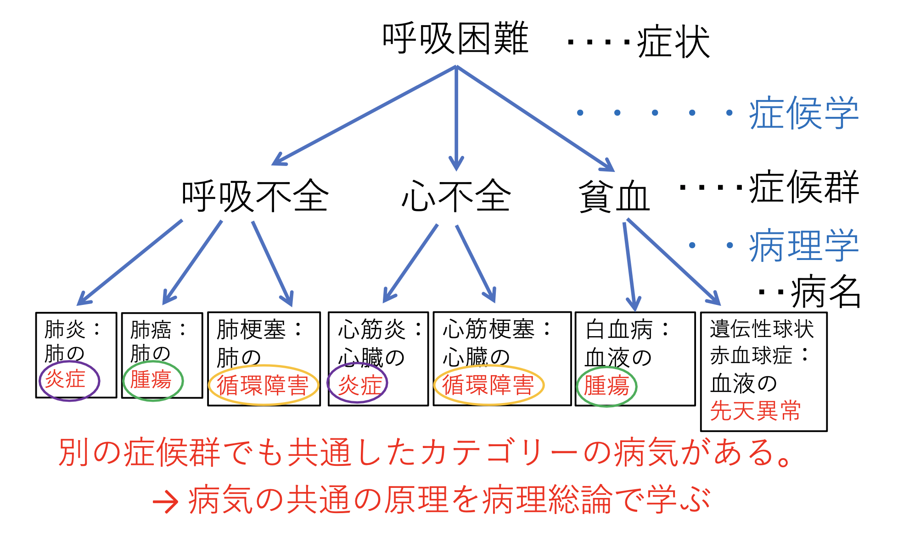
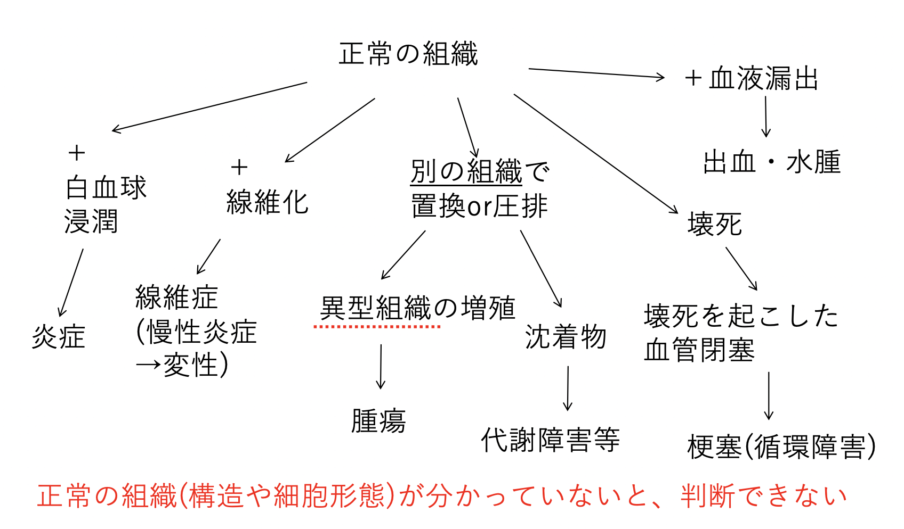

# 0907 組織学の復習
## 病名を決めるまでの例
  

## 病理学概説
- 概念としての病理学
- 病理診断学
- 学問としての病理学  

上記の3者は連動する。教科書では「学問としての病理学」を偏重しすぎる。良い医療従事者となるためには、「概念としての病理学」を学ぶ。医療現場では、「病理診断学」が活躍するが、 病理医に委託している。

## 病理医の組織の診断基準

# 腫瘍の発生母地と分化について
## 分化とは何か？
分化とは、成熟して役割を獲得すること。

## がんの病理診断のアルゴリズム
由来組織と分化度から決める。  
脱分化している状態が腫瘍化している状態である。  
 
## 腫瘍名の表記
- 良性腫瘍
  - 由来組織名+腫 (eg. 腺腫、平滑筋腫)
- 悪性腫瘍 
  - 由来組織名+癌(上皮) (Ex. 腺癌、扁平上皮癌)
  - 由来組織名+肉腫(非上皮) (Ex. 平滑筋肉腫、骨肉腫)
(例外) 悪性リンパ腫、白血病 多発性骨髄腫 etc

## 癌の母地となる正常の上皮
- 扁平上皮：物理的刺激を受ける可能性があり、感染防御を行う。➡︎重層構造をとる。
  - 角化型重層扁平上皮：皮膚 
  - 非角化型重層扁平上皮：眼瞼結膜、口腔、食道、尿道、膣 
- 腺上皮
  - 円柱上皮、立方上皮：胃腸、子宮頸管・内膜
  - 導管と腺房からなる：膵臓、唾液腺、乳腺、前立腺
  - 線毛上皮：鼻腔、気管、気管支、耳管〜中耳、卵管
  - その他：肺、尿細管、卵巣
  
肝臓は、広義のでは腺上皮ではある。  
尿路上皮:膀胱、尿管、腎盂
男性:尿道にも円柱上皮あり
・中皮:胸膜、腹膜
※ 扁平上皮化生の好発部位: 気管支、中耳、子宮頸部、膀胱(感染・刺激に応じ)

皮膚癌・口腔癌・食道癌など:ほとんどが扁平上皮癌
• 胃癌・大腸癌・膵臓癌・乳癌・前立腺癌など:ほとんどが腺癌
• 膀胱癌・尿管癌など:ほとんどが尿路上皮癌
• 肺癌の一部や子宮頸癌の多くが扁平上皮癌である理由:扁平上皮化生が 関わる
さらには感染症の理解にも
• カンジダ、ヘルペスウイルス、パピローマウイルスは 重層扁平上皮が 好き(口内炎、食道炎、膣炎など)
• サイトメガロウイルスは腺上皮が好き(肺炎、腸炎など)
• 淋菌やクラミジアは腺上皮が好き(男性で尿道炎、女性で子宮頚管炎)
• 男性同性愛者にAIDS発症が多い理由:
• 男性同性愛者にAIDS発症が多い理由：膣の代替に直腸を性交で用いる・腺上皮は物理的刺激に弱いため、出血から感染が生じやすい

一般に腫瘍化・悪性化するにつれて
• 核は異型度を増す(綺麗な丸から遠ざかる)
• 核/細胞質比が増大する(核密度が上がる)
• 核自体も大きくなる(DNA合成が盛ん)
• 機能低下した細胞になる(分化の低下を反映) • 分裂増殖速度が速くなる
• 正常組織を破壊する(抑制する)
• 血管の増生を伴うことも(腫瘍栄養血管を誘導) • 腫瘍組織の増大に血流が追い付かず壊死も

腫瘍の細胞異型と構造異型、悪性度について
異型性(atypia) 腫瘍の細胞・組織の形は正常の細胞・組織形と比べると
様々な点で違う。この違いを異型性と呼ぶ。
細胞異型:細胞レベルの異型性 構造異型:細胞の配列の乱れや組織の構築に
ついての異型性 悪性度:その腫瘍の持つ宿主(患者)の予後に
対する影響の程度。
☆病理医は腫瘍の病理組織標本から細胞異型と構造異型を 観察し、診断をする。