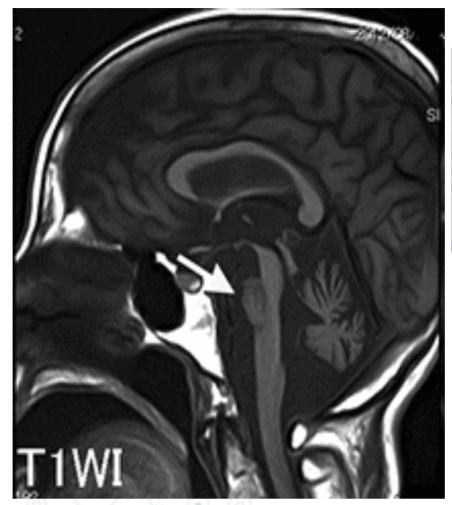

# 0914 先天異常2
# 1. 染色体異常の代表的疾患
|     | 疾患名               | 症状                                                            | 染色体異常形式                     | 核型                             | 
| --- | -------------------- | --------------------------------------------------------------- | ---------------------------------- | -------------------------------- | 
| 1   | Down syndrome        | ・精神発達遅滞 ・心奇形                                      | 21 trisomy                         | ♂ 47, XY, +21 ♀ 47, XX, +21 | 
| 2   | Edwards syndrome     | ・心奇形 ・overlapping finger ・club foot 予後は不良。 | 18 trisomy                         | ♂ 47, XY, +18 ♀ 47, XX, +18 | 
| 3   | Patau syndrome       | ・顔面の奇形 ・全前脳胞症 予後は不良。                    | 13 trisomy                         | ♂ 47, XY, +13 ♀ 47, XX, +13 | 
| 4   | Turner syndrome      | ・心奇形 ・無月経                                            | Missing an X chromosome            | 45, X                            | 
| 5   | Klinefelter syndrome | ・女性化体質 ・無精子症                                      | Two or more X chromosomes in males | 47, XXY                          | 

## 1.1. Down syndrome 
- 頻度：1/1000人。  
  - 95％　染色体不分離に起因し、母体の加齢と共にその頻度は増加する（40歳で1/100）。
  - 4％　 転座型 （ロバートソン転座保因者の親）
  - 1％　 モザイク型 （正常核型と混在する）
- 特徴
  - 特有の顔貌（眼瞼裂斜上、内眼角贅皮）
  - 精神発達遅滞 Mental retardation
  - 筋緊張低下
  - 猿線
- 合併症
  - 先天性心疾患 Congenitial heart disease：ECD・VSD・Fallot四徴症などが生じやすい。
  - 急性白血病：新生児一過性骨髄増殖症TAMや巨核球性白血病M7が生じやすい。
  - 他、鎖肛、甲状腺低形成、アルツハイマー病（21番染色体に家族性アルツハイマー病の責任任遺伝子を含むためと言われる）など。
- 平均寿命：50歳前後

## 1.2. Edwards syndrome
- 頻度：1/3500～1/7000
  - ♂:♀ = 1:4
- 特徴
  - 特有の顔貌（耳介低位、変形、小顎）
  - 手指の屈曲拘縮 overlapping
  - 凸状足底
  - 低体重（低体重出生児に多い）
  - 精神発達遅滞
- 合併症
  - 先天性心疾患：VSD・ASDなどが生じやすい
  - 消化管奇形（食道閉鎖、鎖肛など）
  - 臍帯ヘルニア
  - 泌尿生殖器系奇形（馬蹄腎、水腎症など） 
  - 小脳低形成
  - 脳梁欠損
  - 水頭症
- 予後：多発奇形のため不良。妊娠10週から末期に80%が死亡する。生産児の寿命は1年余りとされる。

## 1.3. Patau syndrome
- 頻度：1/5000
- 特徴
  - 特有の顔貌（小頭、小目、無眼球症、唇裂・口蓋裂）
  - 多指、合指
  - 精神発達遅滞など
- 合併症
  - 嗅脳欠損
  - 全前脳症
  - 単眼球症
  - 先天性心奇形
  - 腎奇形
- 予後：不良。大半が6ヶ月以内に死亡する。

## 1.4.Turner syndrome
- 頻度：1/2000
- 特徴
  - 特有の顔貌（翼状頸）
  - 低身長
  - 大動脈縮窄症
  - 乳房未発達
  - 外反肘
  - 索状卵巣
  - 無月経
- 備考
  - 知的障害は稀だが、学習障害や注意欠陥多動性障害は多い。
  - 45,XOや46,XYのモザイク型の場合、第二次性徴がみられることもある。

## 1.5. Klinefelter syndrome
- 頻度：男児の1/500
- 特徴
  - 高身長
  - 女性化乳房
  - 精巣萎縮
  - 無精子症
  - 類宦官症
  - 薄い体毛
  - 小睾丸
  
## 1.6. 性染色体異常について 
性染色体異常も、常染色体異常と同様に、配偶子形成時の染色体不分離が原因と考えられている。  
なお、X染色体がないと生存は不可能であるため、45,Yや47,YYYはみられない（Y染色体はなくても生存は可能である）。それは、性決定遺伝子SRYや精子形成に関わる遺伝子の多くがX染色体上にあるからだと考えられている。

## 1.7. 代表的な染色体検査
### 1.7.1. Gバンド染色法
最も基本的な検査方法。  
利点は、染色体の構造把握が可能である点。  
一方弱点としては、分裂期中期の細胞を得るまで培養しなければならないので結果を得るまで1週間以上要する点、微小な異常は見逃される可能性がある点である。
### 1.7.2. FISH法 Fluorescence in situ hybridization
利点としては、プローブの工夫により微小な異常でも正確に判定可能である点、間欠期細胞でも検査可能なので結果をすぐに得られる点。  
弱点としては、目的の異常以外は分からない点。
## 1.8. 出生前検査
### 1.8.1. 確定的だが侵襲的な検査
確定的な検査としては、Gバンド法とFISH法があげられる。  
しかしこれらは、絨毛膜（胎盤）または羊水を採取する必要があるため、侵襲性が高い。  
FISH法においては、21,18,13番染色体とハイブリダイズするプローブのみを使用するのが一般的。  
また、Gバンド法は時間を要するため、最初から2つの検査を同時に行なってしまうことが多い。
### 1.8.2. 侵襲は少ないが不確定的な検査
以下の2つが挙げられる。これらは妊婦の血液をサンプルとするため、侵襲性がが少ない。  
1. トリプルマーカー/クアトロテスト  
   -> AFP、hCG、uE3など胎児胎盤機能を反映するタンパクを測定することで、21トリソミーや神経管閉鎖不全の存在を推定できる。
2. 新型出生前診断 Non-invasive prenatal genetic testing: NIPT  
   -> NGSを使って、母体血中のcfDNA（セルフリーDNA）から23本の染色体各々の量を測定する。胎児由来cfDNAが一定レベルで含まれることがわかっているため、欠失している染色体があると推定できる。

# 2. 遺伝子異常の代表的疾患
## 2.1. 常染色体優性遺伝の疾患例
- Marfan症候群：結合組織の脆弱化。
- 遺伝性球状赤血球症：赤血球の膜異常により、脾臓での破壊が亢進し、溶血性貧血をきたすす。先天性溶血性貧血で最多。
- 多発性嚢胞腎：腎臓、肝臓に徐々に嚢胞が増える。
- Huntington舞踏病：中年以後、舞踏運動などの不随意運動と精神症状。
- 筋緊張性ジストロフィー：中年以後、筋肉が固まりやすくなり、収縮状態から戻りにくくなる。
- 家族性アミロイドーシス：アミロイドが沈着する。
- 家族性高コレステロール血症：1/500と頻度が高く、心筋梗塞などのリスクを生じる。
- 家族性大腸ポリポーシス：35歳までに大腸ポリープ、60歳までに大腸癌が100%生じる。
  
これらの症状は、比較的軽症 or 重症でも発症時期が遅い or 浸透率が低いため、遺伝子異常が淘汰されにくい。
### 2.1.1. Marfan症候群
- 原因：15q21上のFBN1遺伝子の変異
- 機序・病態：弾性線維の構成成分であるフィブリリン1蛋白が正常に合成されず、弾性線維の発達障害や脆弱化が起きる。
- 症状：受動的に収縮することが多い臓器で起きる。
  - 大動脈中膜変性 -> 大動脈解離
  - 水晶体支持靭帯変性 -> 水晶体亜脱臼
  - 肺胞の破壊 -> 肺気腫 COPD -> 気胸
  - 皮膚の過伸展
  - 関節の過剰可動性
  - 脊髄変形（後側弯）
  - 高アーチ口蓋
  - 骨の過形成 -> 高身長、クモ状肢
## 2.2. 常染色体劣性遺伝の疾患例
1遺伝子1酵素説に基づき、酵素合成に関する異常が多い。
- フェニルケトン尿症：知能障害
- 糖原病：グリコーゲンを代謝できない（一部は伴性劣性遺伝）。
- ガラクトース血症：ガラクトースを代謝できない。
- ホモシスチン尿症：ホモシスチンを代謝できない。
- Wilson病：肝臓での銅の代謝障害。
- 先天性副腎皮質過形成：副腎での酵素欠損。
- Friedreich失調症：脊髄障害 -> 失調性歩行。
#### 2.2.1. 先天性副腎皮質過形成（副腎性器症候群）
副腎皮質で3種のステロイドホルモンが合成されるが、その経路に異常が起こることが原因。  
21-水酸化酵素の欠損より、副腎皮質の各層で以下の様な異常が起きる。
-   
症状としては、低血糖、低Na&高K（副腎クリーゼ）、女児では外性器男性化、ACTH過剰による皮膚の黒色化、長期的には骨端線早期閉鎖による低身長などがわかっている。  
新生児マススクリーニングの対象疾患で、17α水酸化プロゲステロンの増加を検出する。
#### 2.2.2. 国試例題
生後9日の女児。2日前からの繰り返す嘔吐と哺乳力低下とを主訴に来院した。在胎39週、体重3,050g、Apgarスコア9点（1分）で出生した。活気がなく全身に色素沈着を認め、陰核肥大を認めた。
1. 診断はどれか？  
   1. クレチン症
   2. ガラクトース血症
   3. フェニルケトン尿症
   4. メープルシロップ尿症
   5. 先天性副腎皮質過形成症
2. 検査所見として考えられるのはどれか、2つ選べ？
   1. ACTH高値
   2. 低カリウム血症
   3. 低カルシウム血症
   4. 低ナトリウム血症
   5. 代謝性アルカローシス
## 2.3. X連鎖性（伴性）優性遺伝の疾患例
- レット症候群
- アルポート症候群
- 家族性低リン血性くる病
## 2.4. X連鎖性（伴性）劣性遺伝の疾患例
血液・免疫系の疾患が多い。
- 血友病：第Ⅷ or Ⅸ凝固因子の変異や出血性素因。
- 無γグロブリン血症：液性免疫の障害。 
- 慢性肉芽腫症：好中球が活性酸素を産生できない。
- Wiskott-Aldrich症候群：液性免疫＆細胞性免疫の障害。
- Duchenne型筋ジストロフィー：随意筋の不全。
- Lesch-Nyhan症候群：尿酸代謝障害。
- アンドロゲン不応症：XY型だがアンドロゲン受容体不全により女性様になる。
- 色覚異常：赤・緑視色素遺伝子がX染色体上にあるため。
### 2.4.1. アンドロゲン不応症
Xq11上に存在するアンドロゲン受容体遺伝子ARの異常により発症する。アンドロゲン作用機構の障害のため、外性器異常として女性型（無月経）〜男性型（男性不妊）まで、gender identityを含め種々の程度の男性化障害を呈する。核型は46, XYで精巣は存在するが、ミュラー管由来構造物（子宮）は存在しない。   
治療は、女児として養育された場合は、精巣摘出・膣形成を行い、思春期以降はエストロゲンの補充を行う。精巣摘出は精巣の腫瘍化リスクがあるために行うが、アンドロゲンから変換されたエストロゲンが2次性徴を誘導するため、思春期前の摘出は避けるとの意見もある。男児では、外陰形成術や乳房縮小術を行う。陰嚢外の精巣は腫瘍化リスクがあるため、摘出を検討する。
# 3. 通常の遺伝形式を取らない疾患
## 3.1. Triplet repeat病
3塩基繰り返し数（マイクロサテライトの一種）の増加により発症する。30疾患以上存在するが、神経筋疾患がほとんど。遺伝形式は様々あり、世代を重ねる程リピートが増えて、重篤化する傾向がある。  
特に、(CAG)nが翻訳される疾患をポリグルタミン病という。ポリグルタミン凝集により神経細胞障害を生じ、脊髄小脳失調症やハンチントン舞踏病などを発症する。なおリピートは、ORF（アミノ酸に翻訳される領域）だけでなく、イントロンやUTR（非翻訳領域）にも見られる。
### 3.1.1. 脊髄小脳変性症 SCA
小脳、脊髄、脳幹が進行性に萎縮する難病で、多数の亜型が存在する。    
遺伝性のものが1/3を占め、主にトリプレットリピートが原因であり、神経細胞にポリグルタミンの蓄積や責任遺伝子産物であるAtaxin-3の異常産生が見られる。  
画像所見では、脳幹部と小脳に高度萎縮が確認できる。  
  
  
## 3.2. ミトコンドリア遺伝子の異常
ミトコンドリアDNA（mtDNA）は環状DNAであり、ヒストンもイントロンも持たずに独自で分裂する。細菌の細胞内共生説の根拠となっている。  
ミトコンドリア遺伝子の異常は、ミトコンドリア病の1/4の原因である。ミトコンドリア病とは、ミトコンドリア呼吸鎖酵素の遺伝子異常により起きるもので、200種類程度が知られている。全てのミトコンに変異が入っているわけではなく、変異ミトコン割合が高くなることで発症する。  
ちなみに、残りの3/4は核DNA上の遺伝子異が原因である。  
mtDNAは母系遺伝するため、多型に富む領域のmtDNA配列を解析することで、多くの人種でのバリエーションから系統樹つくることができる。これにより、人類の起源や移動がわかる。これに関しては、Y染色体も同様である。
## 3.3. ゲノムインプリンティング関連疾患
DNAのメチル化では、プロモーター領域のCpG配列の多い部位（= CpGアイランド）においてシトシンをメチル化することで、遺伝子発現を調整している。 細胞や組織によってメチル化部位は異なっており、その違いによって分化の方向が決まると考えられている。配偶子（精子・卵子）のDNAにもメチル化がある。　 
なお、メチル化はリセットされる。それはつまり未分化の状態になる（＝リプログラミング）ということである。しかし例外的にメチル化がリセットされにくい領域がある。その代表がインプリンティング遺伝子である。ここにここに変異や欠失があると、独特な遺伝形式を示すようになる。  
### 3.3.1. インプリンティング遺伝子の例
15q11-13にある遺伝子群。ここにある遺伝子のうち、SNORD116は必ず父由来アレルが、UBE3Aは必ず母由来アレルが発現するようなメチル化となる。したがって、もしそこに欠失があると、例えもう片方のアレルが正常であっても、メチル化されているため発現できず、病気が発症してしまう。   
- 父由来アレルにて、SNORD116の欠失 -> Prader-Willi症候群発症。
- 母由来アレルにて、UBE3Aの欠失 -> Angelman症候群発症。 
#### 3.3.1.1. Prader-Willi症候群
乳児期において、内分泌学的異常（筋緊張低下・過食・肥満・低身長・性腺機能不全）や学習障
害が見られる。
#### 3.3.1.2. Angelman症候群
重度の発達障害、笑い発作、小頭症、幅広の顎が見られる。

# 4. 先天性心奇形
## 4.1. 胎児循環
胎児循環では、酸素化血は、静脈管 -> 下大静脈 -> 右心房 -> 卵円孔 -> 左心房 -> 左心室 -> 大動脈 -> 頭部を栄養する。そして全身を循環した後、静脈血は、上大静脈 -> 右心房 -> 右心室 -> 肺動脈 -> 動脈管 -> 大動脈に流れる。  
動脈管より下位の動脈は静脈血の多い混合血であり、静脈血として、内腸骨動脈 -> 2本の臍動脈 -> 胎盤へと流れていく。
## 4.2. 出生時に起こる劇的変化
1. 第一啼泣により、肺血管床が開き、肺血管抵抗が急激に低下する。
2. 臍帯血管が自発的に収縮し、胎盤との循環を遮断する。
3. 動脈管は、出生後24時間以内に閉じる。
4. 卵円孔は、数日以内に閉鎖する。（組織学的に閉鎖するまでは生後３ヶ月～半年かかる。）
## 4.3. 先天性心奇形とは
新生児の約1%に認められる。新生児の先天性奇形の中で最多（約20%を占める）であり、1歳未満の死亡原因としても最多である。   
大部分が原因不明の多因子的病因といわれる。（内因ではトリソミー、外因では風疹感染の心奇形は有名。）  
チアノーゼの有無で分類することもある。左右シャントの先天性心疾患において、肺血流の増加が持続することによ肺動脈の器質的閉塞性病変が進行し、次第に肺血管抵抗が増加して肺高血圧となると、左心室系の圧を凌駕するようになって右左シャントが出現する（= アイゼンメンジャー化）と、チアノーゼを生じるようになる。

  

チアノーゼとは、動脈血の酸素飽和度の低下によって、皮膚色が青色に見えるようになること。動脈血中の還元ヘモグロビンが5g/dl以上（酸素飽和度は約66%以下）になると出現する。  
原因としては、心短絡路、高度な心拍出量低下、肺酸素化障害などがあげられる。

  

先天性心奇形を原因から分類すると以下。  
1. 左→右シャント：チアノーゼ無し  
   - 心房中隔欠損症
   - 心室中隔欠損症 
   - 心内膜床欠損症 
   - 動脈管開存症
2. 右→左シャント：チアノーゼ有  
   - 三尖弁閉鎖症
   - 肺動脈弁閉鎖症
   - Fallot四徴症
   - Ebstein奇形
3. 左→右→左シャント：チアノーゼ有  
   - 左心低形成症候群
   - 大動脈縮窄症
4. 血管のつけ間違えの例  
   - 完全大血管転位症：チアノーゼ有
   - 修正大血管転位症：チアノーゼ無
   - 総肺静脈還流異常症：チアノーゼ有
   - 両大血管右室起始症：チアノーゼ有  

  

なお、頻度の高さランキングは以下。
1. 心室中隔欠損症：チアノーゼ無
2. 肺動脈狭窄症：チアノーゼ有
3. 心房中隔欠損症：チアノーゼ無
4. ファロー四徴症：チアノーゼ有
5. 動脈管開存症：チアノーゼ無
### 4.3.1. 左→右シャントの例
### 4.3.2. 右→左シャントの例
### 4.3.3. 左→右→左シャントの例
### 4.3.4. 血管のつけ間違えの例
