# 0916 炎症
## 炎症とは？
生体が何らかの**有害な刺激**を受けて細胞が傷害された時に、その**障害の原因を取り除いた**り、細胞能障害の結果出来た壊死物を片付ける過程で生体に出現した**症候**である。ほとんどの場合、急性炎症の担当細胞は**好中球**である。  
- 有害な刺激とは？
  - **細菌・ウイルスなどの微生物による感染**
  - **アレルギー反応**
  - **物理**的因子（**外傷**、**火傷**、**凍傷**、**放射線**、**紫外線**）
  - **化学**的因子（**強酸**、**強アルカリ**、その他有害物質）
- 症候とは？（いわゆる炎症の5徴候）    
  - **発赤**：**血管拡張**による**赤血球の集合**。
  - **発熱**：**血管拡張**による。
  - **腫脹**：**浸出液（漿液）**による**血管浸透性の亢進**による。
  - **疼痛**：**内因性発痛物質**や**pHの変化**による。
  - **機能障害**：**上記の各種変化および肉芽形成**。上の4徴候によって引き起こされるもの。  

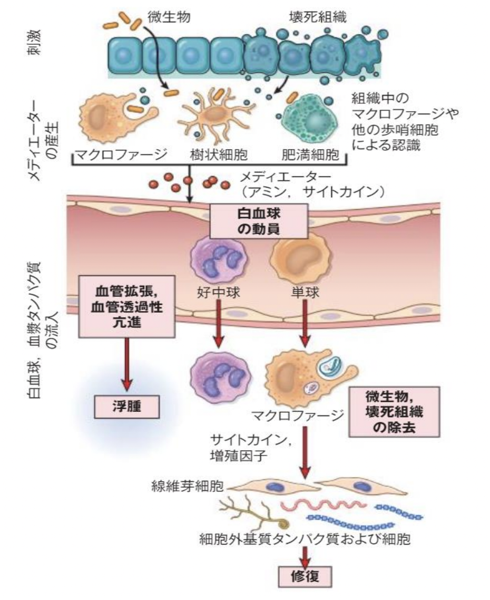  
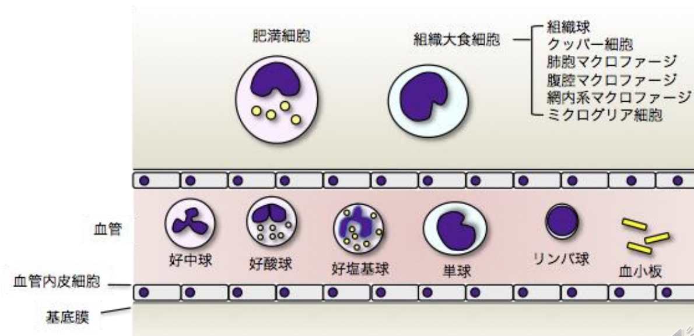

## 急性炎症前期
この時期には**血流量の変化**や**血管壁の変化**が起こる。  
炎症を引き起こす障害を取り除くために、その部分へ多くの**血液を集め**、血液中に含まれる細胞（主に障害を食べて処分している**白血球**）を血管から炎症を起こしている組織へ**送り届け**ようとする働きがある。  

1. **小動脈**や**微小血管**を**拡張**して**十分な血液を確保する**。➡︎**発赤**
2. **微小血管の透過性**を増して、**血漿成分**が**血液**から**組織**へ**滲出**する。➡︎**腫脹**
3. **血流が停滞**するため、**好中球**が**血管壁へ付着**しやすくなる（＝**辺縁趨向**）。
4. **辺縁趨向した好中球**は**血管内皮細胞**に沿って**移動**（＝**ローリング**）し、**内皮細胞結合部位**から**血管外**へ**遊走**する。
5. **好中球**は、**白血球走化因子**により**損傷部位へ移動**して活性化し、**細菌などの損傷原因**を**貪食**する。
6. **好中球と病原体の遺骸**は、①**膿汁となって排出される** or ②**リンパ管に流れる** or ③**マクロファージに貪食される**ことで処理される。②の時、**リンパ液の濾過**が起きるので、**リンパ管**が**腫れる**。

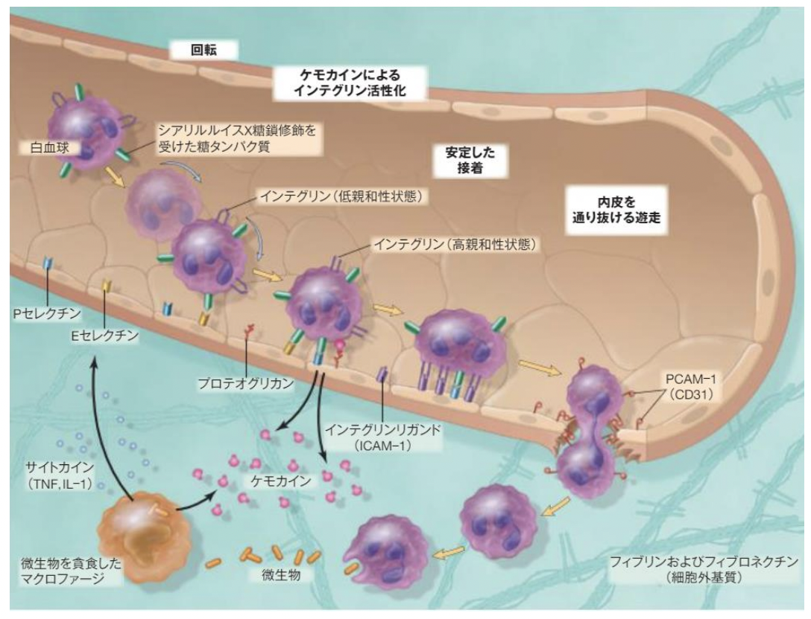

###　白血球活性化
微生物やメディエーターを何が認識するかによって、**4**つに機序が分かれる。
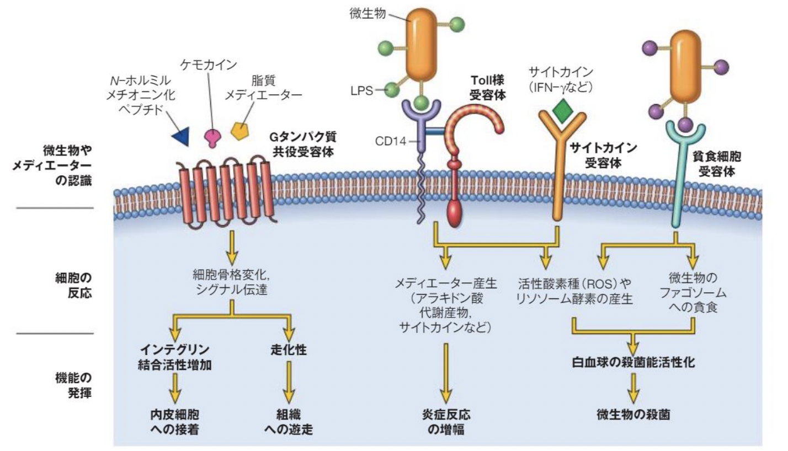  

### 貪食および微生物の細胞内破壊
病原体が**貪食細胞の受容体に結合**すると、**貪食細胞の細胞膜**が**微生物を包み込む**ように**閉まり**、**ファゴソームを形成**する。  
ここから先の反応は3つ判明している。
- **リゾチーム**による分解：**ファゴソーム**は、**リゾチーム**を内包する**リソソーム**と結合し、**ファゴリソソームを形成**する。こうして微生物は、**ファゴリソソーム内のリソソーム酵素**により分解される。
- **活性酸素**による分解
- **iNOS**による分解

ここから4枚は目を通す程度
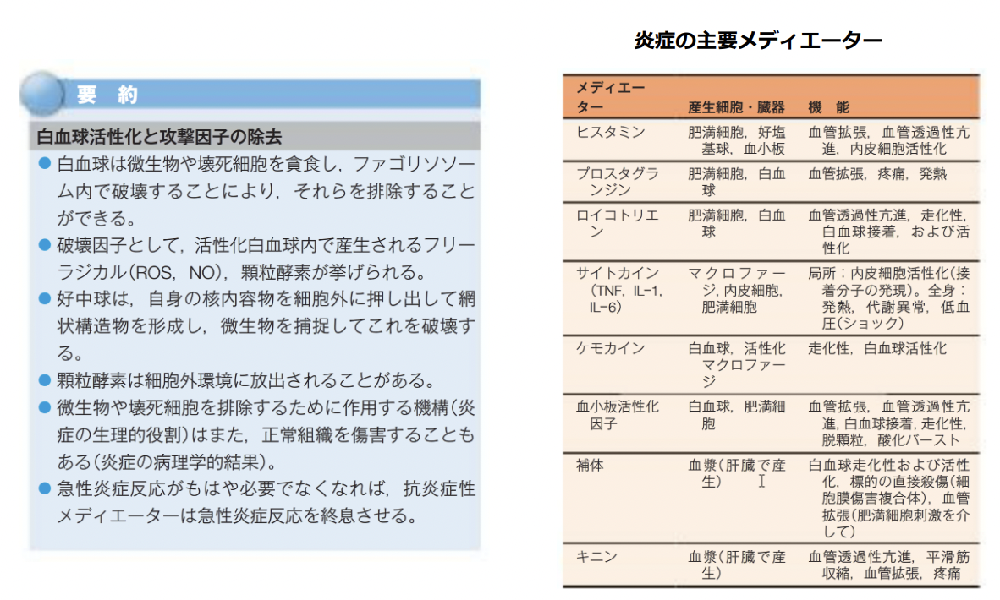  
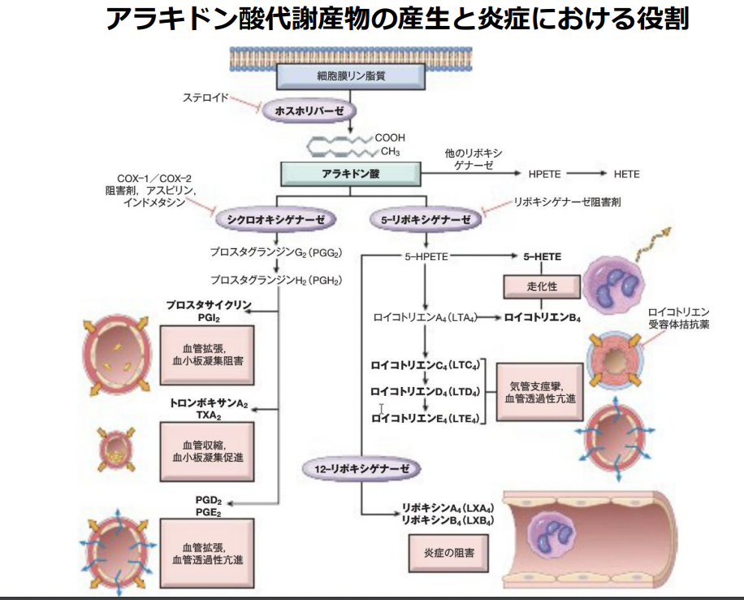  
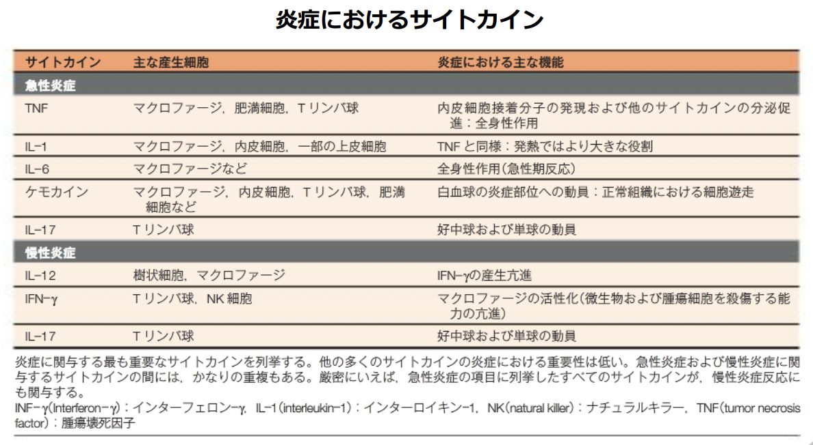  
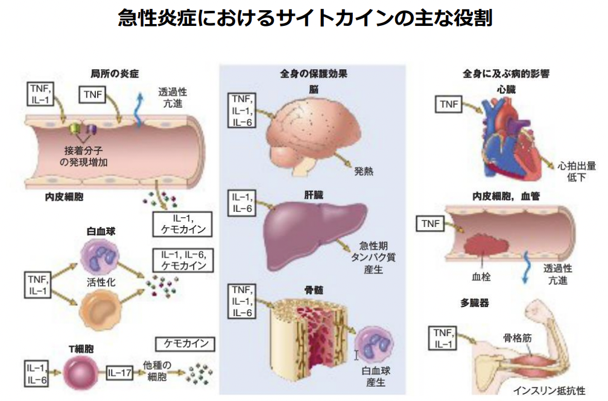

## 炎症の分類
- 時間経過による分類
  - **急性**炎症
  - **慢性**炎症
- 組織学的変化による分類
  - **滲出性**炎症
    - 漿液性炎
    - カタル性炎
    - 線維素性炎
    - 化膿性炎
  - **増殖性**炎症：コブができるイメージ。
    - 肉芽腫性炎症
      - 特異性炎症

## 炎症の時間経過
急性炎症の経過は前述の通り。慢性炎症に入ると、**組織球**が増加してくる。その後には**リンパ球**や**線維芽細胞**も増えることで**肉芽**ができる。急性炎症には、リンパ球は登場しない。
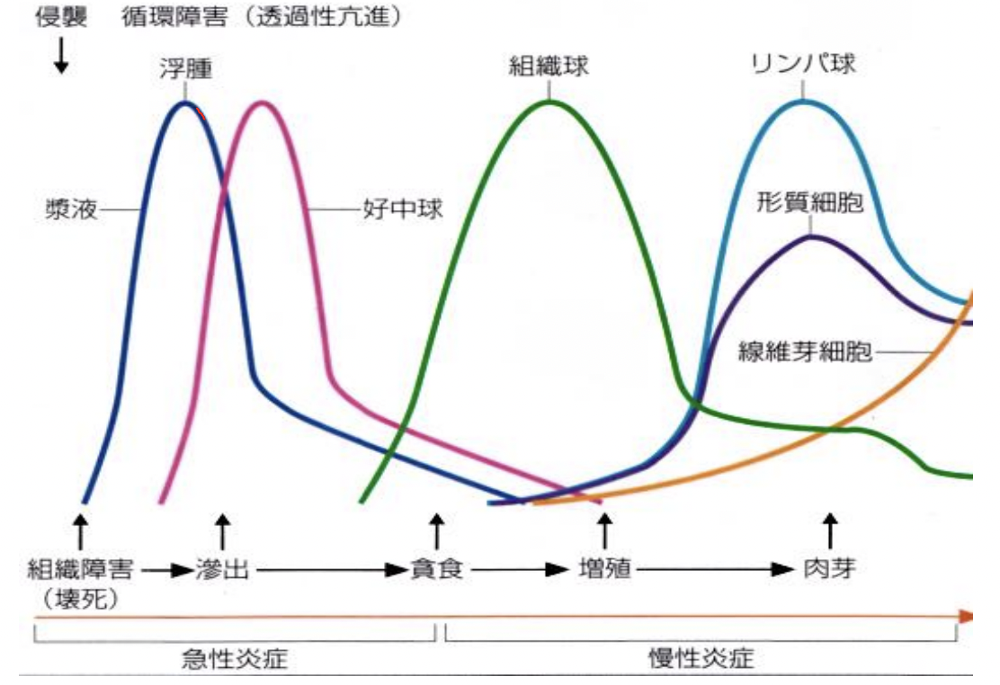

### 組織修復機構・再生と瘢痕
深い損傷では**支持組織による修復**では間に合わず、**コラーゲン**や**線維芽細胞**がとりあえず**瘢痕**（ちょっと膨らんだやつ）を形成する。
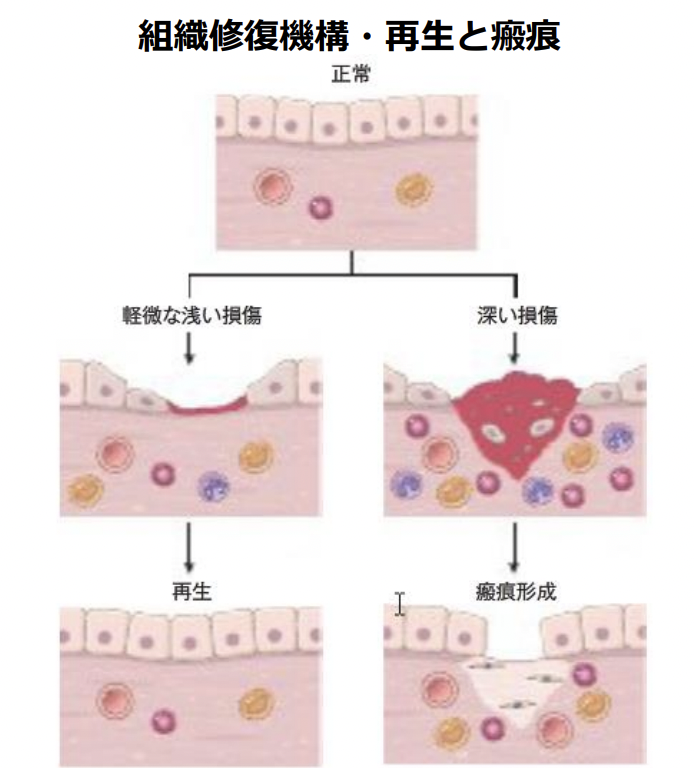  

## 急性炎症後期
急性炎症は障害の性質・強さ・受けた部位や組織・反応を増す宿主の能力による影響を受けながら、以下の4つのパターンのいずれかに帰結する。
1. **完全治癒**  
   ➡︎**化学仲介物質**は**中和**され**除去**される。**血管透過性**は**正常**になり**白血球の遊走**は**とまる**。**リンパによる吸引**と**好中球、マクロファージによる貪食**により炎症の場から浮腫や炎症細胞、壊死物質は除去される。マクロファージはリンパ管を通って組織より消失する。
2. 瘢痕ないし線維化  
   ➡︎相当量の組織が破壊や、組織の不再生、さらに著明に線維素が出てる。線維性組織が完全に吸収されない。  
   ➡︎結合組織の成長により器質化が起こり塊状線維組織（瘢痕化、線維化）ができる。
3. 膿瘍形成  
   ➡︎化膿性の細菌や真菌が感染しているとき炎症後に膿瘍を形成する。
4．慢性炎症へ移行

## SUMMARY 炎症とは？
炎症とは、生体に加わる有害な**侵襲**（微生物、化学物質、熱、外傷など）に対する**生体防御反応**である。組織を傷害する因子を**排除**し、組織を**再生**・**修復**する局所反応であるが、全身に波及して影響を及ぼす。  
炎症の原因には、内因と外因が関与する。例えば、**微生物**、寄生虫の感染、物理刺激(熱、寒冷、光線、外傷など）、化学刺激（毒素、酸、アルカリなど）、抗原抗体反応ないし過敏性反応がある。   
**発赤**、**腫脹**、**発熱**、**疼痛**が4主徴とされ、**機能障害**を加えて5主徴となる。組織変化との相関をみると、充血が発赤、血漿成分の滲出が腫脹、組織の壊死・感染・アレルギー反応が発熱や疼痛をきたす。炎症は、生体の防御反応としての役割を担う一方、その課程や持続期間により、生体が損傷を受けることもあるのだ。組織反応を経時的にみると、循環障害、滲出、増殖、修復が連鎖している。   
炎症はその経過によって**急性炎症**と**慢性炎症**に分類される。

## 炎症地図
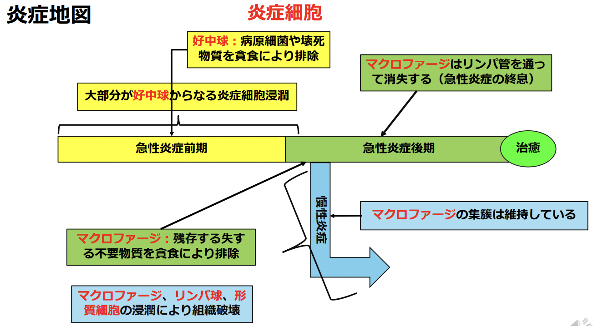  
マクロファージが減らないと、マクロファージが出す細胞傷害の原因因子が悪さをしうる。また、マクロファージがT細胞に抗原提示して、T細胞が炎症性サイトカインを出してマクロファージが活性化されて...といループを無限に繰り返してしまうと、肉芽腫を形成されてしまう。  
水色のところを参考にして書き直して欲しいですね

## 慢性炎症
慢性炎症とは、炎症が長期間（数週～数年間）持続したもの。  
組織学的にはマクロファージの存在のもとにリンパ球や形質細胞が浸潤し、ときにリンパ濾胞を伴う。また、幼若な結合組織や血管の増殖により若い結合組織が顆粒状となった肉芽組織を形成する。  
を肉芽腫性炎とに分けられる。慢性増殖性炎の原因として、第一に生
体内で処理不能なため組織障害が長期にわたって存在すること、第二として感染症、第三として免疫異常が挙げられる。
肉芽腫性炎はマクロファージに由来する類上皮細胞及び多核巨細胞が主な構成成分である肉芽腫の形成される炎症である。
- 慢性炎症の生じる背景
  - 急性炎症からの移行
  - 毒性の低い**微生物**の細胞内持続感染
  - 潜在的に毒性を有する物質の暴露
  - **自己免疫**
- 慢性炎症の特徴
  - 急性炎症の主役は**好中球**で**リンパ球**は出てこなかったが、慢性炎症では**好中球**は出てこず**リンパ球**が主役。
  - **大食細胞**・**リンパ球**・**形質細胞**などの**単核**細胞の**浸潤**。
  - 炎症細胞の浸潤による**組織破壊**、及び新生血管の増生を含む**修復**と**繊維化**。

### ある種の微生物の細胞内持続感染
**結核菌**やある種の真菌（カビ）などによるもの。
これらの微生物は一般に毒性が低く、遅延型アレルギー反応と呼ばれる
免疫反応を引き起こし、肉芽腫性反応を起こす。
潜在的に毒性を有する物質の暴露
吸入されたケイ酸粒子（肺に慢性炎症反応を引き起こします）などや、
内在性のものとしては慢性的に増加した血症脂質（粥状硬化とよばれる
動脈硬化を引き起こす）など。
自己免疫
**自己の抗原が組織に対して免疫反応を起こす**こと。反応を引き起こしていると推定される自己抗原は、ほとんど常に更新されているため、永続的に免疫反応が起こることになる。（eg. **関節リウマチ**など）。

## 炎症の組織障害と炎症細胞のポイント
1. 急性炎症では好中球（多核白血球）浸潤、血管の変化や浮腫が重要である。
2. 慢性炎症では単核球やマクロファージの浸潤や線維化、血管新生に
よる組織構築の改変が認められる。
3. 炎症の結果、フィブリンの析出、膿瘍や潰瘍を形成することがある。
4. 炎症修復の課程や慢性炎症では、正常な機能を消失することがある。