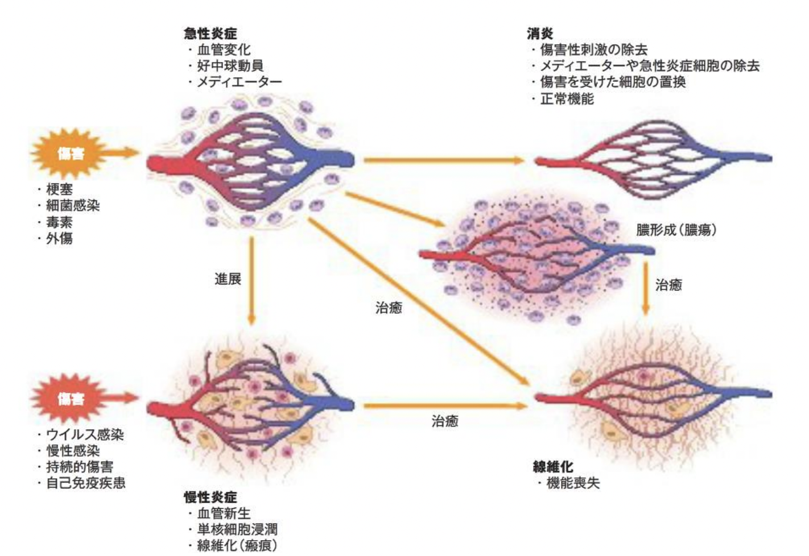

# 0921 炎症2
## 急性炎症
急性炎症の初期には血管反応（局所循環障害）がみられる。続いて、血液の一時停止による充血や血液の血漿成分や細胞成分が血管外へと出て行く“滲出”という特徴的現象が現れ、急性炎症は滲出炎ともよばれている。傷害因子の広がりを防ぐために、防御的に働く血漿成分と細胞成分（炎症細胞）を炎症局所に供給する反応である。  
急性炎症を担当する主な炎症細胞は顆粒球であり、なかでも好中球が大きな役割を果たしている。  
急性炎症には急性、亜急性、慢性に分ける炎症の経過による分類と発生機序による分類があるが、組織学的分類では、漿液性炎、カタル性炎（粘膜の漿液性炎）、線維素性炎、化膿性炎（亜型として膿瘍、蜂窩織炎、蓄膿）、壊死性炎（壊疽性炎、変質性炎を含む出血性炎がある。

## 慢性炎症
慢性炎症とは病原体が生体から出て行かず、蔓延して穏やかに組織傷害を持続し、宿主側の防衛力で押さえ込めない状態にある。臨床的には6ヶ月以上持続したものをさしている。  
組織学的にはマクロファージの存在のもとにリンパ球や形質細胞が浸潤し、ときにリンパ濾胞を伴う。また、幼若な結合組織や血管の増殖により若い結合組織が顆粒状となった肉芽組織を形成する。  
慢性炎症を肉芽腫性炎とに分けられる。慢性増殖性炎の原因として、第一に生体内で処理不能なため組織障害が長期にわたって存在すること、第二として感染症、第三として免疫異常が挙げられる。  
肉芽腫性炎はマクロファージに由来する類上皮細胞及び多核巨細胞が主な構成成分である肉芽腫の形成される炎症である。

## 急性炎症の転帰
  

## マクロファージの活性化  

