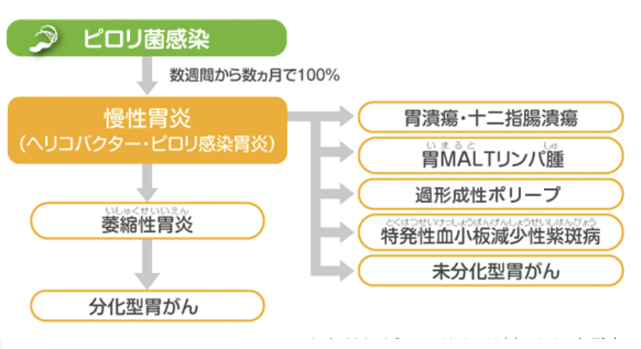

# 0930 炎症3
# 1. 細菌
## 1.1. 細菌の分類
細菌は、**細胞壁**（**グラム染色**に基づく）と**形状**によって4つに分類される。  
※鞭毛の生え方による分類も存在。  
### 1.1.1. 細菌の細胞壁による分類
1. **マイコプラズマ**：**細胞壁を持たない**細菌。
2. **グラム陽性**菌：**一層**からなる**細胞膜**を持つ細菌。  
   eg. **ブドウ球菌**、**ボツリヌス菌**、**乳酸菌**
3. **グラム陰性菌**：**二層以上**からなる**細胞膜**を持つ細菌。  
   eg. **大腸菌**、**サルモネラ菌**、**赤痢菌**、**ペスト菌**など病原性の**高**い菌
### 1.1.2. 細菌を形状から分類
- 球菌：短球菌、双球菌、四連球菌、八連球菌、**連鎖球**菌、**ブドウ球**菌
- 桿菌：長桿菌、短桿菌、連鎖桿菌
### 1.1.3. 【参考】鞭毛の形状による分類
- 単毛菌：コレラ菌、腸炎ビブリオ、緑膿菌、レジオネラ
- 両毛菌：スピリルム、カンピロバクター
- 叢毛菌：ピロリ菌
- 周毛菌：多くの腸内細菌
### 1.1.4. 好気性 or 嫌気性
- 好気性菌 
  - 酸素がある環境下で発育する空気のある場所を好む菌。
  - 食べるスピードは**速**く、**無**臭。 
  - eg. **緑膿**菌・**結核**菌
- 嫌気性菌
  - 増殖に酸素を必要としない菌。
  - 食べるスピードは**遅**く、**アンモニア**臭。
  - eg. **大腸**菌・**腸球**菌
## 1.2. グラム染色
- グラム陽性菌：**厚い細胞壁**を持つため、前染色で染まった細胞壁は**脱色されず**、後染色を行なっても**紫**色に染まる。  
- グラム陰性菌：**薄い細胞壁の外側に外膜**を持つ。前染色で染まった細胞壁は**脱色され**、後染色で**赤**色に染まる。

# 2. 細菌感染症
形態から球菌と桿菌に分けられ、グラム染色によりグラム陽性菌とグラム陰性菌とに分けられる。また、生育環境によって好気性菌と嫌気性菌に分けられる。  
急性化膿性感染症は、グラム陽性球菌とグラム陰性桿菌によるものが多い。  
グラム陽性球菌には**黄色ブドウ球菌**、**溶血性連鎖球菌**、肺炎球菌などがある。グラム陽性桿菌にはクロストリジウム感染症（破傷風菌、ボツリヌス菌、ガス炭疽菌、ディフィシレ菌）がある。   
グラム陰性球菌には**髄膜炎菌**と**淋菌**がある。髄膜炎菌感染症の劇症型である。両側副腎に出血性壊死を生じて、副腎機能不全にてショック状態に陥るものは、**WaterhouseFriderichsen（ウォーターハウス・フリーデリセン)症候群**と呼ばれている。  
グラム陰性桿菌はピロリ菌や大腸菌を含み、多くが腸内細菌叢を形成する。
|              | 球菌                                         | 桿菌                                                                                       | 
| ------------ | -------------------------------------------- | ------------------------------------------------------------------------------------------ | 
| グラム陽性菌 | 黄色ブドウ球菌 溶血性連鎖球菌 肺炎球菌 | クロストリジウム感染症 　破傷風菌 　ボツリヌス菌 　ガス炭疽菌 　ディフィシレ菌 | 
| グラム陰性菌 | 髄膜炎菌 淋菌                             | ピロリ菌 大腸菌                                                                         | 

## 2.1. Helicobacter pylori
胃の内部は胃液によって強酸性であるため、通常細菌は生息できない。しかしピロリ菌は、**ウレアーゼ**という酵素により胃**粘液**中の**尿素**を**分解**し、それで生じる**アンモニア**を用いて胃液を**中和**して存在する。胃**表層上皮**ないしは陰窩の粘液層に見られる。  
【分類】グラム**陰**性**桿**菌  
【形態】長さ4µｍで細長く、緩やかに2-3回右に巻いたらせん状、一方の端に存在する4本の鞭毛がを回しながら動く。  
【関連する感染症・代表例】  
  
cf. 萎縮性胃炎では、**腺管上皮**の**過形成**と**固有腺**の**萎縮**が見られる。

# 3. ウイルス感染症
ウイルスは、生きた細胞の中で宿主の代謝系を利用して増殖する。共通する病理像として、変性、壊死、風船変性などが起こり、**慢性非特異性増殖性炎**を伴う。ウイルスに感染した細胞を顕微鏡で観察すると、**封入体**あるいは**合胞性多核巨細胞**がみられる。前者は異常物質の蓄積による異常染色域のことで、核内にあるものを核内封入体、細胞質にあるものを細胞質封入体という。後者はいくつかの細胞が融合することで合胞体を形成することによりできる。封入体は**ヘルペス**ウイルスや**サイトメガロ**ウイルスなどで見られ、合胞性多核巨細胞は**ヘルペス**ウイルスや**麻疹**ウイルスなどで見られる。  
核酸の種類によりDNAウイルスとRNAウイルスとに大別される。DNAウイルスにはポックスウイルス群(天然痘、伝染性軟属腫）、ヘルペスウイルス群(**水痘**、帯状疱疹、EBV)、アデノウイルス、ヒトパピローマウイルス、ポリオ－マウイルス（JC、BK)、ヒトパルボウイルス（伝染性紅斑）、B型肝炎ウイルスなどがある。  
RNAウイルスにはラブドウイルス(狂犬病）、出血熱ウイルス（エボラ出血熱）、パラミクソウイルス(麻疹、流行性耳下腺炎）、レトロウイルス(エイズ）、ピコナウイルス（ポリオ、コクサッキー、エコー）などがある。  

## 3.1. 肝硬変 liver cirrhosis
### 3.1.1. 肝硬変の定義
偽小葉の形成を定義とする。肝細胞の壊死と再生の結果、小葉構造の改変・線維化・萎縮が起こる。
### 3.1.2. 肝硬変の原因
- **ウイルス**
- **アルコール**・**鬱血**・代謝障害（Wilson病、ヘモクロマトーシス、糖原病）
- 薬剤・寄生虫（日本住血吸虫）
### 3.1.3. 病理・病態
- **黄疸 jaundice**
- **門脈圧亢進 portal hypertension**
  - **食道静脈瘤 esphageal varix**
  - **痔 hemorrhoid**
  - **Capute medusa**
  - **脾腫 splenomegaly**
- **慢性肝不全**による変化
  - **タンパク産生**の**低下** -> **低Alb血症** -> **腹水 ascities**
  - **エストロゲン**の**代謝障害** -> **女性化乳房 Gynecomastia**, **クモ状血管腫 vascular spider**, **手掌紅斑 palmar erythema**, **酒さ**
- **出血**傾向（**Vitamin K**の**合成障害**が原因）
- 肝細胞癌

## 3.2. ヘルペスウイルス
ヘルペスウイルスに感染した細胞を顕微鏡で観察すると、**核内封入体 HSV-1, 2**や**合胞性多核巨細胞**がみられる。  
【感染により引き起こされる疾患】
- **口内炎**：by **HHV-1 単純ヘルペスウイルス1型**
- **性器ヘルペス**：by **HHV-2 単純ヘルペスウイルス2型**
- **肝炎**
- **肺炎**
- **脳炎**：**出血**性があり、**側頭葉**に頻発。
- **ヘルペス性角膜炎**
- **帯状疱疹**・**水痘**

### 3.3. HPV Human Papilloma Virus
皮膚に感染した場合はイボ（=尋常性疣贅）を症状とする。  
性器に感染した場合は外陰部に感染し、子宮頸癌の原因となる。病理的には、koilocytosis, Dysplasiaが特徴。

# 4. 真菌症とは？
真菌とはいわゆるカビのことで、真菌症は**表在**性と**深在**性に分けられる。  
- 表在性
  - **白癬菌**による皮膚糸状菌
  - 皮膚スポロトリコーシス
  - **皮膚クロモマイコーシス**
  - 口腔カンジダ症、カンジダ性膣炎
- 深在性
  - **カンジダ**（食道、肺、肝臓、腎臓に多い）
  - **クリプトコッカス**（中枢神経系に多い）
  - **アスペルギウス**（肺を含む多臓器に出現）
  - **ムコール**（血液疾患時に多い）

真菌の由来部位よって、内在性と外因性に分けられる。  
皮膚と口腔、腸管粘膜から感染し、拡大性、リンパ行性、血行性に進展して、免疫の低下した個体では汎発性真菌症となる。  
組織学的には慢性化膿性炎や肉芽腫性炎を呈し、PAS染色やグロコット染色にて同定される。

# 5. 肉芽腫性感染症とは？
特殊な病原体による慢性増殖性炎症で、特殊な病変を形成するので**特殊性炎症**とよばれる。組織所見から病原体が推測出来ることもある。急性炎症後、体内に傷害性抗原が残存していた場合、線維芽細胞、マクロファージ由来の類上皮細胞、巨細胞、リンパ球（CD4+T細胞）などが活性化されて肉芽腫が形成される疾患。近年は**肉芽腫性炎**とよばれる。  
肉芽腫性炎を誘発する病原体は全て遅延型アレルギーを起こす抗原を有しているので、肉芽腫性炎はIV型アレルギーの関与した炎症である。
肉芽腫性炎症では一度体内に入り出て行かない病原体を**被包**という形で、その病原性を封じ込めている。   
- 抗酸菌（**結核菌**、非定型抗酸菌、らい菌）、**梅毒トレポネーマ** -> **ラングハンス型巨細胞**を伴う**類上皮細胞腫**
- **サルコイドーシス**、ハンセン病 -> **非乾酪性肉芽腫**
- 梅毒 -> 壊死性肉芽腫（ゴム腫）
- ネコ引っ掻き病、**スポロトリコーシス**、野兎病 -> **化膿性肉芽腫**

# 6. 内因性/外因性感染症、日和見感染とは？
内因性感染症は体内に常在する微生物が宿主の状態悪化により引き起こすもので、外因性感染からは外か侵入した微生物が引き起こすものである。  
**院内感染症**として最も重要なものに**メチシリン耐性黄色ブドウ球菌（MRSA)**がある。医療従事者の鼻腔にもMRSAが常在菌として存在しているため、感染防御能の低下した患者にMRSAが発症しうる。この場合は**接触**感染である。また、これ以外に**空気**感染と**飛沫**感染がある(空気感染するものは麻疹、水痘、結核であり、飛沫感染するものはインフルエンザウイルス、風疹、流行性耳下腺炎である。）  
悪性腫瘍や重篤な感染症など、重症基礎疾患の存在とそれらに対する薬剤による治療（抗癌剤、ステロイドホルモンや免疫抑制薬の投与，及び放射線療法による免疫力の低下による菌交代現象が大きな原因となり、**日和見感染症**が起こる。  
日和見感染症を起こす代表疾患がエイズ（AIDS)であり、日和見感染症の代表疾患はニューモシスチス肺炎、サイトメガロウイルス肺炎、非定型型抗酸菌感染症、カポジ肉腫、口腔カンジダ症である。  
※日和見感染症というワードだけ覚えてください。

## 7. 細菌、ウイルス、真菌以外の感染症とは？
細菌、ウイルス、真菌以外の感染症の原因として重要なものには、**リッケチア**、**クラミジア**、**原虫**、**寄生虫**、**プリオン**があげられる。  
- 日本での重要疾患
  - リケッチアによるつつが虫病
  - クラミジアによる鼠径リンパ肉芽腫
  - 原虫によるマラリア、**トリコモナス**、**トキソプラズマ**  

寄生虫には、内部寄生虫（回虫、吸虫、蟯虫）と外部寄生虫（ノミ、シラミ、ケジラミ、疥癬）がある。   
プリオン病は異常プリオンタンパク質が中枢神経系に蓄積し、神経組織を破壊する疾患群で、長い潜伏期間を有する致死性の新型感染症である。ヒトのプリオン病の代表は特発性の**Creutzfeldt-Jakob （クロイツフェルト・ヤコブ）**病で、**海綿状変性**と呼ばれるニューロピル（神経網）の多数の空胞、神経細胞の萎縮・脱落、肥胖グリア細胞の増生がみられ、異常プリオンタンパク質の沈着が確認される。