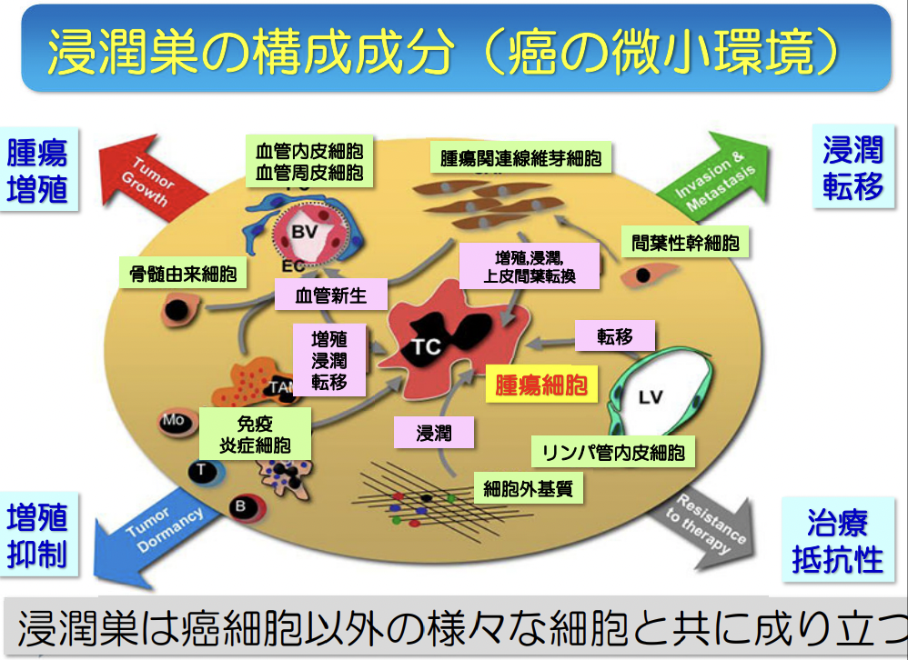
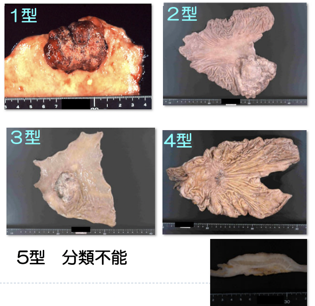
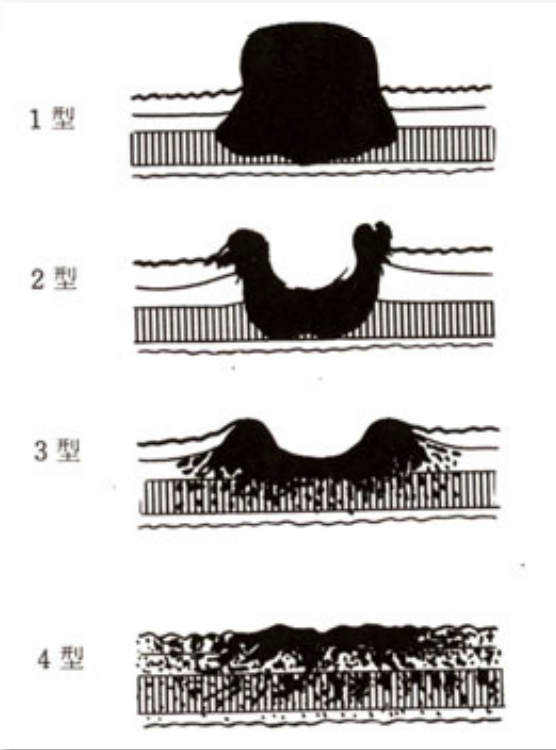
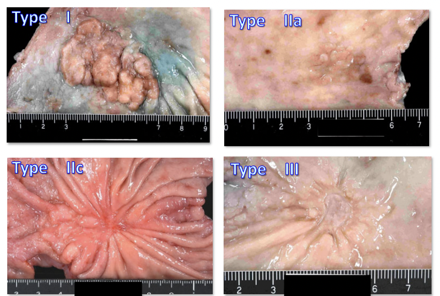
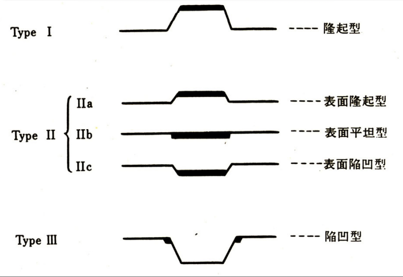
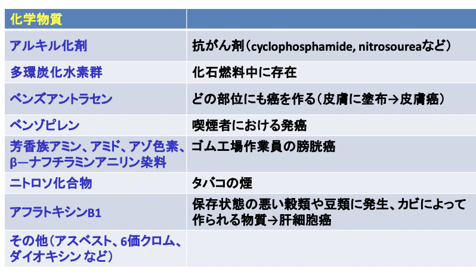
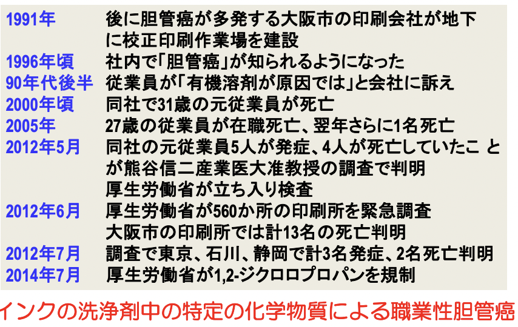
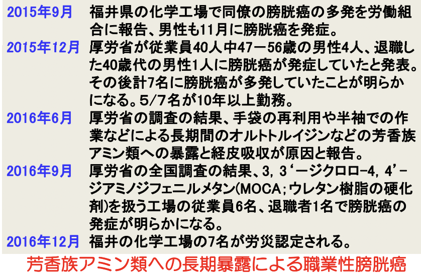

# 1007 腫瘍3-4
## がんと癌
- 腫瘍
  - 良性腫瘍
    - 上皮性
    - 非上皮性
  - 悪性腫瘍 = がん
    - 上皮性 = 癌、癌腫
    - 非上皮性 = 肉腫
  
非上皮性：神経系、血液系、支持組織の間葉系細胞など  

## 腫瘍の増殖、浸潤、転移
がんは、原発巣にて増殖 -> 浸潤 -> 転移することで進行する。  
したがってその様相は、腫瘍の悪性度や患者の予後を決定する重要な因子。  
### 大腸癌の進行
腫瘍化した腺管 -> 良性腺腫（ポリープ） -> 浸潤癌
### 子宮頸癌の進行
異形成（前癌病変） -> 上皮内癌 -> 浸潤癌

# 1. 腫瘍の増殖
## 細胞周期と増殖因子
G1期中のR pointを超えると、細胞周期が分裂まで一気にすすむ。   
癌抑制遺伝子（eg. p53）が機能喪失することで、以下が生じ、腫瘍増殖制御機能が破綻する。  
- 増殖促進シグナル↑
- 増殖制御機構の破綻
- 細胞死の抑制

良性腫瘍と悪性腫瘍は、いずれも増殖スピードは制御されていないという点では一致するが、良性腫瘍ではスピードが緩徐、悪性腫瘍は急速という点において異なる。

## 遺伝子から見た腫瘍の発生、増殖
正常細胞 -> 腫瘍細胞には、2回の遺伝子変異が必要。
1) 癌遺伝子の活性化 -> 異常増殖能獲得
2) 癌抑制遺伝子の機能喪失 -> 制御機構からの逸脱能獲得  

腫瘍の増殖は、遺伝子変の集積と関係している。

### 癌の自然史
異常細胞から臨床的な癌まで進展するのはごく一部。

## 幹細胞とは何か？
自己増殖能と多分化能を持つ細胞。
### 正常組織の幹細胞の種類
全能性幹細胞 > 多能性幹細胞（iPS細胞、ES細胞) > 組織幹細胞 > 終末分化細胞
## 1. 腫瘍の増殖SUMMARY
- 腫瘍とは、身体の細胞本来の増殖コントロール機構から外れた異常な細胞増殖（細胞数の増加、細胞死の減少）。
- 細胞増殖の結果、腫瘤を形成する（-> 局所の機能障害が起こる）
- 制御不能で秩序性に乏しい自律性増殖を示す（細胞周期、分化の抑制）
- がん細胞にも幹細胞が想定されている
- 悪性腫瘍の増殖は速く、良性腫瘍は緩徐

# 2. 腫瘍の浸潤
腫瘍の発生した部位から直接近傍の組織に破壊性に広がる -> 臓器を破壊 -> 機能の喪失 ＝ 悪性の振る舞い
### 浸潤癌
上皮内癌が基底膜を超えて周囲の組織に侵入 -> 血管・リンパ管を破壊 -> 遠隔転移
### 浸潤の開始と腫瘍の拡がり
- 細胞接着性の低下 -> 腫瘍細胞相互の解離
- 癌細胞の基質成分への接着
- タンパク分解酵素の働きにより、細胞外基質の崩壊
- 癌細胞の移動（組織学的に脆弱な部位、血管、リンパ管などを介する移動）
  
   
### 上皮間葉転換現象
癌腫が上皮としての細胞接着分子や極性を失い、浸潤や転移に有利な特性を有するために間葉系の細胞に変化すること。つまり、癌の転移・浸潤に関与する。

### がん微小環境と免疫チェックポイント阻害剤
癌に対する免疫防御システムも存在する。   
そのシステムを利用した分子標的治療薬
免疫チェックポイント分子（免疫系を活性化するか抑制するか決める分子）であるPD‐L1は、免疫系にブレーキをかける。このブレーキを解除することで、腫瘍を攻撃する。これを   

#### 化学療法・分子標的療法と免疫療法の違い
分子標的薬は、従来の化学療法とは異なり、腫瘍の発生にかかわる分子異常や腫瘍特異的に発現し

### 早期癌と進行癌
- 早期癌：治癒率が高いことが期待される癌。
- 進行癌：早期癌の概念を超えて進行している癌。一般的に、既に浸潤を始めた癌を指す。
  
なお、臓器により、早期癌の定義が異なる。
- 食道癌 -> 癌の浸潤が粘膜内にとどまる。リンパ管の転移有無は不問。
- 胃癌 -> 癌の浸潤が粘膜下層までにとどまる。リンパ管の転移有無は不問。
- 大腸癌 -> 癌の浸潤が粘膜下層までにとどまる。リンパ管の転移有無は不問。
- 肺癌 -> 浸潤前癌。浸潤していない癌。
- 乳癌　-> 腫瘤の大きさが触診上2.0cm以下で転移を思わせるリンパ節を触れず、遠隔転移を認めないもの。
- 子宮頚癌 -> 定義なし
- 膀胱癌 -> 上皮内癌

## ☆胃癌の肉眼型分類
### 進行胃癌の肉眼分類
進行癌の肉眼分類は、Borrmann分類に基づく。  
   

- 1型：隆起
- 2型：陥凹（周堤あり・境界明瞭）
- 3型：陥凹（周堤あり・周囲に浸潤）
- 4型：浸潤性
- 5型：分類不能

### 早期胃癌の肉眼分類
  
  

- Type I：隆起
- Type II
  - IIa：表面隆起型
  - IIb：表面平坦型
  - IIc：表面陥凹型
- Type III：陥凹型

## 2. 腫瘍の浸潤SUMMARY
- 癌には上皮内癌と浸潤癌がある
- 腫瘍の浸潤巣では腫瘍細胞と間質成分の相互作用がある
- 浸潤の強い癌は悪性度が高い
- 臓器毎に定義された早期癌と進行癌がある
- 胃、大腸では早期癌、進行癌の肉眼分類がある

# 3. 腫瘍の転移
## 腫瘍の転移様式
1) 血行性転移
2) リンパ行性転移
3) 播種性転移

### 1) 血行性転移
癌細胞が血管内に侵入し、血流に乗って転移すること。  
癌細胞は、壁の厚く丈夫な動脈には侵入することができない。   
転移の過程：原発層にて基底膜を突破 -> 静脈に侵入 -> 血流によって下流へ -> 腫瘍塞栓として他臓器の血管網に付着 -> 増殖。   
血液に侵入したがん細胞は、最終的には静脈 -> 肝臓 ->心 臓→肺→全身、と動脈を通って全身へ転移しうる。よって、血流の多い臓器(骨・脳・肺・肝・副腎など)に 起きやすく、また、原発巣から離れた部位に複数できることも多いため、手術できない。

# 1. 癌の発生
- 内的素因：遺伝的素因、ホルモン、免疫
- 外的素因：化学発癌物質、物理的発癌因子（放射線）、腫瘍ウイルス、寄生虫

## 癌遺伝子
癌の素因となりうる遺伝子。何らかの変異によって、ある遺伝子に有意に高い発癌性が付与される場合にその遺伝子を癌遺伝子と呼ぶ。
家族性腫瘍では癌抑制遺伝子の機能喪失のため、腫瘍の発生を抑えられない。  
| 機能                   | 癌遺伝子               | 代表的な腫瘍           | 
| ---------------------- | ---------------------- | ---------------------- | 
| 増殖因子受容体         | Her2                   | 乳癌、胃癌、卵巣癌  | 
| 増殖因子受容体         | EGFR                   | 肺癌、乳癌、多形膠芽腫 | 
| シグナル伝達タンパク質 | N-ras               | 神経芽腫、甲状腺腫     | 
| シグナル伝達タンパク質 | K-ras               | 膵臓癌、肺癌、大腸癌   | 
| シグナル伝達タンパク質 | Abl                    | 慢性骨髄性白血病       | 
| 転写因子               | Ｎ-myc              | 神経芽腫、肺小細胞癌   | 
| 転写因子               | シグナル伝達タンパク質 | バーキットリンパ腫     | 

## 癌抑制遺伝子
正常状態においては細胞の癌化を抑制している遺伝子。  
eg. p53、RB（網膜芽腫）、APC（大腸癌）、WT1（腎芽腫）

## 発癌の多段階説
イニシエーション -> プロモーション -> プログレッションの過程をたどって、前癌病変を経て段階的に進行する発癌様式。   
この発癌様式は癌遺伝子・癌抑制遺伝子異常の段階的蓄積により説明される。
### ドライバー遺伝子変異と発がん
がん細胞には多くの遺伝子変異が蓄積しているが、そのすべてが発がんに関係しているわけではない。  
遺伝子変異は以下の2種類に分けられる。
- ドライバー遺伝子変異：ごく少数。発がんに直接関係する遺伝子変異。分子標的薬の標的分子として注目されている。
- パッセンジャー遺伝子変異：大多数。発がんに直接関係しない遺伝子変異。

## 1．癌の発生SUMMARY
1) 癌の発生には遺伝子異常が深く関係している
2) 癌遺伝子と癌抑制遺伝子がある
3) 癌の発生、進展には複数の癌遺伝子と癌抑制遺伝子の異常が関わっている（発がんの多段階説）
4) 最近はドライバー遺伝子異常の同定と分子標的治療が行われている

# 2. 腫瘍の外因
## 化学的因子
### 化学発癌物質と腫瘍
現在2000種類を超える発癌物質が知られている。
- タバコ中のタール成分 -> 肺癌
- アスベスト -> 中皮腫
- コールタール取扱い -> 皮膚癌
- アゾ色素 -> 膀胱癌
- アフラトキシン(真菌が産生) -> 肝臓癌  

### 発癌物質の代謝経路
- 経気道的吸収
- 経皮的吸収
- 経消化管的吸収

#### 実験的化学発癌の歴史
20世紀初頭、癌の発生原因の論争：刺激説、素因説など。  
山極勝三郎が、「刺激説」の立場からウサギの耳にコールタールを反復塗布し、1915年に人工的な癌の発生に成功。  
一方、1913年にJohannes Andreas Grib Fibigerが線虫が寄生したゴキブリをネズミに与え世界で初めて人工的癌を発生させたと報告し、1926年にノーベル医学生理学賞受賞。しかし、フィビゲルがノーベル賞を受賞した寄生虫発癌説は、誤りであったことが後年証明された。  

#### 化学発癌のトピックス1
  
  

## 物理的因子
- 放射線   
    -> 疾患：皮膚癌、白血病、甲状腺癌、乳癌、結腸癌、肺癌
- 紫外線 
  - 原因：遺伝子修復機構に欠陥が生じ、ピリミジン二量体が修復されない。  
    -> 疾患：色素性乾皮症 -> →皮膚癌（扁平上皮癌、基底細胞癌、悪性黒色腫）

## ウイルス感染と発癌
発癌ウイルスとは、癌の発生に関与するウイルス。   
ヒト癌の発生の15％程度に関与。DNAウイルスとRNAウイルスがある。  
※RNAウイルス：自己増殖能無し。
### おもな発癌ウイルス
- RNAウイルス
  - HTLV‐1 human T cell leukemia virus type I -> 成人T細胞白血病
  - C型肝炎ウイルス -> 肝細胞癌
- DNAウイルス
  - HPV human papilloma virus -> 子宮頚癌、咽頭癌
  - EBV Epstein-Barr virus -> リンパ腫
  - HHV-8 human herpes virus 8 -> カポジ肉腫、リンパ腫
  - HBV hepatitis B virus -> 肝細胞癌

### Epstein Epstein‐Barr virus と Burkittリンパ腫
#### Epstein-Barr virus (EBV)
- DNAウイルス。
- Bリンパ球に感染することで、Burkittリンパ腫などの発がん要因となる。  
  Burkittリンパ腫は、B細胞性リンパ腫の1つで、アフリカでは小児の風土病である。  
  日本では、日本人の90%がEBV抗体を持つため、散発して見られる。
- 初期感染時 -> 伝染性単核球症（リンパ節炎）
- 免疫能低下時 -> 慢性活動性EBウイルス感染症

#### Burkittリンパ腫の発生機序
マラリアなどによる免疫低下状態 -> EBV感染 -> Bリンパ球の過剰増殖 -> 一部のBリンパ球が遺伝子異常を起こしてc-myc癌遺伝子の過剰発現を獲得 -> 腫瘍化
  
### HPVと子宮頸癌
HPVは、性行為感染症の一つで、子宮頸癌（HPV16 or 18型）と口腔咽頭癌の発癌リスクとなる。  
low risk HPVの場合は一過性感染で済むが、High risk HPVではウイルス遺伝子がゲノムに組み込まれるため、細胞が不死化し腫瘍化する。
子宮頸癌は、20～30代の女性が発症する癌の第1位で、大部分が扁平上皮癌。 

## 2. 腫瘍の外因のまとめ
- 主な外因として、化学物質、物理因子、ウイルスがある
- 外因となる刺激によりDNAが障害され、その後、付加的な遺伝子異常が加わり発癌に至る
- 一般的に発癌に至るまでには濃厚な外因への暴露と長い時間経過が必要である

# 3. 腫瘍の内因
内的素因：遺伝的素因、ホルモン、免疫  
## 遺伝的素因
特定の癌抑制遺伝子やDNA修復遺伝子の異常が受け継がれている場合、遺伝性腫瘍（家族性腫瘍）になる。  
