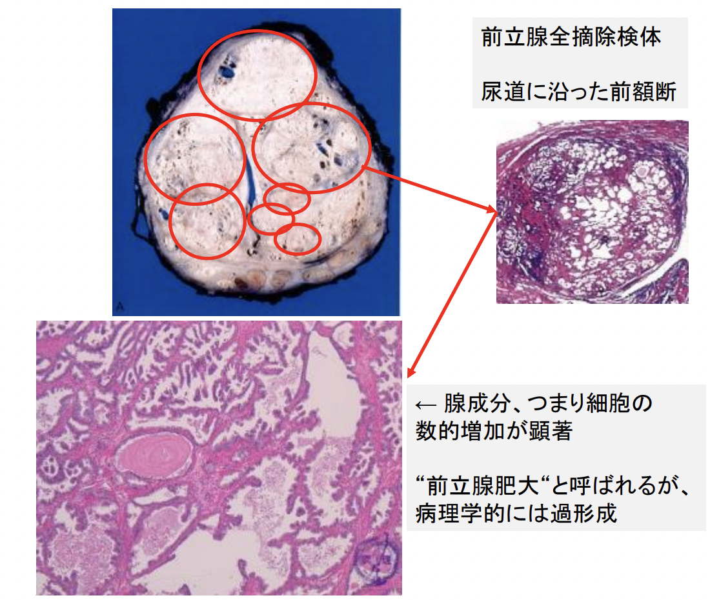
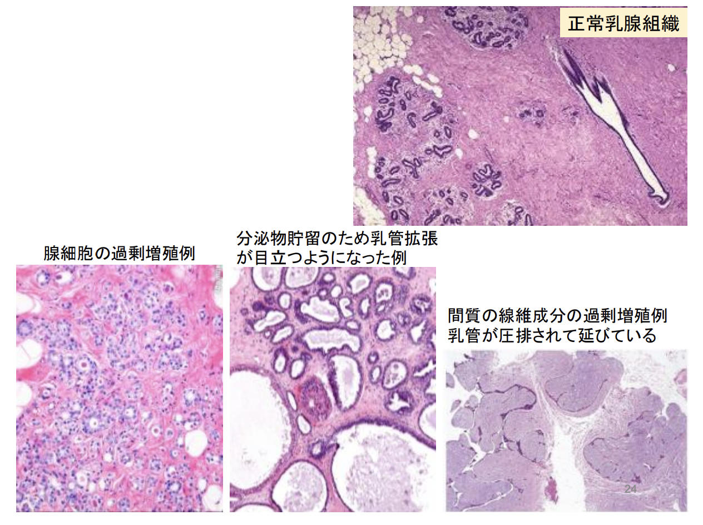
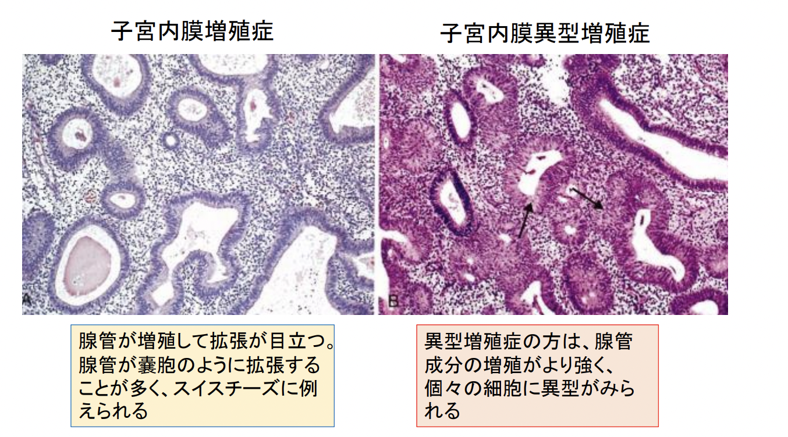
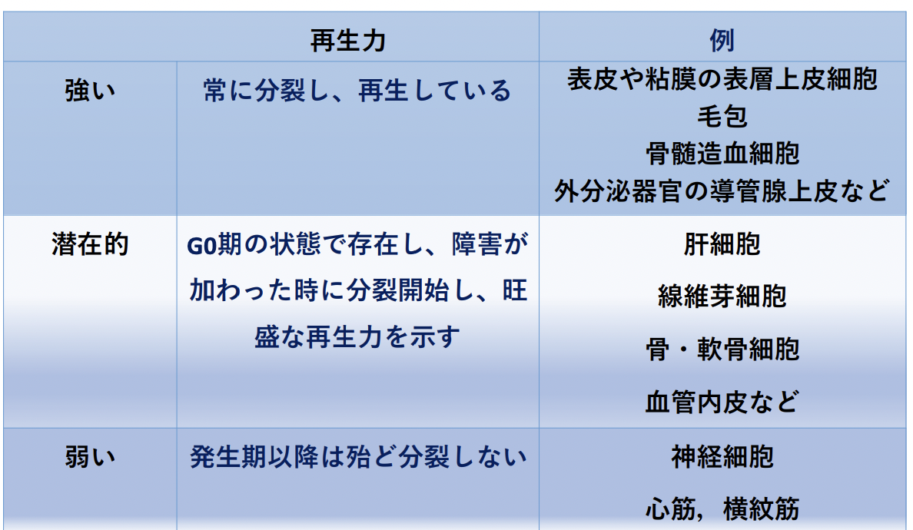
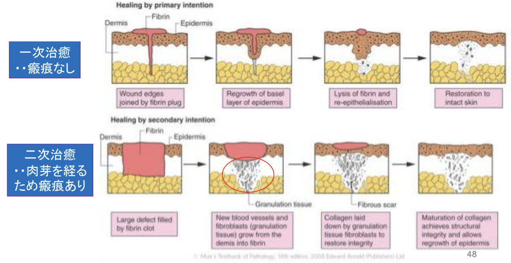
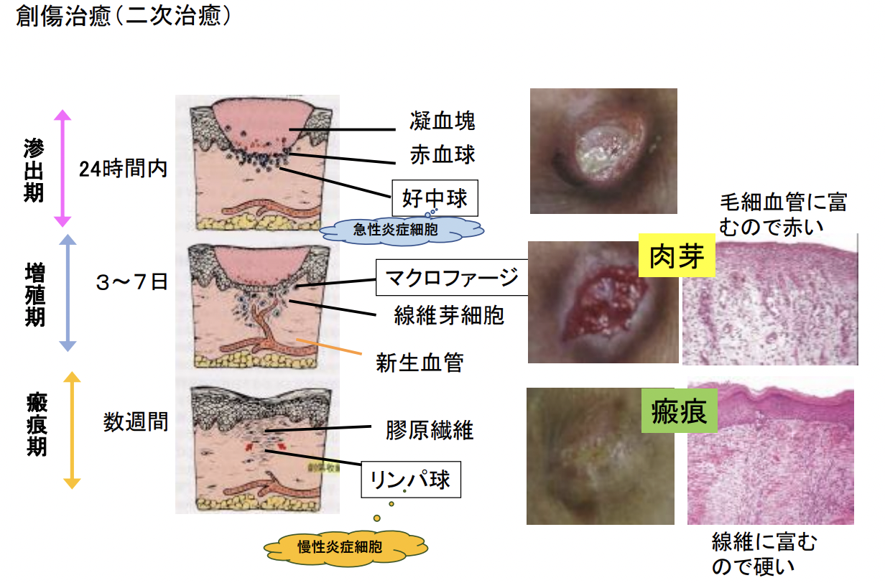
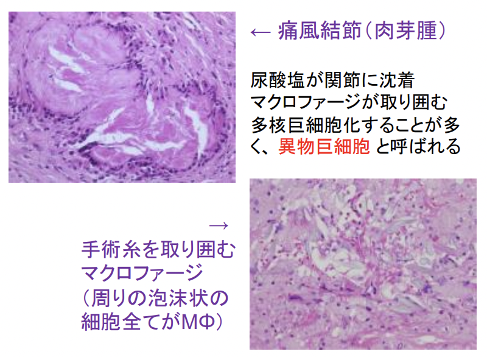
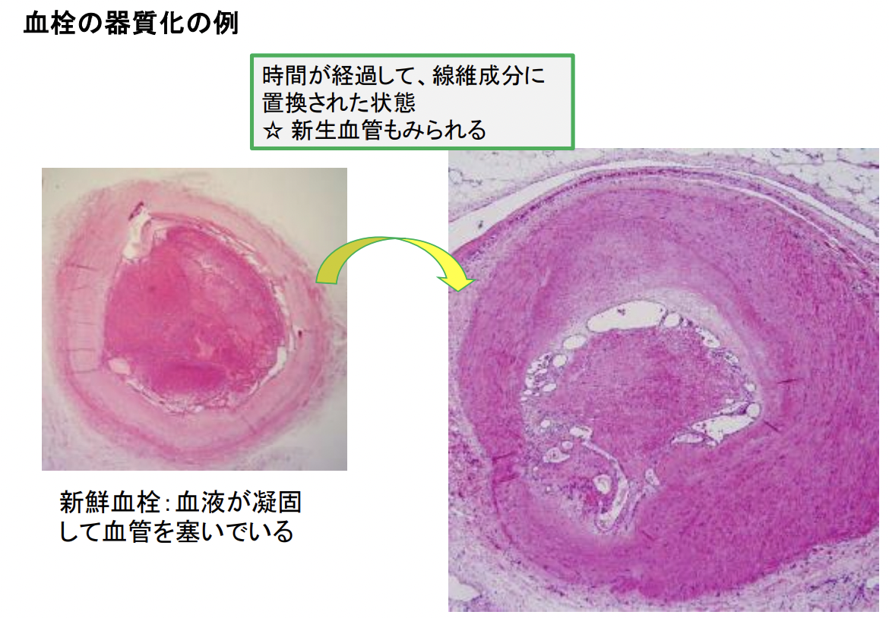
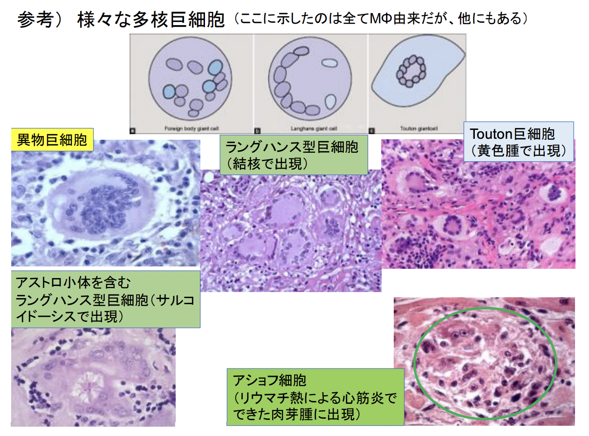
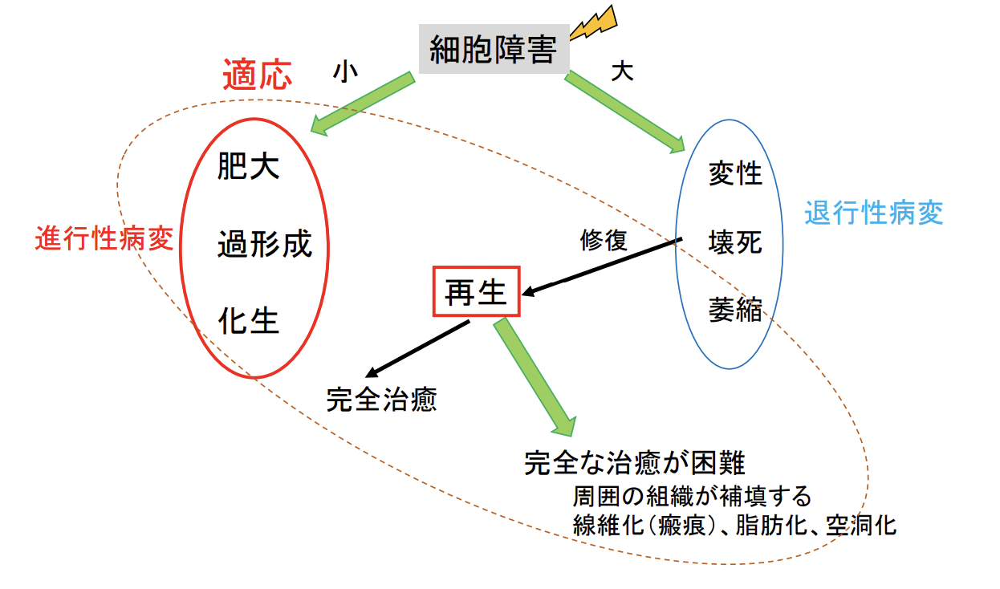

# 2．肥大と過形成
- 肥大 Hypertrophy：個々の細胞の容積の増大による組織や臓器組織の容積増加。
  - ⇔ 萎縮
- 過形成 Hyperplasia：個々の細胞の数の増加による臓器組織の容積増加。  

両方はしばしば複合して起こるため、明確に区別できないこともある。  
心筋や横紋筋では（発生期以後は）細胞分裂が殆ど起こらないため、肥大となる。

## 2.1. 肥大の種類
- 原因から分類
  - 労働性肥大（作業性肥大）
  - ホルモン性肥大
  - 代償性肥大
  - 慢性刺激による肥大
  - 原因不明（特発性）
- 病的かどうかで分類
  - 生理的肥大
  - 病的肥大

### 2.1.1. 労働性肥大（作業性肥大）
労働性肥大とは、負担に対抗して生じる肥大のこと。
- 生理的肥大の例：運動選手の心臓（いわゆるスポーツ心）、骨格筋の肥大、妊娠時の子宮
- 病的肥大の例：高血圧や弁膜症などに伴う心臓の肥大、腸管狭窄に伴う口側腸管の平滑筋の肥大  

eg. 心肥大
- 求心性肥大 concentric hypertrophy
  - 持続する圧負荷（後負荷）への病的適応として、心筋厚が厚くなる。
  - 原因：高血圧、大動脈弁狭窄
- 偏心性肥大 eccentric hypertrophy
  - 持続する容量負荷（前負荷）への病的適応として、心室腔が拡大する
  - 原因：大動脈弁閉鎖不全や僧帽弁閉鎖不全

### 2.1.2. ホルモン性肥大
- 生理的肥大の例：妊娠時の乳腺や子宮の肥大
- 病的肥大の例：末端肥大症による下顎・口唇・鼻・手指の肥大、バセドウ病（甲状腺機能亢進症）の甲状腺の肥大 

### 2.1.3. 代償性肥大
腎臓・精巣・卵巣・副腎などの一方を切除した際や、甲状腺の片葉を切除した際などに、残った方が欠損部の機能を代償するように肥大すること。

### 2.1.4. 慢性刺激による肥大
化学的・物理的・機械的・炎症性の刺激が持
続し、その部位に組織の肥大が起こること。  
eg. 胼胝（タコのこと）

### 2.1.5. 特発性肥大（原因不明の肥大）
- 片側肥大症 hemihypertrophy
  - Beckwith-Wiedemann症候群
  - クリッペル・トレノネー・ウェーバ（Klippel-Trenanay-Weber）症候群など先天性奇形に伴う場合がある。
- 肥大型心筋症 hypertrophic cardiomyopathy
  - 半数程度は家族性。心筋線維の収縮蛋白の遺伝子異常が指摘されているが、原因不明も多い。

cf. 仮性肥大：肥大しているが、真の肥大ではないというニュアンス。  
    eg. 進行性筋ジストロフィーの仮性肥大：ふくらはぎが肥大しているが、筋肉の肥大によるものではなく、筋周囲の結合組織（脂肪組織など）の増加によるもの。

## 2.2. 過形成の例
### 2.2.1. 前立腺肥大症
高齢男性に生じやすい (組織学的には80代で90%)。  
内腺領域（尿道に近い部位）が主に肥大するため、排尿障害を来す。  

### 2.2.2. 乳腺症
乳腺組織の過剰増殖。エストロゲンへの過剰反応が原因。  
  

### 2.2.3. 子宮内膜増殖症
子宮内膜の過剰増殖。   
卵巣ホルモンの分泌異常 -> 内膜が規則的に剥がれ落ちない（月経不順） -> 内膜増殖状態   
細胞異型がない増殖症と、細胞異型がある増殖症がある。異型があると、内膜癌の前癌病変 （ここまで来ると、もはや過形成性病変ではな
く腫瘍性病変）とされる。   
  

### 2.2.4. 過形成性ポリープ Hyperplastic polyp
胃や大腸にて。異型のない腺管が増えて、肉眼的にポリープ状を呈す。

### 2.2.5. ケロイド keloid
創傷治癒の際に、線維組織の過剰な増殖（過形成）により形成される。  
炎症が収束せず、元の創部を超えて、増殖し続けるような病態。体質の影響が大きい。

# 3. 化生 Metaplasia
正常な分化した細胞が他系統の分化した細胞に変化すること。  
細胞が障害を受け、再生する過程で生じると考えられている。  
可逆性変化。  
eg. 扁平上皮化生、腸上皮化生、アポクリン化生、間葉細胞における化生

## 3.1. 扁平上皮化性
円柱上皮 -> 扁平上皮細胞 に置換。
慢性刺激が加わることによって、より物理的抵抗性のある重層扁平上皮に置換される。  
背景：喫煙や結石など慢性炎症 
- 扁平上皮化生が生じる箇所
  - 扁平上皮化子宮頸部粘膜
  - 気管支粘膜
  - 胆嚢、胆管、唾液腺の導管、膀胱粘膜

eg. 白斑症：非角化型から、角化型扁平上皮へ置換。慢性炎症に伴って生じる。口腔粘膜では、発癌リスクの高い病変と考えられている。

## 3.4. 間葉細胞（非上皮）における化生
骨あるいは軟骨細胞への化生が多い。  
eg. 機械的刺激の多い骨格筋、慢性炎症が加わる大動脈粥状硬化症での骨化生、骨髄線維症による造血能低下時の脾臓や肝臓でみられる髄外造血

# 4. 再生 Regeneration
失われた細胞が、残った元の細胞の増殖によって補われること。生理的な再生は、常に分裂している表皮や粘膜、造血細胞などにみられる。細胞の種類によって、再生力は異なる。

## 4.1. 細胞の種類による再生力の違い
  
### 4.1.1. 再生力の強い細胞
eg. 表皮や粘膜の表層上皮細胞、毛包、骨髄造血細胞、外分泌器官の導管腺上皮  
増殖帯の細胞が分裂・増殖する。    
分化成熟して機能を果たした後に、変性・脱落する。  
増殖帯の位置やターンオーバーの期間は細胞・組織により様々。
### 4.4.2. 潜在的再生力を持つ細胞の例
eg. 肝細胞、線維芽細胞、骨・軟骨細胞、血管内皮  
- 肝細胞：肝切除後1か月で80%近く、1年で100%戻る。  
- 骨芽細胞：骨折 -> 骨膜間葉系細胞から骨芽細胞や軟骨細胞が誘導 -> 類骨（幼弱な骨組織）を形成 -> 仮骨（類骨混じる肉芽組織）を形成 -> リモデリング -> 元の姿へ。  
- 血管内皮細胞：糖尿病では、毛細血管が障害再生過程で、 血管内皮細胞が増殖 ->  新生血管が増殖 -> 合併症（網膜剥離、ガラス体出血、血管新生緑内障）

### 4.4.3. 再生力の弱い細胞の例
- 心筋
  - 急性心筋梗塞で心筋が壊死（凝固壊死） -> 膠原線維で置換（線維化、瘢痕化)  
  - 陳旧性心筋梗塞の状態範囲が広ければ、収縮力が落ちて心不全となる。
- 神経細胞
  - 脳梗塞 -> ニューロンが壊死（融解壊死） -> 周囲のアストロサイトが増殖して補填 = グリア瘢痕
  （線維芽細胞はいないので線維化にはならない）

  # 5. 線維化
細胞障害により再生が生じるとき、しばしば線維化を生じる。
創傷治癒では、欠損が大きいと、肉芽 granulation tissue を経て線維化する
（瘢痕scar）。   
  

## 5.1. 肝硬変
肝硬変も。肝細胞が再生を繰り返すうちに、線維化が強くなった状態。  
割面では、大小様々な小葉構造があるようにみえるが、線維化の結果であり、元来の小葉構造とは異なり、偽小葉とよばれる。  
肝細胞機能は高度に低下しており、致命的。

##　5.2. 器質化
器質化とは、体内 or 外来の病的な物質に対して肉芽が形成され、その後、結合組織で置換される反応のこと。  
創傷治癒と似ているが、修復するというより、病的物質を無害化する生体反応という意味合い。  
eg. “肉芽腫”の形成、血栓の器質化  
   
  

## 5.3. 瘢痕収縮
瘢痕は線維性であるため、固く縮んだ組織となる。瘢痕が大きい場合、 機能低下を起こすという意味を含めて、瘢痕収縮と呼ぶことがある。  
eg. 大きな皮膚瘢痕による関節拘縮、陳旧性心筋梗塞による心拍出量低下、胃潰瘍瘢痕による伸展不良

# SUMMARY 
