# 1014 代謝障害
代謝において、一般的にATPを消費して物質を合成することを同化、分解してATPが蓄積されることを異化と呼ぶ。
## 主な代謝経路による代謝異常
1) 糖代謝異常
2) ミトコンドリア代謝異常
3) 脂質代謝異常
4) タンパク質代謝異常
5) 核酸代謝異常
6) その他（色素/金属）

# 1. 糖代謝異常
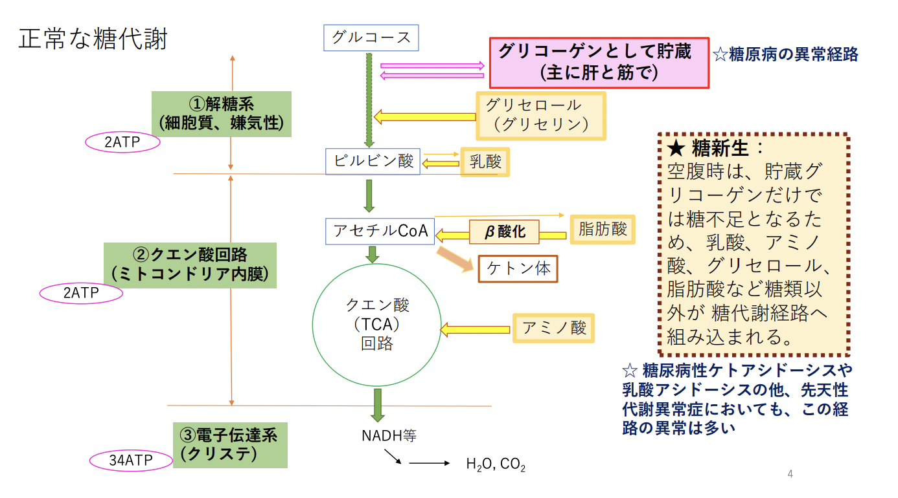  
## 1.1. 糖原病　glycogen storage disease（グリコーゲン蓄積病）
グリコーゲン代謝に関わる酵素の遺伝的欠損。  
欠損酵素により分類され、現在0～15型まで（統廃合で欠番有）。  
遺伝形式はほぼARで、頻度は稀。  
症状は、臓器障害・低血糖。  
主要なグリコーゲン貯蔵臓器である肝や骨格筋に症状が出やすい。
### 1.1.1. I型 von Gierke病
グルコース-6-ホスファターゼ（肝と腎だけに存在）の欠損。  
肝型の代表。肝にグリコーゲンが蓄積して肝腫大。  
主に乳児で発症。  
糖新生の障害 -> 空腹時低血糖発作  
逆に、他の代謝系が亢進 -> 乳酸・尿酸・脂肪酸の過剰産生 -> 高乳酸血症・高尿酸血症・高脂血症  
### 1.1.2. Ⅱ型 Pompe病
酸性αグルコシダーゼの欠損。  
糖原病で唯一のLysosome病。  
全身性の代表。心筋・骨格筋・肝などのLysosomeにグリコーゲンが蓄積。  
乳児型の症状は、心肥大・肝腫大・筋緊張低下・予後不良。  
酵素補充療法がある。  
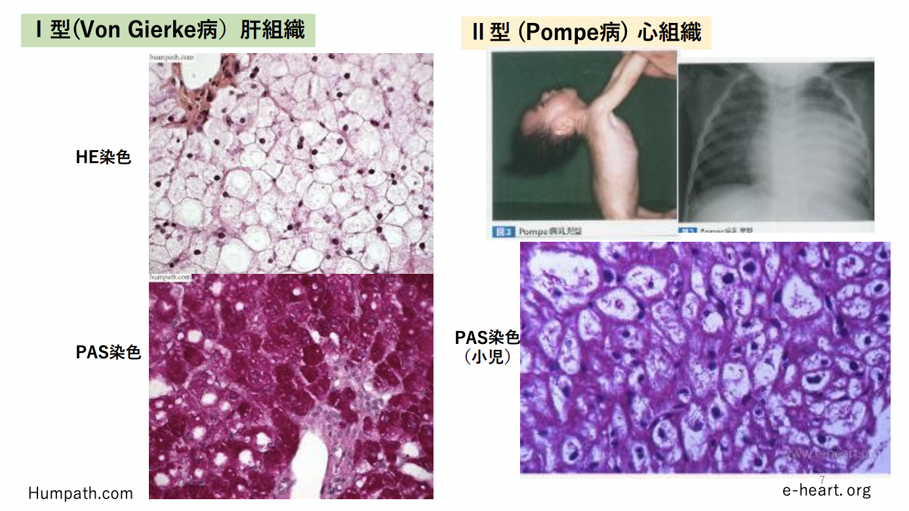  
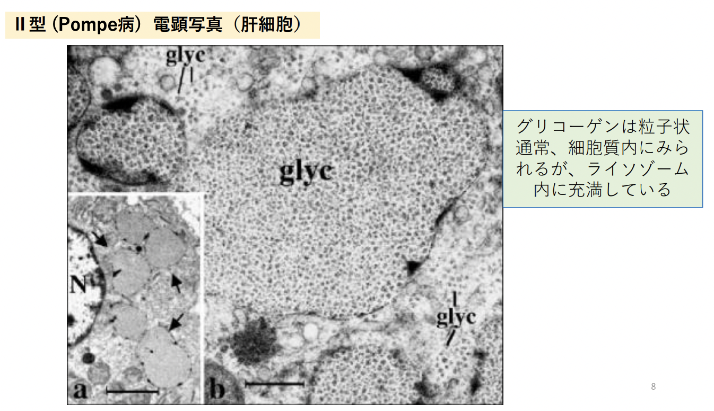  
## 1.2. 糖尿病 Diabetes Mellitus 
インスリンの分泌低下や作用低下（インスリン抵抗性） -> 細胞へのグルコース取り込みが低下 -> 血糖値上昇
### 1.2.1. 原因による糖尿病分類
|            | 概要                                                                                                                                                                  | 頻度 | 年齢       | 体型       | 発症                     | 治療                                               | 
| ---------- | --------------------------------------------------------------------------------------------------------------------------------------------------------------------- | ---- | ---------- | ---------- | ------------------------ | -------------------------------------------------- | 
| I型        | β細胞の破壊。絶対的インスリン欠乏に至る。 A 自己免疫性　B特発性                                                                                                   | 5%   | 小児・若年 | やせ型     | 急激 ウイルス感染など | インスリン注射                                     | 
| II型       | インスリン分泌低下を主体とするものと、インスリン抵抗性 + インスリンの相対的不足を伴うものがある。                                                                     | 95%  | 中年以降   | 大半は肥満 | 緩徐 過食やストレス   | 食事・運動が基本。 血糖降下薬やインスリン併用。 | 
| その他A    | 遺伝因子として遺伝子異常が固定されたもの ①膵β細胞機能に関わる遺伝子異常 ②インスリン作用の伝達機構に関わる遺伝子異常                                          |      |            |            |                          |                                                    | 
| その他B    | 他の疾患に伴うもの ①膵外分泌疾患  ②内分泌疾患  ③肝疾患  ④薬剤や化学物質による ⑤感染症 ⑥免疫機序による稀な病態 ⑦その他の遺伝的症候群に伴う |      |            |            |                          |                                                    | 
| 妊娠糖尿病 |                                                                                                                                                                       |      |            |            |                          |                                                    | 
### 1.2.2. インスリンの働き
筋肉や脂肪細胞の細胞膜上のインスリン受容体にインスリンが結合 -> PI3K、AKTシグナルを介してGLUT4が膜上に移動 -> 細胞内へのグルコース取り込み↑↑ -> 血糖値は下がる。  
細胞へ取り込まれた後、余ったグルコースを、筋や肝ではグリコーゲン、脂肪組織ではトリグリセリドへ合成・貯蔵されるよう働きかける。

### 1.2.3. I型糖尿病
ラ氏島に対する自己免疫作用により、細胞障害
性T細胞がラ氏島を破壊する。  
遺伝性は少ない。  
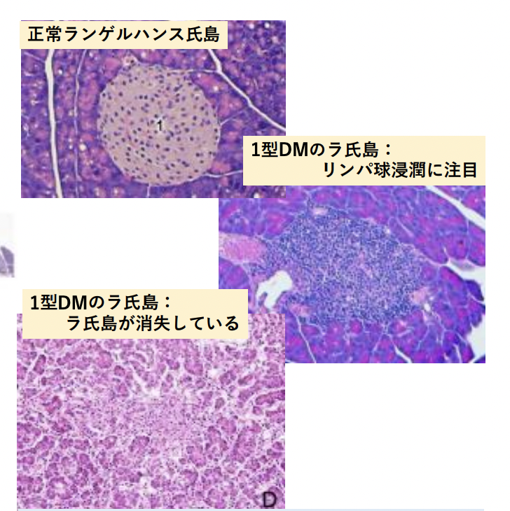  

### 1.2.4. II型糖尿病
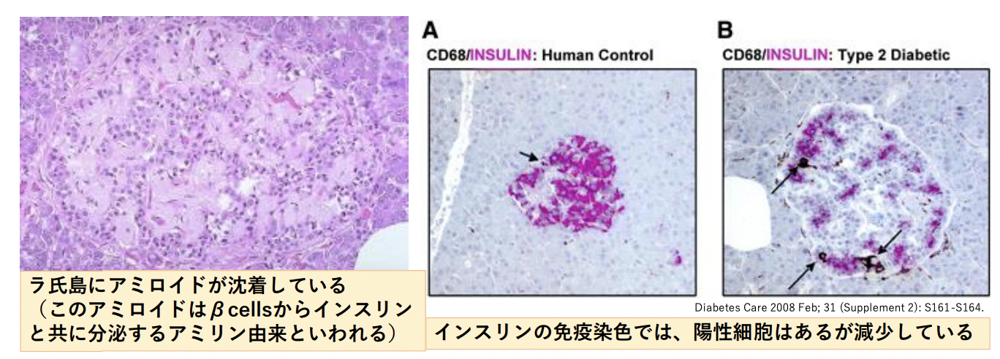
### 1.2.5. 糖尿病合併症
- 微小血管障害 microangiopathy
  - 慢性的な高血糖 -> 余剰な糖がポリオール系代謝経路へ -> ソルビトール産生 -> 活性酸素による酸化ストレスによって微小血管が脆弱化・虚血 -> 三大合併症（腎症・網膜症・神経症）
- 大血管障害：動脈硬化 -> 心筋梗塞・脳梗塞・閉塞性動脈硬化症
- 高血糖による易感染性
- 血糖管理不全等による急性症
  - 高血糖性（糖尿病性ケトアシドーシス、高浸透圧高血糖症候群、ペットボトル症候群）
  - 低血糖性
  - 乳酸性アシドーシス

### 1.2.6. その他の原因による糖尿病の主なもの
- 膵性糖尿病
  - 膵炎・膵外傷・形成不全・癌・膵ヘモクロマトーシス -> インスリン分泌が低下。
  - 慢性膵炎患者の半数が糖尿病。
- 肝疾患    
  - 肝炎・肝硬変 -> 肝細胞減少 -> 糖代謝障害
  - 肝硬変の1～2割が糖尿病。
- 内分泌疾患
  - クッシング症候群・褐色細胞種・先端巨大症・グルカゴノーマ・ソマトスタチノーマ・ルドステロン症・甲状腺機能亢進症
- 薬剤性
  - ステロイドホルモンによる高血糖、利尿薬によるインスリン分泌低下など
- 自己免疫
  - インスリン受容体に対する自己抗体など
- 妊娠性
  - hPLが胎盤の栄養膜細胞から分泌 -> 母体のインスリン抵抗性を上昇 -> 血糖値上昇 -> 胎児に栄養を行きやすくする。

 # 2. ミトコンドリア代謝異常
ミトコンドリアの機能は多彩だが、ミトコンドリア病として知られる疾患では、主にエネルギー産生の異常をみる。   
ミトコンドリアをコードするDNAは、核DNAとミトコンドリアDNAに散在している。  
3大ミトコンドリア病はミトコンドリアDNAの遺伝子異常が原因だが、核DNAに原因のあるミトコンドリア病も多い。  
ただし、母系遺伝するのはミトコンドリ
アDNA異常の疾患に限る。  
ミトコンドリア病の頻度は、10万人に10人程度。
## 2.1. よくみられる症状
- 骨格筋症状：筋力低下・易疲労性。乳酸値上昇
- 中枢神経症状：痙攣・知的障害

## 2.2. 3大ミトコンドリア病（ミトコンドリア病の半数以上を占める）
- 慢性進行性外眼筋麻痺症候群 CPEO: chronic progressive external opthalmoplegia：外眼筋麻痺、網膜色素変性、心伝導障害
- MERRF myoclonus epilepsy with ragged-red fiber：ミオクローヌス・小脳失調・痙攣発作
- MELAS mitochondrial myopathy, encephalopathy：筋力低下・脳卒中様症状・小児疾患  
  
## 2.3. 筋生検
Gomoriトリクローム染色で赤色ぼろ線維が、電子顕微鏡で形態異常を示すミトコンドリアの増加が観察される。
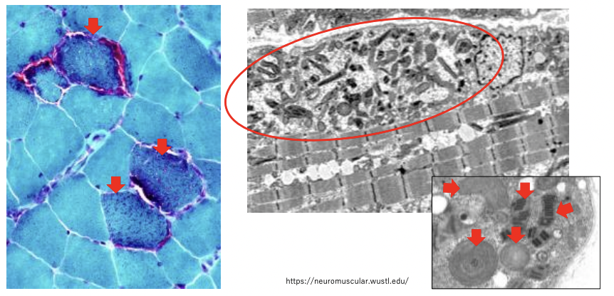

# 3. 脂質代謝異常
1) 脂質異常症（高脂血症）
2) 脂肪肝
3) 粥状硬化症
4) メタボリックシンドローム
5) スフィンゴリピドーシス

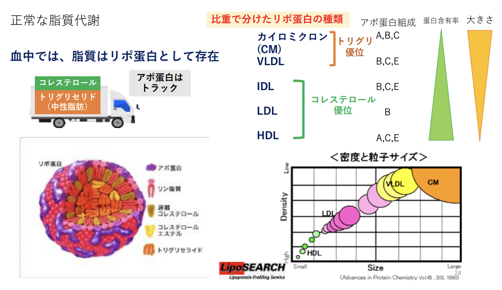  
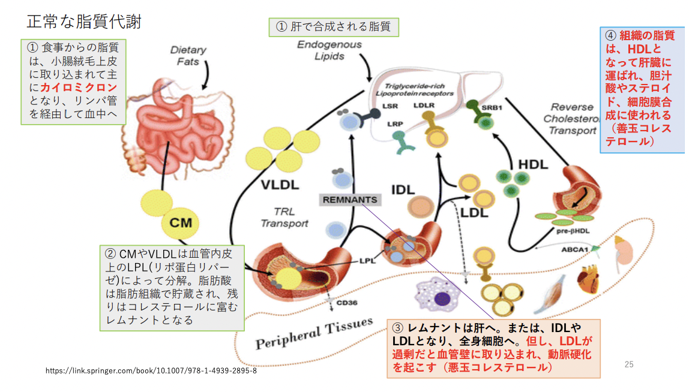
## 3.1. 脂質異常症（高脂血症）
- WHO分類（Fredrickson分類に由来) (1970)：上昇しているリポ蛋白の種類や、総コレステロール値とトリグリセリド値から、Ⅰ型・Ⅱa型・Ⅱb型・Ⅲ型・Ⅳ型・Ⅴ型に分ける。
- 厚労省の病因別分類 (1983)：まず、総コレステロール値≧220mg/dlあるいはトリグリセリド値≧150㎎/dlを高脂血症と定義し、原因別に分類する。原発性（本態性）と続発性、更にそれぞれを原因別や家族性、それ以外（特発性）に分類。
#### 3.1.1. 主な原発性脂質異常症
- 家族性高コレステロール血症
  - LDLレセプタ遺伝子の変異 -> LDL↑ 総コレステロール↑ -> LDLが動脈壁に沈着 -> 動脈硬化症・心筋梗塞・皮膚黄色腫・アキレス腱の肥厚（黄色腫による）・角膜輪。
  - AD遺伝（ヘテロでは200-500人に1人、ホモでは100万人に1人 ）。
  - WHO分類のⅡa または Ⅱb。
#### 3.1.2. 続発性脂質異常症
- 糖尿病：トリグリセリドが上昇しやすい。高血糖やインスリン相対的不足が、脂質代謝に様々に影響を及ぼすため。脂肪肝リスクも。
- ネフローゼ症候群：腎からのアルブミン漏出 -> 低アルブミン血症・浮腫・コレステロール↑・アルブミン合成↑・脂質合成↑・LDLの肝取り込み遅延 -> 高コレステロール血症。
- 甲状腺機能低下症：甲状腺ホルモンがLDLの肝取り込みを促進する機能があるため、コレステロール高値となる。
- 拒食症（神経性食欲不振症）：甲状腺ホルモン低下・胆汁酸排泄障害 -> 高コレステロール血症。
- アルコール過剰摂：摂取エネルギーオーバー・肝での合成亢進 -> トリグリセリド↑
- 肝硬変：肝細胞障害 -> 脂質合成能↓ -> 低コレステロール血症

## 3.2. 脂肪肝
肝炎・肝硬変・癌まで進行する例があることが問題。
大量飲酒で生じることが知られていたが、飲酒しない人でも起こることが近年分かってきた。
### 3.2.1. 脂肪肝の原因
1) 過栄養性：肥満、中心静脈栄養など
2) アルコール性：大滴性、小葉中心性が多い
3) 他の代謝障害： 糖尿病、栄養不良、飢餓、薬剤性、Reye症候群など  

末梢から来る脂肪酸↑ -> 肝内で脂肪酸合成の亢進 -> β酸化の障害 -> 肝でのリポ蛋白の合成や分泌↓
### 3.2.2. 組織像
組織では、肝細胞全体の5％以上に脂肪滴がみえる状態を指す。以前は30％以上だったが、近年NAFLD nonalcoholic fatty liver disease が知られるようになり、脂肪化を早期から捉えて進行を予防しようという傾向がある。  
見え方によって、大滴性（肥満、アルコール性に多い）・小滴性・小葉中心性（アルコール性に多い）・辺縁性・びまん性 などと分類。  
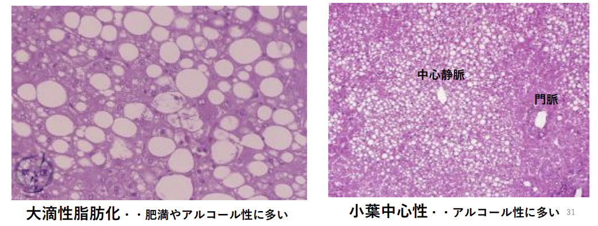

## 3.3. 粥状硬化症 atherosclerosis
大動脈や冠状動脈など太めの動脈に生じる。  
虚血性心疾患・脳血管障害・大動脈瘤の原因。  
危険因子は、年齢・高脂血症・糖尿病・高血圧・喫煙。  
動脈硬化症には、粥状硬化症の他に、メンケベルグ型中膜石灰化、細小動脈硬化症がある。  
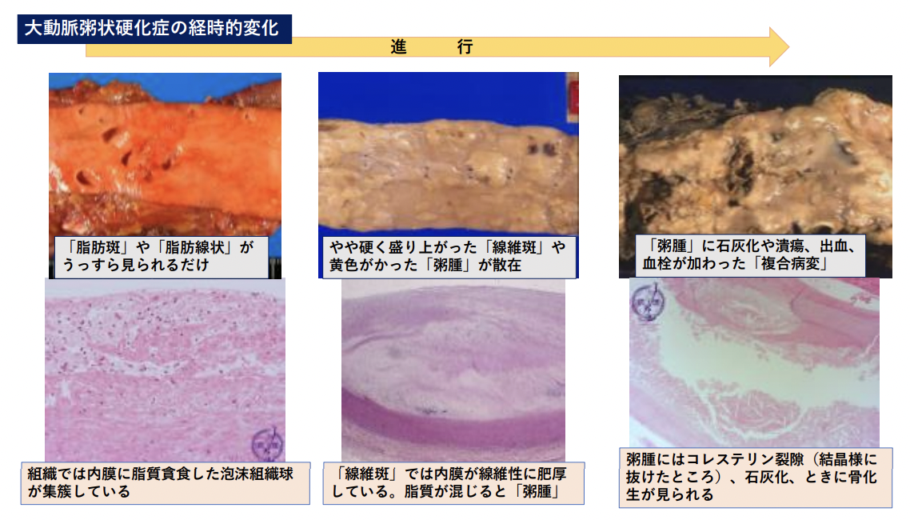

## 3.4. メタボリックシンドローム
2005年～生活習慣病予防を啓蒙する効果を期待して、内科学会が提唱。  
腹囲：男≧85㎝、女≧90㎝ （内臓脂肪面積100cm2に相当）  
更に、①脂質異常、②高血圧、③耐糖能異常 のうち２項目を満たすもの。   
中高年の男性3人に1人、女性の5人に1人。腹囲のカットオフ値については議論あり。  
動脈硬化性疾患のリスクが上昇する（2倍程度）。

## 3.5. スフィンゴリピドーシス sphingolipidosis
遺伝的な酵素欠損 -> スフィンゴ脂質がLysosome内に蓄積。  
Lysosome病とも呼ばれる（糖原病Ⅱ型（Pompe病）、ムコ多糖症も）。  
2000年台より、次々と酵素補充療法でてきた
### 3.5.1. 代表的疾患
- ゴーシェ病
  - グルコセレブロシダーゼ欠損 -> グルコセレブロシドが蓄積。AR。10万人に1人未満。肝脾腫や中枢神経系症状を呈す。
- ニーマンピック病
  - スフィンゴミエリナーゼ欠損 -> スフィンゴミエリンが蓄積。AR。10万人に1人未満。肝脾腫や中枢神経系症状を呈す。乳児型は予後不良。
- Fabry病
  - αガラクトシダーゼAの欠損または低下して、グロボトリアオシルセラミドが蓄積。XRだがヘテロの女性にも発症あるため、10万人に10人程度。血管内皮細胞、平滑筋細胞、汗腺、腎臓、心筋、自律神経節、角膜など全身に蓄積するため、症状様々。原因不明の心不全や腎不全に、未診断のFabry病が含まれている可能性。  
  
### 3.5.2. 組織像
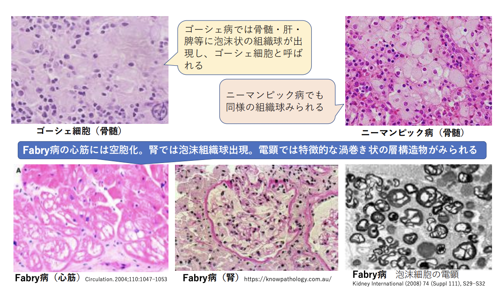  

# 4. タンパク質代謝異常
1) 先天性アミノ酸代謝異常
2) 尿素回路（オルニチン回路）異常
3) アミロイドーシス   

## アミノ酸の代謝
- 他のアミノ酸に変換され蛋白合成
- カテコラミンやホルモンの合成
- プリン・ピリミジン塩基の合成
- 糖新生  

一日約250gの蛋白が常に代謝Sされ、食事から摂取異化、排出50～60g。  
糖新生では、アミノ酸転移酵素によりアミノ基除去 -> クエン酸回路。  
除かれたアミノ基はグルタミン酸に -> 肝へ -> アンモニアになる -> 尿素回路（オルニ
チン回路） -> 尿素として排泄

## 4.1. 先天性アミノ酸代謝異常
アミノ酸代謝における遺伝的酵素欠損。
早期からの食事療法が有効なため、マススクリーニング検査の対象。  
2010年代～タンデムマススクリーニング法の導入（1回で多数の疾患を同時に検査できるよ
うになった。遺伝子検査ではなく異常な蓄積物を質量分析で検出する。）  
有機酸や脂肪酸の代謝異常が加わり、現在20～26程度の疾患（自治体により異なる）が対象検査となっている。  
### 4.1.1. フェニルケトン尿症
フェニルアラニン -> チロシンを担うフェニルアラニン水酸化酵素が欠損。  
症状：高フェニルアラニン血症・鼠様尿臭・赤毛・知能低下  
知能低下は、フェニルアラニン除去ミルクで予防可能。  
チロシン添加食で皮膚や毛髪の色は正常化する
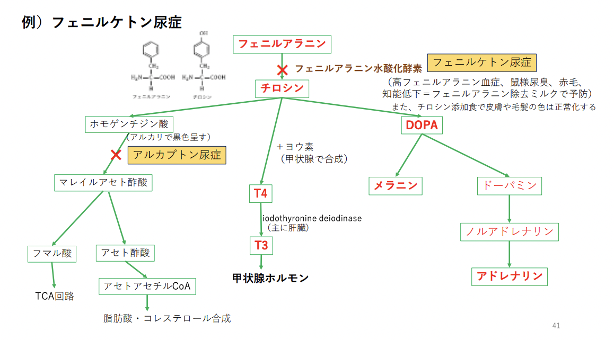
### 4.1.2.尿素回路（オルニチン回路）異常
- 原因
  - 先天的酵素欠損：ほとんどどAR（OTCのみXR）で、10万人に10人程度
    - カルバミルリン酸合成酵素欠損症
    - オルニチントランスカルバミラーゼ（OTC）欠損症：最頻
    - 古典型シトルリン血症
    - アルギニノコハク酸尿症
    - アルギニン血症
    - Nアセチルグルタミン酸合成酵素欠損症
  - 肝硬変
- 症状：高アンモニア血症 -> 中枢神経に障害を与える。 
### 4.1.3. アミロイドーシス
βシート構造をとる線維状のタンパク質が組織に沈着して生じる。   
コンゴーレッド染色で燈色に染まった箇所を偏光顕微鏡で見ると、典型部ではgreen apple 色にみえる。  
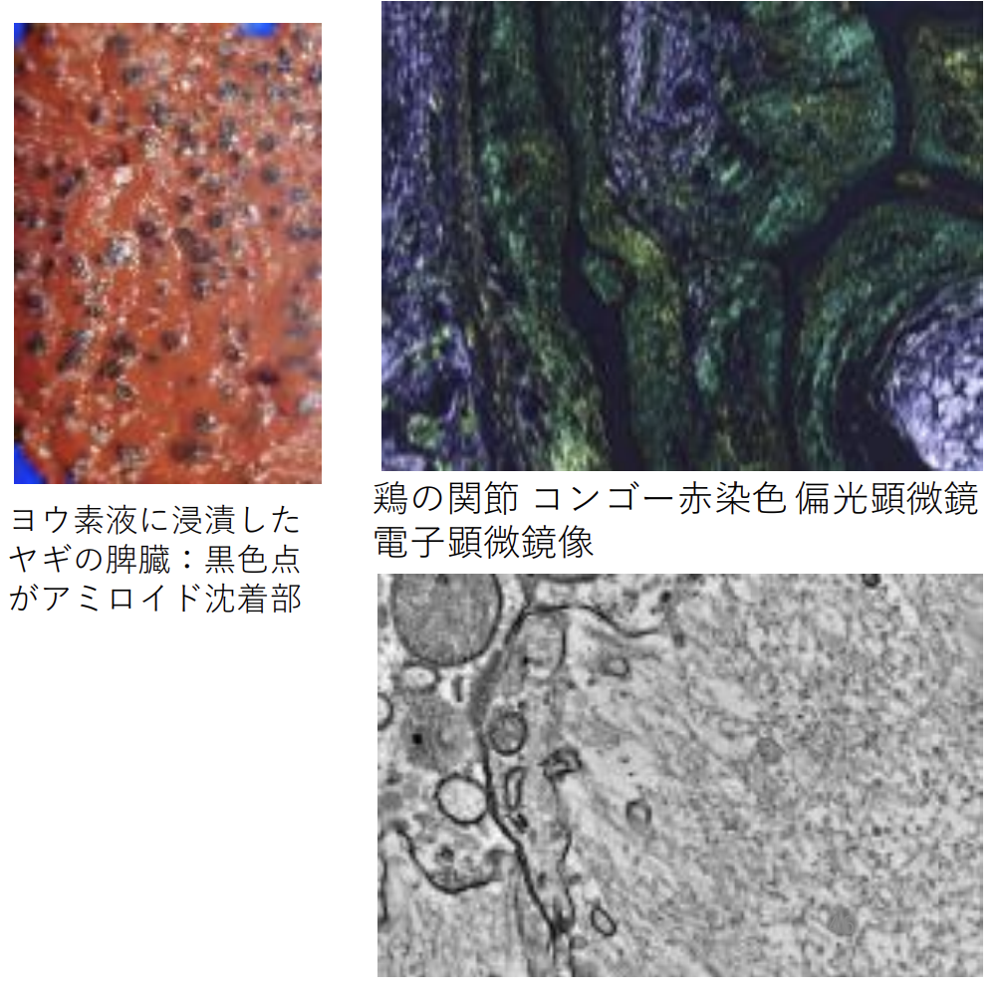  
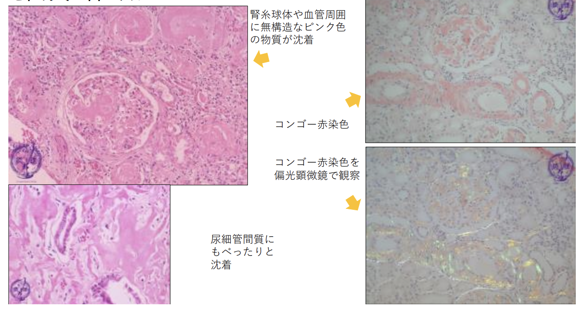
#### 4.1.3.1. アミロイドーシスの種類
アミロイドーシスを生じる元のタンパク質には様々な種類が知られる。  
全身に沈着がみられる「全身性」と特定の臓器に沈着がみられる「限局性」がある遺伝性と非遺伝性がある。
- 代表的なアミロイドタンパク
  - 全身性
    - ALアミロイド：免疫グロブリンの軽鎖由来。骨髄腫でみられる。
    - AAアミロイド：炎症時に増える血性アミロイドAタンパク由来。関節リウマチに見られる。
  - 限局性
    - アミロイドβ：大脳皮質に老人班を形成する。アルツハイマー病で増加。
#### 4.1.3.2. ATTRアミロイドーシス
もともと高齢者の心臓にアミロイドが沈着する病気と考えられ、老人性心アミロイドーシスと呼ばれていた。この前駆体蛋白は、トランスサイレチン（遺伝子変異のない野生型）で、健常人の血中にも少量存在するが、アミロイド蛋白となり、脳以外の全身臓器に沈着する。  
加齢が原因。  
主症状は、アミロイド沈着による心機能異常。   
トランスサイレチン -> アミロイドを抑制する薬剤が近年使用されている
### 4.1.2. その他疾患
- 有機酸代謝異常：糖新生 -> クエン酸回路に入る過程で、一部は有機酸を経る。その過程の遺伝的酵素欠損。
- 脂肪酸代謝異常：糖新生過程（脂肪酸 -> β酸化 -> アセチルCoA -> クエン酸回路）における、脂肪酸をミトコンドリアへ運搬する場面に使われる酵素欠損やカルニチン欠乏による異常。  

これらの多くは遺伝形式はAR。  
症状として、乳児期に低血糖（糖新生障害）・代謝性アシドーシス（様々な酸の蓄積による）・高アンモニア血症（尿素回路にも影響及ぶため）。  
乳児突然死症候群の原因になることも。  

# 5. 拡散代謝異常
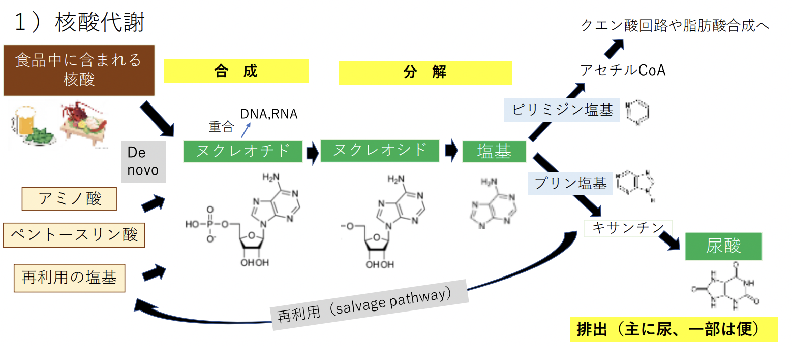  
高尿酸血症の原因は、過剰合成 or 排出低下。  
- 過剰合成（at 肝）：核酸を多く含む食品の摂取など
- 排出低下（ar 腎）：腎不全など

## 5.1. 高尿酸血症を示す疾患
- 痛風：血中の尿酸濃度↑ -> 尿酸塩として析出 -> 関節に沈着 -> 痛み発作を起こす（痛風発作）。腎や心膜に沈着することも。
- レッシュナイハン症候群：HGPRT (ヒポキサンチングアニンホスホリボシルトランスフェラーゼ) 欠損。
プリン塩基分解における再利用経路が障害 -> 尿酸過剰産生。遺伝形式XRで男児のみ発症。高尿酸血症 + 神経症状（自傷行為）。

# 6. その他
1) ヘモグロビン代謝障害
2) ビリルビン代謝障害
3) 鉄代謝障害
4) カルシウム代謝障害
## 6.1. ヘモグロビン代謝障害
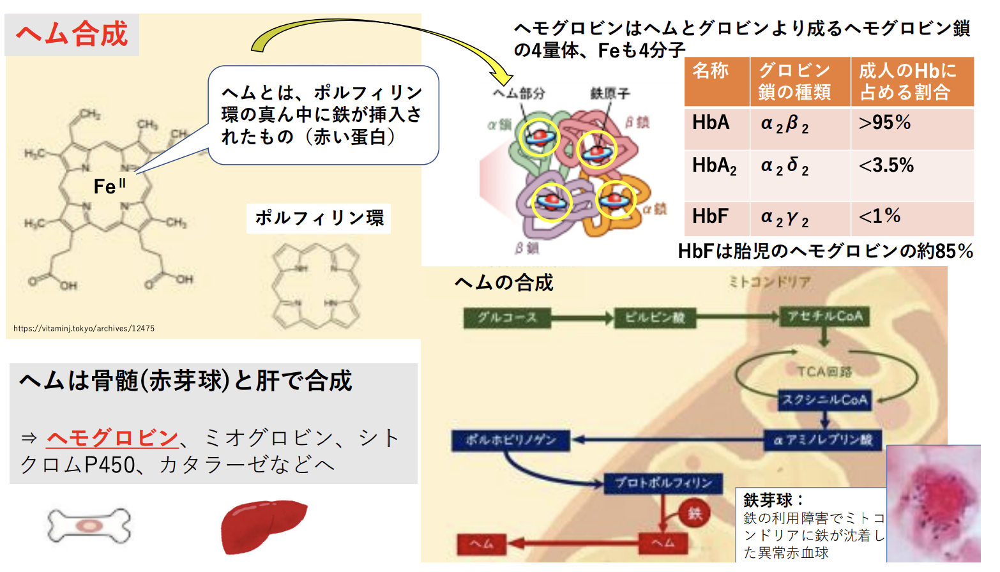
### 6.1.1. ポルフィリン症
□に示した酵素の先天的欠損 -> 特定のポルフィリン体の蓄積 -> 皮膚症状（日光過敏症）・神経症状。   
アルコール・ベンゼン・鉛摂取でも同様の病態が起こり、二次性ポルフィリン症と呼ぶ。
### 6.1.2. 異常ヘモグロビン症
500種類ほど知られ、殆どが遺伝性疾患。
- 構造変化を起こすもの
  - eg. 鎌状赤血球症：β鎖の6番目のアミノ酸がグリシンからバリンに置換。構造変化 -> 凝集 -> 赤血球の鎌状変形 -> 脆弱化 -> 溶血性貧血・血栓塞栓症起きる。
- 合成能低下を起こすもの
  - eg. サラセミア
    - αサラセミア：α鎖グロビンの合成低下
    - βサラセミア：β鎖グロビンの合成低下
### 6.2. ビリルビン代謝
赤血球は120日後に脾臓でMΦに取り込まれ破壊。  
鉄は再利用、グロビンはアミノ酸代謝へ。残ったポルフィリン環はビリルビンとなる。  
アルブミンと結合して水溶性 -> 肝へ運ばれる -> グルクロン酸抱合 -> 無害化＆水溶性 -> 胆汁へ排出 -> 主に便へ排泄。一部は小腸で吸収されて血中に入り、再度、肝で処理。一部は尿中にも排泄。

#### 6.2.1. 高ビリルビン血症を起こす疾患
- 溶血性貧血
  - 脾臓の処理能力を超えるヘモグロビン破壊 -> -> 間接ビリルビン↑ -> 異常ヘモグロビン症など脆弱な赤血球の増加・血液型不適合などの免疫学的機序・多血症等
- 新生児の核黄疸
  - 脾臓の処理能力を超えるヘモグロビン破壊 -> -> 間接ビリルビン↑ -> 多血症に肝機能の未熟性 -> 大脳基底核にビリルビン沈着して脳障害
- Girbert症候群・Crigler-Najar症候群・肝炎・肝硬変
  - グルクロン酸抱合酵素の活性低下や欠失 -> 肝細胞内での抱合能低下 -> 間接ビリルビンが増加 
- Dubin-Johnson症候群・Rotor症候群・肝炎・肝硬変
  - 抱合ビリルビンの毛細胆管への排泄障害で直接ビリルビンが増加
- 胆石・胆管癌
  - 肝外胆管の閉塞により、直接ビリルビンが増加

#### 6.2.2. 黄疸
血中ビリルビン値が上昇して皮膚や粘膜が黄染する。ビリルビン値 2～3mg/dLから気づかれる。
- 直接ビリルビン上昇：肝細胞でのグルクロン酸抱合の後～胆道に障害
- 間接ビリルビン上昇：脾臓での赤血球破壊～肝細胞内でのグルクロン酸抱合までに障害

### 6.3. 鉄代謝
- ヘモジデローシス：ヘモジデリンが沈着すること。
- ヘモクロマトーシス：高度な沈着で臓器障害を来したもの。肝では肝硬変になりうる。  
  
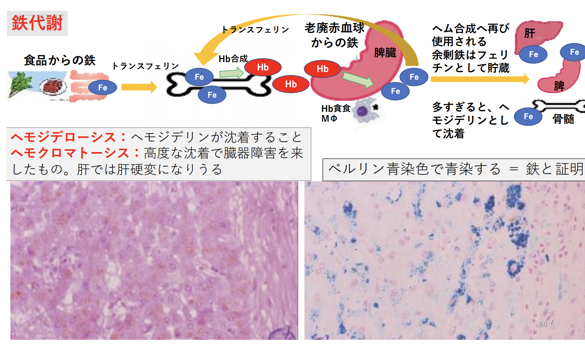

### 6.4. Ca代謝
Caの99％は骨にある。副甲状腺ホルモンやカルシトニンなどの影響を受け、骨吸収と骨形成が常に行われ、血中カルシウム濃度を保っている。
- 転移性石灰化：高カルシウム血症によって臓器に石灰沈着。（骨組織からカルシウムが移る、という意味で
転移とよばれる）高度だと臓器障害起こす。

比較）異栄養性石灰化：“退行性変化・変性”の一つで、高カルシウム血症がなくても起こる。  
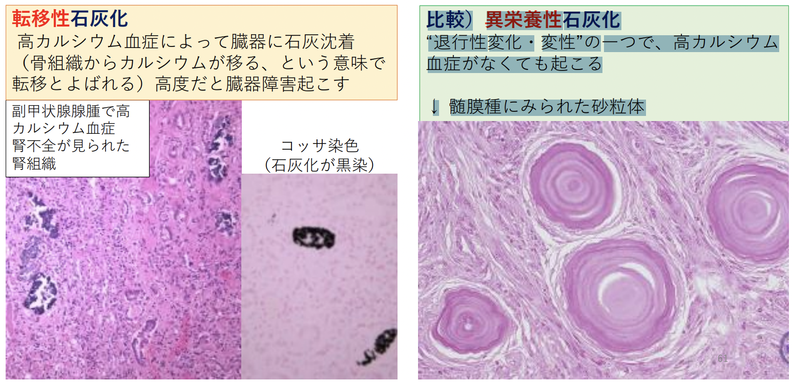
