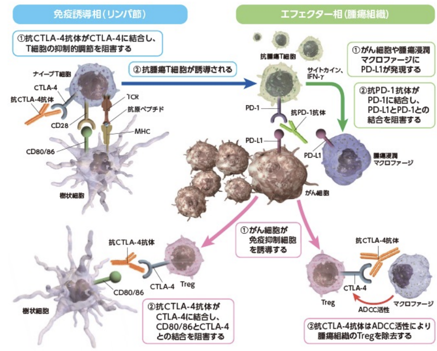

# 1102 分子腫瘍学
# 1. がんの概論
- 細胞の無限の自立性増殖
- 発生するもとの組織に類似する
- はじまりはたった一つの細胞
## 1.1. 日本人の主な死因
1. がん 30.3%
2. 心疾患 15.3%
3. 脳血管疾患 14.7%
4. その他 39.7%
## 1.2. 生涯でがんに罹患する確率
生涯でがんに罹患する確率は、男性53％、女性40％。
## 1.3. 多段階発がん
1. 正常な組織
2. 1つ目の異常を持った細胞が増殖
3. 複数の異常を持った細胞が増殖
4. 悪性度の高い細胞ができて周囲へ広がる
  
特にStem cellに変異が起きると悪性度が上がる。

# 2. がんの原因となる異常
1. がん遺伝子
2. がん抑制遺伝子
3. DNA修復遺伝子
4. Epigeneticな遺伝子の制御とがん
5. がんと免疫
## 2.1. がん遺伝子
### 2.1.1. 発見にいたる道のり
- 1911年：3ラウス肉腫ウイルス（Rous sarcoma virus：RSV）の発見
  - ニワトリの肉腫をすりつぶし、これを濾過した液体を別のニワトリに投与すると肉腫を生じた。  
  -> ウイルス感染によるがん化の誘導
- 1970年代：世界初のがん原遺伝子srcの発見
  - RSVのmRNAにコードされたがんの原因となる遺伝子が同定された。その後、花房秀三郎が「がん遺伝子は、われわれの体に存在する遺伝子が変異したものである」ということを見出した。
- その後、WeinbergがRas遺伝子を単離した。  

### 2.1.2. 肺がんのゲノム解析
NGSでの解析により、肺腺がん患者の75％以上が治療可能なドライバー変異(RTK/RAS/RAF変異）を持つことが明らかになった。  
   
- 肺がんに見られる変異・遺伝子異常
  - EGFR変異：肺腺がん、女性、非喫煙者に多くみられる。また、非小細胞肺がんの3-4割がEGFR変異陽性。
  - EML4-ALK 染色体変異
  - RET融合遺伝子：肺腺がんの1.2%に見られる。
  - ROS1融合遺伝子：肺腺がんの1.2%に見られる。

  
## 2.2. がん抑制遺伝子
Knudson, Jr.が、がんを抑制する分子が存在するのでは？ということを考えた。
### 2.2.1. 網膜芽細胞腫
日本では、毎年約80名の患者が存在する。その数、15000人にひとりの割合にのぼる。  
網膜芽細胞腫には、遺伝性と非遺伝性がある。  
遺伝性では両側性かつ多巣性が多く、非遺伝性では片側性かつ単巣性が多い。  

### 2.2.2. Rb遺伝子の発見
1986年にRb遺伝子が発見された
### 2.2.3. 癌抑制遺伝子の代表例
以下、いずれの疾患も遺伝形式はADである。
- p53：これに変異が起こると、Li-Fraumeni syndromeを発症する。
- APC：これに変異が起こると、家族性大腸ポリポージスを発症する。大腸癌の多くの患者にこの変異が見られる。
- BRCA1/BRCA2：これに変異が起こると、遺伝性乳がん卵巣がん症候群を発症する。
## 2.3. DNA修復遺伝子
DNAは損傷をうけたり、修復異常がおこる。
### 2.3.1. DNA損傷の原因
- 活性酸素
- UV
- 放射線
- DNA複製異常
### 2.3.2. DNA修復のパターン
- 一本鎖DNA修復
  - 塩基除去修復  BER; base excision repair 
  - 核酸除去修復  NER; nucleotide excision repai
  - ミスマッチ修復  MMR; mismatch repair
- 二本鎖DNA修復  DSBR
  - 非相同組換え末端結合部  NHEJ; Non-Homologous End-Joining
  - 相同組み換え  HR; homologous recombination
### 2.3.3. DNA修復の異常を示す疾患
#### 2.3.3.1. リンチ症候群 HNPCC; Hereditary non-polyposis colorectal cancer（遺伝性非ポリポーシス大腸がん）
生殖細胞系列での**ミスマッチ修復遺伝子**（MSH2・MLH1・MSH6・PMS1・PMS2･EPCAM）の変異による症候群。症例の50%がMSH2・MLH1遺伝子の変異。遺伝形式はADを示す。治療法としては、免疫チェックポイント阻害薬が有効。  
若年性に大腸がんを発症する。また、他にも子宮内膜、卵巣、胃、小腸、肝胆道系、腎盂・尿管がんを発症する。全大腸がんの2-5％程度がリンチ症候群 HNPCCと考えられる。  
平均発症年齢は43-45歳、リンチ症候群（HNPCC）の遺伝子変異を持つ人では、約80％が生涯の間に大腸がんを発症する。女性では、20-60％が生涯に子宮内膜がんを発症する。  
※遺伝子を問うことはない。  
  

##### cf. マイクロサテライト不安定性 Microsatellite Instability MSI  
まず、マイクロサテライトとは、ゲノムの中で1～数塩基の塩基配列が繰り返し見られる部位のこと。この部位は、DNA複製時に繰り返し回数のエラーが生じやすい。繰り返し配列に異常が見られずDNA修復機構が正常な癌は、MS stableと言える。  
一方、マイクロサテライト不安定性 MSIとは、細胞が分裂する際に起こる、DNAの配列ミスを修復する機能が低下している状態のこと。  
リンチ症候群では、ミスマッチ修復遺伝子に変異があることから、この繰り返し配列に異常がでるため、MS instabilityと言える。逆に言えば、MSIの有無を調べる事で、リンチ症候群の可能性を調べる事ができるのである。   
＊リンチ症候群では90%以上で、散発性大腸がんでは6～7%で、MSIが見られる。  
なお、MSIはPCRをするだけで調べることがができるので、大腸癌診断では必ずMSIを検査する。
#### 2.3.3.2. 遺伝性乳がん・卵巣がん症候群 Hereditary Breast and Ovarian Cancer; HBOC
HBOCでは、BRCA1 or/and BRCA2遺伝子に変異が見られる。なおこれらの変異は、乳がん、卵巣がん、膵がん、前立腺がんの原因となりうる。  
DNA損傷の中でも最も細胞に対する毒性が強いのは、DNA二本鎖切断 double-strand break; DSB であるが、そのの修復過程にBRCA1/2が重要な役割をはたす。  
  
## 2.4. Epigeneticな遺伝子の制御とがん
がんの発生は、がん遺伝子・がん抑制遺伝子の変異だけでは説明できない。統計学だけで考えると、ヒトはがんにならないとされる。   
遺伝子変異が関与しない生体の変化を、遺伝子のマスキングといい、epigeneticな遺伝子制御が起きていると考えられている。遺伝子のマスキングがが起きていると、がん抑制遺伝子が使えなくなってしまう。これによりがんが発生すると考えられている。
## 2.5. がんと免疫
### 2.5.1. CAR-T療法
CAR-T療法により、治療抵抗性の急性リンパ性白血病ALL30例中27例（90%）で完全寛解が得られた。  
CARとは、キメラ抗原受容体 Chimeric Antigen Receptorのことである。これは、腫瘍抗原に特異的な一本鎖抗体とCD3ζ鎖（T細胞を活性化するドメイン）を癒合させた人工的な受容体である。この遺伝子を患者T細胞へ導入することで、腫瘍のみに反応するT細胞とするという手法が、CAR-T療法である。  
現在、共刺激分子を発現させることで、より強力に改良されてきている。

  

通常のT細胞の免疫応答では、まずTCRがHLA上の抗原を認識し、共刺激分子がTCRシグナルを増強させ、そのシグナルをT細胞自身や周囲細胞が分泌することで、T細胞が活性化・増殖する。一方CAR-T細胞には、HLA関係なく、直接腫瘍抗原を認識できるという利点がある。  
  
### 2.5.2. 免疫チェックポイント阻害薬
  
