# 0829 基本概念I-A
## 薬物の作用点
薬物は、**標的分子に結合する**ことでその薬効を発揮する。標的分子（DNAや酵素、○○受容体などのタンパク質）を**薬物受容体**と呼ぶ。
### 受容体
- 広義：**刺激・物質・信号を受け取る**もの。つまり、**すべてのタンパク質**が受容体といえる。
- 狭義：**脂質二重膜（細胞膜や核膜など）上**に局在し、様々な信号を受け取る膜型分子。**細胞膜受容体**, **核内受容体**, **イオンチャネル**など。

## 薬物の作用
標的分子に結合した薬物は、その標的分子（受容体）の機能を促進または抑制する。
- アゴニスト(**作動薬**)：標的分子を**活性化**する薬物。
- アンタゴニスト（**拮抗薬**）：アゴニストに**拮抗**的に働き、標的分子の活性を**減弱**させる薬物。
  - 同義の言葉として、**遮断薬**や**阻害剤**がある。3つの使い分けは以下。
    - 標的分子が**酵素**の場合➡︎**阻害剤**
    - 標的分子が**受容体**の場合➡︎**拮抗薬**
    - 標的分子が**イオンチャネル**の場合➡︎**遮断薬（ブロッカー）**

## 薬物の投与量と薬理反応
薬理反応は、その**投与量**に依存する。効果は頭打ちとなり、その状態を**飽和状態Emax**という。**投与量**が**閾値**より低いと、効果は得られない。
### 用量-反応曲線
ある薬物の受容体およびそのエフェクターの反応を測定し、**薬理反応量**と**薬物濃度**の関係をグラフにプロットしたもの。  
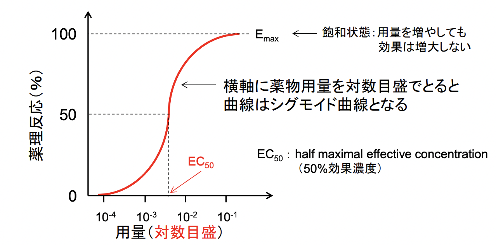   
曲線の形は、横軸を**対数**目盛にするか**等分**目盛にするかによって変わる。  
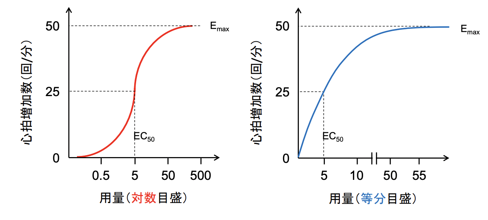

## 薬物の作用の強さを示す指標
いずれも**薬物とその受容体の親和性**を評価している。
### **EC50**
**half maximal effective concentrarion**　(JP：**50%効果濃度**)  
**薬効の50%を得るために必要な薬物濃度**を示す。数値が**低い**薬剤ほど、受容体への親和性は高く、作用が高い。  

薬効を数値として測定できる場合(eg. **心拍数**)：**その最大反応の50%を得るための濃度** を指す。  
効果出現の有無で評価する場合：**母集団の50%で反応が認められる濃度**を指す。  

cf. **ED50**; **effective dose**(JP：**50%有効用量**)：EC50と基本的には同じ。   

<p>   

薬物は、濃度に依存してその効果が大きくなるが、濃度を上げすぎると**毒性**が生じ、最悪の場合死に至る。
中毒濃度は**TC**; **Toxic concentration**、致死濃度は**LC**; **lethal concentration**と表される。  
**EC50とLC50・TC50の間隔が広い**、つまり**低**EC50、**高**LC50、**高**TC50であるような薬物が扱いやすい薬であると考えられる。  
```
治療定数 = LD50 / ED50  
```
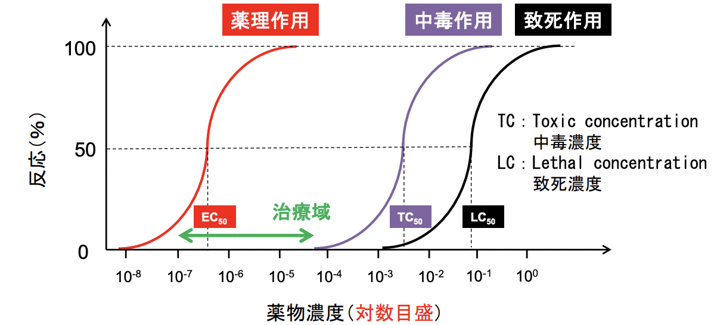

### **KD** 
D**issociation constant**(JP：**解離定数**)  
**薬物ー受容体複合体の解離しやすさ**を示す。 数値が**低い**薬物ほど、受容体への親和性は高く、作用が高い。  
薬物と受容体は、**結合と解離のバランス**によってある平衡状態に落ち着く。薬物と受容体の結合反応に「**質量作用**の法則」を応用できると考えると、**平衡状態において薬物：受容体：複合体の濃度比は理論的には一定**である。この考えをベースにしたのがKDである。  

𝐿：リガンド(薬物) 薬物が遊離した状態  
𝑅：受容体 薬物が結合していない状態   
𝐿𝑅：複合体 薬物と受容体が結合した状態  
𝑘1、 𝑘2 ：反応速度定数
として、以下のような化学反応式が成り立つ。  
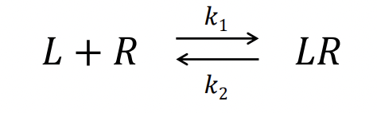

この可逆反応はいずれ平衡に達し、平衡状態においては以下の式が成り立つ。
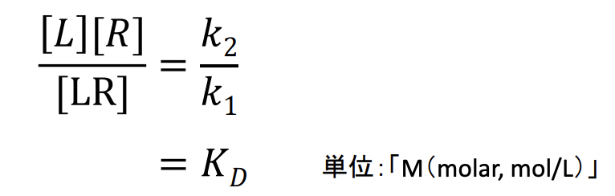  

ここで**KB**を**結合定数**とすると、  
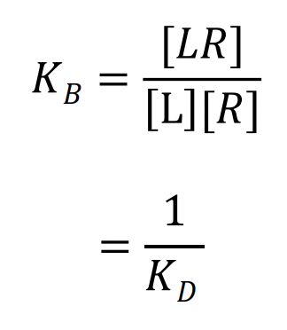


### Bmax 
**Maximum binding**(**最大結合部位数**)  
**受容体の最大密度**を示し、これは**受容体の総量**に相当する。  
**受容体の100%を占有するための必要な薬物濃度薬物濃度**で示され、これは**薬効100%を得るために必要な薬物濃度**とほぼ一致するという考えをベースとしている。  
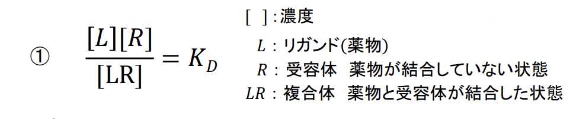  

ここで、𝐿：リガンドをフリーな状態と捉えてFと置き、LRを結合受容体としてBと置き換えた時、受容体総数Bmaxは以下のように考えることができる。  
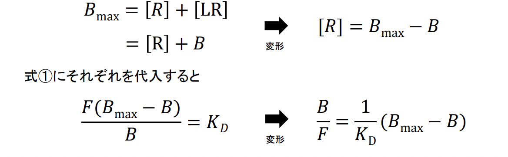

### **Scatchard**プロット
**受容体を含むタンパク質に対するリガンドの結合を解析する**ために用いられる古典的手法。
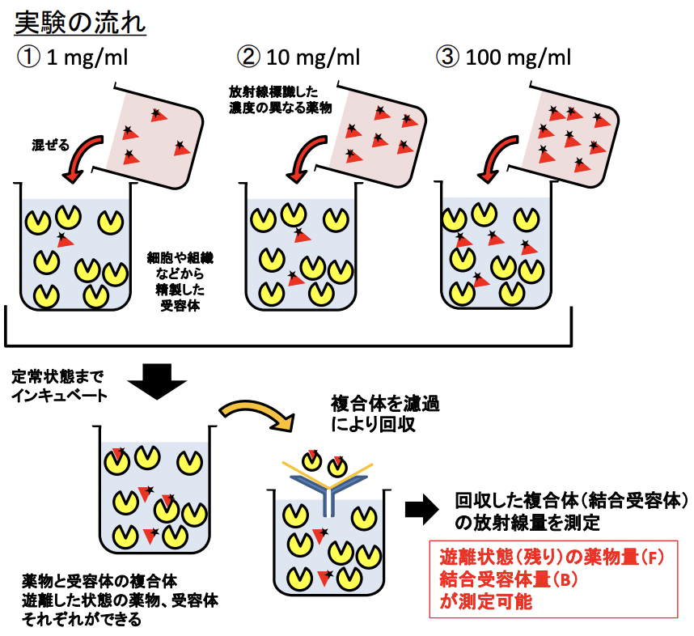   
測定結果をグラフにプロットすると以下のようになり、BmaxとKDを推定することができる。  
KDの式変形から、   
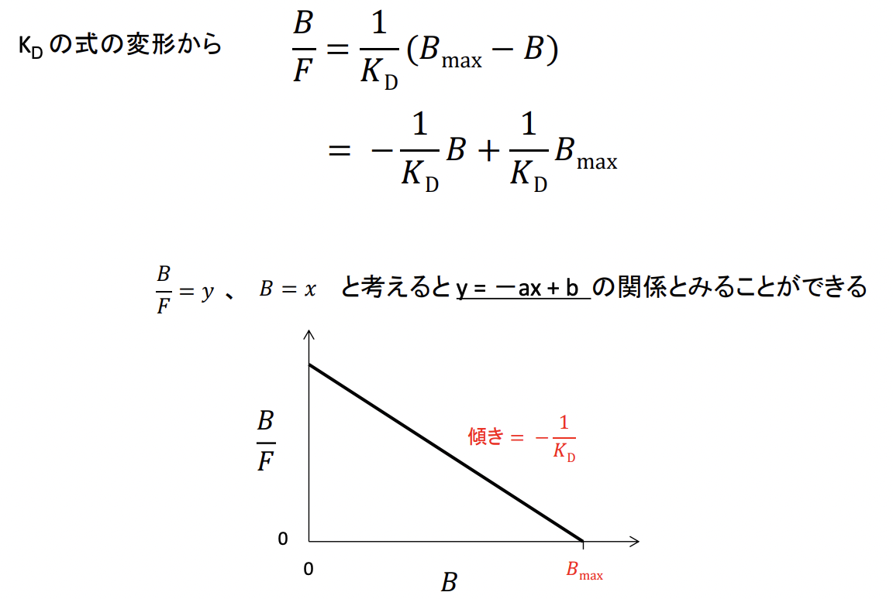 

ただし、Scatchardプロットは脆弱性を孕む。  
**受容体と薬剤が1:1の対応**であるならば、Scatchardプロットは**直線**のグラフになるが、生体内には**親和性の異なる他の受容体が存在したりする**ので、**グラフが直線になるとは限らない**のである。  
親和性が異なる受容体が複数共存している環境においては、**協同効果(アロステリック効果)**が働く可能性があるのだ。これは、**ある受容体にリガンドが結合する**と、**結合していない受容体のリガンド親和性が変化する**ことがある、というものだ。  
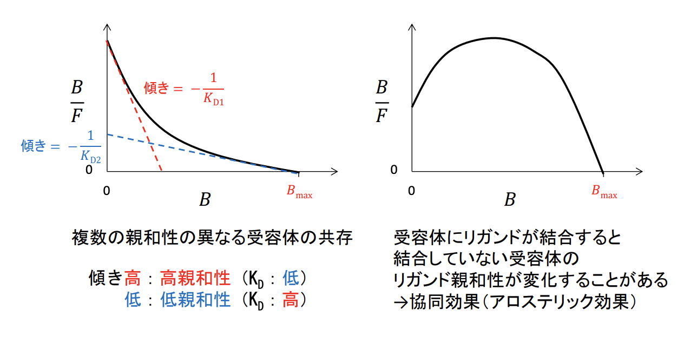

### EC50, KD, Bmaxの関係
𝐿：リガンド(薬物) 薬物が遊離した状態  
𝑅：受容体 薬物が結合していない状態   
𝐿𝑅：複合体 薬物と受容体が結合した状態
として、   
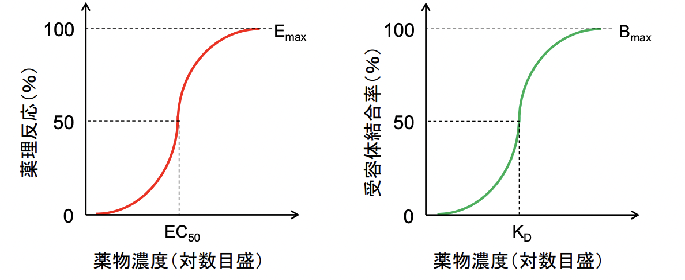  
**余剰受容体**を考えなくていい場合、**薬理反応率**と**受容体結合率**は**一致**する。つまり、結合率が50%の時に薬理反応は**50**％(**EC50**)になる。  
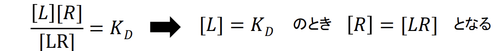  
つまり、`EC50 = KD`が成り立つ。


## 余剰受容体
**最大反応状態Emaxにおいて、リガンドと結合していない受容体**を余剰受容体という。  
この概念が存在するということは、**薬物の最大反応Emaxを得るための受容体結合率が100%でない**ものが存在する。  
### 生体内における余剰受容体の利点
1. **薬物感受性の増強**：**低濃度の薬物でも強い作用を得る**ことができる。
2. **薬物作用に影響する疾患や脱感作に対する抵抗性**：**受容体の減少や非競合的アンタゴニストの存在下**においても**最大反応を得る**ことができる。  
#### 余剰受容体の一例
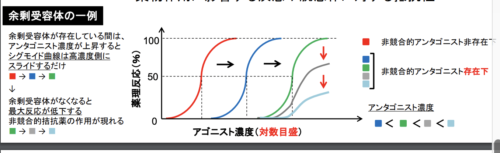 

## アゴニスト agonist
**受容体を介して標的シグナルを活性化する**薬物のこと。**作動薬**とも呼ばれる。  
### アゴニストの種類
1. **完全**アゴニスト：**受容体に結合すると標的シグナルを完全に活性化できる**薬物。
2. **部分**アゴニスト：**標的シグナルを活性化することはできるが、受容体との結合が飽和した状態であっても標的シグナルを完全には活性化できない**薬物。
3. **インバース**アゴニスト：**構成的(基底)活性を抑制する**薬物。

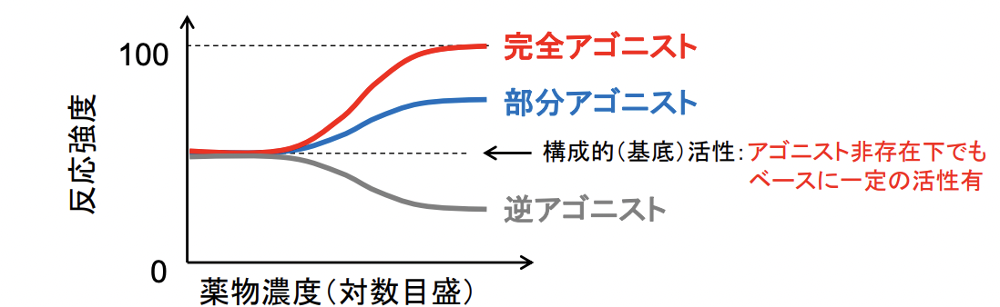  

## アンタゴニスト antagonist
**アゴニストに対して拮抗的に働き、標的分子の活性を減弱させる**薬物。**拮抗薬**とも呼ばれる。  
### アンタゴニストの種類
1. **競合的**アンタゴニスト：**受容体のアゴニストと同じ**部位に結合し、**アゴニストの結合を妨げ、受容体の活性化を抑制する**。  
   ➡︎**受容体活性化に必要なアゴニスト濃度**が**上昇**する(=**EC50**が**上昇**する)。
2. **非競合的**アンタゴニスト：**受容体のアゴニストとは異なる**部位に結合し、**結合による受容体の立体構造の変化などによって受容体活性を抑制する**。**リガンドの結合能**には影響しない。  
   ➡︎**最大反応レベルが低下する**(=**EC50**は**変化しない**)。  
3. **アロステリック**アンタゴニスト：**リガンドの結合部位とは異なる**部位に結合することで、**受容体の立体構造変化などを引き起こし、リガンドの結合能や活性効果を低下させる**。  
  ➡︎**受容体の反応レベル・EC50**が**低下**する。
4. **可逆的**アンタゴニスト：**アゴニスト量を増やしていくことにより、結合したアンタゴニストを打ち消すことができる**。
5. **不可逆的**アンタゴニスト：**一度結合すると受容体から離れず、受容体を阻害し続ける**。  
  ➡︎**共有結合などの強い結合**を示すため。

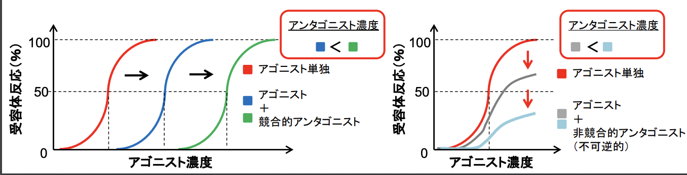  
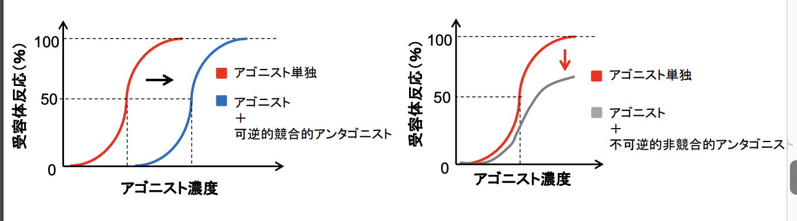 

## アゴニストとアンタゴニストの結合イメージ
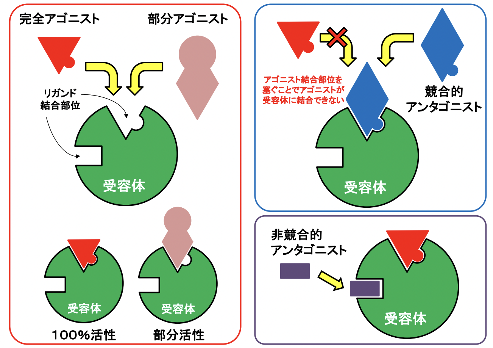   

### アロステリックアンタゴニストと非競合的アンタゴニストの違い
- アロステリックアンタゴニスト：**リガンドが結合することで受容体の立体構造変化などを引き起こし、リガンドの結合能や活性効果を低下させる**。  
  ➡︎**受容体の反応レベル・EC50が低下する**。
- 非競合的アンタゴニスト：**リガンドの結合能には影響しない。**  
  ➡︎**受容体の反応レベルが低下するが、EC50は変化しない**。

## シグナル伝達
- 1. **細胞間**シグナル伝達  
  ➡︎**生体維持**に必要なシグナルを担当細胞に伝達する。
- 2. **細胞内**シグナル伝達  
  ➡︎**細胞外から受けた刺激**（シグナル）等を細胞内で伝達し、**遺伝子発現**などを介して**最終的な細胞応答**を誘導する。
  - 細胞応答：**増殖**・**分化**、**遊走**、**形態変化**、**分泌**など

### シグナル伝達の概念図
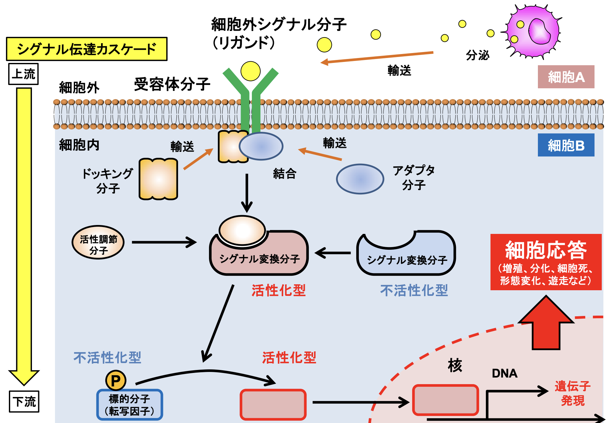

### 細胞間シグナル伝達の伝達方法
1. **可溶性リガンドー受容体に**よるシグナル伝達  
   - 例：**ホルモン**、**サイトカイン**、**神経伝達物質**、**増殖因子**など
   - type
     - **エンドクライン**型
     - **パラクライン**型
     - **オートクライン**型
   - 利点：**多くかつ遠くの**細胞にもシグナルを伝えることができる。
2. **細胞膜結合分子同士**によるシグナル伝達
    - 例：**アポトーシス分子**、**抗原提示**、**神経ガイダンス分子**、**細胞接着分子**など
    - 利点：**標的細胞にのみ確実**にシグナルを伝えることができる。
### 細胞内シグナル伝達の伝達方法
1. **セカンドメッセンジャー**によるシグナル伝達  
   ➡︎**細胞内での濃度変化**によって下流のシグナル分子を制御する。
   - セカンドメッセンジャーの種類
     1. **カルシウムイオン**  
        1. **イオンチャネルを介した細胞外**からの流入
        2. **外部刺激に伴った小胞体**からの流出
     2. **環状ヌクレオチド**(①**cAMP**, ②**cGMP**)  
        - **細胞外刺激**により、①**cAMP**は**アデニル酸シクラーゼAC**の触媒により**ATP**から、②**cGMP**は**グアニル酸シクラーゼGC**の触媒により**GTP**から合成される。
        - **細胞内の濃度上昇**に伴って、①**cAMP**は**PKA**を、②**cGMP**は**PKG**を活性化して、様々な細胞機能を誘導する。
     1. **リン脂質の分解産物**(①**イノシトール3リン酸IP3**, ②**ジアノシルグリセロールDAG**)  
        - **細胞膜**成分である**ホスファチジルイノシトールPI**から産生される。
        - ①**IP3**の作用：**小胞体からのCa2+放出を促進し、細胞機能を制御する**。
        - ②**DAG**：**PKCを活性化する**。
2. **タンパク質の構造変化、結合、修飾**によるシグナル伝達
   1. **コンフォメーション変化**  
      - eg. **フォールディング**、**リガンド結合部位の開放**
      - 例えば、**Ca2+が結合**することで、**結合分子であるNF-ATの結合部位が開く**。
   2. **分子結合**　　
     - eg. **アダプター分子等の結合**
   3. **翻訳後修飾**  
     - eg. **リン酸化**、**ユビキチン化**、**メチル化**、**アセチル化**
     - 例えば、**増殖因子受容体**は、リガンドである**増殖因子**(**インスリン**, **EGF**など)の結合を受けて**二量体を形成する**。これにより**細胞内領域に存在するキナーゼドメインが近接し、互いをリン酸化する**。それに伴い、**アダプター分子が結合**し、シグナルを細胞内へと伝達していく。
  
### シグナル分子のON/OFF
ほとんどのシグナル分子はシグナルのONとOFFが厳密にコントールされており、活性化された後は不活性化される。
- 受容体型膜タンパク質（eg. **増殖因子受容体**、**GPCR**など）
  - **エンドサイトーシス**：**細胞膜上の受容体の除去、分解**。
  - **Shedding**（**細胞内領域の切断**）：**細胞膜上の受容体の減少およびリソソーム（ユビキチン化）による分解**。
- リン酸化タンパク質  
  - 必ずしもリン酸化誘導によって活性化するとは限らず、脱リン酸化によって活性化される分子も存在する。
  - キナーゼ：リン酸化を触媒する酵素。
  - ホスファターゼ：脱リン酸化を担う酵素。
- コンフォメーション変化：**リガンド結合が解除される等により構造が元に戻る**。
- 発現量が増加するシグナル分子
  - **様々な分解酵素によって分解され、量が減少する**。
  - **チャネルやトランスポーターによる細胞外などへの汲出し**。

### 受容体のシグナル模式図
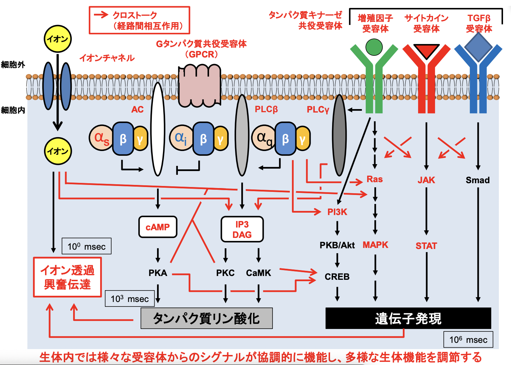  

## 市販薬の標的分子のタイプ
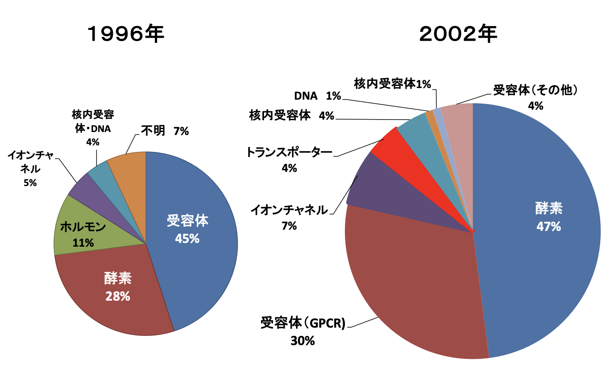