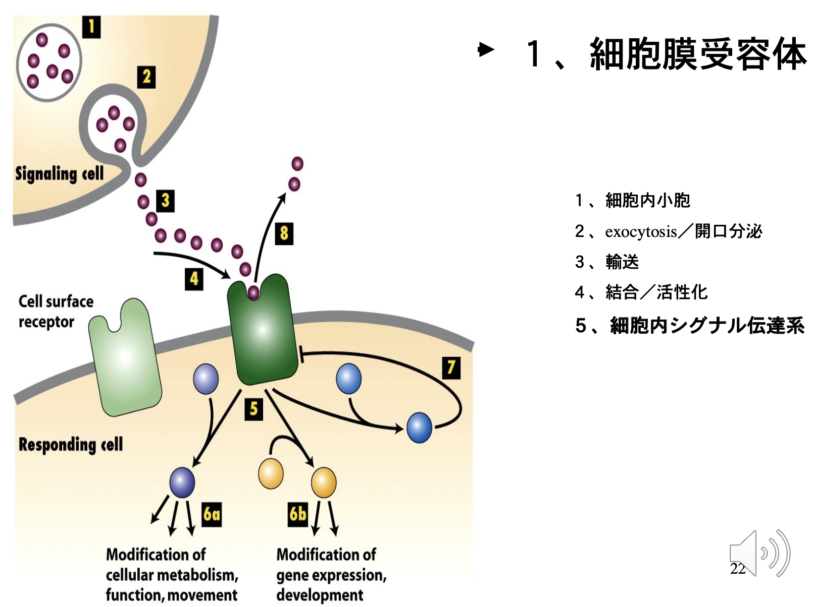
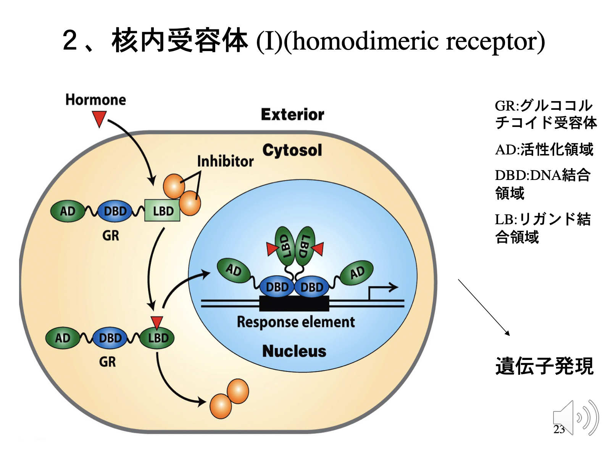

# 0829 総論
## 試験例題
1. 薬物の標的分子(総合名)を4種類あげよ。
2. アゴニスト/アンタゴニストを説明せよ。
3. 薬剤の標的分子が存在しない薬物は存在するかどうか?
4. 内因性(内在性)免疫抑制物質が存在するかどうか?自分の考えを述べよ。

## 各種定義
- 薬理学：薬物と生体の相互作用の結果起こる反応を理解する科学。
- 薬学：生体内の調節分子に結合し、正常な身体機能を亢進あるいは抑制することを通じて生体と相互作用する物質の研究をする学問。
- 薬物：標的に結合して働く。小分子(分子量200−600)が多いが、最近は蛋白質やペプチド(抗体)もよく使われる。
- 臨床薬理学：疾患治療の観点から薬物と生体の相互作用の結果起こる反応を理解する医学。

## 薬効
- 治療薬が病態に対して効果を示すための必須事項
  - **適切な薬剤選択**
  - **薬剤が標的に結合する**

### 薬剤の標的分子になりうるものは？
- **受容体**
- **転写因子**
- **酵素**
- **イオンチャネル**
- **トランスポーター**  
  
※薬物は、**リガンド**の1つと捉えられる。  
➡︎定義:**生体内分子に結合する**分子。典型例としては、**ホルモン**, **サイトカイン**, **ケモカイン**, **生理活性物質**など。結合先は**それぞれの特異的受容体**。  

### 受容体
一般的に受容体とは、生体内に存在する**ホルモン**, **サイトカイン**, **ケモカイン**, **生理活性物質**に対する受容体をさす。これは、薬理学においては**狭義**の受容体である。  
   
  

   

では、薬物の受容体、つまり薬理学における広義の受容体とは何か？  
➡︎ **薬物その他の生体内外の物質が結合して、生物学的情報を生体に伝える物質・分子**。

### 受容体による薬効の例
#### モルヒネ
モルヒネとは、有名な**麻薬性鎮痛剤**である。モルヒネは、**細胞膜受容体**である**モルヒネ受容体**に結合し、**細胞内シグナル**(**セカンドメッセンジャー**)によって**細胞レベルでの鎮痛**作用をもたらす。
#### 甲状腺ホルモン
甲状腺ホルモンは、**核内受容体**である**T3受容体**に結合する。これが**転写因子**となって、**DNA**の**T3受容体特異的塩基配列TRE**に結合する。これにより、**TREを上流に持つ遺伝子の転写が変化**し、**甲状腺ホルモン**の作用をもたらす。
#### サイクロスポリン
サイクロスポリンは、**サイクロフィリンと複合体を形成**し、**酵素カルシニューリン**を**阻害**することで、**T細胞の機能**を**抑制**する。これにより、**移植免疫**が**抑制**される。

薬物は体内に存在する物質であることも体内に存在しない人工的な物質であることもある。しかし、標的分子は一部の例外を除いて体内の分子(タンパク質・核酸など)である。これは、**ほとんどの薬物が生体に存在する組みに働きかける**ことを意味する。  
ただし、これには例外があり、例えばそれは**微生物などの体外生物による感染症に対する治療薬**が挙げられる。そのような元々生体に存在しない物質が薬物になる場合、**薬物に類似したリガンドが生体内に存在する**可能性を考慮しなければならない。  
例えばモルヒネについて、**モルヒネ受容体に結合する生体内因子が存在する**であろうと予想され、実際その後、下記の**生体内オピオイド類**が発見された。
- **エンドルフィン類**(**μ受容体**) 
- **エンケファリン類**(**δ受容体**) 
- **ダイノルフィン類**(**κ受容体**)

## アゴニスト vs アンタゴニスト
- アゴニスト
  - **生体内物質と同じ受容体に結合して、同様の細胞内情報伝達系を作動させる**薬物のこと。
  - eg：**イソプロテノール**
    - ➡︎**アドレナリン**のアゴニスト。アドレナリンと同様、**βアドレナリン受容体**に結合して、**血圧上昇**作用をもたらす。  
- アンタゴニスト
  - **既存の生体内物質と同じ受容体に結合するが、同様の作用はせず、時には拮抗作用を持つ**薬物のこと。
  - eg1：**ナロキサン**
    - ➡︎**muオピオイド受容体**を**不活型**にして、**モルヒネ中毒（鎮痛・呼吸抑制）**を**解除**する作用をもたらす。
  - eg2：**βブロッカー**
    - ➡︎**βアドレナリン受容体**を**不活型**にして、**降圧**作用や**心筋保護**作用をもたらす。
  - eg3：**タモキシフェン**
    - ➡︎**エストロゲン受容体**を**不活型**にして、**乳がんの増殖抑制**作用をもたらす。
  - eg4：**プロバスタチン**
    - ➡︎**HMG-CoA誘導体**である。**HMG-CoAレダクターゼ**を**不活型**にして、**コレステロール生合成の抑制**作用や、**肝からのLDL取り込み促進**作用をもたらす。
      - cf. コレステロール生合成：**酢酸** → **アセチルCoA** → **HMG-CoA**(+**HMG-CoAレダクターゼ**) → **メバロン酸** →コレステロール
  - eg5：**FK506**
    - ➡︎**FKBPと複合体を形成**し、**カルシニューリン**を**不活型**にして、**T細胞機能の抑制**作用や**移植免疫の抑制**作用をもたらす。
  - eg6：**Caアンタゴニスト**
    - ➡︎**Caチャネル**を**不活型**にして、**細胞内へのCaイオン流入**を**抑制**することで、**降圧**作用、**心筋保護**作用、**不整脈抑制**作用をもたらす。
