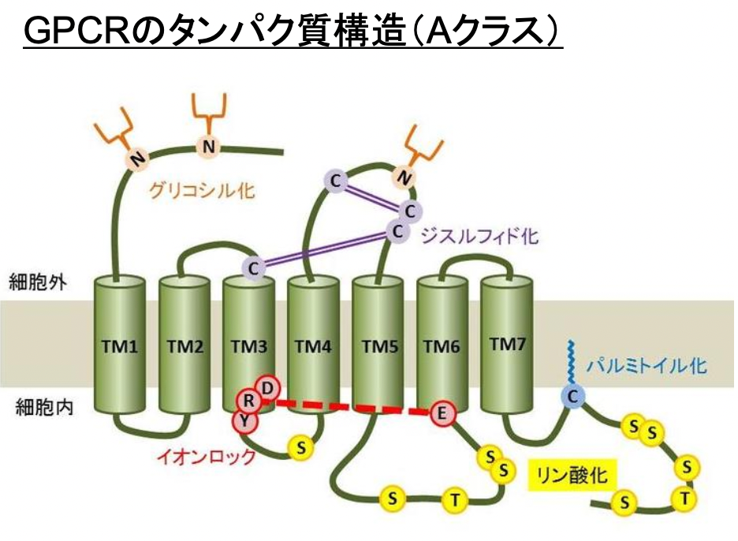

# 0905 基本概念I-B
# 分子標的薬
疾患の原因となるタンパク質(分子)にのみ作用する薬物。がん細胞にのみ発現しているタンパク質にのみ作用するため、正常な細胞には作用しない。標的となる分子が様々なところで機能していると正常細胞にも影響を与える可能性が高まるため、副作用が多くなる。  
ターゲットの例：**がん細胞の増殖**に関わるタンパク質や、**栄養を運ぶ血管やがんを攻撃する免疫**に関わるタンパク質。

### 通常、治療薬の標的となるタンパク質
薬物が結合しうるタンパク質である。それは以下。  
- **スプライシングバリアント**：**同じ遺伝子から合成され、機能や構造がかなり似ている**タンパク質。
- **ファミリー分子**：**別の遺伝子から合成されるが、機能や構造が似ている**タンパク質。
- **立体構造やアミノ酸配列が部分的に似ている**タンパク質
- **非特異的結合**
  
これらは全て副作用を起こしてしまう。  
この副作用を抑えるには、以下の3点が重要。
1. **がん細胞にのみ発現している**タンパク質、もしくは**がん細胞に高発現している**タンパク質(Eg. **腫瘍マーカー**)を標的とする。
2. **シグナルの上流分子**を標的とする。  
   why？➡️**下流のシグナル分子**は、**クロストークにより複数の経路で機能する**場合があるため。
3. **DDSの制限・改良** 

# GPCR
**三量体Gタンパク質**が結合する**7回膜貫通型**受容体。  
ヒトでは**800**種類以上見つかっており、その半数は**感覚**(**味覚**、**嗅覚**、**痛覚**、**フェロモン**)に対する受容体。また1/**6**は、**神経系の内分泌系の制御**に関与する（eg. **GABA**）。残りは、**リガンドや生理機能が不明**な**オーファン**受容体。   
現在使用されている薬物の**30**%以上がGPCRを標的としている。  

## GPCRの分類
1. クラス**A**（**ロドプシン様**受容体）：GPCRの約**85**%を占める。  
   - eg. **ロドプシン**、**アドレナリン受容体**、**ムスカリン性アセチルコリン受容体**、**嗅覚受容体**
2. クラス**B**（**セレクチン様**受容体）： **N末端の細胞外領域に長いリガンド結合部位を持つ**。①**セクレチン様**と②**Adhesion型**の2種類が存在する。  
   - ①**セレクチン様**：**ペプチドホルモン**
     - eg. **セクレチン**、**グルカゴン**、**グルカゴン様ペプチドGLP**、**カルシトニン**、**副甲状腺ホルモン**
   - ②**Adhesion型**：**N末端に様々なドメイン構造を持ち、細胞外マトリックスとするとされるが、その多くはリガンドが不明**。
3. クラス**C**（**代謝型グルタミン酸受容体**）：**N末端の細胞外領域にVenus flytrap VFTドメインを持つ**。  
   - eg. **代謝型グルタミン酸受容体**、**GABAB受容体**、**カルシウム感知受容体**、**味覚受容体**

## GPCRのシグナリング
1. リガンドが結合すると、**Gα**から**GPCRの活性化**により**GDPが外れてGTPが結合**し、**Gα**が**活性化型**へと移行する。
2. 三量体だったGタンパク質から**Gβ－Gγの複合体が解離する**。
3. **GαとGβ－Gγはそれぞれのエフェクター分子を活性化させる**。  

### Gαシグナリング
Gαは**４**つのファミリーに分類され、それぞれ決まった下流シグナルを活性化または抑制する。どんなGPCRであっても基本的にはこれらのシグナル経路を伝達する。  
ファミリーの分類は以下。
- α**q/11**：**PLCβを介して、小胞体からのCa2+放出を促す**。
- α**s**：**アデニル酸シクラーゼを活性化して、cAMPの合成を促進する**。
- α**i/o**：**アデニル酸シクラーゼを抑制して、cAMPの合成を抑制する**。
- α**12/13**：**RhoGEFを介してRhoAを活性化し、細胞運動に関与する**。

## 脱感作
脱感作とは、**GPCRによる細胞応答の時間や強さを制限する**仕組みのこと。**生体の恒常性維持**に重要な現象だが、**薬物効果の維持**にも大きく影響する。
### 脱感作のメカニズム
1. GPCRにリガンドが結合すると、**GPCRのリン酸化が誘導される**。
2. これに伴って、**βアレスチンと呼ばれる細胞内分子がGPCRに結合する**。
3. **βアレスチンが結合したGPCRはGタンパク質結合ができなくなる**。
4. **これらと並行してリガンドが結合したGPCRはエンドサイトーシスによって細胞内に取り込まれる**。    
➡︎**リガンドが結合できる細胞表面のGPCR量が減少する**。
  
つまり脱感作という仕組みがあるので、GPCRを標的とする薬物には、**長期投与**などによって**治療効果が低下**してしまうという問題点がある。  
※エンドサイトーシスされたGPCRは**リソソームで分解される**か、**リガンドが外れたのちに細胞表面へと再び戻ってくる**（=**リサイクル経路**）。  

## タンパク質リン酸化を介した細胞間シグナル伝達
1. **分子内にキナーゼドメインを持つ**受容体
   1. **受容体型チロシンキナーゼ**
   2. **TGF-β受容体**：**セリン・スレオニンリン酸化を触媒する**。
2. **分子内にキナーゼドメインを持たない**受容体
   1. **サイトカイン受容体**：**受容体に細胞質型チロシンキナーゼが結合**し、シグナルを伝達する。

cf. リン酸化を受けるアミノ酸：**チロシン、セリン、スレオニン**  
ただし実際は、**チロシン、セリン、スレオニンを中心とした数アミノ酸配列（４～８アミノ酸程度）からなるリン酸化モチーフ**のみがリン酸化を受ける。  

**セリン・スレオニン**のリン酸化は**単細胞でも保存された**機能だが、**チロシン**のリン酸化は**多細胞が進化の過程で獲得した**機能であるため、**免疫系**や**神経系**で特に発達している。  
**チロシンキナーゼ**のひとつは、**世界初のがん原遺伝子**として発見されており、**チロシン**リン酸化シグナルは**細胞のがん化**と深い関わりがある。

### がんとタンパク質チロシンリン酸化の歴史
- 1911年：**ラウス肉腫ウイルス（Rous sarcoma virus：RSV）** の発見
  - ニワトリの肉腫をすりつぶし、これを濾過した液体を別のニワトリに投与すると肉腫を生じた。  
  ➡︎**ウイルス感染**による**がん化の誘導**
- 1970年代：**世界初のがん原遺伝子src**の発見
  - **RSVのmRNAにコードされたがんの原因となる遺伝子**が同定された。
- その後：**srcがコードするタンパク質がチロシンキナーゼである**こと、**src遺伝子はヒトをはじめ様々な多細胞生物が保有している**こと、**遺伝子変異などによる異常活性化ががん化を引き起こす**ことが明らかとなった。  
  ➡︎様々な**チロシンキナーゼ**やその**関連シグナル**が**細胞のがん化**と関わることが、明らかになった。

### がん原遺伝子とがん抑制遺伝子
| がん原遺伝子 | 遺伝子産物の機能         | 遺伝性腫瘍                 | 
| ------------ | ------------------------ | -------------------------- | 
| EGFR         | チロシンキナーゼ         | 肺がん                     | 
| HER2 / erbB2 | チロシンキナーゼ         | 乳がん、卵巣がん           | 
| C-Met        | チロシンキナーゼ         | 胃がん、肺がん、メラノーマ | 
| C-Kit        | チロシンキナーゼ         | 消化管間質腫瘍             | 
| Ret          | チロシンキナーゼ         | 多発性内分泌腫瘍           | 
| ABL          | チロシンキナーゼ         | 慢性骨髄性白血病           | 
| CDK          | セリンスレオニンキナーゼ | 乳がん、胃がん、大腸がん   | 
| AKT          | セリンスレオニンキナーゼ | 子宮がんなど               | 
| Ras          | 低分子Gタンパク質        | 膵がん、大腸がん           | 
| Myc          | 転写因子                 | リンパ腫、肺がん、乳がん   | 
| SOX2         | 転写因子                 | 肺がん、扁平上皮がん       | 

| がん抑制遺伝子 | 遺伝子産物の機能     | 遺伝性腫瘍     | 
| -------------- | -------------------- | -------------- | 
| p53            | 転写因子             | 脳腫瘍、白血病 | 
| BRCA           | 遺伝子修復           | 乳がん         | 
| APC            | 細胞接着（増殖抑制） | 大腸がん       | 

## 1.1. 受容体型チロシンキナーゼ Receptor tyrosine kinase
ほとんどが**増殖因子の受容体**である。
- **インスリン** － **インスリン受容体**
- **EGF（上皮成長因子**） － **EGF受容体**
- **BDNF（脳由来神経栄養因子）** － **TrkB （BDNF受容体）**
- **PDGF（血小板由来成長因子）** － **PDGF受容体**
- **FGF（線維芽細胞増殖因子）** － **FGF受容体**
- **VEGF（血管内皮細胞増殖因子）** － **VEGF受容体**  

リガンドが結合すると、受容体は**活性化**して**２量体を形成**し、**お互いのチロシンリン酸化サイトをリン酸化**し、下流へとシグナルを伝える。  
主な下流シグナル：**Ras/MAPK経路**、**PI3K/Akt経路**    
細胞応答：**細胞増殖**、**分化**、**接着**、**遊走（運動）**、**生存**など。

## 1.2. TGF-β受容体 Transforming growth factor-β receptor
受容体型セリンスレオニンキナーゼ。
I型とII型がある。細胞応答：細胞増殖、分化、アポトーシスなど。
- process
  - I型とII型それぞれがホモ２量体を形成する。
  - まずリガンドがII型に結合する。
  - リガンドが結合した後、II型とI型が結合し、４量体を形成する。
  - II型はI型をリン酸化することで４量体は活性化し、転写因子であるSmadをリン酸化する。
  - リン酸化されたSmadは核へと移行し、遺伝子発現を誘導する。  

## 2.1. サイトカイン受容体
**内因性の酵素活性（キナーゼ活性）を持たない**のが特徴。  
eg. **インターフェロン IFN**、**インターロイキン IL**、**腫瘍壊死因子 TNF**などの受容体。  
リガンドが結合すると、受容体は**２量体を形成**し、**受容体近傍にリクルートされた細胞質型チロシンキナーゼを活性化する**。**活性化したチロシンキナーゼ**は**受容体や下流シグナル分子をリン酸化**し、シグナルを伝える。  
主な下流シグナル：**JAK/STAT経路**  
細胞応答：**細胞増殖**、**分化**、**遊走（運動）**、**アポトーシス**など

## 細胞内シグナル経路
多様な細胞外からのシグナルは、細胞内では以下の経路に集約されることがある。
1. **Ras/MAPK**経路
2. **PI3K/Akt**経路（**PI3K/PKB**経路）
3. **JAK/STAT**経路

### 1. Ras/MAPK経路
**低分子量Gタンパク質 Ras**と**MAPキナーゼカスケード MAPK cascade**からなるシグナル伝達経路。**キナーゼが連鎖的に反応**することで、**シグナルを増幅**する。  
#### eg. **Ras-ERK1/2**経路
   
  
 #### MAPKの種類とシグナル
 - **ERK**：**細胞増殖・分裂・分化**が**活性化**される。
 - **P38**：**アポトーシス・炎症・成長・細胞周期の停止・細胞分化**が**活性化**される。
 - **JNK**：**アポトーシス・炎症・成長・細胞周期の停止・細胞分化**が**活性化**される。
 - **ERKS**：**内皮細胞による内腔形成**が**活性化**される。

### 2. PI3K/Akt経路
**PI3K**が、**リン酸化受容体型チロシンキナーゼRTK**に結合することで**活性化**し、**PIP2をリン酸化**して**PIP3**を生成する。**セリンスレオニンキナーゼ Akt**が、**PIP3に結合**しようとして**細胞膜近傍に移動**し、**PHドメイン**を介して**PIP3に結合**する。 これにより、**Akt**は**コンフォメーション変化**して活性化され、以下の3分子を**リン酸化**する。
- **mTOR**➡︎**タンパク質合成**、**細胞増殖**
- **FoXO**➡︎**細胞生存**、**細胞分化**
- **GSK3β**➡︎**細胞生存**、**代謝**

#### ホスファチジルイノシトールの代謝
**リン酸化される場所**によって呼ばれ方が変わる。  
ホスファチジルイノシトールのリン酸化を制御しているのは、**PI3K**などの**キナーゼ**と**ホスファターゼ**。

### 3. JAK/STAT経路
リガンド(eg. **IFNγ**)の結合により受容体が**2量体化**し、活性化する。**JAK**が**受容体の近傍に移動**し**活性化**すると、**受容体**および**STAT**を**リン酸化**する。**リン酸化されたSTAT**は**2量体を形成**して**核へ移行**し、**遺伝子発現**を誘導する。

#### JAKおよびSTATの種類
- JAK **Janus kinase**：**細胞質型チロシンキナーゼファミリー**
  - **JAK1**
  - **JAK2**
  - **JAK3**
  - **Tyk2**
- STAT **Signal transducer and activator of transcription**：**転写因子**
  - **STAT1**
  - **STAT2**
  - **STAT3**
  - **STAT4**
  - **STAT5**
  - **STAT6**  
  
リガンドによって**機能するJAKとSTATの組み合わせ**が異なる。細かいところは問わない。

## 低分子量Gタンパク質 Small G protein
GTPの結合によって活性化する分子量20～30KDaのタンパク質。
|              | 低分子量Gタンパク質                                                | 三量体Gタンパク質                                                     | 
| ------------ | ------------------------------------------------------------------ | --------------------------------------------------------------------- | 
| サブユニット | サブユニット構造を持たない                                         | 3つサブユニット(α, β, γ)からなる                                   | 
| 分子量       | 20－30KDa                                                          | α 40－50KDa β 35KDa γ 10KDa                                  | 
| シグナル     | Ras, Rhoなどのファミリーがあり、多機能                             | αサブユニットの種類による。 主には４経路。                        | 
| 備考         | GTPase活性を持たない分子もある。それらは、GEFやGAPの補助を受ける。 | αサブユニットがGTPase活性を持ち、GTPを自ら加水分解し不活性型にもどる | 

### 低分子量Gタンパク質の種類と生理機能
- **Ras**ファミリー：**細胞増殖・分化・遺伝子発現**に関与。
  - サブファミリー
    - **Ras（Rat sarcoma）**：**Rat肉腫**より発見された**がん原遺伝子**。
    - **Rap（Ras-related protein）**
    - **Ral（Ras-like）**
- **Rho**ファミリー：**細胞の運動、細胞骨格**に関与。
  - サブファミリー
    - **Rho（Ras homologous）**
    - **Rac（Ras-related C3 botulinum toxin substrate**
    - **Cdc42（cell division cycle42）**
- **Rab**ファミリー：**小胞輸送**に関与。Rab4、Rab5、Rab7、Rab11など約**70**種類が存在。名前はRat brainに由来。
- **Ran**ファミリー：**細胞質−核間の輸送、有糸分裂の紡錘体集合、微小管構築**に関与。名前はRas-related nuclear proteinに由来。
- **Sar/Arf**ファミリー：小胞輸送に関与する。名前はそれぞれSecretion-associated and Ras-relatedとADP-ribosylation factorに由来。

## 核内受容体
リガンドは**脂溶**性物質なので、細胞膜を通過して細胞内で受容体に結合する。リガンドが核内受容体に結合すると、複合体は**核内へと移行**し、**転写調節因子**として働く。  
機能：**代謝**、**恒常性**、**分化**、**成長**、**発生**、**老化**、**生殖**
### 核内受容体の種類
| サブファミリー       | 受容体名                             | リガンド名                   | 
| -------------------- | ------------------------------------ | ---------------------------- | 
| 甲状腺ホルモン型     | 甲状腺ホルモン受容体                 | 甲状腺ホルモン               | 
| 甲状腺ホルモン型     | レチノイン酸受容体                   | ビタミンA関連化合物          | 
| 甲状腺ホルモン型     | ペルオキシソーム増殖因子活性化受容体 | 長鎖脂肪酸プロスタグランジン | 
| 甲状腺ホルモン型     | ビタミンD受容体                      | ビタミンD                    | 
| レチノイドX受容体型  | 肝細胞核因子4                        | 飽和脂肪酸                   | 
| レチノイドX受容体型  | レチノイドX受容体                    | レチノイド                   | 
| エストロゲン受容体型 | エストロゲン受容体                   | エストロゲン                 | 
| エストロゲン受容体型 | グルチコルチコイド受容体             | コルチゾール                 | 
| エストロゲン受容体型 | ミネラルコルチコイド受容体           | アルドステロン               | 
| エストロゲン受容体型 | プロゲステロン受容体                 | プロゲステロン               | 
| エストロゲン受容体型 | アンドロゲン受容体                   | テストステロン               | 
このほかにも**神経成長因子IB**型、**ステロイド生産因子**型、**胚細胞各因子**型などがある。

## 細胞周期とは
ひとつ母細胞が細胞分裂によって娘細胞を生み出すまでの期間のこと。つまり、細胞分裂から次の分裂までの期間。  
しかし、生体を形成する細胞の多くは実は増殖をしていないものが多い。  
➡︎**接触阻害 Contact inhibition**と呼ばれる、**細胞と細胞が密に接触するようになると、一定配列をとって運動や増殖が停止する**現象のため。これが作動せずに増殖を繰り返す細胞が、**がん細胞**。  
また、分化の過程で細胞周期が停止して細胞増殖しない細胞も存在する。代表例は、神経細胞や心筋細胞。  
個体より取り出した細胞を増殖因子や栄養素などを含む培地下に晒すと、**１日半**ぐらいかけて細胞分裂を行う。

  

### 細胞周期とチェックポイント
  

### 細胞周期関連シグナル
- 細胞周期を促進するアクセル
  - **サイクリン Cyclin**：**細胞増殖刺激**や**細胞周期**に応じて発現が変化する。
  - **CDK Cyclin-dependent kinase**：**セリンスレオニンキナーゼ**のひとつで、**サイクリンと結合**することで活性化する。**標的分子のリン酸化**を介して**転写調節**などを行う。
- 細胞周期を止めるブレーキ
  - **CDK阻害タンパク質CKI Cyclin-dependent kinase inhibitor**：細胞増殖を抑制するDNAの損傷などによって活性化される。
    - **INK4**（**Inhibitor of CDK4**）：p15, p16, p18, p19
    - **CIP/KIP**（**CDK interacting protein/Kinase inhibitory protein**）：p21, p27, p57
  - **細胞増殖抑制因子**
    - **Rb**：**転写因子E2Fに結合**することで、**転写活性を抑制**する**がん抑制遺伝子**。**CDK**によって**リン酸化**されることで**E2Fから解離**すると、増殖が促進される。
#### 細胞周期関連シグナルの異常
- がん細胞の異常増殖：**休止期に移行することなく増殖を繰り返している**状態。
- アポトーシス：神経細胞で起きた場合、**細胞死**を引き起こし、**神経変性疾患**などの原因となる。

## 出席問題
7回膜貫通型受容体GPCRは、結合する[A　　　　　　]タンパク質によってシグナル伝達経路が異なる。[A]タンパク質のαサブユニットのひとつであるαsは[B　　　　　　]を[C　　　　　　]することで[D　　　　　　]の産生を[E　　　　　　]する。一方のαiはBを[F　　　　　　]することでCの産生を[G　　　　　　]する。αq/11はPLCβの活性化を介してセカンドメッセンジャーである[H　　　　　　]の細胞内濃度を上昇させ、α12/13は、低分子量Gタンパク質である[I　　　　　　]を[J　　　　　　]する。