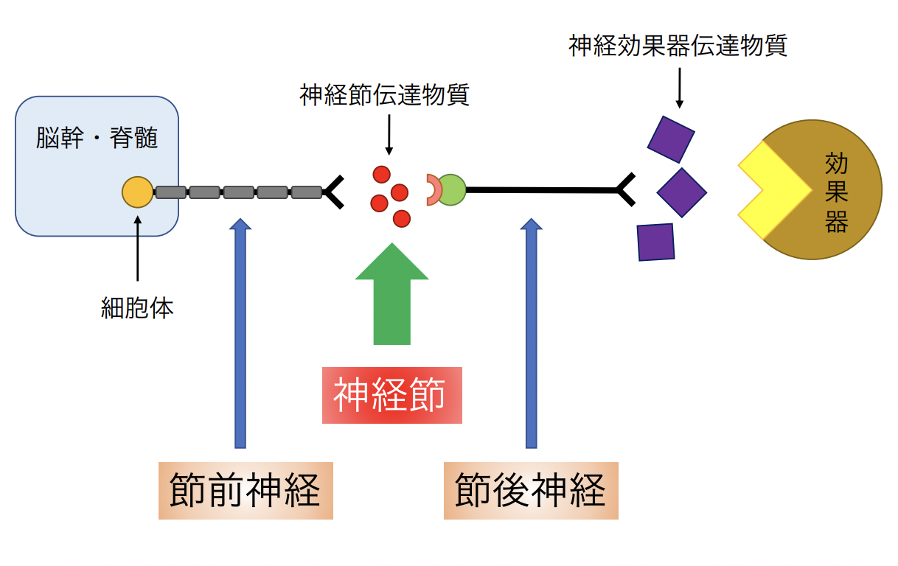
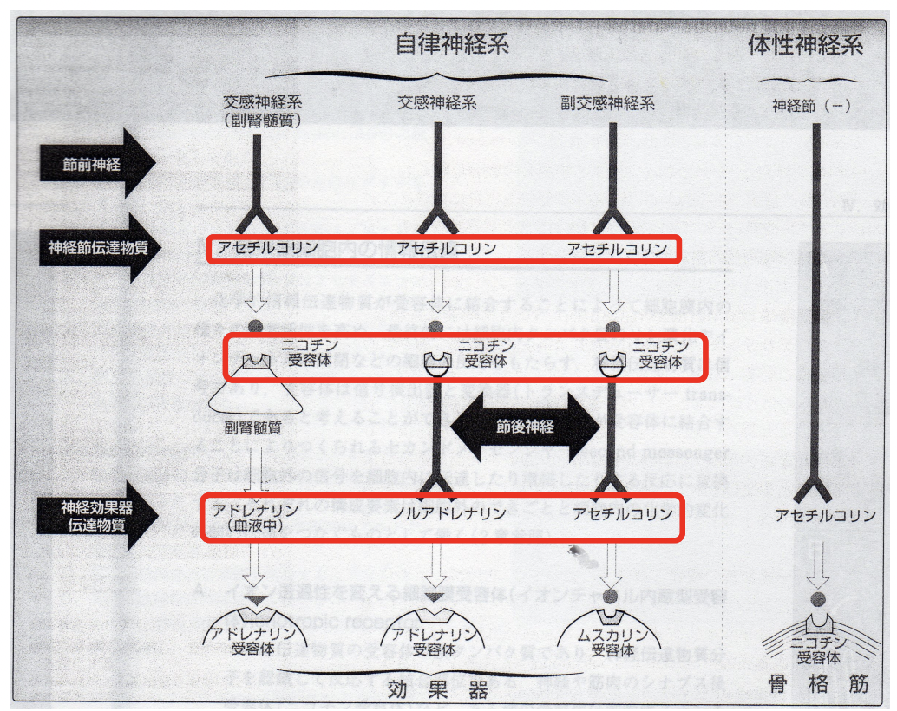
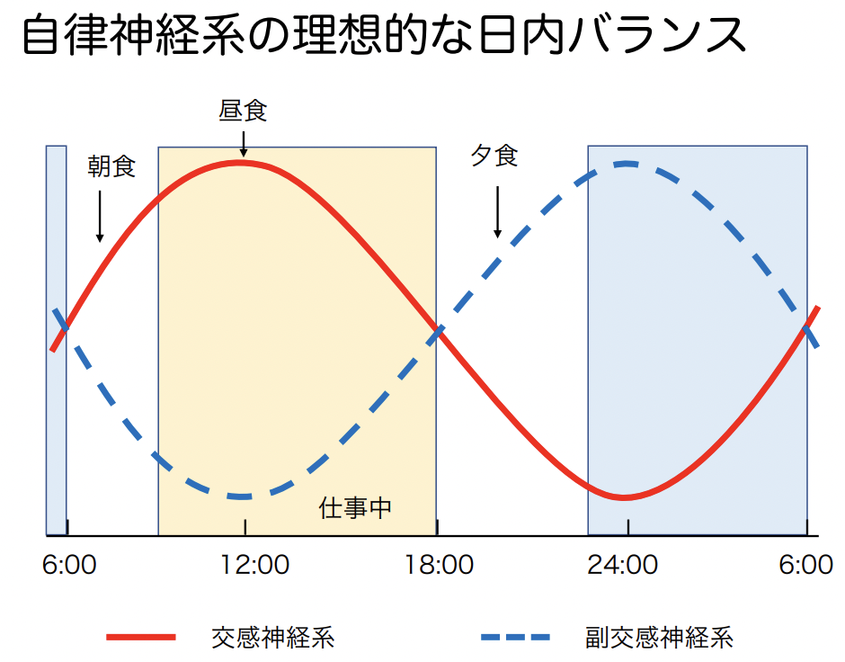
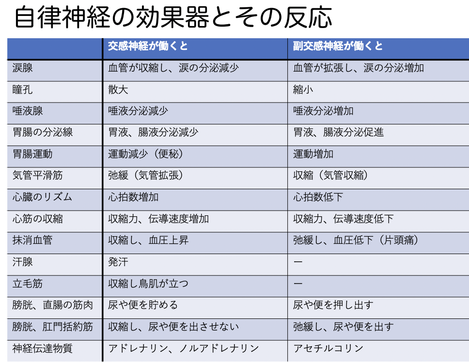
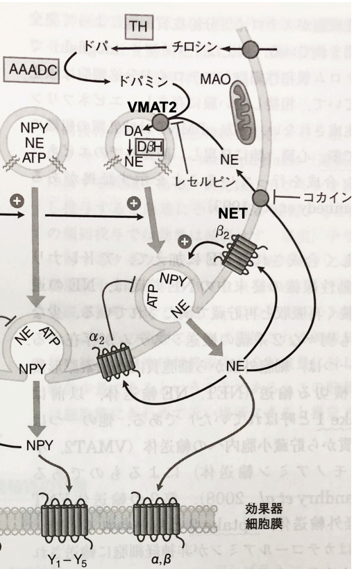
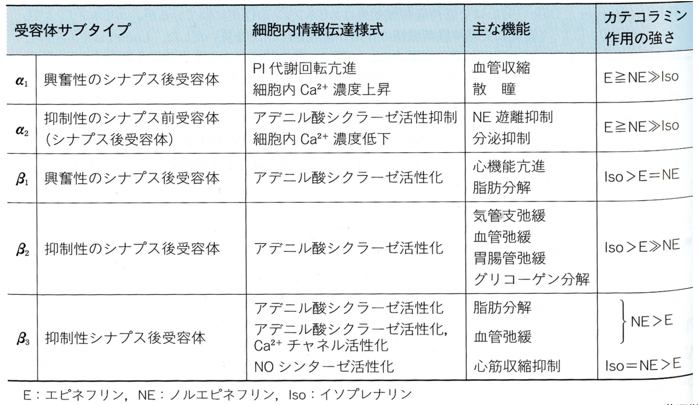
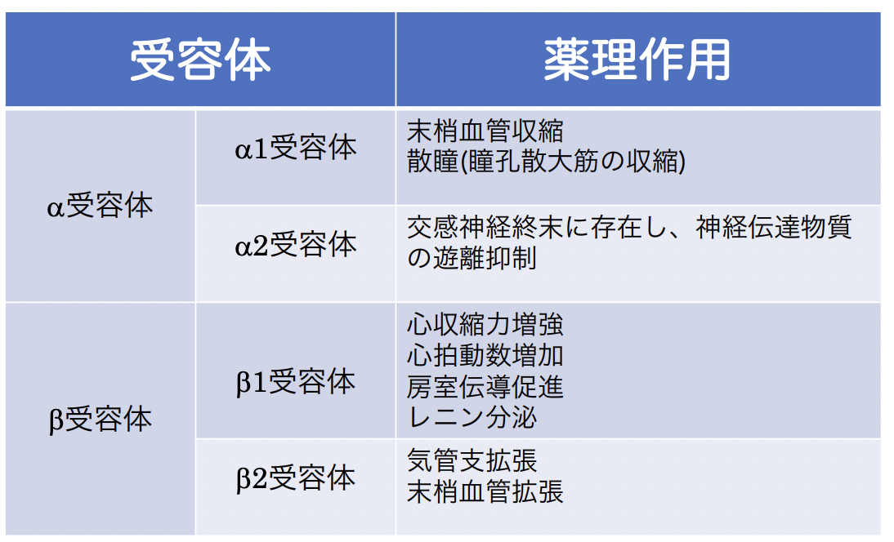
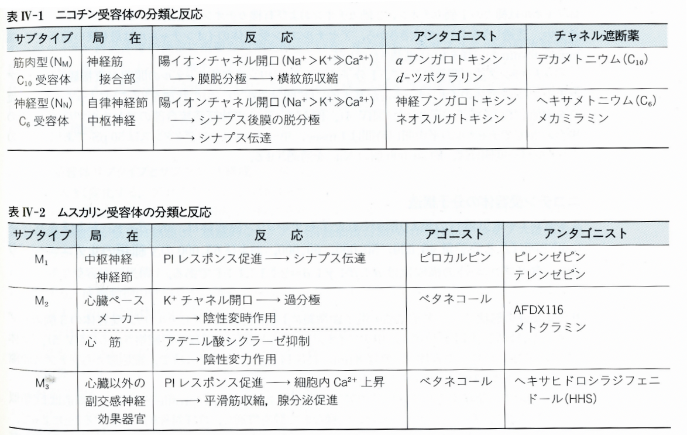
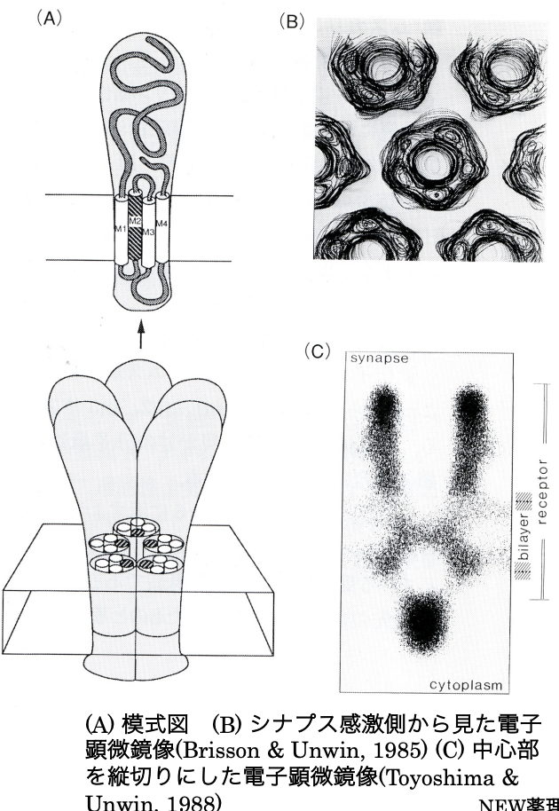

# 0909 自律神経
- 神経系
  - **中枢神経系**
  - **末梢神経系**
    - **体性神経系**
      - **運動神経（遠心性）**
      -**知覚神経（求心性）**
    - **自律神経系**
      - **自律神経（遠心性）**
        - **交感神経**
        - **副交感神経**
      - **内臓知覚神経（求心性）**

## 自律神経系
### 遠心性神経 efferent neuron
中枢神経系から２種類のタイプの遠心性神経(ニューロン、線維)によってインパルスを伝えている。1つ目のタイプが、**節前線維**であり、２つ目のタイプである**節後線維**と**神経節**を形成する。
### 求心性神経 afferent neuron
自律神経系の求心性神経は**反射**による自律神経系調節にとって重要な役割を担う。  
eg. **頸動脈洞**や**大動脈弓**で**血圧**を感知し、情報を中枢神経系へ送り、それに応じた遠心性神経活動に影響を与える。

### 神経節とは？

#### 自律神経系の神経伝達物質

### 交感神経系と副交感神経系の特徴まとめ
|                    | 交感神経系                       | 副交感神経系                     | 
| ------------------ | -------------------------------- | -------------------------------- | 
| 起点               | 胸髄〜腰髄                       | 脳幹と仙髄                       | 
| 神経線維の長さ     | 節前線維：短い 節後線維：長い | 節前線維：長い 節後線維：短い | 
| 髄鞘の有無         | 節前線維：有髄 節後線維：無髄 | 節前線維：有髄 節後線維：無髄 | 
| 神経節の位置       | 脊髄近傍                         | 効果器上 or 近傍                 | 
| 節前線維分岐の程度 | 非常に多い                       | 最小限                           | 
| 分布               | 広範性                           | 限局性                           | 
| 応答の様式         | 拡散性                           | 個別性                           | 

### 自律神経系の臓器支配
#### 交感神経
節前神経は**第1〜3胸髄 or 第4腰髄の前根**から出て、**脊柱の両側の交感神経幹にある椎骨神経節**にて節後神経とシナプスを作る。一部は**神経叢**を作り、**腹腔神経節や上・下腸間膜神経節**にて**ニューロンを変える**。節後線維は**直接**or**血管周囲神経叢**を通って効果器へ分布する。

#### 副交感神経
節前神経の様式によって2つに分かれる。  
- **頭部遠心**性副交感神経：**迷走神経背側核 or 下唾液核 or 上唾液核 or 動眼神経核**から出て、**迷走神経**を通ると**胸腹部**へ、**舌咽神経 or 顔面神経 or 動眼神経**を通ると**頭部**へ分布する。  
- **仙部遠心**性副交感神経：**骨盤臓器**は**第2~4仙随**の支配を受ける。

### 交感神経系の機能
1. 交感神経刺激効果  
   ➡︎ 交感神経刺激効果は**心拍数や血圧を上昇**させ、体内のエネルギーを動員し、**皮膚や内臓**への血流を減少させる一方、**骨格筋や心臓**への血流を増やす。交感神経の刺激は、**瞳孔拡大（散瞳）**と**細気管支の拡張**をもたらす。
2. 闘争・迷走反応  
   ➡︎緊急時に見られる体の変化。**交感神経**による**効果器の直接の活性化**と**副腎髄質の刺激**による**アドレナリンや少量のノルアドレナリンの放出**により引き起こされる。これらのホルモンは血流中に入り、**アドレナリン受容体を有する効果器**で反応を引き起こす。交感神経系は**一体**で機能する傾向があり、激しい運動中や恐怖に対しては、しばしば**交感神経系全体として発火**する。

### 副交感神経系の機能
1. **ホメオスタシスの維持**  
   ➡︎副交感神経系は、**消化**や**老廃物の排泄**など人体に必須の機能を維持している。しばしば交感神経系の作用と逆、あるいは拮抗する作用を発揮し、“休息・消化”の状況において交感神経系を一般的に凌駕する。
2. 個別での作用  
   ➡︎副交感神経系は**一体となって機能せず、全体的に発火することはない**。また、交感神経と異なり、**個々の副交感神経線維が別々に活性化**し、特定の個別の器官で働くようになる。  

 ### 自律神経系による支配の特徴
- **二重**支配   
  ➡︎体内のほとんどの器官は交感神経系と副交感神経系によって二重に支配されている。  
  - 例外）交感神経の支配のみを受ける部位：**副腎髄質**、**瞳孔散大筋**、**大部分の血管**、**腎臓**、**立毛筋**、**汗腺**  
  - 例外）副交感神経の支配のみを受ける部位：**血管内皮**、**鼻咽頭腺**
- **拮抗支配**  
  ➡︎交感神経系と副交感神経系の臓器への作用は一般的に拮抗的に働く。
  
  
  

## 神経伝達物質
神経伝達物質とは、**神経細胞間 or 神経細胞-効果器間**の伝達を担う**化学**物質のことである。  
**神経終末への活動電位の到達**による**脱分極**により、**細胞内Ca2+**が**増加**する。これにより**シナプス小胞**が**シナプス前膜と融合**し、**その内容物**が**シナプス間隙**に放出される。放出された神経伝達物質は、**シナプス後受容体 or 特定の受容体**に結合する。

### 交感神経伝達物質
交感神経伝達物質：主に**ノルアドレナリン**。（※例外：**副腎髄質**では**アドレナリン**が働く。）  
いずれも**カテコールアミン**の一種で、**チロシン**を原料として合成され、**アドレナリン**受容体に結合する。　　
アドレナリンは**副腎髄質**にて、ノルアドレナリンは**中枢神経系のノルアドレナリン神経と副腎髄質**にて、合成・分泌される。

### 交感神経終末におけるノルアドレナリンの合成・貯蔵・遊離・代謝
1. **チロシン**が、**Na+-アミノ酸共輸送体**である**アミノ酸トランスポーター**を介して**シナプス間隙**から**能動**的に輸送される。
2. 取り込まれたチロシンは、**チロシン水酸化酵素(TH)**により**L-ドパ**に変換された後、**芳香族L-アミノ酸脱炭酸酵素(AAADC)**により**ドパミン**に変換される。
3. **小胞性モノアミントランスポーター2(VMAT2)**により、**ドパミン**が**シナプス小胞**に輸送される。
4. **小胞内のドパミンb水酸化酵素(DbH)**により**ドパミン**が**ノルアドレナリン(図中ではNE)**に変換される。
5. シナプス間隙に放出されたノルアドレナリンは、**効果器上 or シナプス前膜のアドレナリン受容体**を**刺激**できる。
6. **ノルアドレナリン**による**シナプス前自己受容体の刺激**により、**ノルアドレナリンや共同伝達物質の放出**が抑制 or 促進される。
7. ノルアドレナリンがシナプスから除去される機序は、主に**ノルアドレナリントランスポーター**によって行われる。
8. 再取り込みされたノルアドレナリンは**小胞体に貯蔵**されるか、**モノアミンオキシダーゼ(MAO)**により**代謝**される。  
  
  

### アドレナリン受容体
**ヘテロ三量体Gタンパク質共役**型受容体。  
| 受容体分類 | 興奮性/抑制性？前/後？ | サブタイプ | 親和性を持つGタンパク質 | 細胞内情報伝達様式                                   | 主な機能                                                                         | 
| ---------- | ---------------------- | ---------- | ----------------------- | ---------------------------------------------------- | -------------------------------------------------------------------------------- | 
| α1        | 興奮性シナプス後受容体 | A, B, D    | Gq                      | PI代謝回転亢進 細胞内Ca2+濃度上昇                 | 血管、気管支、消化管、子宮、膀胱の平滑筋収縮 胃の括約筋弛緩 散瞳           | 
| α2        | 抑制性シナプス前受容体 | A, B, C    | Gi                      | AC活性抑制 細胞内Ca2+濃度低下                     | 交感神経終末にて神経伝達物質の分泌抑制                                           | 
| β1        | 興奮性シナプス後受容体 | -          | Gs                      | AC活性化                                             | 心拍数増加、心収縮力増大、房室伝導促進 腸管の括約筋弛緩 腎のレニン分泌促進 | 
| β2        | 抑制性シナプス後受容体 | -          | Gs                      | AC活性化                                             | 血管、気管支拡張 腸管の弛緩                                                   | 
| β3        | 抑制性シナプス後受容体 | -          | Gs                      | AC活性化 Ca2+チャネル活性化 NOシンターゼ活性化 | 脂肪分解促進                                                                     |   

アドレナリン作用性受容体のすべてのタイプにおいて、活性化に続く反応はセカンドメッセンジャー産生 ＆ イオンチャネルの活性化に対するGタンパク質の介在効果によってもたらされる。  

  

### ノルアドレナリンのアドレナリン受容体への親和性
- α作用：**強**い。**α1・α2受容体に対する作用は同程度**。
- β作用：**弱**い。**特に、β2受容体に対する作用は非常に弱い**。

### イソプロテレノール（イソプレナリン）のアドレナリン受容体への親和性
- α作用：**ほとんど発現しない**。
- β作用：**非選択的**で、その作用は**アドレナリン**より**強い**。**β1とβ2の作用はほぼ等しい**。

### アドレナリンの循環器系での薬理作用
- 心臓
  - **β1**受容体刺激による**心機能亢進**作用➡︎**血圧上昇**、**心拍数増大**、**拍出量増加**
- 血管
  - **α1**受容体による**血管収縮**作用と、**β2**受容体による**血管拡張**作用の両作用。中程度の用量では、**α1**作用により**皮膚・粘膜・腎臓やその他の内臓**の**血管**を**収縮**させるが、**β2**作用により**骨格筋や冠血管**を**拡張**させるため、**末梢血管抵抗**が**減少**する。通常、**少**量ではβ作用が、**多**量ではα作用が優位に現れる。
- 血圧
  - **β1**受容体による**心拍数・心拍出量増加**作用と、**α1**受容体による**血管収縮**作用が関与して、**収縮**期血圧が**上昇**する。しかし、**拡張**期血圧は、**β2**受容体による**骨格筋などの血管拡張**作用が関与して**末梢血管抵抗**が**減少**するため、**軽度**に**下降**する。そのため、平均血圧の変化は**ほとんど見られない**。ただ、大量投与時は**α1**作用が強く現れ、**収縮期・拡張期血圧共に上昇**し、**ノルアドレナリン**で見られるような**徐脈反射**が現れる。

### ノルアドレナリンの循環器系での薬理作用  
- 心臓
  - ノルアドレナリンの摘出心臓in vitroに対するβ作用は、アドレナリンより**やや弱いか同程度である**。一方、静脈投与in vivoでは**迷走反射**が大きく作動するため**心拍数低下**が発現する。
- 血管と血圧
  - 静注すると、**α1**受容体による**脳血管・冠動脈以外の血管**を強く**収縮**作用が見られる。**β2**受容体による作用はほとんど見られないため、**アドレナリン**使用時のような**血管拡張**作用はほとんど見られない。その結果、**末梢血管抵抗**が**増大**し、**収縮期/拡張期血圧の両方**が**上昇**する。これにより、**平均血圧**も**上昇**し、**迷走神経反射**が作動して**徐脈**が起こる。

### イソプロテレノール（イソプレナリン）の循環器系での薬理作用
- 心臓
  - **β1**受容体による非常に強い**陽性変力**(**心筋収縮力増大**)作用、**陽性変時**(**心拍数増大**)作用を示し、**心拍出量**が**増大**する。
- 血管と血圧
  - **β1**受容体による**心拍出量増大**作用により、**収縮期血圧**はやや**上昇**するが、**β2**受容体による**骨格筋や内臓などの血管**が**拡張**し、**末梢血管抵抗**は**減少**する。このため、**拡張期血圧**は**低下**し、この結果**平均血圧**は**下降**する。
- その他：アドレナリンのメチル基をイソプロピル基に置換した合成カテコラミンで、生体内に存在しない。

### ヒト循環系に対するアドレナリン作用薬の効果まとめ
#### ノルアドレナリンの反応
**α1**作用により、**末梢血管の収縮**->**末梢血管抵抗の上昇**->**収縮期/拡張期血圧の上昇**->**迷走神経反射**により**心拍の減少**。
### アドレナリンの反応
**β1**作用による**心拍出量増加**と**α1**作用による**血管収縮**により、**収縮期血圧**は**上昇**する。しかし、**β2**作用による**骨格筋などの血管拡張**作用で**末梢血管抵抗が減少**するので、**拡張期血圧は軽度に下降する**。このため、**平均血圧の変化はほとんど見られない**が、**心肺蘇生**時のように**大**量にアドレナリンを投与すると**α**作用が強く現れ、**収縮期血圧、拡張期血圧共に上昇する**。
#### イソプレナリン(イソプロテレノール)の反応
b1作用により心機能が亢進し、心拍数が増加する。b2作用により末梢血管が拡張し、末梢血管抵抗が減少するため、拡張期血圧は下降する。

# 副交感神経系
## アセチルコリン(ACh)の合成・貯蔵・遊離・代謝
1. Na+依存性輸送体経由でコリンが取り込まれる。
2. ミトコンドリア由来のアセチルCoAとコリンからAChが合成される。
3. AChは貯蔵小胞へ輸送される。
4. 瘤状構造物の分極により電位依存性Ca2+チャネルを通してCa2+が流入する。
5. Ca2+が小胞膜と細胞膜の融合を促進し、AChの開口分泌が起こる。
6. 分泌されたAChは効果器の受容体と結合し特異的な応答を起こす。
7. AChは自身の遊離調節をするため、シナプス前受容体に作用する。
8. AChはシナプス膜に結合しているアセチルコリンエステラーゼ(AChE)によってコリンと酢酸に代謝される。
  
の合成_貯蔵_遊離_代謝.png)  

## アセチルコリン受容体
ニコチン受容体とムスカリン受容体に分けられる。  

### ニコチン受容体
⾃律神経節や運動神経終末に存在する。  
サブタイプは2つある。
- NN(Nicotinic Neuronal):神経節
- NM(Nicotinic Muscle):神経-筋接合部  

**イオンチャネル**型受容体である。  
陽イオン(Na+)チャネルを開⼝する。Na+イオンの流⼊と同時にK+の流出が起こる。
• a、b、g、およびdの４種類のサブユ
ニットからなり、各サブユニットの構
成⽐は
a : b : g : d=2:1:1:1である。
• それぞれのサブユニットは４回膜貫通
型である。
  
### ムスカリン受容体
副交感神経効果器官、神経節、中枢神経に存在する。
• サブタイプは、M1、M2、M3の３種類ある。
• Gタンパク質共役型受容体である。
• ７回膜貫通型受容体である。
• ムスカリン受容体はGタンパク質を介して以下のよう
な細胞内反応を起こす。
Ø 細胞内Ca2+濃度の上昇：イノシトール三リン酸の
生成を介して起こる。
Ø アデニル酸シクラーゼ抑制：Gi/0を介してアデニル
酸シクラーゼと負の共役を行っていることによる。
Ø 膜イオン透過性変化：細胞膜のイオン透過性を変化
させて、細胞興奮性を調節している。心臓ではK+
チャネルの開口を引き起こし、心臓のペースメー
カー細胞における陰性変時作用はK+透過性上昇に
よる分極によって起こる。

## コリン作動薬
コリン作動薬はコリン作動神経の興奮効果を示す薬物グループを意味す
る。従って、副交感神経興奮薬とは必ずしも同義語ではない。（運動神経
もコリン作動性神経であるため。）
1) 直接型コリン作動薬：AChのムスカリン様受容体に直接結合して作用
を表すもの。
a. コリンエステル類：ACh、メタコリン、カルバコール、ベタネコール
b. 天然アルカロイド類：ムスカリン、ピロカルピン
2) 間接型コリン作動薬：AChの分解に寄与するコリンエステラーゼを阻
害し、シナプス間伱のACh濃度を高める結果、ACh作用を発現するもの。
a. 可逆的コリンエステラーゼ阻害薬：フィゾスチグミン、ネオスチグミ
ン、エドロホニウム、ピリドスチグミン、ジスチグミン
b. 非可逆的コリンエステラーゼ阻害薬：エコチオバート、殺虫剤(マラチ
オン、パラチオン)、神経性毒ガス(サリン、タブン)

### コリン作動薬の薬理作用
• 心血管系：心拍数の減少、血管拡張、低血圧
• 消化器系：消化管の蠕動運動亢進
• 瞳孔：縮瞳（瞳孔括約筋の収縮）
• 腺分泌：唾液腺、汗腺などの分泌亢進   
cf. 地下鉄サリン事件

### ChE再賦活薬(有機リン中毒治療薬)
有機リン酸化合物(農薬など)の中毒時は、コリンエステラーゼ阻害薬の過剰投与で起こる。末梢のムスカリン様とニコチン様作用の過剰症状および中枢性のムスカリン受容体刺激症状(縮瞳、視力障害、運動機能抑制、昏睡など)が発現する。最終的には呼吸麻痺で死亡する。  
この治療法としては以下の二つが挙げられる。
- アトロピンの大量投与：有機リン化合物のムスカリン様作用、ニコチン様作用に拮抗させるため。
- プラリドキシム(PAM)などのChE再賦活薬の処置：有機リン
を除去するため。

## MCQ1
Q. 自律神経系の説明として正しいのはどれか？
1. 求心性ニューロンは、中枢神経系からのシグナルを受容体へ伝える。
2. 副交感神経節での神経伝達物質はノルアドレナリンである。
3. 交感神経節での神経伝達物質はアセチルコリンである。
4. 交感神経のニューロンは、効果器にアセチルコリンンを放出する。
5. 副交感神経のニューロンは、効果器にノルアドレナリンを放出する。  

A. 3  
1は、×求心性➡︎◯遠心性 
2は、×ノルアドレナリン➡︎◯アセチルコリン

## MCQ2
Q. ライオンに襲われた人の生理学的変化として適当なものはどれ？
1. 涙分泌量の増加
2. 瞳孔の縮小(縮瞳)
3. 心拍数の増加
4. 胃運動の活性化
5. 血圧の低下  
  
A. 3

## MCQ3
Q. 交感神経系・副交感神経系について正しい記述を選べ。
1. アセチルコリンは、ムスカリン受容体を活性化させる。
2. アセチルコリンは、アドレナリン受容体を活性化させる。
3. ノルアドレナリンは、ムスカリン受容体を活性化させる。
4. 交感神経系の活性化は、血圧低下を引き起こす。
5. 交感神経系の活性化は、下痢を引き起こす。  
  
A. 1