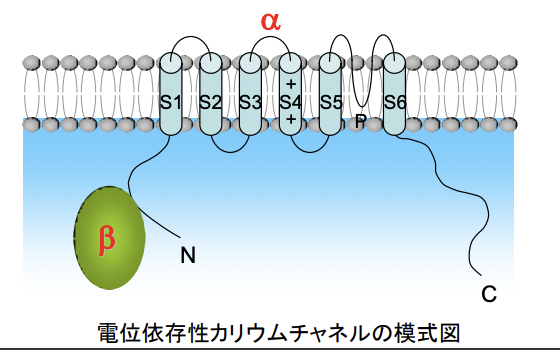

# 0909 イオンチャネルとトランスポーター
## 出席確認のための設問
1. イオンチャネルによる輸送についてまとめよ。（ポイント：①輸送様式 ②選別方法）
2. トランスポーターによる輸送についてまとめよ。（ポイント：①輸送様式 ②選別方法 ③輸送できる物質）
3. チャネルとトランスポーターによる輸送においての相違点を列挙せよ （３個以上） 。

## 膜輸送タンパク質における背景
• イオンチャネルやトランスポーターは細胞内外のイオンや細胞
生存などに関わる物質の濃度などの細胞環境の制御におい
て重要な役割を有する
• この調節機構が破綻すると様々な疾患が引き起こされてしま
う
• これまでにイオンチャネルをはじめとした膜輸送を担う分子を
標的とした様々な薬物が開発されている
• トランスポーターの一部は薬物の輸送に用いられる
### 人体を構成する主要元素重量比
  

## 脂質二重膜の透過性
透過性大  
- 疎水性分子：O2, CO2, N2, ベンゼン
- 小型で電荷をもたない極性分子：H2O, 尿素, グリセロール
- 大型で電荷をもたない極性分子：グルコース、スクロース
- イオン  
透過性小

### 脂質やイオンの膜輸送様式
- 単純拡散
- イオンチャネル：受動輸送
- トランスポーター：受動輸送も能動輸送もある。

### 哺乳類細胞の内外のイオン濃度
  
細胞の内外で**イオン濃度勾配**が存在し、その変化が情報シグナルとして機能する。

# イオンチャネル
イオンチャネルとは、細胞膜や細胞内膜系などの脂質二重膜に存在するイオンを透過させる役割を持つ膜タンパク質のことである。  脂質二重膜はイオンをほとんど透過しないため、イオンを膜の内外に透過させるために生体機能に必須となる。  
バクテリアから高等動物まで、あらゆる細胞に発現しており、濃度と電位の勾配に従ってイオンをイオン透過路（ポア）を通らせることで、流出入させる。  
ポアに存在するイオン選択性フィルターにより、通ることのできるイオンの種類、あるいは大きさが決まっている。  

## イオンチャネルの種類
- Na+チャネル：[Na+]は細胞外の方が高い。Na＋が流入することで、膜を脱分極させる。
- Ca2+チャネル：[Ca2+]は細胞外の方が高い。Ca2+が流入することで、多様な細胞機能が誘導される。
- K+チャネル：[K+]は細胞内の方が高い。K+が流出することで、膜が過分極する。
- Cl-チャネル：Cl-が流入することで、膜が過分極する。

## イオンチャネルの開閉
### イオン選択性フィルター
イオン選択性フィルターとは、目的のイオンだけを選択的に通過させるためのフィルター構造のことである。  
イオンの選択性は以下を指標としている。
- ポアの径の物理的大きさ  
  - カリウムイオン：直径1.33 Å、
  - ナトリウムイオン：0.95 Å 
  - cf. Å ：10−10 m = 0.1 nm
- ポア周辺の電荷をもつアミノ酸の配置
  
  

### 構造変化によるイオンチャネルの開閉
1. Blocking particleによる開閉制御
2. 構造変化による開閉制御

#### イオンチャネル開閉のコントロール
1. リガンド依存性
2. 電位依存性
3. 機械刺激依存性

## Na+チャネル
p20の赤い表はいらない。
### ナトリウムイオンの役割
1. 神経細胞や筋細胞の興奮（活動電位の発生）
2. 上皮細胞の水輸送や腺分泌
3. 細胞外液量や浸透圧の調整
### Na+チャネルの特徴
ナトリウムチャネルは高い選択性を持ってナトリウムイオンを透過させるイオンチャネルである。ナトリウムチャネルは細胞外に最も多い陽イオンであるナトリウムイオンを透過させ、大きな内向き電流を生じ脱分極を引き起こす。
### Na+チャネルの種類
Na+チャネルには、電位依存性ナトリウムチャネルとアミロライド感受性（上皮性）ナトリウムチャネルが存在する。
#### 電位依存性Na+チャネル
α, β1, β2のサブユニットからなる。  
αサブユニットは6回膜貫通タンパクであり、ポアを形成する。具体的には、膜貫通へリックス1-4が膜電位を感知し、ヘリックス5-6がポアを形成する。  
βサブユニットがチャネルの活性化、不活性化の速度を調節する。  

  
静止膜電位は-70mVであり、電位依存性Na+チャネルは自動的な不活性化機構を有する。  
以下、活動電位伝導の機序。
1. Na+チャネルが開き、 Na+が流入
2. Na+の流入によりチャネル周囲の膜電位が変化
3. 電位変化によって隣接するチャネルが開口
4. それまで開口していたチャネルは自動的に不活性化状態へ移行
5. 1～4を繰り返すことで一定の向きにシグナルが伝達
  

#### アミロライド感受性（上皮性）Na+チャネル
K+保持性利尿薬アミロライドによって阻害される電位非依存性のNa+チャネルである。  
アミロライド感受性（上皮性）Na+チャネルは以下に分けられる。
- ENaC 上皮性：上皮細胞や内皮細胞などに発現する。腎遠位尿細管、大腸上皮、気道上皮などにおいては、Na+の吸収に関わる。
- BNaC 脳型：脳や神経細胞に分布する。    

  

- 遺伝子変異による機能亢進➡︎食塩感受性高血圧症（Liddle症候群）
  - ナトリウム吸収の促進により循環血流が増え、高血圧になるため。
- 遺伝子変異による機能低下➡︎高カリウム血症性アシドーシスを伴うNaCl喪失  
  - 腎遠位尿細管がNa+再吸収不全をきたし、低ナトリウム血症、高カリウム血症、代謝性アシドーシスを呈する。

### Na+チャネルまとめ

### Na+チャネルに作用する薬剤・毒素
  

### Na+チャネルを標的とした不整脈薬

# K+チャネル
基本的にK+チャネルは、K+を選択的に細胞内から細胞外へと透過させる。  
静止膜電位の形成や電気的な細胞応答、シナプス伝達やカリウム濃度の恒常性維持に関わる。  
K+チャネルは、K+以外の一価の陽イオン（Li+やNa+など）もわずかに通過させてしまう
cf. 一価の陽イオンの大きさ：`K+ > Rb+ > Cs+ > Na+ >Li+`
## K+チャネルの構造と分類
1. 内向き整流性K+チャネル
2. Two-pore domain K+チャネル
3. 電位依存性K+チャネル
4. Ca2+活性化K+チャネル  

### 電位依存性カリウムチャネル
1-12までのサブクラスが存在（Kv1～Kv12）。   
さらに、40種類程度のサブファミリーも見つかっており、全てで40種類程度同定されている（Kv1.1-1.8、Kv2.1-2.2、Kv3.1-3.4、Kv4.1-4.3、Kv5.1、・・・Kv12.3）。  
脱分極によって活性化し、細胞内のK+を細胞外に放出する。  
チャネルを形成する6回膜貫通型のαサブユニットと細胞内のβサブユニットから構成されるものが多い（βサブユニットを持たないものもある）。  
  
  

活性化の違いに準じて、以下の二つのタイプに分けられる。  
- 早期不活性化K+チャネル：脱分極刺激による活性化後すぐに不活性化され、一過的な電流を流す。
- 遅延整流性K+チャネル：不活性化が殆どおこらず活性化が持続する。

黒ライドチャネルの種類：不要