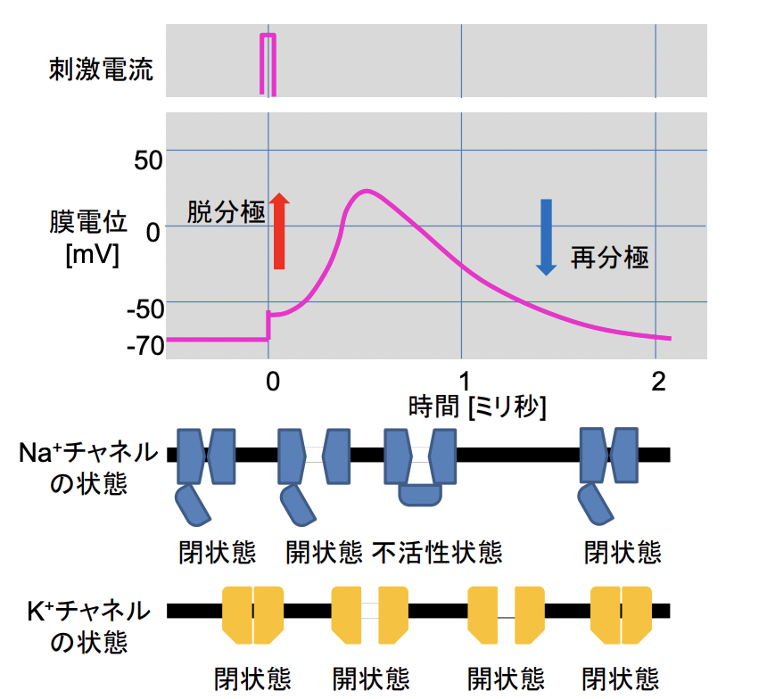

# 0909 イオンチャネルとトランスポーター
## 出席確認のための設問
1. イオンチャネルによる輸送についてまとめよ。（ポイント：①輸送様式 ②選別方法）
2. トランスポーターによる輸送についてまとめよ。（ポイント：①輸送様式 ②選別方法 ③輸送できる物質）
3. チャネルとトランスポーターによる輸送においての相違点を列挙せよ （３個以上） 。

## 膜輸送タンパク質における背景
イオンチャネルやトランスポーターは、細胞内外のイオンや細胞生存などに関わる物質の濃度などの細胞環境の制御において重要な役割を有する。この調節機構が破綻すると様々な疾患が引き起こされてしまう。これまでにイオンチャネルをはじめとした膜輸送を担う分子を標的とした様々な薬物が開発されている。トランスポーターの一部は薬物の輸送に用いられる。

## 人体を構成する主要元素重量比
  

## 脂質二重膜の透過性
↑ 透過性大  
- **疎水性**分子：**O2**, **CO2**, **N2**, **ベンゼン**
- **小型で電荷をもたない極性**分子：**H2O**, **尿素**, **グリセロール**
- **大型で電荷をもたない極性**分子：**グルコース**, **スクロース**
- **イオン**  

↓ 透過性小

### 脂質やイオンの膜輸送様式
- 単純拡散
- イオンチャネル：受動輸送
- トランスポーター：**受動輸送も能動輸送もある**。

### 哺乳類細胞の内外のイオン濃度
|      | 細胞内濃度（mM） | 細胞外濃度（mM） | 
| ---- | ---------------- | ---------------- | 
| Na+  | 5-15             | 145              | 
| K+   | 140              | 5                | 
| Mg2+ | 0.5              | 1-2              | 
| Ca2+ | 10^-4            | 1-2              | 
| H+   | 7 * 10^-5        | 4 * 10^-5        | 
| Cl-  | 5-15             | 110              |   

細胞の内外で**イオン濃度勾配**が存在し、その変化が**情報シグナル**として機能する。

# イオンチャネル
イオンチャネルとは、細胞膜や細胞内膜系などの脂質二重膜に存在するイオンを透過させる役割を持つ膜タンパク質のことである。脂質二重膜はイオンをほとんど透過しないため、イオンチャネルはイオンを膜の内外に透過させるために生体機能に必須となる。  
バクテリアから高等動物まで、あらゆる細胞に発現しており、**濃度と電位の勾配**に従ってイオンを**ポア**に通らせることで、流出入させる。  
**ポア**に存在する**イオン選択性フィルター**により、通ることのできるイオンの種類、あるいは大きさが決まっている。  

## イオンチャネルの種類
- Na+チャネル：[Na+]は細胞外の方が高い。Na＋が流入することで、膜を脱分極させる。
- Ca2+チャネル：[Ca2+]は細胞外の方が高い。Ca2+が流入することで、多様な細胞機能が誘導される。
- K+チャネル：[K+]は細胞内の方が高い。K+が流出することで、膜が過分極する。
- Cl-チャネル：Cl-が流入することで、膜が過分極する。

## イオンチャネルの開閉
### イオン選択性フィルター
イオン選択性フィルターとは、**目的のイオンだけを選択的に通過させるためのフィルター構造**のことである。  
イオンの選択性は以下を指標としている。
- **ポアの径の物理的大きさ**  
  - カリウムイオン：直径1.33 Å、
  - ナトリウムイオン：0.95 Å 
  - cf. Å ：10−10 m = 0.1 nm
- **ポア周辺の電荷をもつアミノ酸の配置**
  
  

### 構造変化によるイオンチャネルの開閉
1. **Blocking particle**による開閉制御
2. **構造変化**による開閉制御

#### イオンチャネル開閉のコントロール
1. **リガンド依存性**
2. **電位依存性**
3. **機械刺激依存性**

## Na+チャネル
### ナトリウムイオンの役割
1. **活動電位の発生**
2. **上皮細胞の水輸送や腺分泌**
3. **細胞外液量や浸透圧の調整**
### Na+チャネルの特徴
ナトリウムチャネルは高い選択性を持ってナトリウムイオンを透過させるイオンチャネルである。ナトリウムチャネルは細胞外に最も多い陽イオンであるナトリウムイオンを透過させ、大きな**内向き電流**を生じ脱分極を引き起こす。
### Na+チャネルの種類
- **電位依存性**Na+チャネル
- **アミロライド感受性（上皮性）**Na+チャネル
#### 電位依存性Na+チャネル
**α, β1, β2**のサブユニットからなる。  
αサブユニットは**6回膜貫通**タンパクであり、**ポアを形成する**。具体的には、**膜貫通へリックス1-4が膜電位を感知し、ヘリックス5-6がポアを形成する**。  
βサブユニットが**チャネルの活性化・不活性化の速度を調節する**。  

   

静止膜電位は **-70mV**であり、電位依存性Na+チャネルは**自動的な不活性化機構**を有する。  
以下、活動電位伝導の機序。
1. **Na+チャネルが開き、 Na+が流入**
2. **Na+の流入によりチャネル周囲の膜電位が変化**
3. **電位変化によって隣接するチャネルが開口**
4. **それまで開口していたチャネルは自動的に不活性化状態へ移行**
5. 1～4を繰り返すことで一定の向きにシグナルが伝達
  

#### アミロライド感受性（上皮性）Na+チャネル
**K+保持性利尿薬アミロライド**によって阻害される**電位非依存**性のNa+チャネルである。  
アミロライド感受性（上皮性）Na+チャネルは以下に分けられる。
- **ENaC 上皮性**：**上皮細胞**や**内皮細胞**などに分布する。**腎遠位尿細管**、**大腸上皮**、**気道上皮**などにおいては、**Na+の吸収**に関わる。
- **BNaC 脳型**：**脳**や**神経細胞**に分布する。    

  

- アミロライド感受性（上皮性）Na+チャネルに関連する疾患
  - **食塩感受性高血圧症**（**Liddle症候群**）
    - 機序：**遺伝子変異による機能亢進** -> **Na+吸収↑** -> **循環血流↑** -> **高血圧**。
  - **高カリウム血症性アシドーシス**を伴う**NaCl喪失**
    - **遺伝子変異による機能低下** -> **腎遠位尿細管にてNa+再吸収不全** -> **低ナトリウム血症・高カリウム血症・代謝性アシドーシス**。
### Na+チャネルまとめ

### Na+チャネルに作用する薬剤・毒素
- Na+の通過阻害
  - **テトロドトキシン**
  - サキシトキシン
  - μコノトキシン
- Naチャネルの活性化延長（活動電位持続時間の延長）
  - バトラコトキシン
  - アコニチン
  - αサソリ毒
- Na+流入増加
  - ブレべトキシン
  - シガトキシン
- Na+遮断 / 活動電位の立上がり抑制 / 活動電位持続時間の短縮 / 不活性化状態からの回復延長 など
  - **プロカインアミド**
  - **リドカイン**
  - **フェニトイン**
  - **カルバマゼピン**

### Na+チャネルを標的とした不整脈薬
- **Ia**分類
  - 作用機序：**活動電位時間延長**
  - 薬剤：**キニジン**、**プロカインアミド**、ジソピラミド
- **Ib**分類
  - 作用機序：**活動電位時間短縮**
  - 薬剤：**リドカイン**、メキシレチン
- **Ic**分類
  - 作用機序：**活動電位時間不変**
  - 薬剤：フレカイニド、ピルシカイニド

# K+チャネル
基本的にK+チャネルは、K+を選択的に細胞内から細胞外へと透過させる。  
**静止膜電位の形成**や**電気的な細胞応答**、**シナプス伝達**やカリウム濃度の恒常性維持に関わる。  
K+チャネルは、**K+以外の一価の陽イオン（Li+やNa+など）**もわずかにつうかさせてしまう。  
cf. 一価の陽イオンの大きさ：`K+ > Rb+ > Cs+ > Na+ >Li+`
## K+チャネルの構造と分類
1. **内向き整流性**K+チャネル
2. **Two-pore domain** K+チャネル
3. **電位依存性**K+チャネル
4. **Ca2+活性化**K+チャネル  

### 電位依存性カリウムチャネル
**1-12**までのサブクラスが存在（Kv1～Kv12）。   
さらにサブファミリーも見つかっており、全てで**40**種類程度同定されている（Kv1.1-1.8、Kv2.1-2.2、Kv3.1-3.4、Kv4.1-4.3、Kv5.1、・・・Kv12.3）。  
**脱分極**によって活性化し、細胞**内**のK+を細胞**外**に放出する。  
**チャネルを形成する6回膜貫通型のαサブユニット**と**細胞内のβサブユニット**から構成されるものが多い（βサブユニットを持たないものもある）。  
  
  

活性化の違いに準じて、以下の二つのタイプに分けられる。  
- **早期不活性化**K+チャネル：**脱分極刺激による活性化後すぐに不活性化され、一過的な電流を流す**。
- **遅延整流性**K+チャネル：**不活性化が殆どおこらず活性化が持続する**。

### K+チャネルの開閉と膜電位
K+チャネルは、**活動電位の持続時間**と**発火頻度**を制御している。  
  
  

### サブユニットによるKv1チャネルの機能調節
**Kvβ2**は**自己抑制機構**を備えた**Kv1.4**チャネルの**不活性化**を促進する。  
  
  

### 他のカリウムチャネル
- カルシウム活性化K+チャネル
  - **細胞内のCa2+の濃度上昇**によって活性化されるカリウムチャネル。
  - **神経細胞**において**活動電位後過分極の形成**に関与する。
- Two-pore domain K+チャネル
  - 構造：**2回膜貫通領域 + ポアP領域**
  - 基本的には**常にチャネルが開いており**、K+は**濃度勾配に従って外へと漏れ出てしまう**。
  - **静止膜電位の形成**や**膜抵抗の決定**に関与する。
- 内向き整流性K+チャネル
  - **膜が過分極した**時に開口し、K+を**流入**させる唯一の**内向き**チャネル。
  - **Gタンパク質活性化**K+チャネル（**三量体Gタンパク質と結合**する）と**ATP感受性**K+チャネル（**ATPに**よって活性が調節される）がある。

### K+チャネル関連薬と病態
| 一般名                                  | 分類             | 病態                 | 
| --------------------------------------- | ---------------- | -------------------- | 
| アミオダロン                            | K+チャネル遮断薬 | 不整脈               | 
| ニフェカラント                          | K+チャネル遮断薬 | 不整脈               | 
| ソタロール                              | K+チャネル遮断薬 | 不整脈               | 
| ニコランジル                            | K+チャネル開口薬 | 虚血性心疾患         | 
| ミノキシジル                            | K+チャネル開口薬 | 脱毛                 | 
| ハロタン                                | K+チャネル開口薬 | 吸入麻酔（販売停止） | 
| グリベンクラミド                        | K+チャネル阻害薬 | 2型糖尿病            | 
| トルブタミド                            | K+チャネル阻害薬 | 2型糖尿病            | 
| ナテグリニド                            | K+チャネル阻害薬 | 2型糖尿病            | 
| KGチャネル作用薬 （Gタンパク質制御） | アデノシン       | 発作性上室性頻脈     | 

# Ca2+チャネル
## Ca2+シグナル
細胞内Ca2＋はセカンドメッセンジャーとして働く。  
Ca2+濃度変化は、**筋収縮**・**ホルモンや神経伝達物質の放出**・**遺伝子転写**・**細胞の増殖や分化**といった、細胞生理機能の調節因子として重要。  
## Ca2+チャネル
- **細胞膜**上に存在する種
  - 性質：**電位依存性、リガンド依存性**
  - 機能：**細胞外のCa2+を細胞内に流入させる**。
- **小胞体膜**上に存在する種
  - 性質：**リガンド依存性**
  - 機能：**小胞体内に蓄積されたCa2+を細胞質へ放出する**。
### 電位依存性Ca2+チャネル
**4**つのサブユニット（**α1/α2δ/β/γ**）から構成される。  
**α1**サブユニットは、**ポアを形成し**、その特性により**5**種類に分類される。  
**α2δ/β/γ**サブユニットは、**α1サブユニットの発現調節機能調節や細胞内局在**に重要。   

### Ca2+放出チャネル
**小胞体内に蓄えられたCa2+を細胞質へと放出する**チャネル。
- eg. **リアノジン受容体**
  - **植物アルカロイドであるリアノジンが結合**することに由来する。
  - **Ca2＋**によって活性化され、**小胞体からのカルシウム誘発性カルシウム放出**を引き起こす。
- **イノシトール三リン酸（IP3)受容体**
  - **細胞膜上の受容体の活性化** -> **Gタンパク質を介して細胞内IP3濃度増加** -> **IP3がIP3受容体に結合** -> 小胞体内のCa2＋放出促進

# Cl-イオン
## Cl-の機能
- **膜電位の安定化や刺激に対する膜電位応答**
  - **K+**とともに**静止膜電位の安定化**に寄与。  
  - **活動電位発生**時には**再分極を速める**。
- **経上皮水輸送や腺分泌**  
  - **上皮細胞の水の吸収**や**膵液・汗の分泌**時には、**Na+**とともにCl-の**移動**が必要。
- **細胞体積**の変化
  - Cl-/**Na+** の流入 -> 細胞の体積**増大**
  - Cl-/**K+** の流出 -> 細胞の体積**減少**
## 細胞内Cl-の恒常性維持
  
## Cl-チャネル
基本的に輸送方法は、**受**動的な**透過**。  
**アニオン**（eg. **I-, Br−, F−**）や**アミノ酸アニオン**（eg. **NO3−, HCO3−, グルタミン酸, アスパラギン酸**）にも透過性を示すものが多い。  
  

## 他のイオンチャネル
### 1. **NMDA型グルタミン酸受容体**
**グルタミン酸結合**により活性化 -> **Na+, K+, Ca2+を通過させる**   
主に**中枢神経系**に発現し、**記憶・学習**に関わる。  
### 2. **TRP（Transient Receptor Potential）チャネル**
温度、機械刺激、浸透圧、痛み関連物質、フェロモン、酸・塩基、レドックスや刺激性化学物質など、様々な刺激で活性化 -> **Na+, K+を通過させる**。
### 3. **電位依存性プロトンチャネル**
**脳**や**筋**のイオンチャネルと一部類似の構造を示す。  
**膜電位と細胞内外のpH**を感知 -> **H+を選択的に通す**。

# トランスポーター
生体膜を貫通し、膜を通して特定の物質を輸送するタンパク質。  
輸送方法：**受動輸送** or **促進拡散** or **能動輸送**  
能動輸送の方法を取るものは、**細胞内外における濃度勾配を生み出す**役割も担っている。  
輸送方法：**物質が結合部位に結合** -> **可逆的な構造変化** -> 物質を膜の反対側に輸送
## チャネルとの相違点
1) **輸送対象**：トランスポーターは**イオン以外の物質も輸送する**。
2) **輸送法**
   1) トランスポーターは、**その特異的な結合部位に結合した分子のみ**を輸送する。
   2) トランスポーターは、**能動輸送もできる**。
3) **輸送量**：トランスポーターでは、**1回の輸送ごとに構造変化はリセットされ、チャネルのように開いた状態が継続されることはないため、一度の輸送で運ぶことのできる量は決まっている**。
## トランスポーターによる能動輸送方法
- **共役輸送**：**勾配に従って運ぶ別の物質の輸送と共役させる**。
- **ATP駆動ポンプ**：**ATPの加水分解と共役させる**。
- **光駆動ポンプ**：**光エネルギーの取り込みと共役させる**。  
## トランスポーターの種類
   
## イオントランスポーター
  
## Na+-K+-ATPアーゼの反応モデル  
  
## **モノアミン**トランスポーター
以下のようなモノアミントランスポーターを標的とした薬剤は、**抗鬱薬**や**ADHD治療薬**などに用いられる。
- **SSRI (Selective serotonin reuptake inhibitor)**
  - 機序：**セロトニントランスポーターに結合** -> **セロトニンの再取り込みを阻害** -> **シナプス間のセロトニン濃度を高める** -> **セロトニンシグナルの増強**
  - 用途：**抗うつ薬**
- **SNRI (Serotonin & Norepinephrine reuptake inhibitor）**
  - 機序：**シナプスにおけるセロトニン/ノルエピネフリンの再取り込み阻害** -> **シナプス間の濃度を高める**
  - 用途：新たな**抗うつ薬**

  

## 薬物トランスポーター  
**水溶性 or 脂溶性の低い**薬は、**細胞膜を透過できない**ため、トランスポータが必要。  
薬物トランスポーターは、**本来の内因性基質と構造的に類似した**薬物を輸送することができる。  
特に、**腸からの吸収**、**血中への輸送**、**腎臓・肝臓による排出**などにおいて機能している。  
- **一次性能動輸送**系
  - **ATPの加水分解によって生じるエネルギーを直接利用**して物質を輸送する。基本的に**細胞外への排出**を担う。
  - eg. **ABCトランスポーター ATP-binding cassette**
- **二次性能動輸送**系
  - **膜電位やイオン勾配を駆動力と**して物質を輸送する。**細胞内への取り込み**を担うが、**取り込みと排出の両方**を行うものもある。
  - eg. **SLCトランスポーター Solute carrier superfamily**
### 主な薬物トランスポーター
    
### 薬物トランスポーターによるベクトル輸送
  

