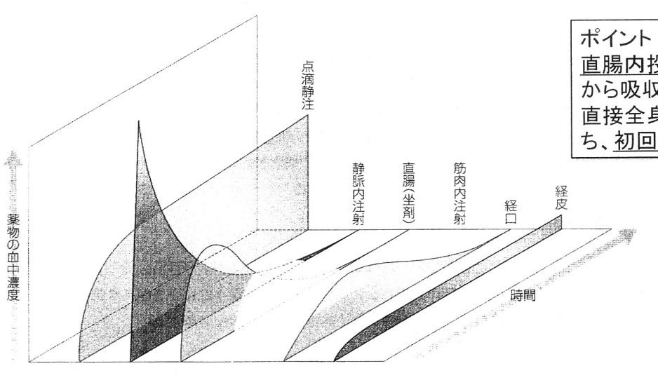
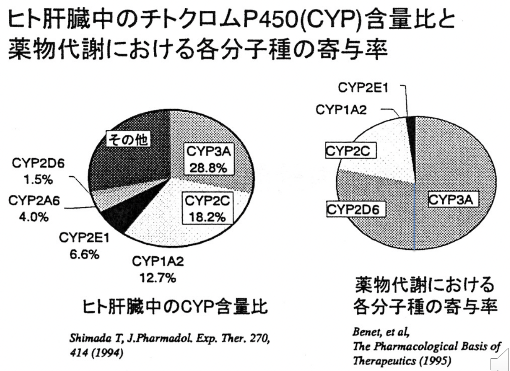
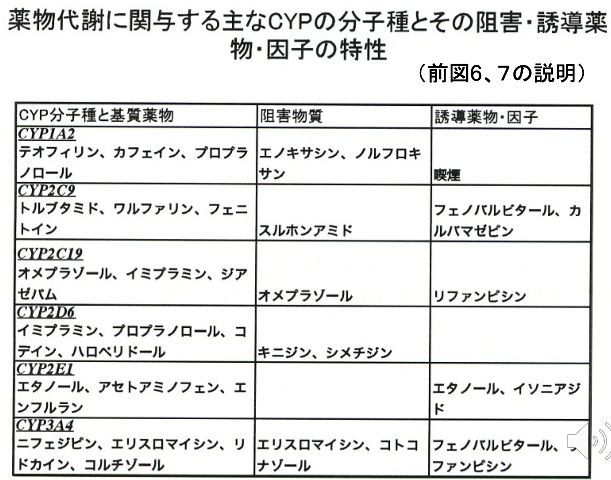
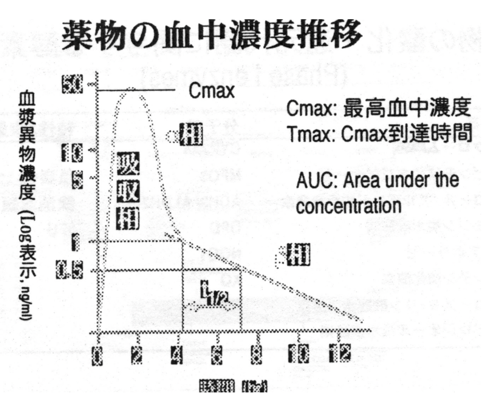
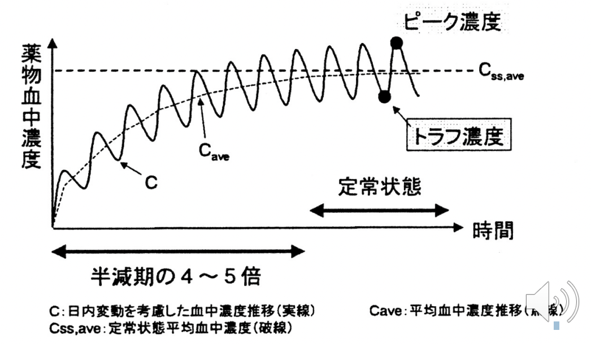
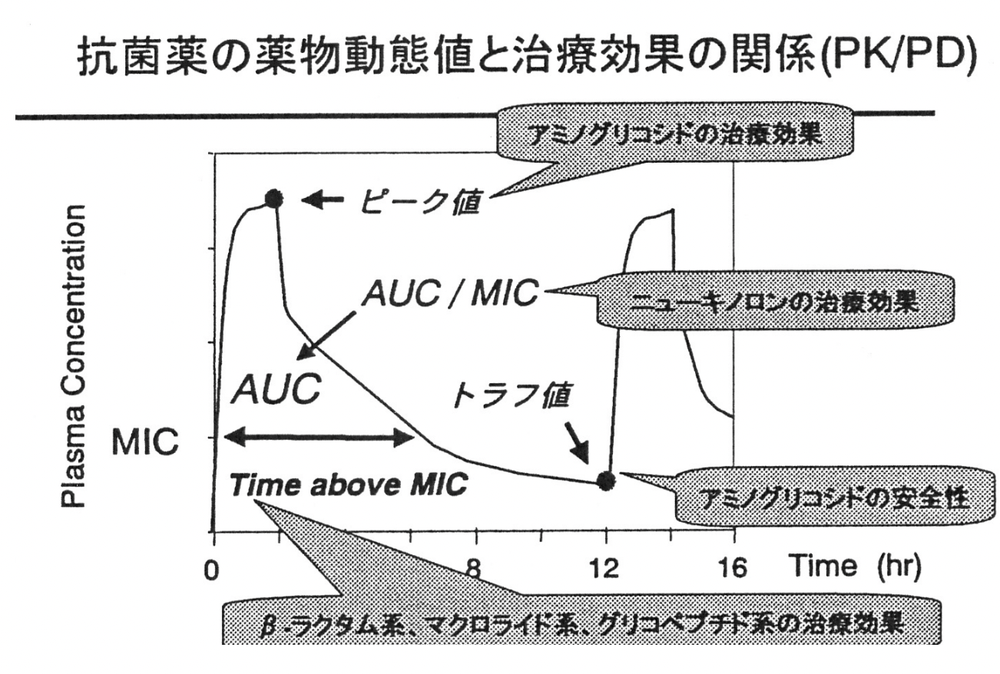
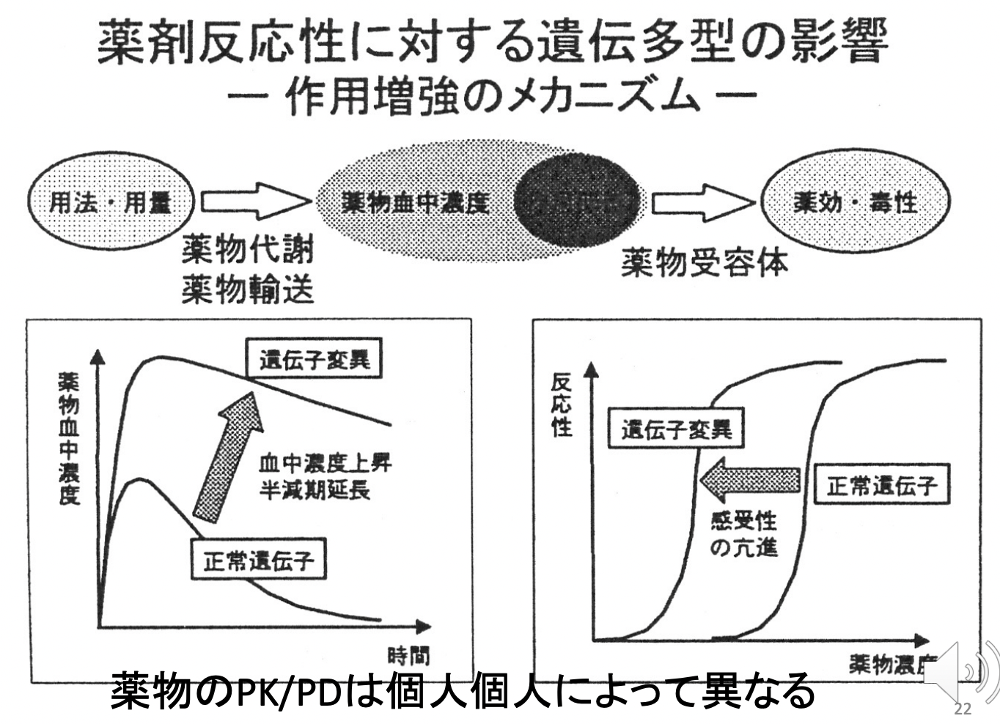

# 薬理学総論II 薬物動態I
## QUESTIONS
- 薬物動態の４相を挙げて概略を説明せよ
- First pass effect と Bioavailabilityを説明せよ
- Blood-Brain Barrierを説明せよ
- チトクロームP450（CYP）とは何か説明せよ
- 薬物動態における代謝の２相を説明せよ
- 薬物代謝酵素を通じた薬物相互作用が起こりやすいメカニズムと理由を述べよ
- 分布容積を説明し、いかなる場合にその概念が用いられるか説明せよ
- AUC、クリアランスを概念的に説明せよ
- 繰り返し投与の際、定常状態になる時間をその薬物の半減期との比較で示せ

## 薬物が適切な効果を示すために必要なポイント
- **十分量の標的へのデリバリー**
- **薬の有効な量の維持**
- **副作用の回避**

## 薬物動態 pharmacokinetics
**薬物が標的に到達し分解される過程**のことを言い、以下のステップからなる。
1. **吸収 Absorption**
2. **分布 distribution**
3. **代謝 Metabolism**
4. **排泄 Excretion**

## 薬物動態 pharmacokinetics と薬力学 pharmcodynamics
- 薬物動態 **PK**：**薬剤の体内動態（吸収、分布、代謝、排泄）**を研究する学問。
  - 横軸：**時間**
  - 縦軸：**濃度**
- 薬力学 **PD**：**薬剤の作用によっておこる生体の変化**を研究する学問。
  - 横軸：**濃度**
  - 縦軸：**反応**

## 薬物動態PKの概略
### 経口薬
経口薬の動向：**消化管** -> **門脈** -> **肝臓** -> **肝静脈** -> **下大静脈** -> **心臓** -> **動脈系** -> **ターゲット臓器** -> **腎臓** ->排泄  
血管内の薬物は、以下の2種類に分けられる。
- **結合型**薬物：**血漿タンパクに結合し、血管内で安定的に存在し、作用を示すことはない**。
- **遊離型**薬物：**血漿タンパクに結合せず、血管から各臓器へ移行し、作用を示す**。

### 腎臓からの排泄
水溶性薬物は、**腎臓からそのまま排泄されることが多い**。  
脂溶性薬物は、**肝臓にて代謝を受けて水溶化しないと排泄されない**。

### 肝臓代謝に関する2つのポイント
1. 肝臓代謝により、**活性化方向 or 不活性化方向に進む**。   
   -> **不活性化**方向に進むことが大半だが、**ロキソニン**など**活性化**方向に進むものも存在する。
2. **肝臓にて、初回通過効果を引き起こす**。  
   -> 肝臓で代謝されることで、**薬効が100%でなくなってしまう**。

## 経口投与時の薬物体内動態 Pharmacokinetics の詳細説明
経口で投与された薬物は、**消化管で吸収され**【1】、**門脈を経て肝臓に到達**し【2】、その後、**全身循環を経て、標的器官に到達**し【3】、薬効を発揮する。**肝臓に到達した薬物の一部は代謝を受け水溶化され**【4】、**循環を経て腎臓より排泄される**【5-1】。**一部は未変化体（水溶性）でそのまま腎臓から排泄される**【5-2】。

## 1. 吸収 Absorption
- 投与方法
  - **経口**
  - **注射** 
    - **静脈**
    - **皮下**
    - **筋肉内**
    - **動脈**
  - **座薬** 
    - **経肛門**
  - **皮膚** 
    - **経皮**
  - **舌下**
    
経口投与のみ、**門脈系を通り、肝臓にて代謝を受ける**。そのため、以下のよう経口投与に特有の利点・欠点がある。  
- 経口投与の利点
  - **簡便**
- 経口投与の欠点
  - **他の薬剤と比較すると薬効までに時間を要する**。   
  - **初回通過効果による薬効の減弱化**。  

cf. 何故、経口投与で吸収できない薬物が存在するのか？

### 吸収を作用する因子：**生理的障壁**の存在  
- **細胞膜通過**  
  -> 薬剤は、**受動拡散**によって細胞膜を通過する。**細胞間隙にはtight junctionが存在する**ので、細胞間を通過することは不可能であるからだ。細胞膜は脂質二重膜からなるため、**きわめて小さな疎水性**分子しか通過することはできない。  
- **粘液や消化管環境への曝露**  
  -> **胃**における**酸性環境**、**腸**における**アルカリ環境**に**耐えられなければならない**。

#### cf. 膜における輸送
- 受動輸送：膜内外の濃度勾配に従う。
  - **単純拡散**：**分子量が小さい親脂質**物質のみ。
  - **促進拡散**：**水溶性イオン**や分子量の大きい物質は膜輸送蛋白質であるチャネルやキャリア（トランスポーター）によって促進吸収される。
- 能動輸送：濃度勾配にさからって物質を輸送する。通常ATPのエネルギーを使う。
  - **単**輸送
  - **対向**輸送
  - **共**輸送

### 吸収に関与する薬物の物性
薬物は、主に**小腸**にて**単純拡散**方式で吸収される。  
※一部は**胃**や**大腸**にて吸収され、また**薬物トランスポーター**による吸収も見られる。   
- 【一般的原則】
  - 薬物の**脂溶性（非イオン型） / 水溶性（イオン型）**が重要。  
    -> 脂質二重膜を通過しなければならないため、脂溶性の高い薬剤の方が吸収されやすい。
- 薬物の**酸性 / 塩基性**が**吸収される消化管**を決定づける。　 

この一般的原則に乗っ取ると...  
- 弱酸性薬物
  - **胃（低pH）** にて、**非イオン型** -> **脂溶性** -> 吸収↑。
  - **腸（高pH）** にて、　**イオン型** -> **水溶性** -> 吸収↓。
- 弱塩基性薬物
  - **腸（高pH）** にて、**非イオン型** -> **脂溶性** -> 吸収↑。
  - **胃（低pH）** にて、　**イオン型** -> **水溶性** -> 吸収↓。　　

薬剤に多いのは、**弱塩基**性。  

Henderson-Hasselbalchの式   
```
Ka = [H+][A-] / [HA]
pKa = pH + log（[AH]/[A-]）
（Ka:酸解離定数）
```

### 経口以外の投与方法による吸収
吸収速度：**静脈内投与** > **直腸内投与** > **筋肉内投与** > **皮下投与** > **経口投与**  
持続性：**点滴静注** > **経皮** > **経口投与** > **皮下投与** > **筋肉内投与** > **直腸内投与**  
#### 注射
**速効**性が求められる場合に用いる。**消化管や肝臓で速やかに代謝される**薬物や**胃腸で吸収されない**薬物など。  
以下投与箇所。  
1) **静脈内 intravenous**：**速効性**があるため、**緊急**の場合。
2) **筋肉内 intramuscular**：**静脈内投与と違って、刺激性のある薬物や油性基剤を用いた**薬剤も投与可能。
3) **皮下 subcutaneous**：**懸濁液**も可能。**刺激性のある**薬物は投与不能。
4) **動脈内 intraarterial**：**腫瘍病巣に支配血管より高濃度の抗癌剤を投与**。
5) **くも膜下腔注射**：**腰椎麻酔や抗癌剤の投与**など。
#### 吸入
**揮発性**薬剤は、**肺胞上皮**および**気管支粘膜**から吸収される。  
eg. **全身麻酔薬**、**気管支喘息の薬剤**など。
#### 舌下
**口腔粘膜**から吸収され、**肝臓を経ずに全身循環に入る**。  
eg. **ニトログリセリン**（for **狭心症**）、**降圧薬**など
#### 直腸内
**直腸内粘膜**から吸収 -> **下大静脈** -> **直接**全身循環へ。  
つまり、**ほとんど門脈に入らず、肝臓で分解されない**ため、**初回通過効果を受けない**。    
**内服が困難な小児**や**消化器症状の強い**場合に使用。
#### 経皮
**テープにはって**投与される。**皮膚を通して**吸収され、薬効を発揮する。**ゆっくりと**吸収される。**貼付薬**と呼ばれる。  
eg. **狭心症薬**、**降圧薬**、**鎮痛剤**、**気管支喘息薬**
#### 薬物の投与経路と血中濃度
  


## 2. 代謝
**肝臓**にて薬物の代謝が起こり、その結果、薬物の**不活性化 or 活性化**が起こる。   
### Bioavailability (生物学的利用率）とは？
**投与量に対して準関係に吸収された薬物量の比**、つまり**実際に生体に利用される薬物の割合(%)**のこと。  
**経口投与**された薬は、代謝による**初回通過効果を受ける**ため、**100%吸収されることはない**。つまり、薬物投与量 **≠ 血中濃度**。  
一方、**静脈注射**により投与された場合は、**肝臓による代謝を受けずに直接循環血液に入ることができる**ため、**初回通過効果を受けずに、100%吸収される**。つまり、薬物投与量 **= 血中濃度**。
### DDS
DDSとは、**体内の薬物分布を量的・空間的・時間的に制御し、コントロールする薬物供給システム**。

## 3. 分布
体内に吸収した薬物は**循環器系**によって全身に運ばれ、**濃度勾配に従って**各組織に通常均一に分布する。  
例外）**ヨード剤**は**甲状腺ホルモンの原料**であるため、**甲状腺**に**高親和性**であり、**甲状腺に集中して**分布する。  
※ ただし、**脳組織**、**精巣組織**、**胎盤**、**網膜**等は**それぞれ独自の関門があり、すべての薬物が移行できない**。

### Blood-Brain Barrier 血管脳関門
組織学的にBBBの実体は、**脳の毛細血管壁の内皮細胞の密着した接合体**である。   
**血管内皮細胞のtight junction**と**薬剤排泄性トランスポーター MDR Multi-drug resistance**の存在により薬物などの脳移行が制限される。  

### その他の関門
- **血液胎盤**関門
  - **胎盤の血管内非細胞**と**トロホブラスト**からなり、薬物の移行が制限される。**MDR**や**MRP(Multi-drug resistance-associated protein)**が発現していて、**一度取り込まれた薬物を再度母体側に排泄する**場合がある。（しかし実際には、**妊娠時の胎児薬物移行**が**副作用**として問題になる場合が多い。）
- **血液脳脊髄液**関門
  - **脈絡叢や脳外表面軟膜毛細血管の血管内皮細胞**より構成される。
- **血液精巣**関門
  - **精巣のセルトリ細胞**からなる
- **血液網膜関**


## 4. 代謝 Metabolism 
### 薬物の物性と消失経路の関係
- 水溶性薬物
  - **血漿タンパク結合率が高く、腎臓で濾過され安く再吸収されない**。  
  -> 消失経路：**腎排泄**  
- 脂溶性薬物
  - **血漿タンパク結合率が高く、腎臓で濾過されずに再吸収される**。  
  -> 消失経路　　
      - **肝臓にて、極性基（水酸基など）を入れて水溶性に変換**。
      - **胆汁排泄（あくまでも一部）**

### 肝臓における薬物代謝
肝臓における薬物代謝は**2段階**の反応からなる。  
- **第I相**：**酸化・還元・加水分解**
- **第II相**：**抱合反応**

### 薬物代謝の結果もたらされる効果
- **活性薬物 -> 不活性化代謝物**    
  - 通常のパターン
- **プロドラッグ -> 活性化代謝物 -> 不活性化代謝物**
  - 投与時には**活性のないプロドラッグ**の形で投与し、**体内に入った後に代謝されて活性化され**、効果を示すような薬剤。**副作用などを軽減する**ために開発される場合が多い。
  - eg. **ロキソニン**

### チトクロームP450（CYP）とは？
主に**肝臓**に存在する**薬物代謝酵素**であり、多くの薬物の薬物代謝の**律速段階**である**酸化還元反応**を制御する。  
最初の反応は、**酸化**反応。  
その後の反応は、**個々の薬物の構造に応じて種々の**タイプが存在し、**自動**的に進むことが多い。  
```
CYPによる最初の酸化反応式
S + O2 + NADPH2 -> SO + H2O + NADP
```
最終的な反応形式は、以下。
C一水酸化, N一酸化, N一脱アルキル化, O一脱アルキル化, S一脱アルキル化, エポキシ化, 過酸化, 脱アミノ化, 脱硫化, S一酸化, 脱ハロゲン化, アゾ基還, ニトロ基還元, ヒドロキ・シアミン還元, エポキシド還元, N一環キシド還元  

### チトクロームP450（CYP）などの薬物酵素の特徴
- **ミクロソーム**（多くは**小胞体**）に局在する。
- **肝臓**における活性が強く、他の組織の**5〜30**倍程度の活性を示す。
- **脂溶性薬物**を**酸化**する。
- 多数の**isoform**や**遺伝子多型**が存在するため、**遺伝的な相違**がある。
- **基質特異性**が**低く**、**1つの分子種で多数の薬物を代謝する** （薬物代謝に20分子種で100万以上の薬物を代謝している）。-> **薬物相互作用**
- **他の薬物や物質により活性が阻害されやすい**。-> **薬物相互作用**
- **多くの化学物質でCYPの発現が制御される**。-> **薬物相互作用**

    

**薬物代謝酵素の数の絶対数は少なく**、**一つの酵素が多数の薬剤を代謝**するため、**代謝酵素の取り合い**が起きる。  
その結果、**薬の血中濃度が上がり**、**思わぬ副作用**が起こる恐れがある。  
   
   
とりあえず今は覚えなくていい。

### 腸肝循環
プロセス：**肝臓**にて**グルクロン酸抱合などの抱合反応** -> **胆汁** -> **十二指腸に排泄** -> **腸内細菌のグルクロニダーゼにより脱抱合** -> **再吸収**   
以上の腸肝循環により**薬物の排泄が遅延する**場合がある。  

## 5. 排泄 Excretion
**水溶性薬物（肝臓代謝で水溶化された脂溶性薬物を含む）**は、主に**糸球体**で濾過される。  
一部の薬物は、**尿細管**にある**トランスポーター**により**分泌**されたり**再吸収**されたりする。  

## 6. 薬物トランスポーター
生体の薬物の**取り込み**や**排泄**の機能を担う膜タンパク質。**薬物代謝のすべての相**に関係する。   
中でも、**ABCB1**、**ABCC1**、**AGCG2**は、**癌の多剤耐性**に関与。  
- at **肝臓**
  - **肝細胞の管腔側膜**のトランスポーターが、**代謝後の薬物を胆汁中排泄**。
  - **肝細胞の血管側膜**のトランスポーターが、**代謝後の薬物を全身へ**。
- at **腎臓**
  - **尿細管分泌**や**再吸収**に関与。
- at **脳**
  - **BBB**に局在。  
### eg. **P-糖タンパク質** 
分布：**消化管粘膜**、**腎尿細管上皮細胞**、**BBB**   
eg. **ABCB1** 
**広範囲の基質を認識する多剤トランスポーター**。  
**薬剤処理** -> **癌細胞の細胞膜上に発現↑** -> **多剤耐性**　　


## 7. 薬物動態の数式概念 
### 7-1. 経口単回投与
   
・**Cmax**：**最大血中濃度**  
・**Tmax**：**Cmaxに達するまでの時間**  

#### AUC **Area Under the Curve**
AUCは、**薬物血中濃度曲線を時間に応じて積分した**ものである。つまり、**トータルの薬物曝露量**を表す。  
その値は**投与方法**によって異なり、概ね**薬効**に比例する。  
``` 
AUC：mg hr/L
Dose：投与量 mg
CL：クリアランス L/hr
F：Bioavailability
・静脈内瞬時投与の場合： AUC = Dose / CL
・血管外投与（経口、筋注、皮下注など）： AUC = F・Dose / CL
```

#### クリアランス
基本、**`CL = 総消失量 / AUC`**。   
**AUC**は**血中濃度**、**総消失量**は**排泄速度**を反映すると考えると、**`CL = 排泄速度 / 血中濃度`** が成り立つ。
**全身クリアランス Total Body Clearance**：　**`CLt = F・Dose / AUC`**   
**腎クリアランス Renal Clearance**：　**`CLr = 尿中総排泄量 / AUC`**    
**肝臓クリアランス Hepatic Clearance**：　**CLh**  
全身からの消失速度 = **腎からの消失速度 + 肝からの消失速度**であれば、**`CLt = CLr + CLh`** が成り立つ。  

#### 投与設計へのクリアランスの利用
- 静脈内持続点滴投与の場合   
  -> **`維持投与速度(mg/h) = 目標血中濃度(mg/L) * CL(L/h)`** 
- 内服投与の場合  
  -> **`投与量(mg)=目標AUC(mg・h/L) * CL(L/h)`**

### 7-2. 繰り返し投与
#### 繰り返し投与時の薬物動態  
   
薬剤の繰り返し投与は、**有効濃度を一定期間維持**する為に行う。多くの薬剤は繰り返し投与される場合が多い。  
薬物を繰り返し投与すると、**半減期の約4-5倍**の経過時間で血中濃度は**定常状態Css**に到達する。  
**ピーク濃度**が薬物有効性の、**トラフ濃度（血中濃度最低値）**が薬物安定性の指標となる。

### 薬物の分布容積 Volume of Distribution
```
分布容積[L] = 体内薬物量[mg] / 薬物血中濃度[mg/L]
```
薬物は投与量として生体に与えられるが、測定値として得られるのは**薬物血中濃度**である。この両者の関係を表すために導入されたのが**分布容積Vd**である。  
Vd値は**薬物の組織分布性の大小**を表しており、大部分の薬物が血中に存在していれば、血中濃度は**高く**、Vdは**小さく**なる。逆に大部分の薬物が組織中へ移行すれば、血中濃度は**低く**、Vdは**大きく**なる。  
血液透析による薬物除去を考えると、Vdが**小さい**薬物の方が除去効率が高い。

#### 投与設計への分布容積の利用
分布容積は、**初回負荷量**（=**目標血中濃度に速やかに到達させるのに必要な薬物投与量**）の算出に用いられる。   
特に**半減期の長い**薬物の場合、定常状態になるのに時間がかかるため、それを**短縮**するために**一気に血中薬物濃度を上昇させる**「**ローディング**」を行う。  
```
初回負荷量 Dose[mg] = 目標血中濃度 Ctarget(mg/L) *  Vd / F
```

## 8. 薬効に関する薬物動態から逸脱した薬物概念
一般的に**薬物の血中濃度がどのくらいの時間治療域にあるか毒性域にあるか**によって、薬物の治療効果や副作用の出現が判断されるが、そう単純ではない薬物も存在する。**抗菌剤**や**抗癌剤**は、効果・副作用の出方が特異的である。
### 抗菌剤の効果 / 副作用の特異性
ある種の**抗菌剤**（eg. **アミノグリコシド**、**ニューキノロン薬物**）は、**PAE postantibiotic effect**（= **有効濃度以下になっても一定期間抗菌効果が残存する現象**）を持つことに注意。    
  

- **時間依存的**抗菌薬
  - eg. **βラクタム**、**マクロライド**、**グリコペプチド**
  - 治療指標（PK/PDパラメータ）：**Time above MIC**（= **血中濃度が菌の発育阻止濃度 MIC以上に保たれている時間を、24時間に対する%で表したもの**。）
- **濃度依存的**抗菌薬
  - eg. ①**アミノグリコシド**、②**ニューキノロン**
  - 治療指標（PK/PDパラメータ）
    - ①**アミノグリコシド** -> **ピーク値**。**腎毒性**を有するため、**安全性に関してはトラフ値に注意**。 
    - ②**ニューキノロン** -> **AUC/MIC**

#### 投与方法による血中濃度推移の違い
- 一度に投与 -> **高いピーク濃度**を期待できる。
- 分割投与 -> **長い持続時間と高いトラフ濃度**を期待できる。

## 薬物動態 / 薬力学の個人間相違
   
-> **薬物治療モニタリング Therapeutic Drug Monitoring;TDM** が重要。
