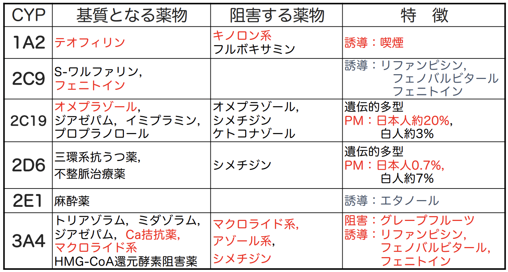

# 0926 薬物動態3 薬物の相互作用
医薬品には、**医療用医薬品**と**一般用医薬品(OTC)**の2種があり、いずれも**医薬品機構 PMDA**によって**添付文書**が管理されている。  
- 目的：医薬品の適用を受ける患者の安全を確保し、適正使用を図るために、医師・歯科医師・薬剤師等の医薬関係者に対して必要な情報を提供する。
- 作成：当該医薬品の製造販売業者
- 改正の概要 (一部)
  - 原則禁忌・慎重投与の廃止
    - 新設：＊｢特定の背景の患者集団に関する注意｣
  - ｢高齢者への投与｣、｢妊婦，産婦，授乳婦等への投与｣，｢小児等への投与｣ の廃止  
  -> 新設項｢＊」の下に集約
    - 授乳に関する注意：｢授乳を避けさせること」という記載は 単に乳汁移行が認められたという理由だけではしない。
    - 小児等：｢安全性は確立していない」->試験の実施の有無等を記載
- 添付文書へのその他記載事項
  - 警告、禁忌、組成・性状、効能・効果、用法・用量、相互作用、副作用、薬物動態、臨床成績、過量投与

## TDM: Therapeutic Drug Monitoring 治療薬剤血中濃度モニタリング
**治療域(安全域)の狭い**薬物を投与する際に、定期的に血中濃度を測定し、その結果に基づいて**投与量・投与間隔**等をその人個人に適した投与方法に設定すること。

## 薬物の相互作用
相互作用とは、**複数の薬物を併用した場合に、薬効が変化するような作用が起こること**。作用は以下に分けられる。  
- 薬物相互作用
  - **協力**作用
    - **相加効果**：**作用点と作用機序が同一の**2薬（以上）の併用時に、**各薬効を足し合わせた程度の薬効を生じる**。
    - **相乗効果**：**作用点と作用機序が異なる**2薬（以上）の併用時に、**各薬効を足し合わせた以上の薬効を生じる**。
  - **拮抗**作用
    - **薬理学的拮抗**：**作用点と作用機序が同一の**2薬（以上）の併用時に、**いずれかの薬効や有害作用が減弱する**。
    - **生理学的拮抗**：**作用点と作用機序が異なる**2薬（以上）の併用時に、**いずれかの薬効や有害作用が減弱する**。
  
### 協力的作用を期待した併用
**投与量が少なくて済む**ため、**相乗効果**の方がより協力的作用が期待できる。   
### 拮抗作用を期待した併用
以下の2つの場面において有効。
- **中毒時の解毒**
  - **原因療法** -> 薬理学的拮抗
  - **対症療法** -> 生理学的拮抗
- **副作用の軽減** -> **生理学的拮抗**
  
しかし、**目的とする薬効を減弱させては意味が無い**ので、併用には**作用機序の異なる**薬剤を使用するのがセオリー。  
同系統薬の少量ずつの併用 -> **副作用が重なるだけで意味がない**。  
#### 実例
慢性副鼻腔炎治療中に風邪をひいた小児が、血小板減少を指摘された。  
主訴の治療のために、**マクロライド系抗生物質3種（エリスロマイシン、クラリスロマイシン、ミデカマイシン）を併用**したことが原因であったことが、後に判明した。

### 現状の薬物治療
2種以上が同時処方される**多剤併用**療法を受けている患者の服用薬は、しっかりと把握しなければならない。初診時の問診で他疾患での服用薬を確認することが重要。特に、相互作用が問題になるような薬を処方する場合は確認必須。

### 1つの疾患での併用
1つの疾患で多剤を併用するのは以下の3シチュエーション。 
1) **より良い効果**を求める時
2) **副作用の軽減、安全域の拡大**を求める時
3) **効果発現・持続性の向上**を求める時
#### 1) より良い効果
**1つの薬の有効性には限界がある**。  
もしも効果がない場合、**同様の薬効を有しかつ作用機序の異なる他剤の併用にシフトして、相乗効果を期待**。  
**投与量を増加させても意味がない**ことに注意。   

#### 2) 副作用の軽減、安全域の拡大  
例えば、以下の使い方。
- **制癌剤** ＋ **制吐薬**
- **抗炎症薬** ＋ **胃薬**
#### 効果発現や持続性への期待
例えば、**薬剤の分解を阻止する**ために多剤併用する。

## 薬物動態学的相互作用と薬動力学的相互作用
- A. 薬物動態学的相互作用 pharmacokinetic interaction：相互作用全体の**65**%
- B. 薬動力学的相互作用 pharmacodynamic interaction：相互作用全体の**35**%
## A. 薬物動態学的相互作用
併用薬物は、**他の薬物動態**に影響を与えうる。  
「**血中濃度が変化** -> **作用の活性化 or 不活性化** -> **副作用の増大**」の可能性に注意する必要がある。
- 薬物動態
  - 吸収：7%
  - 分布：3%
  - 代謝：40%
  - 排泄：7%  
  
薬物動態学的相互作用では、**予期せぬ重大な問題**が生じる可能性がある。  
eg. **ソリブジン事件**(1993)：**抗癌剤**フルオロウラシルを服用中、**免疫力が低下**し、**帯状疱疹**が生じてしまった。これに対し、**抗ウイルス薬ソリブジン**を併用したところ、**抗癌剤の代謝**が**低下**し、**副作用(骨髄抑制）**が**増大**してしまった。

以下、薬物動態の各相における薬物動態学的相互作用を見ていく。

### A.1. 消化管吸収における相互作用
1. **物理・化学的相互作用**
2. **消化管内のpHの変動**
3. **消化管運動促進/抑制**
4. **小腸上皮細胞での代謝**
5. **小腸上皮細胞でのくみ出し**

#### A.1.1. 物理・化学的相互作用
- PATTERN1
  - **含有する金属カチオン(Al3+，Mg2+，Ca2+，Fe2+)とキレート形成** ->　**薬物吸収↓** -> 薬効 **↓**   
  - eg. 以下の薬剤と**制酸剤or鉄剤**の併用。
    - **ニューキノロン系抗菌薬**（eg. **シプロフロキサシン**）
    - **テトラサイクリン系抗生物質**
    - **ビスホスホネート製剤**（**骨粗鬆症治療薬**）
  - 対策
    - **金属カチオンを含有しない製剤に変更する**。
    - **投与時間を2-3時間ずらす**。
- PATTERN2
  - **薬物を吸着** -> **吸収を阻害 + 薬剤代謝促進** -> 薬効 **↓** 。 
  - eg. **コレスチラミン**（**陰イオン交換樹脂**、**脂質異常症治療薬**）：**消化管内で胆汁酸を吸着し、食事中コレステロールの吸収を阻害する**。

#### A.1.2. 消化管内のpHの変動 
消化管内のpHの変動 -> **溶解度が変化**。  

#### A.1.3. 消化管運動
- 消化管運動を促進：**メトクロプラミド**  
- 消化管運動を抑制：**抗コリン薬**、**麻薬**  
腸の運動を促進・抑制することにより、**吸収されやすさ**が変化する。

#### A.1.4. 小腸上皮細胞での代謝
**CYP3A4阻害** -> **代謝↓** -> **吸収↑** -> **作用↑**。  
eg. **Ca拮抗薬** + **GFj**の併用 -> **Ca拮抗薬の効果が過剰に上昇** -> **血圧が下がりすぎてしまう**。

#### A.1.5. 小腸粘膜細胞での汲み出し
**P糖タンパク質 (Pgp)** による**腸管腔内への排泄作用阻害** -> **吸収↑**

### A.2. 生体内分布における相互作用
1. **血漿蛋白結合に関する相互作用**
2. **体液のpHの変動による相互作用**
#### A.2.1. 血漿タンパク結合に関する相互作用
**タンパク結合能の強い薬物は、結合能の弱い薬物の結合を解離させる**。   
特に、**結合率が90%以上**の薬物には注意する必要がある。例えば、結合率99%の場合、1%の遊離型が作用する。ここで、1%遊離型が増加して2%になったとすると、作用は**2倍**になる。  
eg. **ワルファリン（結合能が弱い）**+ **アスピリン（結合能が強い）**-> **ワルファリンの非結合型↑** -> **抗凝血作用↑**  
eg. **トルブタミド（スルフォニルウレア系経口糖尿病薬）**＋ **アスピリン（非ステロイド性抗炎症薬）**-> **トルブタミドの非結合型↑** -> **血糖低下作用↑** → **低血糖**  
eg. **サルファ剤（高結合能）**は、**新生児**には禁忌。**アルブミンが少ない**新生児に与えると、**結合型ビリルビン -> 遊離型ビリルビンと変化**し、これが**中枢へ移行**することで、**核黄疸**となる。  
#### A.2.2. 体液のpHの変動による相互作用
pH変化が以下に影響。
- **消化管からの吸収**
- **細胞内・外における薬物の分布**
- **腎からの排泄**

### A.3. 代謝に影響を与える相互作用
代謝とは、**異物を分解 or 修飾して水に溶けやすい形に変化させる**こと。  
通常、薬物は代謝されて**不活性**化する。  
**CYP(Cytochrome P-450)**：**96**%の代謝に関与する酵素。
- 酵素阻害：**75**%
- 酵素誘導：**23**%

全ての薬物が相互作用を起こすわけではない。
単代謝経路薬物と多代謝経路薬物では、**単**代謝経路薬物の方がより相互作用の影響を受けやすい。   

#### A.3.1. 酵素阻害
**CYPヘム鉄に薬物が配位** -> **複合体生成** -> 酵素の活性化を阻害。  
- 普通の薬剤：酵素阻害 -> **代謝↓** -> **活性型↑** -> **薬剤の血中濃度↑** -> **副作用の発現**  
- プロドラッグ：酵素阻害 -> **代謝↓** -> **活性型↓** -> **薬剤の血中濃度↓** -> **作用↓**  

- 酵素阻害効果のあるもの  
  - **アゾール系抗真菌薬**
  - **マクロライド系抗菌薬**（eg. **エリスロマイシン**）
  - **シメチジン**(**消化性潰瘍治療薬**、**H2遮断薬**)
  - **グレープフルーツジュース**

#### A.3.2. 酵素誘導 
**肝臓のCYP↑** -> **代謝↑** -> **血中濃度↓** -> **効果↓**  
※ もちろんプロドラッグでは逆。

- 酵素誘導効果のあるもの  
  - **リファンピシン**（**抗結核薬**）
  - **フェノバルビタール**（**抗てんかん薬**、**催眠鎮静薬**）
  - **フェニトイン**（**抗てんかん薬**）
    - 影響：**避妊薬の効果↓**、**ワルファリンの効果↓**、**糖尿病薬の効果↓**
  - **喫煙**

#### A.3.3. 代謝過程における相互作用例とその回避
- **テオフィリン** + **ニューキノロン系抗菌薬** 
  - 影響：**テオフィリン（気管支喘息治療薬）の血中濃度↑** -> **副作用↑**
  - 対処：**ニューキノロン系抗菌薬**を、影響が小さい**オフロキサシン**・**レボフロキサシン**・**フレロキサシン**・**ロメフロキサシン**・**スパルフロキサシン**に変更する。しかし、併用時は**副作用発現**に注意し**TDM**を行うこと。
- **テオフィリン** + **エリスロマイシン**
  - 影響：**テオフィリンの血中濃度↑** -> **副作用↑**
  - 対処：**テオフィリンの投与量を25%↓**。OR **マクロライド系**を影響が小さい**ジョサマイシン**・**ミデカマイシン**に変更する
- **HMG-CoA還元酵素阻害薬** + **マクロライド系抗生物質** 
  - 影響：**HMG-CoA還元酵素阻害薬（脂質異常症治療薬）の血中濃度↑** -> **副作用↑（腎機能悪化、横紋筋融解症）**
  - 対処：**HMG-CoA還元酵素阻害薬**を、**3A4による代謝を受けないプラバスタチン**に変更する。
- **テルフェナジン** + **イトラコナゾール** or **エリスロマイシン**
  - 影響：**テルフェナジン(抗アレルギー<抗ヒスタミン>薬) の血中濃度↑** -> **心血管系の致死的な副作用↑（QT延長）**
  - **販売中止**になり、現在**フェキソフェナジン（アレグラ®）**が代替されている。

### A.4. 排泄における相互作用
排泄には以下の3段階があるが、相互作用はこの全ての段階に影響を与える。
1) **糸球体濾過**
2) **尿細管分泌**
3) **尿細管再吸収**

#### A.4.1. 糸球体濾過
**腎血流量**に影響する薬による影響。

#### A.4.2. 尿細管分泌 
**トランスポーターを阻害する**薬物（eg. **OCT**、**P-糖蛋白**）による影響。
- **ジゴキシン（強心薬）** ＋ **キニジン (抗不整脈薬)**
  - 影響：**キニジンによるジゴキシンのP糖タンパク（尿細管分泌に関与する）阻害** -> **ジゴキシンの血中濃度↑** -> **副作用発現** 
  - 対処：**TDM**
- **メトトレキサート（抗悪性腫瘍薬、抗リウマチ薬）** + **プロベネシド（高尿酸血症治療薬、尿酸排泄促進薬）**
  - 影響：**プロベネシドによるメトトレキサートの尿細管分泌↓** -> **メトトレキサートの血中濃度↑** -> **副作用↑**
  - 対処
    - **メトトレキサート**のTDMを行い、必要に応じ減量。
    - **高用量化学療法**の場合は、**尿酸排泄促進薬**として**排泄競合が少ないベンズブロマロン**に変更 or **尿酸合成阻害薬**である**アロプリノール**に変更。

#### A.4.3. 尿細管再吸収
**尿pHを変化させる**薬物による影響。

#### A.4.4. 薬物中毒時への応用
**排泄を増やす**ことで、**中毒の原因物質を体内から追い出す**。  
|                        | 睡眠薬 | 覚醒剤 | 
| ---------------------- | ------ | ------ | 
| 炭酸水素Na排泄量       | ↑     | ↓     | 
| 塩化アンモニウム排泄量 | ↓     | ↑     | 

- 弱酸性薬物の場合
  - eg
    - **フェノバルビタール**
    - **非ステロイド性抗炎症薬**
    - **ベンゾジアゼピン系薬** (**抗不安薬**、**催眠薬**）
  - 対処：**炭酸水素ナトリウムの点滴静注** -> **尿をアルカリ性に**。
- 弱塩基性薬物
  - eg. **メタンフェタミン** (**覚醒剤**)
  - 対処：**塩化アンモニウムの点滴静注** -> **尿を酸性に**
 
## B. 薬動力学的相互作用
**薬物の作用点**、**受容体に対する作用や結合性**に影響を与える。  
ただし、**作用**を知っていれば**相互作用は予測できる**ので、**大きな問題はない**。  

1. 注意が必要な相互作用／好ましくない相互作用
   1. 類似／同じ作用
   2. 同じ作用部位における作用
   3. 標的器官は違うが作用機序が同じ
   4. 同じ副作用
   5. 感受性の変化
   6. 作用の減弱／打ち消し
2. 相互作用を利用した併用
   1. 作用の増強
   2. 副作用の軽減
   3. 耐性菌出現の抑制
   4. 抗菌スペクトルの拡大

### B.1. 注意が必要な相互作用／好ましくない相互作用
相互作用は、**処方開始**時だけでなく、**長期併用**時や**併用中止**時にも注意が必要。例えばどちらかの薬を中止する場合には、**亢進していた代謝が元に戻る**ことによる**副作用↑**、**阻害していた代謝が元に戻る**ことによる**作用↓**になったりする可能性がある。
#### B.1.1. 類似／同じ作用
1) **糖尿病治療薬**の併用  
   - eg. **インスリン** +　**β遮断薬** -> **血糖低下作用の延長**
   - 影響：**低血糖**
2) **中枢神経系抑制薬**の併用  
   - 影響：**中枢神経抑制作用の増強**
3) **抗コリン薬** + **抗コリン**を有する薬物の併用  
   - 影響：**口渇**・**散瞳**・**尿閉**・**便秘**・**動悸**
   - eg. 抗コリン作用を有する薬物：**抗ヒスタミン薬**、**三環系抗うつ薬**、フェノチアジン系薬（統合失調症治療薬）、抗パーキンソン病薬、キニジン(抗不整脈薬)、プロカインアミド(抗不整脈薬)
4) **抗凝固作用薬** + **血小板凝集抑制作用薬**  
   - eg. **ワルファリン** + **アスピリン** -> **出血傾向**

#### B.1.2. 同じ作用部位における作用
1) **β受容体**  
   - eg. **気管支拡張薬（β2作用薬）**+ **狭心症治療薬（β遮断薬）** -> **作用減弱、気管支喘息増悪**
2) **GABAA受容体**  
   - eg. **ニューキノロン系抗菌薬** + **非ステロイド性抗炎症薬** -> **結合阻害** -> **痙攣の誘発**
   - eg. **アルコール** + **抗不安薬** -> **結合増大** -> **抗不安薬作用↑**

#### B.1.3. 標的器官は違うが作用機序が同じ
1) **消化管運動調節薬** + **統合失調症治療薬**  
   - 影響：**ともにD2受容体遮断作用** -> **錐体外路症状** -> **相加的に副作用発現↑**  
    -> **ドパミン不足**である**パーキンソン**患者への**消化管運動調節薬**処方は禁忌。
2) **緑内障治療薬** + **狭心症治療薬**  
   - 影響：**共にβ遮断作用** -> **徐脈**

#### B.1.4. 同じ副作用
1) **脂質異常症治療薬**の併用  
   - eg. **フィブラート系** + **スタチン系（HMG-CoA還元酵素阻害薬）**-> ともに**横紋筋融解症↑**
2) **高血圧治療薬**の併用   
   - eg. **カリウム保持性利尿薬** + **ACE阻害薬** -> **高カリウム血症**
3) **アミノグリコシド系抗生物質**とXXの併用  
   - eg. **フロセミド**との併用 -> **聴覚障害↑**、**腎障害↑**
   - eg. **麻酔薬・筋弛緩薬**との併用 -> **呼吸抑制↑**

#### B.1.5. 感受性の変化
1) **ハロタン** + **アドレナリン作働薬** -> **心臓のカテコラミン感受性↑** -> **不整脈**
2) **チアジド系**や**ループ利尿薬**による**低カリウム血症** + **ジギタリス(強心薬)** -> **ジギタリス中毒**

#### B.1.6. 作用の減弱／打ち消し
1) **殺菌作用を有する抗生物質** + **静菌作用を有する抗生物質**
2) **血液凝固因子（プロトロンビン）**に対する作用  
   - eg. **ワルファリン（プロトロンビン抑制)** + **ビタミンK（プロトロンビン産生）**

### B.2. 相互作用を利用した併用
#### B.2.1. 作用の増強
1) **代謝阻害薬（酵素阻害薬）の配合**による効果増強  
   - **パーキンソン治療薬（レボドパ）**+ **末梢での分解阻害薬（ベンセラジド）**
   - **ペニシリン系抗生物質** + **βラクタマーゼ阻害薬**
2) **作用機序の異なる抗生物質**  
   - **細菌細胞壁の合成阻害** + **核酸合成阻害**
   - **葉酸合成阻害** + **葉酸利用阻害**
     - eg. **ST合剤**（**スルファメトキサゾール** + **トリメトプリム**）
#### B.2.2. 副作用の軽減
1) **プロスタグランジンPG生成**に対する作用  
   - eg. **非ステロイド性抗炎症薬** + **PG誘導体／PG増強薬** -> **PG合成阻害による胃腸障害**
2) **抗がん剤の多剤併用療法**  
   - 影響：**作用増強** + **副作用の軽減** -> **各薬物の投与量↓** -> **副作用や毒性↓**
#### B.2.3. 耐性菌出現の抑制
eg. **結核治療**における併用
#### B.2.4. 抗菌スペクトルの拡大
eg. **複合感染**時の**抗生物質**の併用

## 食物・嗜好品との相互作用
### A. 薬物動態学的相互作用
1) 代謝阻害：**グレープフルーツジュース**
2) 代謝促進：**喫煙**
3) 吸収阻害：**牛乳(Ca)**、**緑茶**  
   - **緑茶のタンニン** + **鉄剤** -> **鉄の吸収↓**
### B. 薬動力学的相互作用
1) 作用の打消：**納豆**、**クロレラ**、**緑葉野菜（VK）**
2) 作用の増強：**飲酒**
### 漢方薬
**甘草** + **フロセミド/チアジド系利尿薬** -> **低カリウム血症**

## 薬物動態に考慮が必要な場合
**安全域が狭い（治療係数が小さい）**薬剤を処方している場合に加え、以下の患者に処方する場合は注意が必要。
- **肝疾患**・**腎疾患**
  - 懸念点：**代謝・排泄障害(T1/2の延長)**による**薬剤蓄積**    
  -> その薬物が、**肝代謝型か腎排泄型か**に注意。
- **小児**
  - 懸念点：**BBB**・**腎排泄**・**肝代謝酵**の**未発達**
- **高齢者**
  - 懸念点：**腎臓**・**肝臓**の**機能低下** -> **低アルブミン血症**・**無酸症**
- **妊婦**
  - 懸念点：**体液量の変化**等

## 薬の有効性と安全性確保
患者一人ひとりに適した処方計画の設定が不可欠。  
薬の適正使用：効果は最大限、副作用は最小限。  
遺伝子診断によるオーダーメイド療法に期待。