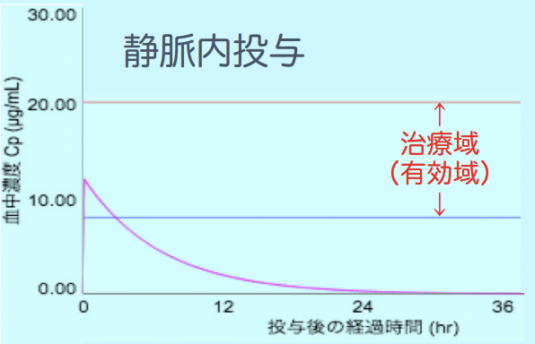
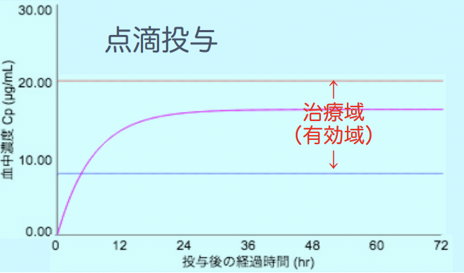
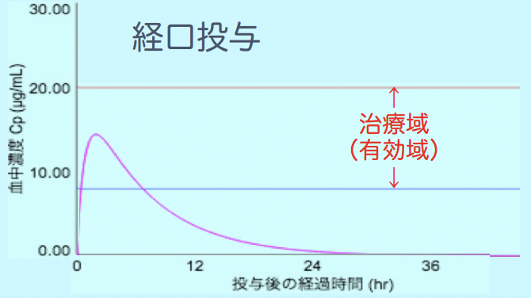
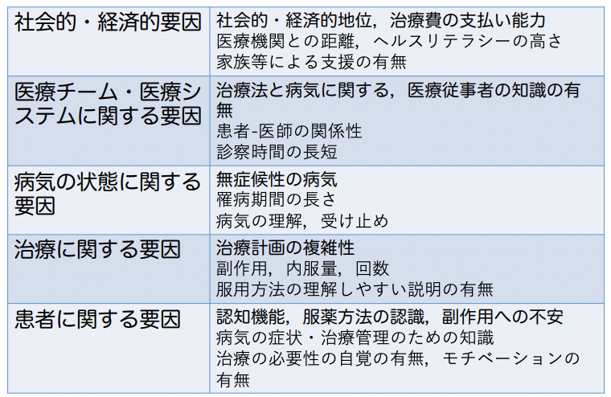

## V問題
1. AとBではどちらが強い薬物か? -> A
2. この薬は安全と言えるか? -> 危険。薬理作用100%で、中毒50%、致死数%。
3. ED50とLD50、大きいのは? -> LD50。
4. 治療係数が大きい薬物と小さい薬物、安全なのは？ -> 小さい薬物
5. 薬は投与すれば効果が出る。-> 誤
6. 薬はどこから入れても良いか？ -> NO

# 薬理作用の修飾因子
薬理作用の強度は、以下の3点で決定される。
- 薬の固有活性
- 作用部位の薬物濃度（薬物側の因子）
- 作用部位の組織の薬物感受性（生体側の因子）
  
## 1. 薬物側の因子
1. 投与量
2. 適用方法（投与経路）
3. 他の薬物との併用
### 1.1. 投与量
投与量は、作用の強さを規定する。
### 1.2. 適用方法
薬はどこから入れても、静脈血 -> 心臓 -> 肺循環 -> 全身へ。  
しかし、作用部位に効率よく薬を送り届けるために投与方法は決められている。  
正しい投与経路で使用しないと、十分な薬効が得られない or 医療事故を引き起こす。  
eg. トロンビンは経口。注射したら血液凝固が起きてしまう。  
投与方法のそれぞれの特徴を以下にまとめる。  
- 経口
  - 利点：安全かつ簡便。可能であれば原則経口。
  - 欠点：消化管で分解されてしまうもの。
- 注射（静脈内、点滴、皮下、筋肉）
  - 利点：早期作用発現、吸収の確実性。
  - 欠点：要滅菌、急激な作用による事故。
- 吸入：気体 or 揮発性の薬で、気道から吸入。
  - 利点：肺胞上皮や気道粘膜から直接吸収できる。
- 直腸内
- 経皮
- 点眼
- 点鼻
- 膣内

|        | 全身         | 局所             | 
| ------ | ------------ | ---------------- | 
| 吸入   | 全身麻酔薬   | 喘息治療薬       | 
| 直腸内 | 解熱鎮痛薬   | 痔疾患治療薬     | 
| 経皮   | 狭心症治療薬 | 腰痛治療薬       | 
| 点眼   | 副作用       | 緑内障治療薬     | 
| 点鼻   | 夜尿症治療薬 | アレルギー性鼻炎 | 　　
  
cf. 緑内障治療薬は、β遮断薬である。  
- β刺激 -> 心機能↑ or 気管支拡張 -> 喘息治療  
- β抑制 -> 心機能↓ -> 高血圧、狭心症、不整脈治療  
   　　 -> 気管支収縮 → 喘息悪化

 
  
    
   

#### 剤形
錠剤にも、裸状・糖衣・徐放・腸溶・舌下・OD・油性・口腔内崩壊（フィルム製剤）など、様々ある。  
油性の利点は、持続性の高さ。eg. ホルモン剤、抗精神病薬    
懸濁性製剤は、静注不可能。

舌下とODの違いは以下。   
|                      | 舌下 | OD                               | 
| -------------------- | ---- | ---------------------------------- | 
| 口腔内粘膜からの吸収 | 有   | 無                                 | 
| 用途                 | 発作 | 水無し服用 水分制限 嚥下困難 | 

eg. ニトログリセリンは、舌下も経費もあるが、場合によって使い分ける。 
| 作用 | 舌下 | 経皮 | 
| ---- | ---- | ---- | 
| 発現 | 速   | 遅   | 
| 持続 | 無   | 有   | 
| 用途 | 発作 | 予防 |     

#### DDS
「薬物の効果の最大化と副作用の最小化」を実現するための疾患部位だけに薬物を届ける工夫。  
eg. 経皮吸収製剤ーアレルギー性鼻炎治療薬ʼ18.4  

#### 投与間隔
有効血中濃度域に収まるように、適切な時間・時刻での投与が重要。

#### cf. ジェネリック
後発医薬品。医療費の破綻を背景に、薬価の安いジェネリックが普及した。  
- 有効成分：先発品 ＝ 後発品
- 有効性：先発品 ＝ 後発品
- 安全性：先発品 ＝ 後発品
- 添加物：先発品 ≠ 後発品
- 製法：先発品 ≠ 後発品  

後発品の情報量の少なさやも生物学的同等性への疑問が、問題になってきた。  
後発品↑への歴史
- 後発品・一般名処方 -> 診療報酬(処方箋料，調剤料)加算  
- 処方箋様式の変更
  - 2006.4.1～ 後発品への変更 可 ＋ 医師の署名
  - 2008.4.1～ 後発品への変更 不可 ＋ 医師の署名    
- 後発品の商品名統一：一般名 ＋ 剤形 ＋ 含有量 ＋「会社名」
- 平成29年6月の「医療用後発医薬品の販売名の一般的名称への変更・・・について」の通知では平成32(令和２)年9月までに後発医薬品の使用割合を80%を達成するとともに，医療用後発医薬品の一般的名称への販売名変更についても3年以内を目途に対応の必要
- 「配合剤」ジェネリック医薬品の統一ブランド名称について
  - 成分が複数含まれる配合剤の数も増え，後発各社のブランド名称のままでは，医療事故の元になるとして，日本ジェネリック医薬品・バイオシミラー学会は「配合剤ジェネリック医薬品の統一ブランド名称」を検討
- オーソライズドジェネリック Authorized Generic(AG)の登場。先発医薬品メーカーが関連会社に特許権を許諾し、先発品と同一品質・同一工場・同一ラインで作られたジェネリック。

### 1.3. 他の薬物との併用
薬物相互作用を参照。

## 2.生体側の因子
### 2.1. 生理的因子
1) 年齢（新生児、小児、高齢）  
2) 体重
3) 性差
4) 生体リズム

#### 2.1.1. 年齢
- 新生児・小児
  - 体内水分量が多い。
  - BBB機能・代謝酵素活性・皮膚の防御機能は成人未満。  
- 高齢者
  - 加齢により、腎機能↓、肝機能↓、胃液分泌能↓、消化管運動機能↓、体内水分量↓、体脂肪↑、筋肉量↓、感受性↑or↓、併院、合併症
#### 2.1.2. 体重
単純な体重の重さ・軽さだけでなく、血液量・脂肪量・水分量が、薬の性質（脂溶性・水溶性）と体内分布に関与。  
eg. 脂肪太り？浮腫太り？  
#### 2.1.3. 性差
生物学的な差から、罹患しやすい疾患・薬効・副作用に差が生じる。  
代謝酵素にも差が出て、血中濃度の差に帰因する。
#### 2.1.4. 生体リズム
自律神経機能・ホルモン分泌機能・免疫機能は、日周期・月周期・年周期の影響を受ける。
eg. 副腎皮質ホルモン、インスリン、心拍数、胃液分泌、血圧、体温、癌細胞の増殖   
例えば、以下は交感神経活性のサーカディアンリズムの影響を受ける。
- 心臓突然死の発症頻度：早朝～正午に↑
  - 原因：交感神経系亢進 -> 急激な血圧上昇・血小板凝固能亢進
- 喘息発作：夜間～早朝に↑
  - 原因：交感神経活性が夜間に↓  
  -> 喘息治療薬は就寝前に投与する。
- コレステロール生合成：夜間に↑  
  -> 脂質異常症治療薬（HMG-CoA還元酵素阻害薬）は夜の投与が効果大。
- 消化性潰瘍：夜間に↑  
  - 原因：胃酸分泌が夜間に↑  
  -> 治療薬は就寝前に投与。

#### 2.2. 病的因子
1) 病態 -> 代謝・排泄の遅延 -> 薬理作用↑ -> 副作用
2) 妊娠  

cf. 腎機能の指標：クレアチニン

#### 2.3. 環境因子
1) 食事・飲酒・喫煙・健康食品・サプリメント  
   - 影響
     - 食事中の脂肪分に溶ける薬物量
     - 食事の摂取による胃酸分泌↑
     - 食事摂取 -> 胃内からの排出が遅延（-> 吸収に要する時間の変化）
     - 代謝酵素の誘導・阻害
   - eg. 納豆、牛乳、酒、タバコ、グレープフルーツジュース、セントジョーンズワート
2) 心理的因子（プラセボ効果）：医師の接し方一つで、作用に変化。
#### 2.4.  アレルギー体質
初回投与による免疫反応 -> 2回目投与時にアナフィラキシーショック -> 過敏症  
ペニシリンなどで見られる。問診が重要。
##### 2.5. 遺伝的因子：代謝酵素の遺伝多型, etc 個別医療
1) 種差・系統差・人種差  
   - eg. サリドマイドの催奇形：ネズミ[ - ] 、ヒト[ ＋ ] 、ウサギ[ ＋ ]  
   - eg. 白人 vs 黄色人種での代謝酵素の違い -> 副作用の違い  
       -> 外国で開発された薬を日本国内へ導入する時に注意。  
            eg. イソニアジド（抗結核薬）：代謝によりアセチル化を受ける。副作用として、Slow acetylatorでは多発神経炎、Rapid acetylatorでは肝障害が見られた。
2) 個体差
先天的遺伝子多型による代謝酵素欠損 -> 薬物代謝速度の相違 -> 吸収・排泄の相違
- eg. サクシニルコリン（筋弛緩薬）の代謝

## 3. コンプライアンス から アドヒアランス へ
### コンプライアンスとは
患者が医師の指示通りに薬を服用しているかどうかを、服薬状況（率）で表したもの。  
もし勝手に服薬を中止してしまうと、病気が進行・再発してしまうかも。   
勝手に増量してしまうと、副作用が発現してしまうかも。
### アドヒアランスとは
自分の考え・信念に基づいてルールを守ること。  
つまり、患者が理解し、疑問も不安も解消しながら、納得して薬を飲むこと。  
### アドヒアランスに影響を与える要因
- 生体側：病気への理解
  - 服薬の目的・必要性
  - 薬物の働き（予測される作用）
  - 途中で服用を止めた場合の不利益な反応・副作用等
  - 飲み忘れた時の対応方法
  - 小児の場合 -> 服薬嫌悪、母親への教育
  - 高齢者の場合 -> 服薬管理能力の低下
- 薬剤側
  - 1日の服薬回数
  - 剤形

  

### アドヒアランス不良が治療に及ぼす影響
 - 抗生物質の場合 -> 耐性菌の出現
 - 副腎皮質ステロイド、催眠・鎮静薬、抗てんかん薬、高血圧治療薬 -> 反動が起こることも。  
-> 血中濃度を測定して、服用を確認する必要がある。

### アドヒアランスを改善するためには
- 生体側
  - 十分な説明（インフォームドコンセプト）
  - 医療従事者との信頼関係
- 薬剤側
  - 服用回数を減らす
  - 剤形をOD錠など飲みやすい形にする。
  - 調剤方法を一包化等工夫する。
  
### アドヒアランスが悪化しがちな薬
- なかなか効果が現れない薬
  - eg. 抗うつ薬、金製剤（関節リウマチ）、抗甲状腺薬、抗アンドロゲン薬（前立腺肥大症）
- 中止時期の見極めが難しい薬
  - eg. 抗うつ薬、鉄欠乏性貧血治療薬

### SUMMARY
患者個々のアドヒアランスの原因を明確にすることが大事。  
医療者中心の医療から、PCM patient-centered Medicineへ。