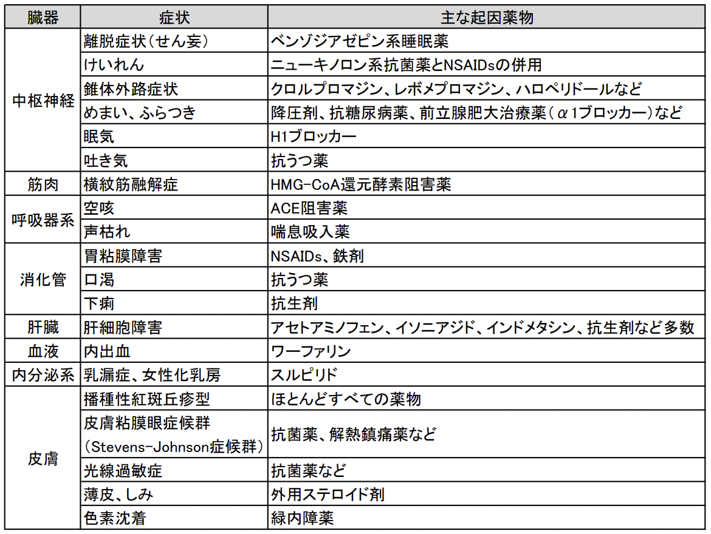
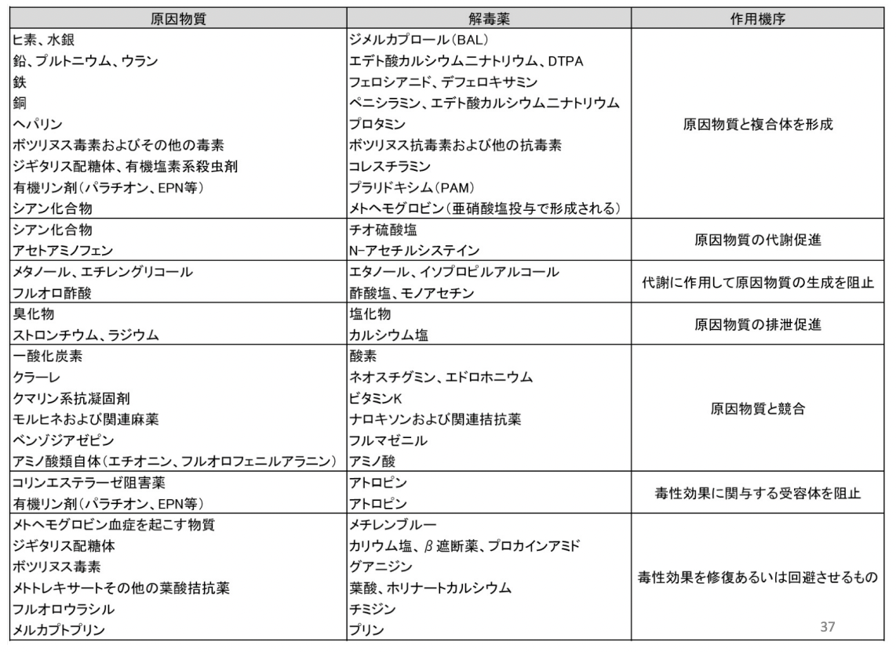
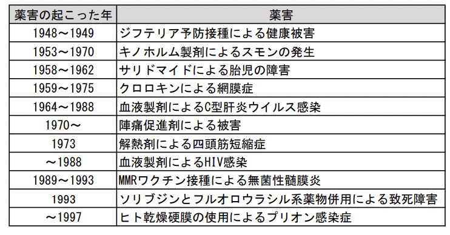

# 1003 薬理学総論VI
治療困難とされていた疾患に対して、ペニシリン、ストレプトマイシン、コルチゾンなどのような強力な特効薬が劇的な薬効を示したことにより、多少の副作用はやむを得ないものとされていた。しかし、1960 年代に入り**サリドマイド**に**催奇形作用**のあることが判明してから、副作用に対する認識が一変し、薬物の**安全性**が有効性と同様に重要であるという認識のもとに、科学的な眼が向けられるようになってきた。今日では、薬物の使用に際して、その**有効性と安全性のバランス**により**有用性**が判断されるようになってきている。さらに、薬物の使用には患者の**QOL**を考慮した総合的な判断が重要である。  
eg. ダイエットを希望しているうつ病の患者に対して抗うつ薬及び胃腸薬のスルピリドを投与する場合など。

# 1. 薬物の副作用
## 1.1. 薬物の主作用と副作用
- 主作用：**使用目的にあった薬理作用。薬効。**
- 副作用：**目的の作用以外の薬理作用。**

副作用は、基本患者にとっては好ましくない。しかし、患者にとって好ましい、好ましくないかは患者の状態および環境により決まるということに注意。  
- eg. 抗ヒスタミン薬の作用
  - **抗アレルギー**作用（主作用）
  - **催眠**作用（副作用）：特に**アルコール摂取**時に**悪心**作用あり -> **アルコール中毒薬**
- eg. アスピリンの作用：**量**によって主作用が異なる。
  - 基本：**解熱鎮痛**作用
  - 低用量：**抗血小板**作用

## 1.2. 副作用の分類
副作用は、薬物の薬理作用に関連して起こるものと、無関係に起こるものに分けられる。
### 薬物の薬理作用に関連して起こる副作用
- **主作用の異常な増強**により発現する副作用
  - **過量投与**・**薬物体内動態の異常**によって**体内薬物濃度が高まった**場合。
    - eg. **降圧剤**による**低血圧**
  - **薬物に対する生体感受性が高まった**場合。
    - eg. **糖尿病薬**による**低血糖**
- **目的としない器官・組織に作用して**発現する副作用
  - **薬物の作用の特異性が低く**、**使用目的でない造血器・消化器・肝臓・腎臓**などにも作用して、それぞれの器官・組織に障害を起こす。
    - eg. **抗がん剤**による**骨髄抑制**や**消化管障害**など
### 薬理作用とは無関係な作用によって起こる副作用
ほとんどは、**活性中間体**（**生体内で代謝的活性化を受けた不安定な**物質）が原因となる。これは、**DNAや蛋白質などの生体高分子と反応し共有結合体を作ったり**、**膜リン脂質の過酸化**を引き起こすことにより副作用を発現する。    
**予測することが難しい**ものが多い。  
eg. **薬物アレルギー**、**細胞毒性**、**遺伝毒性**、**発癌性**など。  

## 1.3. 副作用発現に影響を及ぼす因子
1) **生理的因子**   
   1) **年齢**
   2) **性別**
   3) **妊婦・授乳婦**
2) **病理的因子**
3) **個体差**
4) **環境**
5) **心理的効果**
### 1.3.1. 生理的因子
#### 1.3.1.1. 年齢
- 小児：**薬物に対する反応性が大きい**。
  -  why?
     - **低い肝薬物代謝酵素活性**（胎児では、母体の**1/5**〜**1/10**程度）：特に、**P450系酵素の発達は比較的遅く**、代謝経路により発達の程度が一様でない。
     - **腎機能が未発達**。
     - **未発達なBBB** -> **ほとんどの薬物が脳へ移行する**。
     - **血清アルブミン量が少ない** -> **遊離型薬物の比率**が母体血中より**高く**なる。
     - **胃液が低pH** & **胃内容排出時間が長い** -> **吸収**が**遅い**。
  - **未熟児**の場合は、これらの傾向が特に強い。
- 高齢者：**副作用の発現率が高い**。
  - why?
    - **薬物動態の変動**
      - メカニズム：加齢 -> **臓器機能の低下** -> **薬物代謝の低下**。
      - 特に、**肝臓**・**腎臓**・**心臓**・**肺**の**機能低下↓** -> **体内動態（吸収・分布・代謝・排泄）が変化** -> **組織内薬物濃度↑**。
    - **薬力学の変動**
      - メカニズム：**受容体数の減少**・**受容体機構の減弱**（**結合親和性の低下**、**情報伝達過程の障害**に起因） -> **反応性低下** or **感受性亢進**
#### 1.3.1.2. 性別
男女では、**女性**の方が感受性が高い。   
why? -> **性ホルモン**の**薬物代謝に対する影**響の違い   
動物実験においても薬物の副作用の発現に性差のみられる場合が多い。
#### 1.3.1.3. 妊婦・授乳婦
**副作用発現**に違いがみられる場合がある。  
妊娠中に薬物を投与する場合、**胎児や子宮に対する影響**を考慮する必要がある。  
- 妊娠中に危険な薬物
  - 妊娠初期 -> **催奇形性をもつ**薬物
  - 妊娠末期 -> **麦角アルカロイド**などの**子宮収縮薬**
  - 出産が近い時期 -> **モルヒネ**などの**中枢抑制薬**や**抗凝血薬**

薬物は**血液胎盤関門を通過**し、胎児へ移行する。（**極性の高い**薬物は除く。）   
胎児は**薬物の影響を受けやすい**ので、妊娠中の投与に関する安全性が確立していない薬物は妊婦へは投与しないか、治療上の**有益性が危険性を上回る**と判断される場合のみ投与する。  
また、**乳腺から排泄される**薬物は**乳汁を介して**乳幼児へ移行する可能性が大きいので、授乳期における薬物投与に注意が必要である。

### 1.3.2. 病理的因子
- 肝疾患
  - 以下により、**遊離型薬物の血中濃度増加**。
    - **肝臓からの直接型ビリルビンの排泄障害** -> **血清ビリルビン増加** -> **ビリルビンの血漿蛋白への結合↑** -> **血漿蛋白の薬物結合能低下**
    - **肝薬物代謝能の低下**。
    - **肝臓でのアルブミン合成低下**。
- 腎疾患
  - **腎排泄の低下** -> **低脂溶性薬物が体内に蓄積**。
  - **腎不全により尿中へのアルブミン漏出** -> **血清アルブミンの低下** -> **遊離型薬物の血中濃度増加**
  - **尿毒症物質のアルブミンへの結合** -> **アルブミンの薬物結合能低下** -> **遊離型薬物の血中濃度増加**
- 心不全
  - **血流量の低下** -> **薬物吸収量の低下**・ **肝での薬物酸化反応の阻害**・**腎排泄の低下**

### 1.3.3. 個体差
- **遺伝的な酵素活性の低下**
  - **薬物代謝能**に関係する酵素
    - eg. **N-アセチル化の多型性**、**チトクロムP450酵素の異常**、**血清偽性コリンエステラーゼの異常**、**アルコール/アルデヒド代謝の異常**
  - **薬物に対する感受性の異常**（**薬理遺伝学的酵素病**）
    - eg. **グルコース6リン酸脱水素酵素欠損症**  
      - 機序：上記疾患 -> NADPH不足 -> 還元型グルタチオン（GSH）不足 -> 活性酸素蓄積 -> 赤血球膜の酸化 -> 溶血。
      - 赤血球内の酸化を促進する薬剤（eg. アセトアニリド・フェナセチン・スルホンアミド類など）の投与で溶血性貧血が起きやすくなる。
    - eg. **薬物性メトヘモグロビン血症**
      - 機序：**メトヘモグロビン還元酵素の欠損** -> メトヘモグロビン増加 -> 酸素欠乏状態。
      - 赤血球内の酸化を促進する薬剤（アセトアニリド・フェナセチン・スルホンアミド類など）の投与で貧血が起こる。
- **薬物アレルギー**
  - 副作用としての発生頻度はかなり高い。薬物に対し過敏症の既往歴のある患者、気管支喘息・発疹・蕁麻疹等を起こしやすい患者には慎重に投与する必要がある。また、アレルギー反応に似ているが、免疫学的基盤がなく、主に遺伝的要因による偽性アレルギー反応もある。
### 1.3.4. 環境
薬物に対する感受性が、環境・住居の構造・居住環境などによって影響されることがある。
### 1.3.5. 心理的効果
医師の患者に対する応接状態、患者の性格および薬物適用後の副作用出現の様子などが原因となって、薬物の効果が変動することがある。これを心理的効果という。薬理活性のない物質を偽薬（プラセボ）として適用しても有効性あるいは副作用がみられることがある。これはプラセボ効果と呼ばれている。  
eg. 効果に差のない２種の薬物AとBで、Aを服薬していても改善が認められない場合、「Bにしましょうか。Bの方がよく聞くと評判なんですよ」の一言で効いてしまう。

## 1.4. 薬物相互作用と副作用
多種類の薬物を併用することによって、予期しない有害な薬物相互作用を起こす危険性が高まる。薬物相互作用は薬の併用時に常に起こりうるものであり、薬物相互作用を起こす薬物との併用に際しては十分な注意を払う必要がある。  
薬物相互作用は以下。
1) **物理化学**的な相互作用：eg. 薬効が変化する配合禁忌など
2) **薬物動態学**的な相互作用：薬物の**吸収・分布・代謝・排泄過程**で現れる相互作用
3) **薬力学**的な相互作用：薬物の**作用部位**における相互作用であり、併用した薬物の協力作用や拮抗作用に基づいて、薬効・毒性に著しい変動がみられる。
4) 作用機序が明らかでない相互作用
5) **薬物・食物間**相互作用：eg. **Ca拮抗薬**（**GFJ**中のフラノクマリン類は**CYP3A4を阻害し、CYP3A4により代謝される**）の効果を**増強**
6) **薬物・環境物質間**相互作用：eg. **ニコチン**（CYP1A2を誘導し、CYP1A2により代謝される薬物の効果を**減弱**させる）  

## 1.5. 薬の副作用とその対策
新薬が発売され、一般の患者に用いられるようになると副作用の発生が治験中に比べて**多く**なる。その原因として、臨床治験中と異なり、多数の異なる集団の患者にも投与されるし、**多くの薬の併用により薬物相互作用が起きやすくなる**からである。これらの副作用に関する情報は関連機関へ報告することが義務づけられている。
### 薬の副作用対策
- 副作用原因薬の究明
- 副作用原因薬の投与中止
- 副作用原因薬の作用拮抗薬または解毒薬の投与
- 副作用発現の予防が困難な場合 -> 同じ効果を持つが副作用が起きないであろう別の薬に変える。
- 体内薬物血中濃度と副作用発現の関係が得られている場合 -> 薬物血中濃度モニタリング（TDM）

## 1.6. 主な副作用

# 2. 薬物の連用による有害作用
## 2.1. 薬物の耐性
耐性：**薬物を反復投与した場合に、効果が次第に減弱する**こと。
- **代謝**耐性：**薬物代謝酵素の誘導により、薬物代謝が促進される**。
- **組織**耐性：**薬物の受容体の増減や受容体と細胞内情報伝達系の脱共役による**。
- **行動**耐性：**薬物の効果を代償して行動遂行能力を回復する耐性**。
- **交差**耐性：**ある薬物に対する耐性が形成された後に、その薬物と類似した薬理作用を持つ薬物にも耐性を示すことがある**。
- **タキフィラキシー**：**短時間内の反復投与により、次第に効果が減弱する現象**。  
  - eg. **エフェドリンの2回目投与による効果減弱**：**エフェドリン**・チラミン投与 -> 交感神経終末からノルエピネフリン放出 -> 血圧上昇 だが、反復投与すると、神経終末のノルエピネフリンが枯渇 -> エフェドリンの効果減弱。
## 2.2. 薬物の蓄積
薬物を連用した場合、**腎排泄の低下**ため、**体内に均等 or 特定の部位に薬物が蓄積する**ことも。これにより、**その薬物効果が強まり、一度に大量を投与したときのような毒性が出現する**ことも起こる。
## 2.3. 薬物依存症
薬物中止あるいは薬物の長期連用による**薬物耐性**により薬物の効果が減弱したときに、その薬物に対する欲求が強くなり、使用を中止することが困難となる。この状態を薬物依存といい、この依存には、**身体的依存**と**精神的依存**がある。**精神的依存だけが生じる**場合を**習慣**、**それに身体的依存を伴う**場合を**耽溺性**あるいは**嗜癖**という。
### 2.3.1. 身体的依存
薬物が体内にあるのが通常の状態だと体が覚え、薬物が体内組織に存在することが欲求される状態。薬物の中止あるいは薬物の耐性により薬物の効果が減弱すると、体に異変が生じる。これを**退薬症状**（**離脱症状**、**禁断症状**）といい、薬物使用の中断により死に至ることもある。
### 2.3.2. 精神的依存
薬物の中止あるいは薬物の耐性により薬物の効果が減弱したときに、原則身体的症状は認められないが、薬物の反復的使用を渇望する状態をさす。
### 2.3.3. 薬物依存を起こす代表的な薬物
- モルヒネ：けしの成分
- ヘロイン：コデインやモルヒネの誘導体
- コカイン：コカの成分
- **テトラヒドロカンナビノール**：大麻草の成分
- **メタンフェタミン**：麻黄成分のエフェドリンから合成
- 催眠鎮静薬（バルビツール酸誘導体、ベンゾジアゼピン系など）
- 精神安定薬・抗不安薬などの向精神薬
- 鎮痛薬
- リゼルギン酸LSD-25・フェンサイクリジンPCP・メスカリンやジメチルトリプタミンDMT：幻覚発現薬
- サイロシビン：違法ドラッグMDMAMDA、キノコ類のマジックマッシュルームの成分
- 有機溶剤（トルエン、シンナー、アセトン、エーテル、クロロホルムなど）
- アルコール
- ニコチン  

薬物により身体的依存、精神的依存、耐性を形成する特徴が異なる。  
各薬物は麻薬及び向精神薬取締法、覚せい剤取締法、大麻取締法、毒物及び劇物取締法、未成年者飲酒禁止法、未成年者喫煙禁止法により法規制され、その製造・管理・使用が厳重に規制されている。  
これらの薬物の多くは、乱用が行われ、個人的または社会的に害を招くことがある。薬物乱用とは薬物を社会的に許容されていない目的や方法で自己使用することをいい、したがって、麻薬・覚せい剤・有機溶剤の吸引、未成年者の飲酒・喫煙、睡眠薬や鎮痛薬の複数錠服用は一回行っただけでも乱用となる。薬物依存になると、薬物欲しさを抑えられなくなり、薬物を手に入れようとする行動（**薬物探索行動**）を起こすようになる。
### 2.3.4. 薬物依存症の発症機序
依存性には、**中脳の腹側被蓋野から前脳の側坐核に投射するドーパミン神経系**（**腎排泄の低下**・**脳内報酬系**）が関与すると考えられている。
**ドーパミン**は、**人間の脳機能を活発化させ、快感を作り出し、意欲的な活動を作り出す**、極めて重要な**神経伝達物質**の一つ。 
**神経終末内のドーパミンがシグナルを受ける** -> **次々とシナプス間隙に放出** -> **シナプス後膜上のドーパミン受容体に結合** -> 新たなシグナル というように情報が伝達されていく。  
その後、受容体に結合していたドーパミンは、**受容体から遊離** -> **ドーパミントランスポーターから再吸収** -> **元の神経終末へ**。  
しかし、覚醒剤を乱用すると、**A10神経系に異常をきたし**、その使用の度に以下の機序が起きる。  
**覚醒剤がドーパミントランスポーターから神経終末内へ** -> **ドーパミンを逆流的にシナプス間隙に放出** -> **シナプス間隙にてドーパミン過剰状態に** -> **シナプス後膜上のドーパミン受容体に結合したドーパミン↑** -> **新たなシグナル増強** -> **脳を強制的に興奮**。  
これを幾度も繰り返すと、ドーパミントランスポーター数が減少してしまうことが、覚醒剤依存症に陥った人のPET研究でわかっている。  
このような、脳内報酬系での生物学的変化が薬物依存症の原因であり、また結果でもあると考えられている。  

### 2.3.5. 薬物依存症の症状・経過
- 症状：精神神経症状（精神障害、幻覚、妄想、記憶力低下、意識障害などの）、痙攣、瞳孔散大、食欲減退（衰弱）、血圧上昇、脳出血、心臓発作、呼吸不全、視力障害など
- 急性中毒：薬物依存がなくても乱用すれば誰でも急性中毒に陥り、生命的な危機を招く。急性中毒は迅速かつ適切な処置により回復することが多いが、時には死に至る。
- 慢性中毒：薬物依存に陥っている人がさらに乱用を繰り返した結果として発生する慢性的状態であり、薬物の使用を中止しても、出現していた症状は自然には消えず、時には進行性に悪化していく。  
  eg. 覚せい剤精神病（主症状：幻覚、妄想）、有機溶剤精神病（特徴：無動機症候群）
- **フラッシュバック**（自然再燃現象）：薬物乱用をやめ、治療により通常生活に戻り、薬物を使用しなくても、突然、幻覚・妄想などの精神異常が再燃する。疲労、飲酒、ストレスなどのほんの小さなきっかけで起こりうる。

### 2.3.6. 薬剤依存症の治療法
特効薬**なし**。いったん異常となった**A10神経系**は、半永久的に元には戻らない可能性あり。  
薬物依存は基本的に一度なったらその後は治ることはない。  
断薬が困難な場合 -> **アゴニスト療法**（= **依存性の弱い同種の薬物で代替する**方法）  
治療とリハビリテーションのための社会的体制の整備、周囲の人の手助け、同じような境遇の人々が集まりお互いに影響を与える自助グループによる支援、そして本人が一生止め続ける強い意志を持ち続けることが重要である。

## 2.4. 長期投与による影響
短期投与では問題ないが、長期投与では毒性発現 or **異なる毒性発現**。

# 3. 薬物中毒
## 3.1. 中毒
薬物の意図的過誤 or 薬物治療中の過量投与 -> 中毒症状
## 3.2. 中毒症状への対応  
1) **バイタルサインの評価**：不良の場合は、速やかな**蘇生術**の開始が必要である。
2) **薬物・毒物の同定の試み**：病歴・血液や尿の分析
3) **吸収阻止**：**催吐薬**・**胃洗浄**・**活性炭**の**胃内**投与
4) **排泄促進**：**血液透析**・**利尿**等
### 解毒薬の作用タイプ
1) **原因物質と複合体を形成**
2) **原因物質の代謝・排泄促進**
3) **原因物質の産生抑制**
4) **原因物質と競合・受容体阻害**
5) **原因物質による毒性の修復・回避**  

  

# 4. 薬物アレルギー
## 4.1. 薬物アレルギーの発症機序
薬物・代謝物・剤形中成分が**ハプテン**（**抗体との結合は可能だが、分子量が小さいため、単独では非抗原性**）となり、**体内のタンパク質と結合**して**複合体を作る**。この複合体が**抗原性を持つ**ことで、**抗原抗体反応**を起こし、薬物アレルギーを惹起する。
## 4.2. 薬物アレルギー分類
| type                                | 機序                                                                                       | 症状                                                         | 原因薬物                                                                                   | 
| ----------------------------------- | ------------------------------------------------------------------------------------------ | ------------------------------------------------------------ | ------------------------------------------------------------------------------------------ | 
| I型（即時型） アナフィラキシー型 | 抗原 + IgE -> 肥満細胞からヒスタミン・ロイトコリエン遊離                                   | 蕁麻疹 アナフィラキシーショック 気管支喘息 鼻炎     | 消炎鎮痛薬 抗菌薬 麻酔薬 向精神薬 筋弛緩薬 消毒薬 造影剤 医薬品添加物 | 
| II型（即時型） 細胞傷害型        | 抗原 + IgG/IgM -> 補体の活性化 or 抗体 + NKcell -> 膜傷害複合体MAC・消化酵素により細胞傷害 | 溶血性貧血                                                   | ペニシリン メチルドパ                                                                   | 
| III型（即時型） 免疫複合体型     | 抗原 + IgG/IgM -> 組織沈着 -> 補体活性化 -> 好中球による消化酵素の放出 -> 細胞傷害         | 紫斑病 薬物熱 過敏性血管炎 血小板減少症             | 抗拮抗薬 D-ペニシラミン カルバマゼピン                                               | 
| IV型（遅延型） 細胞性免疫型      | 抗体の関与なし。 抗原によって刺激されたTcellがマクロファージを活性化 -> 細胞傷害        | 無顆粒球症 再生不良性貧血 発疹 紅斑 接触性皮膚炎 | 抗菌薬 点眼薬 消毒薬 軟膏・クリームの基材                                         | 

## 4.3. 薬物アレルギーの発症要因
1) 薬物側の要因  
   1) **タンパク製剤が完全抗原として**アレルギー反応を引き起こす。
   2) **低分子の薬物がハプテンとして作用し、生体高分子と共有結合して完全抗原となり**、アレルギー反応を引き起こす。
2) 生体側の要因
   1) **薬物代謝異常**
   2) **抗体産生機構の異常**
   3) **抗原抗体反応によって遊離する化学伝達物質に対する高い感受性**。

## 4.4. 主な薬物アレルギーの症状と治療法
### 4.4.1. **蕁麻疹発疹**と**血管浮腫**
 - 【症状】
   - おそらく薬物アレルギーで最も多くみられる症状である。眼瞼、口唇、顔面が最も侵されやすく、たいてい痒みを伴う。**喉頭浮腫**はまれだが、なれば致命的である。
 - 【治療方針】
   - **H1受容体拮抗薬**
   - **副腎皮質ステロイド**
### 4.4.2. アナフィラキシーショック
- 【症状】
  - **気管支収縮**や**咽頭**を含む**血管浮腫**を伴う急激な**血圧低下**が生じ、**血管内分画からの水分喪失**により死に至る場合がある。薬物の経口投与後**一時間**以内、静注の場合は**分**単位で生じる。
- 【治療方針】：目的は**血圧上昇**と**気管支拡張**
  - **当該医薬品の投与中止** -> **酸素投与**・**気道確保** -> **エピネフリン**・**抗ヒスタミン薬**・**副腎皮質ステロイド薬**・**気管支拡張薬**・**輸液**の投与
  
## 4.5. 薬物アレルギーの予防策
- 十分な問診・検査
- 代替薬の選択

# 5. 薬害
## 5.1. 医原病
**医療行為が原因となり生ずる疾患**のこと。  
医薬品、医療機器によるものの他に、検査、手術、X 線や麻酔など様々な原因で起こりうる。  
**医薬品の投与または摂取によって起こった障害**を薬害といい、その要因には医薬品による薬理作用や有毒作用と、病原微生物や化学物質の混入（汚染）によるものがある。
## 5.2. 薬害と副作用の違い
副作用は、**受忍できる有害作用**。  
薬害はそうではなく、**受忍することのできない有害作用**。

## 5.3. 日本における主な薬害
