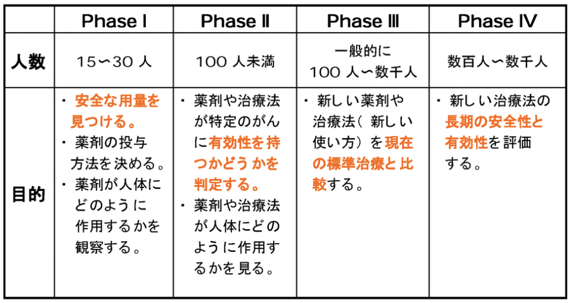
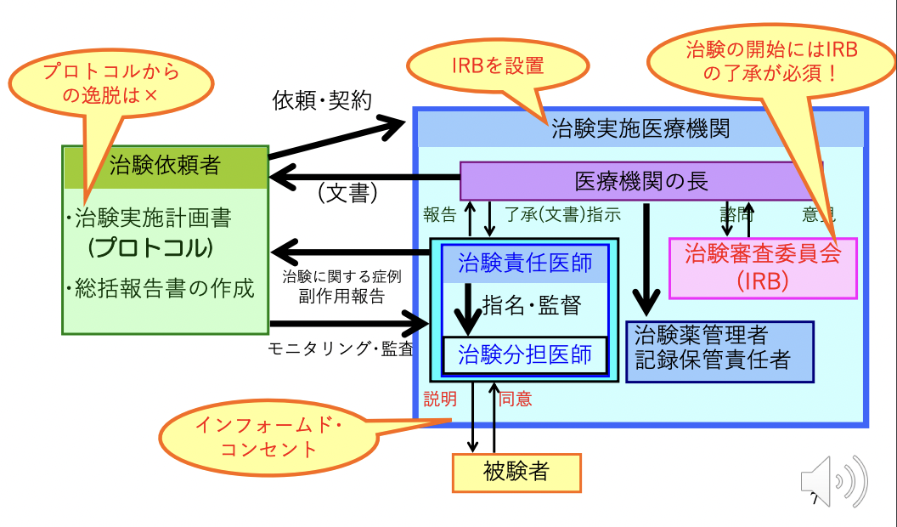

# 1003 薬理学総論VII（薬剤開発）
## QUESTION
1. 臨床治験の4相を説明せよ
2. プラシーボとプラシーボ効果を説明せよ
3. 2重盲検法の説明

## 1. 薬の研究開発(R&D)
新薬の研究開発は、成功率よりリスクの方が圧倒的に高い。  
新薬となって医療の場に供給できる確率は、1/**11,000**。多額の研究開発費と長い年月を費やしたものの、開発途中で研究を断念しなければならないケースも珍しくない。  
しかし、一度新薬を新薬を公開することができれば、新薬1品目は平均9～17年で200～300億円儲けることができる。  
## 2. 新規医薬品開発までの流れ
1. **基礎研究**（2〜4年）
2. **前臨床試験**（3〜5年）：**動物実験**。
3. **治験**（3〜5年）：**GLP**の省令に基づいて実施される。
   1. **臨床第I相試験**：**少数の健常人**で**安全性**を検討。
   2. **臨床第II相試験前期・後期**：**少数の患者**で**有効性・安全性**を検討。
   3. **臨床第III相試験**：**多数の患者**で**有用性**を検討。
4. **承認審査**（2〜3年）
5. 製造
6. 販売まで
7. **再審査**

### 臨床試験の開発相
がんの場合は、普通の治験とは異なり、**PhaseIからがん患者を治験対象とする**。   
各Phaseの目的は以下。
- Phase I：**安全な容量を見つける**。
- Phase II：**その薬剤の有効性を判定する**。
- Phase III：**その薬剤と現在の標準治療を比較する**。
- Phase IV：**長期の安全性と有効性を評価する**。
  

## 3. 治験体制
ポイントは以下。
- **治験依頼者が作成したプロトコルから逸脱してはならない**。
- **治験実施医療機関**は**IRB（治験審査委員会）を設置**すること。
- 治験の開始には**IRBの了承**が必要であること。
- **治験分担医師**は被験者に対して**インフォームド・コンセント**を行うこと。  

  

## 4. インフォームド・コンセント
ICとは、**被験者に対する文書による説明と同意を得る**こと。  
**GCP**の省令に基づいて、治験に参加する被験者にはICを取得することが義務づけられている。

## 5. プラセボとプラセボ効果
臨床試験は、**治験薬と対照薬（既存の類似薬）を比較する**ことが目的。  
外観や味が治験薬と全く同じプラセボを作って比較試験を行うこともある。プラセボは、**乳糖**や**でんぷん**などの薬としての効き目のないものであるが、**ある程度の効き目がみられることがある**。これを「**プラセボ効果**」という。

## 6. **二重盲検**法
**臨床試験第Ⅱ相・第Ⅲ相**において、治験薬ー対照薬/プラセボを使い、**担当医師・患者にどちらの薬を使用しているかが分からない**よう公平な第三者が無作為に投薬を割り当て、**結果の科学性を高める**方法。  
渡された薬がどちらか分かってしまうと、そこに医師や患者の先入観が入ることも考えられる。そうした可能性を除外し，公正で客観的なデータを得るためのものが二重盲検法。  

## 7. 製造販売後安全対策
- **PMS**：**市販後調査**
  1. **GVP**（**安全性**に関与）：**副作用・感染症報告**制度
  2. **GPSP**（**有用性**に関与）：**再審査**制度、**再評価**制度

## 適正使用
### 医薬品の適正使用
医薬品の適正使用とは、まず的確な診断に基づき患者の症状にかなった最適の薬剤、剤形と適切な用法・用量が決定され、これに基づき調剤されること、次いで**患者に薬剤についての説明が十分理解され**、**正確に使用された後その効果や副作用が評価され**、**処方にフィードバックされる**という一連のサイクルをいう。
### 守秘義務
医療従事者は、患者の同意を得ずに、患者以外の者に対して診療情報の提供を行うことは、医療従事者の守秘義務に反し、法律上の規定がある場合を除き認められないことに留意しなければならない。

# 1003 基本概念Ⅰ-4 核内受容体・転写因子
## QUESTION
1. orphan receptor とは何か？
2. 核内受容体に対するModulatorとはなにか？例を挙げて説明せよ
3. 2種類の核内受容体の反応形式の概略を示せ

## 1. 核内受容体とは何か？  
**DNA結合領域**・**リガンド結合領域**・**可変領域**から構成されている。  
リガンドが細胞内に侵入し、細胞質あるいは核内において受容体と結合する。リガンド結合により受容体は活性化し、**核内に移行してDNAに直接結合して転写を制御する**。つまり、核内受容体は**転写因子**の一種でもある。このような受容体を核内受容体と呼ぶ。  
ヒトでは、48-60種類ある。

## 2. 転写因子とは何か？
転写因子とは、**遺伝子の転写調節部位に結合して転写を制御するタンパク質**のこと。  
- 広義の転写因子：**転写に係るRNA polymerase以外の因子全て**。  
- 狭義の転写因子：**RNAポリメラーゼの足場となる複合体を形成する因子**。  

### 転写因子の具体的な転写調節機構
以下の3過程からなる。
1) **転写調節部位に結合**。
2) **クロマチンを開示**。
3) **転写促進**。  

促進的に働くのは、**転写活性化因子（transcription activator)**。  
逆に抑制的に働くのが、**転写抑制因子(transcription repressor)**。

### 転写調節部位とは？
- **promoter**
- **enhancer**
- **silencer**

## 3. 転写因子の結合部位
転写因子の結合部位の**DNA配列（hormone responsive element）**には**厳格な法則**が存在する。

## 4. 核内受容体作用形式
### type1
**リガンドが核内受容体のリガンド結合領域に結合** -> **リガンド結合領域からinhibitorが取れる** -> **核内に移行** -> 核**内受容体のDNA結合領域がDNAの特定の部位に結合**。  
eg. **Estrogen receptor**、**Progesteron receptor**、**Glucocorticoid receptor**
### type2
このタイプの受容体は、**それぞれの特異的なreceptorと共通受容体分子RXRがheterodimerを形成して働く**。**常に核内に存在する**。
- Ligandの結合がない状態 -> **転写調節領域に結合して、遺伝子発現を抑制**
- Ligandが結合している状態 -> **遺伝子発現を誘導する**

eg. **Thyroid hormone receptor**、**Vitamin D receptor**、**Retinoic acid receptor**

## 5. Orphan Receptorとは何か？
Orphan Receptorとは、**Ligandが未知の受容体**のこと。  
eg. **PPAR-γ（ペルオキシソーム増殖因子活性化受容体）**、**LXR（肝臓X受容体）**

##  6. 転写共役因子 Cofactor
転写共役因子とは、**直接DNAに結合する狭義の転写因子以外の転写因子**のこと。  
**Co-activator**と**Co-repressor**からなる。
- Co-activatorの作用形式：**ヒストンをアセチル化してユークロマチン化** -> **遺伝子発現↑**。
- Co-repressorの作用形式：**ヒストンを脱アセチル化してヘテロクロマチン化** -> **遺伝子発現↓**。

## 7. 転写因子の特異性
1つの転写因子には**多数の標的遺伝子**がある。  
-> **転写因子の機能を修飾すれば同時に多種類の変化が起こりうる**ことを意味する。  

## 8. 薬剤の理想
1. **ある特定の臓器や細胞にのみ働かせたい**
2. **ある遺伝子（分子）のみに働かせたい**  

これができないために**副作用**が出現する。しかしこの達成には多大な困難が存在する。そこで出てきた概念が**核内受容体に対するModulator**という概念。

## 9. 核内受容体に対するModulatorとはなにか？
Modulatorとは、**核内受容体の機能の一部を修飾する薬物**。  
分子機序：**組織特異的な働きを持つCo-factorの機能を修飾** -> **核内受容体の機能の一部を調節**。
### **WSERM Selective estrogen receptor modulator** 
**Estrogen receptorに結合して、組織特異的にestrogenのアゴニスト/アンタゴニストとして作用する**化合物の総称。  
**Raloxifen**eは、**骨代謝**や**脂質代謝**には**アゴニスト**として、**子宮内膜**や**乳房組織**には**アンタゴニスト**として作用するため、**骨粗鬆症治療薬**として用いられている。

