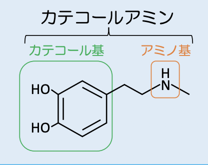
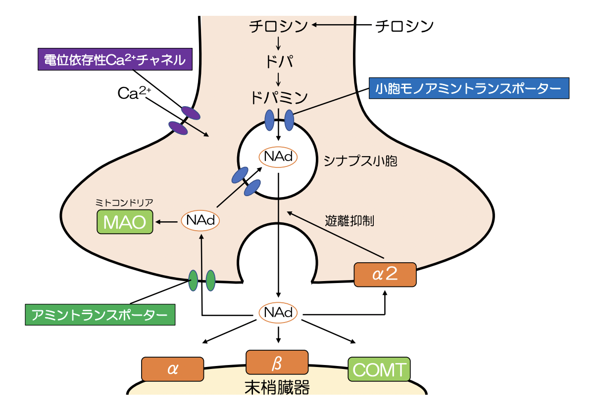
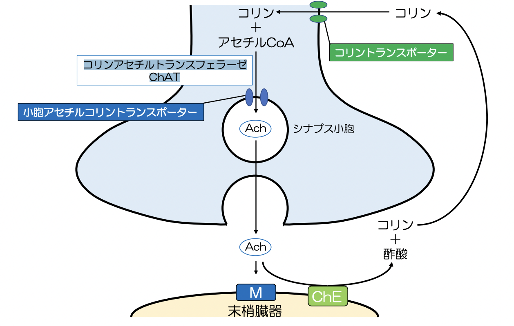

# 1003 交感神経作用薬
## G proteinの機序を確認すること
# 自律神経作用薬の全体像
- 自律神経作用薬
  - 交感神経作用薬
    - 交感神経興奮薬
      - 直接型
        - α/β受容体刺激薬
        - α1受容体刺激薬
        - 非選択的β受容体刺激薬
        - β1受容体刺激薬
        - β2受容体刺激薬
        - β3受容体刺激薬
      - 間接型
      - 混合型
    - 交感神経遮断薬
      - 受容体遮断型  
        - α1/β受容体遮断薬
        - 非選択的α受容体遮断薬
        - α1受容体遮断薬
        - 非選択的β受容体遮断薬
        - β1受容体遮断薬
      - 分泌抑制型
        - ノルアドレナリン枯渇薬
        - ノルアドレナリン遊離阻害薬 
  - 副交感神経作用薬
    - 副交感神経興奮薬
      - 直接型
        - コリンエステル類
        - 合成コリンエステル類
        - コリン作動性アルカロイド
        - その他コリン作動薬
      - 間接型
        - 可逆的コリンエステラーゼ阻害薬
        - 不可逆的コリンエステラーゼ阻害薬
    - 副交感神経遮断薬
      - 受容体遮断型  
        - 天然物質
        - 合成品


# 1. 自律神経系
## カテコールアミンの代謝
カテコールアミンは、カテコール基とアミノ基からなる。   
    
ドーパミン・ノルアドレナリン・アドレナリンの3つがある。  
代謝過程は以下。
```
チロシン　-> ドパ -> ドパミン -> ノルアドレナリン NAd -> アドレナリンAd 
```
律速段階は、チロシン　-> ドパの反応。   
ノルアドレナリンとアドレナリンは、MAOやCOMTによって分解されて、バニリルマンデル酸になる。  
抹消投与による中枢作用は発現しない。  
- 経口投与：消化管で分解 or 肝臓で代謝
- 静注投与：BBBを通過しない  



## アセチルコリンの代謝
  

## 自律神経系の受容体分布と刺激効果
- α1
  - Gq
  - 作用：血管・気管支・瞳孔散大筋・消化管・子宮・尿道の平滑筋収縮、胃の括約筋弛緩
- α2
  - 作用：膵臓にてインスリン分泌低下
- β1
  - Gs
  - 作用：心臓の機能亢進、腸管の括約筋弛緩、腎のレニン分泌
- β2
  - Gs
  - 作用：血管・気管支・子宮・膀胱の平滑筋弛緩、肝臓にてグリコーゲン分泌促進、膵臓にてグルカゴン分泌増加
- β3
  - Gs 
  - 作用：膀胱の平滑筋弛緩、脂肪の分解
- M1
  - Gq
  - 分布：胃と神経
- M2
  - Gi
  - 分布：心臓と神経終末
- M3
  - Gq
  - 分布：平滑筋と分泌腺

### cf. 散瞳と縮瞳
- 散瞳：α1刺激による瞳孔散大筋収縮
- 縮瞳：M3刺激による瞳孔括約筋収縮

### cf. 蓄尿と排尿
- 蓄尿
  - β2/β3刺激による膀胱平滑筋の平滑筋弛緩
  - α1刺激による内尿道括約筋収縮
  - β2刺激による外尿道括約筋収縮
- 排尿
  - M3刺激による膀胱平滑筋収縮
  - M3刺激による内尿道括約筋弛緩

# 2. 交感神経興奮薬の作用機序
- 直接型：直接受容体に作用して効果器を興奮させる。
- 間接型：交感神経終末に作用して内因性NAdを遊離させる。
- 混合型：直接型と間接型の両方の性質を併有する。

## 2.1. 直接型交感神経興奮薬
### 2.1.1. α/β受容体刺激薬
薬剤：アドレナリン、ノルアドレナリン
#### 2.1.1.1. アドレナリン
- 作用の強さ
  - α1 ＝ α2 ＝ β1 ＝ β2
- 作用  
  - 心臓：β1刺激　-> 心機能亢進
  - 血管
    - 皮膚血管・内臓血管：α1 > β2 -> 血管収縮
    - 骨格筋血管・冠血管：α1 < β2受容体 -> 血管拡張
  - 瞳孔：α1刺激 -> 瞳孔散大筋収縮 （散瞳）
  - 気管支：β2刺激 -> 気管支平滑筋弛緩 （気管支拡張）
  - 消化管：β2刺激 -> 消化管平滑筋弛緩 （消化抑制）
  - 膀胱
    - β2/β3刺激 -> 膀胱平滑筋弛緩（蓄尿）
    - α1刺激 -> 内尿道括約筋収縮 （蓄尿）
  - 子宮：β2刺激 -> 子宮平滑筋弛緩 （非妊娠時の子宮収縮抑制）
  - 肝臓：β2刺激 -> グリコーゲン分解促進 -> 末梢への糖取り込み増加 -> エネルギー消費増加
  - 膵臓
    - α2刺激 -> インスリン分泌低下 -> 末梢への糖取り込み増加 -> エネルギー消費増加
    - β2刺激 -> グルカゴン分泌増加　-> 末梢への糖取り込み増加 -> エネルギー消費増加
  - 脂肪細胞：β3刺激 -> 脂肪分解促進 -> エネルギー消費増加  
- 適用
  - 血管収縮作用による局所麻酔薬効果延長
  - 鼻閉
  - 消化管内止血
  - 散瞳
- 備考
  - アドレナリン反転  
    -> α受容体遮断薬を投与した後にアドレナリンを急速静注すると、β2作用による血圧拡張作用のみが起こり、血圧が低下する。ノルアドレナリンは、β2作用が弱いためアドレナリン反転は認められない。  

#### 2.1.1.2. ノルアドレナリン
- 作用の強さ
  - α1 ＝ α2 > β1 >> β2
- 作用
  - 心臓：β1刺激　-> 心機能亢進
  - 血管：皮膚血管や内臓血管では、α1 > β2 -> 血管収縮
- 適用
  - ショック時の心臓刺激   
- 備考
  - ドロキシドパ
    - ノルアドレナリンのプロドラッグ。経口投与可能な昇圧薬。  
  - 反射性徐脈の可能性あり。
    - 血圧が上昇すると、圧受容器（頸動脈洞・大動脈弓）が感知し減圧反射が働き、迷走神経（Ach -> 心臓M2受容体）を介した反射性徐脈が起きる。

### 2.1.2. α1受容体刺激薬
- 薬剤
  - フェニレフリン
  - ミドドリン
  - エチレフリン
  - ナファゾリン
  - テトラヒドロゾリン
  - トラマゾリン
  - オキシメタゾリン  
- 作用 
  - 血管：皮膚血管や内臓血管では、α1 -> 血管収縮 -> 血圧上昇
  - 瞳孔：α1 -> 瞳孔散大筋収縮 （散瞳）
- 適用
  - 低血圧
  - 散瞳
  - 充血・鬱血の改善 by ナファゾリン、テトラヒドロゾリン、トラマゾリン、オキシメタゾリン
- 副作用
  - 高血圧
  - 眼圧上昇 -> 緑内障
- 備考
  - 反射性徐脈の可能性あり。

### 2.1.3. 非選択的β受容体刺激薬
- 薬剤
  - イソプレナリン（イソプロテレノール）
- 作用
  - 心臓：β1刺激　-> 心機能亢進
  - 血管：骨格筋血管・冠血管：α1 < β2受容体 -> 血管拡張
  - 気管支：β2刺激　-> 気管支平滑筋弛緩（気管支拡張）
- 適用
  - 高度の徐脈
  - 気管支喘息
  - 内耳障害に基づく目眩
- 副作用
  - 低カリウム血症
  - 頭痛
  - 振戦（骨格筋の筋紡錘興奮）
- 備考
  - β2受容体刺激薬による低カリウム血症
    - 機序β2受容体刺激 -> Na+/K+ ATPaseが活性化 -> 細胞内へK+取り込み -> 低カリウム血症

### 2.1.4. β1受容体刺激薬
- 薬剤
  - ドブタミン
  - デノパミン
- 作用
  - 心臓：β1刺激　-> 心機能亢進
- 適用
  - 強心薬
- 副作用
  - 不整脈
  - 血圧上昇
  - 胃腸症状
  - 頭痛
- 備考
  - ドブタミンは合成カテコールアミンであるため、経口不可。静注投与するため、急性心不全に適用。　
  - デノパミンは非カテコールアミンであるため、経口可能。経口投与するため、慢性心不全に適用。

### 2.1.5. α2受容体刺激薬
- 薬剤
  - リトドリン *
  - イソクスプリン * 
  - トリメトキノール
  - オルシプレナリン
  - サルブタモール
  - テルブタリン
  - ツロブテロール
  - プロカテロール
  - フェノテロール
  - ホルモテロール
  - クレンブテロール
  - サルメテロール
  - マブテロール
  - インダカテロール
  - メトキシフェナミン
- 作用
  - 子宮：β2刺激 -> 子宮平滑筋弛緩（子宮収縮抑制）
  - 気管支：β2刺激 -> 気管支平滑筋弛緩（気管支拡張）
- 適用
  - 切迫流産・切迫早産（by *）
  - 気管支喘息・慢性気管支炎・肺気腫・気管支拡張症（by *以外）
- 副作用
  - 低カリウム血症
  - 振戦（β2遮断薬により改善）
  - 頻脈
  - 動悸

### 2.1.6. β3受容体刺激薬
- 薬剤
  - ミラベグロン
  - ビベグロン
- 作用
  - 膀胱：β3刺激 -> 膀胱平滑筋弛緩（蓄尿）
- 適用
  - 過活動膀胱における尿意切迫感・頻尿・切迫性尿失禁
- 副作用
  - 尿閉
  - 高血圧

## 2.2. 間接型交感神経興奮薬
### 2.2.1. 間接型アドレナリン作動薬
#### 2.2.1.1. アンフェタミン / メタンフェタミン
- 機序  
  - NAd・DOAの遊離促進 or 再取り込み阻害 or MAO阻害 -> シナプス間隙のNAd・DOA濃度を増加 -> α1/β1刺激
- 適用
  - ナルコレプシー・昏睡・うつ・麻酔からの覚醒
- 副作用
  - 精神的依存
  - 耐性
  - 興奮
  - 不眠
  - 心悸亢進
  - 頻脈
  - 血圧上昇
- 備考
  - 身体的依存はほとんどない。
  - タキフィラキシーを起こす。
  - 覚醒剤に分類（大脳皮質興奮作用あり）される。

#### 2.2.1.2. アメジニウム
- 機序
  - 交感神経終末に取り込み -> NAdの再取り込み阻害/MAO阻害 -> 交感神経機能の亢進
- 適用
  - 本態性低血圧
  - 起立性低血圧
  - 透析施行時の血圧低下の改善
- 副作用
  - 動悸
  - 頻脈
  - 血圧変動
  - 不整脈
  - 頭痛
  - 立ちくらみ

#### 2.2.1.3. フロプロピオン
- 機序
  - COMT阻害 -> NAd作用強化 -> β刺激 -> Oddi括約筋弛緩
- 適用
  - 胆道ジスキネジア、胆石症、胆嚢炎、胆管炎、膵炎、尿路結石などにおける鎮痛・鎮痙
- 備考
  - チラミン：アミントランスポーターを介して神経終末に取り込まれ、節後線維終末からのNAd遊離を促進し、交感神経興奮作用を示す。MAO阻害薬使用時にチラミンを多く含む食物（チーズ、赤ワイン、チョコレートなど）を摂取すると、高血圧発作を起こすことがある。タキフィラキシーを起こす。

## 2.3. 混合型交感神経興奮薬
### 2.3.1. 混合型交感神経興奮薬
#### 2.3.1.1. エフェドリン / メチルエフェドリン
- 作用
  - 直接作用：β刺激
  - 間接作用：交感神経終末からのNAd遊離を促進。
  - 中枢興奮作用：BBBを通過し、ドパミン遊離促進 / MAO阻害
- 適用
  - 気管支喘息
  - 気管支炎
  - 感冒
  - 上気道炎を伴う咳嗽
  - 鼻粘膜の充血（α1）
- 副作用
  - 動悸（β1）
  - 血圧上昇（α1）
  - 不整脈（β1）
  - 振戦（β2）
  - 低カリウム血症（β2）
  - 不眠（乱用による中枢興奮）
- 備考
  - 経口投与で有効。  
    - 生体膜透過性が高く、COMTやMAOで分解されないため。
    - タキフィラキシーを起こす。
  - 気管支拡張作用はエフェドリン>>メチルエフェドリンだが、中枢興奮作用も同じ -> 気管支拡張のためにはメチルエフェドリンを使用。
  - エフェドリンは麻黄の成分。
#### 2.3.1.2. ドパミン / ドカルパミン
- 作用
  - 直接作用：用量によって異なる作用を示す。
    - 少量：D1刺激 -> 腎血管拡張 -> 利尿
    - 中用量：β1刺激 -> 心機能亢進
    - 多量：α1刺激 -> 血管収縮
  - 間接作用：ノルアドレナリン遊離を促進
- 適用
  - 急性循環不全時の昇圧（by 静注）
  - ④は③のプロドラッグで、経口投与により持続的効果を示す。
- 副作用
  - 不整脈
  - 動悸
  - 麻痺性イレウス

# 3. 交感神経遮断薬
## 3.1. 交感神経遮断薬の作用機序
1) 受容体遮断型：受容体に作用して、NAdの作用を遮断する。
2) 機能抑制型：交感神経終末に作用して、NAdを枯渇 or 遊離を阻害することで、NAdの分泌を抑制する。
### 3.1.1. 受容体遮断型交感神経遮断薬
#### 3.1.1.1. α1/β受容体遮断薬
- 薬剤
  - ラベタロール
  - アモスラロール
  - アロチノロール、
  - カルベジロール
  - ベバントロール
- 作用
  - 心臓：β1遮断 -> 心機能抑制
  - 血管：皮膚血管や内臓血管では、α1受容体 > β2受容体 -> 血管拡張
  - 気管支：β2遮断 -> 気管支平滑筋弛緩
- 適用
  - 高血圧症
  - 狭心症
  - 不整脈
  - 本態性振戦
  - 虚血性心疾患又は拡張型心筋症に基づく慢性心不全
- 禁忌
  - 気管支喘息
  - 高度徐脈
  - 洞房・房室ブロック

#### 3.1.1.2. 非選択的α受容体遮断薬
- 薬剤
  - フェントラミン
- 作用
  - 血管：α1遮断 -> 血管拡張
  - 交感神経終末：α2遮断 -> NAd遊離増加 -> 心機能亢進
- 適用
  - 褐色性細胞腫（過剰なAd・NAdの循環）の診断
  - 術前・術後の血圧降下
- 副作用
  - 低血圧
  - 不整脈
- 備考
  - 麦角アルカロイド：エルゴタミン、エルゴメトリンなどを主成分とする。α受容体・ドパミン受容体・セロトニン受容体に部分作用薬および拮抗薬として作用するため、薬理作用は多岐にわたる。
    - エルゴタミン ：血管収縮作用 -> 片頭痛薬（禁忌：狭心症）
    - エルゴメトリン：子宮収縮作用 -> 分娩後の子宮出血
 
#### 3.1.1.3. α1受容体遮断薬
- 薬剤
  - ブナゾシン
  - ドキサゾシン
  - プラゾシン
  - テラゾシン
  - ウラピジル
  - タムスロシン
  - シロドシン
  - ナフトピジル
- 作用
  - 血管：α1遮断 -> 血管平滑筋弛緩 -> 血圧低下
  - 前立腺：α1遮断 -> 前立腺平滑筋弛緩 -> 前立腺肥大改善
  - 膀胱：α1遮断 -> 内尿道括約筋弛緩 -> 排尿改善

#### 3.1.1.4. 非選択的β受容体遮断薬
- 薬剤
  - 【ISA(−)】
    - プロプラノロール
    - チモロール
    - ナドロール
    - ニプラジロール
    - ブフェトロール
  - 【ISA(+)】
    - ピンドロール
    - カルテオロール
- 作用
  - 心臓：β1遮断 -> 心機能抑制
  - 血管：NO遊離 -> 血管拡張 by ニプラジロール
  - 毛様体：β2遮断 -> 毛様体平滑筋収縮 -> 隅角開放
  - 気管支：β2遮断 -> 気管支平滑筋収縮 -> 気管支収縮
- 適用
  - 不整脈
  - 狭心症
  - 高血圧症
  - 緑内障
  - 片頭痛の発生抑制
- 副作用
  - うっ血性心不全
  - 徐脈
  - 末梢虚血
  - 血糖降下
- 禁忌
  - 気管支喘息
  - 高度徐脈
  - 洞房・房室ブロック

#### 3.1.1.5. β1受容体遮断薬
- 薬剤
  - 【ISA(−)】
    - アテノロール
    - メトプロロール
    - ビソプロロール
    - ベタキソロール
    - エスモロール
    - ランジオロール
  - 【ISA(+)】
    - アセブトロール
    - セリプロロール
- 作用  
  - 心臓：β1遮断 -> 心機能抑制
- 適用
  - 不整脈
  - 狭心症
  - 高血圧症
  - 緑内障
  - 虚血性心疾患又は拡張型心筋症に基づく慢性心不全
- 禁忌
  - 高度徐脈
  - 急性心不全
  - 洞房・房室ブロック
- 備考
  - 気管支喘息患者には慎重投与を行うこと。
  - 長期投与後の休薬はリバウンド（狭心症の悪化）を起こすため徐々に減量する。

#### 泌尿器系
- 膀胱平滑筋
  - β2：弛緩
  - β3：弛緩
  - M3：収縮
- 内尿道括約筋
  - α1：収縮
  - M3：弛緩
- 前立腺平滑筋
  - α1：収縮
- 外尿道括約筋
  - β2：収縮  

##### 前立腺肥大
前立腺肥大 -> 尿道を圧迫 -> 排尿障害 -> 尿閉 or 腎機能低下

##### 緑内障
緑内障は、眼房水の産生抑制・排出促進が有効。
- 瞳孔散大筋の収縮 ＝ 隅角閉塞 -> α1刺激不可
- 瞳孔括約筋の弛緩 = 隅角閉塞 -> M3遮断不可

##### ISA Intrinsic Sympathomimetic Activity 内因性交感神経刺激作用
β受容体を軽く刺激する作用のこと。  
ISAにより、交感神経が興奮している時はβ受容体を抑制し、交感神経が興奮していない時には、β受容体をわずかに刺激することになり、安静時の心拍数に与える影響が少ないことや徐脈が発生しにくいなどの作用がある。
- ISA(+)：心拍出量を減少させ過ぎず、高齢者や徐脈の患者さんに適する。
^ ISA(-)：心拍出量を減少させるため、狭心症や頻脈の患者さんに適する心筋梗塞の再発や虚血性疾患を防止し、心不全の予後を改善する。

## 3.2. 分泌抑制型交感神経遮断薬
### 3.2.1. ノルアドレナリン枯渇薬
- 薬剤
  - レセルピン
- 作用：小胞モノアミントランスポーターを阻害 -> NAd、ドパミンを枯渇させる -> 降圧作用・鎮静作用
- 適用  
  - 高血圧
  - 統合失調症
- 副作用
  - うつ状態
  - 消化器症状（副交感神経優位になるため）
  - 徐脈
  - 植物アルカロイド
- 備考
  - セロトニンの枯渇も同時に生じる -> うつを誘発
  - レセルピンを前処理後にNAdやAdを処理すると、その作用はレセルピン未処理に比べて増強する。これは効果器の受容体が増加したためであり、過感受性という。
### 3.2.2. ノルアドレナリン遊離阻害薬
- 薬剤
  - ①メチルドパ
  - ②クロニジン
  - ③グアナベンズ
- 作用
  - ①②③：中枢神経系のα2受容体を刺激 -> 交感神経抑制 -> 降圧作用。
  - ②③：交感神経終末のα2刺激　-> NAdの遊離抑制
- 適用
  - 高血圧
- 副作用
- 口渇、めまい、眠気、徐脈、起立性低血圧、肝機能障害長期投与後の休薬はリバウンド（血圧上昇）を起こすため徐々に減量する。