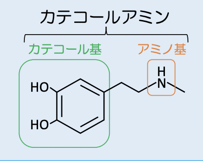
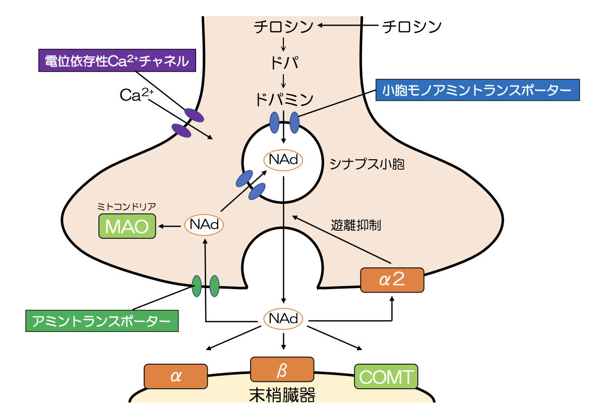
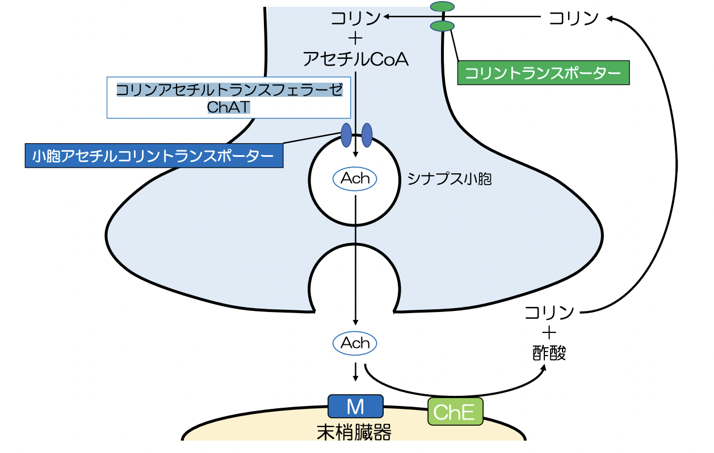

# 1003 交感神経作用薬
## G proteinの機序を確認すること
# 自律神経作用薬の全体像
- 自律神経作用薬
  - **交感神経作用薬**
    - **交感神経興奮薬**
      - **直接型**
        - **α/β受容体刺激薬**
        - **α1受容体刺激薬**
        - **非選択的β受容体刺激薬**
        - **β1受容体刺激薬**
        - **β2受容体刺激薬**
        - **β3受容体刺激薬**
      - **間接型**
      - **混合型**
    - **交感神経遮断薬**
      - **受容体遮断型**  
        - **α1/β受容体遮断薬**
        - **非選択的α受容体遮断薬**
        - **α1受容体遮断薬**
        - **非選択的β受容体遮断薬**
        - **β1受容体遮断薬**
      - **分泌抑制型**
        - **ノルアドレナリン枯渇薬**
        - **ノルアドレナリン遊離阻害薬** 
  - **副交感神経作用薬**
    - **副交感神経興奮薬**
      - **直接型**
        - **コリンエステル類**
        - **合成コリンエステル類**
        - **コリン作動性アルカロイド**
        - **その他コリン作動薬**
      - **間接型**
        - **可逆的コリンエステラーゼ阻害薬**
        - **不可逆的コリンエステラーゼ阻害薬**
    - **副交感神経遮断薬**
      - **受容体遮断型**
        - **天然物質**
        - **合成品**


# 1. 自律神経系
## カテコールアミンの代謝
カテコールアミンは、**カテコール基とアミノ基**からなる。   
    
**ドーパミン**・**ノルアドレナリン**・**アドレナリン**の3つがある。  
代謝過程は以下。
```
チロシン　-> ドパ -> ドパミン -> ノルアドレナリン NAd -> アドレナリンAd 
```
律速段階は、**チロシン**　-> **ドパ**の反応。   
**ノルアドレナリンとアドレナリン**は、**MAO**や**COMT**によって**分解**されて、**バニリルマンデル酸**になる。  
抹消投与による中枢作用は**発現しない**。  
- 経口投与：**消化管で分解** or **肝臓で代謝**
- 静注投与：**BBBを通過しない**  



## アセチルコリンの代謝
  

## 自律神経系の受容体分布と刺激効果
- **α1**
  - G**q**
  - 作用：**血管・気管支・瞳孔散大筋・消化管・子宮・尿道の平滑筋収縮、胃の括約筋弛緩**
- **α2**
  - G**i**
  - 作用：**膵臓にてインスリン分泌低下**
- **β1**
  - G**s**
  - 作用：**心臓の機能亢進、腸管の括約筋弛緩、腎のレニン分泌**
- **β2**
  - G**s**
  - 作用：**血管・気管支・子宮・膀胱の平滑筋弛緩、肝臓にてグリコーゲン分泌促進、膵臓にてグルカゴン分泌増加**
- **β3**
  - G**s** 
  - 作用：**膀胱の平滑筋弛緩、脂肪の分解**
- **M1**
  - G**q**
  - 分布：**胃と神経**
- **M2**
  - G**i**
  - 分布：**心臓と神経終末**
- **M3**
  - G**q**
  - 分布：**平滑筋と分泌腺**

### cf. 散瞳と縮瞳
- 散瞳：**α1**刺激による**瞳孔散大筋収縮**
- 縮瞳：**M3**刺激による**瞳孔括約筋収縮**

### cf. 蓄尿と排尿
- 蓄尿
  - **β2/β3**刺激による**膀胱平滑筋の平滑筋弛緩**
  - **α1**刺激による**内尿道括約筋収縮**
  - **β2**刺激による**外尿道括約筋収縮**
- 排尿
  - **M3**刺激による**膀胱平滑筋収縮**
  - **M3**刺激による**内尿道括約筋弛緩**

# 2. 交感神経興奮薬の作用機序
- **直接**型：**直接受容体に作用して効果器を興奮させる**。
- **間接**型：**交感神経終末に作用して内因性NAdを遊離させる**。
- **混合**型：**直接型と間接型の両方の性質を併有する**。

## 2.1. 直接型交感神経興奮薬
### 2.1.1. α/β受容体刺激薬
薬剤：**アドレナリン、ノルアドレナリン**
#### 2.1.1.1. アドレナリン
- 作用の強さ
  - **α1 = α2 ＝ β1 ＝ β2**
- 作用  
  - **心臓**：**β1**刺激　-> **心機能亢進**
  - **血管**
    - **皮膚血管・内臓血管**：**α1 > β2** -> **血管収縮**
    - **骨格筋血管・冠血管**：**α1 < β2** -> **血管拡張**
  - **瞳孔**：**α1**刺激 -> **瞳孔散大筋収縮** -> **散瞳**
  - **気管支**：**β2**刺激 -> **気管支平滑筋弛緩** -> **気管支拡張**
  - **消化管**：**β2**刺激 -> **消化管平滑筋弛緩** -> **消化抑制**
  - **膀胱**
    - **β2/β3**刺激 -> **膀胱平滑筋弛緩** -> **蓄尿**
    - **α1**刺激 -> **内尿道括約筋収縮** -> **蓄尿**
  - **子宮**：**β2**刺激 -> **子宮平滑筋弛緩** -> **非妊娠時の子宮収縮抑制**
  - 肝臓：β2刺激 -> グリコーゲン分解促進 -> 末梢への糖取り込み増加 -> **エネルギー消費増加**
  - 膵臓
    - α2刺激 -> インスリン分泌低下 -> 末梢への糖取り込み増加 -> **エネルギー消費増加**
    - β2刺激 -> グルカゴン分泌増加　-> 末梢への糖取り込み増加 -> **エネルギー消費増加**
  - 脂肪細胞：β3刺激 -> 脂肪分解促進 -> **エネルギー消費増加**  
- 適用
  - 血管収縮作用による局所麻酔薬効果延長
  - 鼻閉
  - 消化管内止血
  - 散瞳
- 備考
  - **アドレナリン反転**  
    -> **α受容体遮断**薬を投与した後にアドレナリンを**急速静注**すると、**β2作用による血圧拡張作用のみが起こり、血圧が低下する**。**ノルアドレナリン**では、**β2作用が弱い**ためアドレナリン反転は認められない。  

#### 2.1.1.2. ノルアドレナリン
- 作用の強さ
  - **α1 ＝ α2 > β1 >> β2**
- 作用
  - **心臓**：**β1**刺激　-> **心機能亢進**
  - **皮膚血管・内臓血管**：**α1 > β2** -> **血管収縮**
- 適用
  - ショック時の心臓刺激   
- 備考
  - **ドロキシドパ**
    - ノルアドレナリンの**プロドラッグ**。**経口投与可能な昇圧**薬。  
  - **反射性徐脈**の可能性あり。
    - ノルアドレナリンにより**血圧が上昇**すると、**圧受容器（頸動脈洞・大動脈弓）**が感知し**減圧反射**が働き、**迷走神経（Ach -> 心臓M2受容体）**を介して徐**脈**が起きる。

### 2.1.2. α1受容体刺激薬
- 薬剤
  - **フェニレフリン**
  - **ミドドリン**
  - **エチレフリン**
  - **ナファゾリン**
  - **テトラヒドロゾリン**
  - **トラマゾリン**
  - **オキシメタゾリン**  
- 作用 
  - **血管**：**皮膚血管や内臓血**管では、**α1** -> **血管収縮** -> **血圧上昇**
  - 瞳孔：α1 -> 瞳孔散大筋収縮 （散瞳）
- 適用
  - **低血圧**
  - 散瞳
  - **充血・鬱血の改善** by **ナファゾリン、テトラヒドロゾリン、トラマゾリン、オキシメタゾリン**
- 副作用
  - 高血圧
  - 眼圧上昇 -> 緑内障
- 備考
  - **反射性徐脈**の可能性あり。

### 2.1.3. 非選択的β受容体刺激薬
- 薬剤
  - **イソプレナリン（イソプロテレノール）**
- 作用
  - **心臓**：**β1**刺激　-> **心機能亢進**
  - **血管**
    - **骨格筋血管・冠血管**：**α1 < β2** -> **血管拡張**
  - **気管支**：**β2**刺激 -> **気管支平滑筋弛緩** -> **気管支拡張**
- 適用
  - **高度の徐脈**
  - **気管支喘息**
  - 内耳障害に基づく目眩
- 副作用
  - 低カリウム血症
  - 頭痛
  - 振戦（骨格筋の筋紡錘興奮）
- 備考
  - **β2受容体刺激**薬による**低カリウム血症**
    - 機序：**β2受容体刺激** -> **Na+/K+ ATPaseが活性化** -> **細胞内へK+取り込み** -> **低カリウム血症**

### 2.1.4. β1受容体刺激薬
- 薬剤
  - **ドブタミン**
  - **デノパミン**
- 作用
  - **心臓**：**β1**刺激　-> **心機能亢進**
- 適用
  - **強心薬**
- 副作用
  - 不整脈
  - 血圧上昇
  - 胃腸症状
  - 頭痛
- 備考
  - ドブタミンは**合成カテコールアミン**であるため、**経口不可** -> **静注投与**するため、**急性心不全**に適用。　
  - デノパミンは**非カテコールアミン**であるため、**経口可能** -> **経口投与**するため、**慢性心不全**に適用。

### 2.1.5. α2受容体刺激薬
- 薬剤
  - **リトドリン**
  - **イソクスプリン** 
  - **トリメトキノール**
  - **オルシプレナリン**
  - **サルブタモール**
  - **テルブタリン**
  - **ツロブテロール**
  - **プロカテロール**
  - **フェノテロール**
  - **ホルモテロール**
  - **クレンブテロール**
  - **サルメテロール**
  - **マブテロール**
  - **インダカテロール**
  - **メトキシフェナミン**
- 作用
  - **子宮**：**β2**刺激 -> **子宮平滑筋弛緩** -> **非妊娠時の子宮収縮抑制**
  - **気管支**：**β2**刺激 -> **気管支平滑筋弛緩** -> **気管支拡張**
- 適用
  - **切迫流産・切迫早産**（by **リトドリン、イソクスプリン**）
  - **気管支喘息**・慢性気管支炎・肺気腫・気管支拡張症（by **リトドリン、イソクスプリン以外**）
- 副作用
  - 低カリウム血症
  - **振戦**（**β2遮断薬**により改善）
  - 頻脈
  - 動悸

### 2.1.6. β3受容体刺激薬
- 薬剤
  - **ミラベグロン**
  - **ビベグロン**
- 作用
  - **膀胱**：**β3**刺激 -> **膀胱平滑筋弛緩**-> **蓄尿**
- 適用
  - **過活動膀胱における尿意切迫感・頻尿・切迫性尿失禁**
- 副作用
  - 尿閉
  - 高血圧

## 2.2. 間接型交感神経興奮薬
### 2.2.1. 間接型アドレナリン作動薬
#### 2.2.1.1. アンフェタミン / **メタンフェタミン**
- 機序  
  - **NAd・DOAの遊離促進 or 再取り込み阻害 or MAO阻害** -> **シナプス間隙のNAd・DOA濃度を増加** -> **α1/β1刺激**
- 適用
  - ナルコレプシー・昏睡・うつ・麻酔からの覚醒
- 副作用
  - 精神的依存
  - 耐性
  - 興奮
  - 不眠
  - 心悸亢進
  - 頻脈
  - 血圧上昇
- 備考
  - 身体的依存はほとんどない。
  - タキフィラキシーを起こす。
  - 覚醒剤に分類（大脳皮質興奮作用あり）される。

#### 2.2.1.2. **アメジニウム**
- 機序
  - **交感神経終末に取り込み** -> **NAdの再取り込み阻害/MAO阻害** -> 交感神経機能の亢進
- 適用
  - **本態性低血圧**
  - **起立性低血圧**
  - 透析施行時の血圧低下の改善
- 副作用
  - 動悸
  - 頻脈
  - 血圧変動
  - 不整脈
  - 頭痛
  - 立ちくらみ

#### 2.2.1.3. **フロプロピオン**
- 機序
  - **COMT阻害** -> **NAd作用強化** -> β刺激 -> Oddi括約筋弛緩
- 適用
  - 胆道ジスキネジア、胆石症、胆嚢炎、胆管炎、膵炎、尿路結石などにおける鎮痛・鎮痙
- 備考
  - チラミン：アミントランスポーターを介して神経終末に取り込まれ、節後線維終末からのNAd遊離を促進し、交感神経興奮作用を示す。MAO阻害薬使用時にチラミンを多く含む食物（チーズ、赤ワイン、チョコレートなど）を摂取すると、高血圧発作を起こすことがある。タキフィラキシーを起こす。

## 2.3. 混合型交感神経興奮薬
### 2.3.1. 混合型交感神経興奮薬
#### 2.3.1.1. **エフェドリン** / **メチルエフェドリン**
- 作用
  - 直接作用：**β刺激**
  - 間接作用：**交感神経終末からのNAd遊離を促進。**
  - **中枢興奮**作用：**BBBを通過し、ドパミン遊離促進 / MAO阻害**
- 適用
  - **気管支喘息**
  - 気管支炎
  - 感冒
  - 上気道炎を伴う咳嗽
  - 鼻粘膜の充血（α1）
- 副作用
  - 動悸（β1）
  - **血圧上昇**（**α1**）
  - 不整脈（β1）
  - 振戦（β2）
  - 低カリウム血症（β2）
  - **不眠**（-> **乱用による中枢興奮**）
- 備考
  - **経口投与**で有効。  
    - **生体膜透過性が高く**、**COMTやMAOで分解されない**ため。
    - タキフィラキシーを起こす。
  - 気管支拡張作用はエフェドリン>>メチルエフェドリンだが、中枢興奮作用も同じ -> 気管支拡張のためにはメチルエフェドリンを使用。
  - エフェドリンは麻黄の成分。
#### 2.3.1.2. **ドパミン** / **ドカルパミン**
- 作用
  - 直接作用：用量によって異なる作用を示す。
    - 少量：D1刺激 -> 腎血管拡張 -> 利尿
    - 中用量：**β1**刺激 -> **心機能亢進**
    - 多量：**α1**刺激 -> **血管収縮**
  - 間接作用：ノルアドレナリン遊離を促進
- 適用
  - **急性循環不全時の昇圧**（by **静注**）
  - ④は③のプロドラッグで、経口投与により持続的効果を示す。
- 副作用
  - 不整脈
  - 動悸
  - 麻痺性イレウス

# 3. 交感神経遮断薬
## 3.1. 交感神経遮断薬の作用機序
1) **受容体遮断**型：**受容体に作用して、NAdの作用を遮断する**。
2) **機能抑制**型：**交感神経終末に作用して、NAdを枯渇 or 遊離を阻害することで、NAdの分泌を抑制する**。
### 3.1.1. 受容体遮断型交感神経遮断薬
#### 3.1.1.1. α1/β受容体遮断薬
- 薬剤
  - **ラベタロール**
  - **アモスラロール**
  - **アロチノロール**
  - **カルベジロール**
  - ベバントロール
- 作用
  - **心臓**：**β1遮断** -> **心機能抑制**
  - **血管**：**皮膚血管や内臓血管**では、**α1 > β2** -> **血管拡張**
  - **気管支**：**β2遮断** -> **気管支平滑筋弛緩**
- 適用
  - **高血圧症**
  - 狭心症
  - 不整脈
  - 本態性振戦
  - 虚血性心疾患又は拡張型心筋症に基づく慢性心不全
- 禁忌
  - **気管支喘息**
  - 高度徐脈
  - 洞房・房室ブロック

#### 3.1.1.2. 非選択的α受容体遮断薬
- 薬剤
  - **フェントラミン**
- 作用
  - **血管**：**α1遮断** -> **血管拡張**
  - **交感神経終末**：**α2遮断** -> **NAd遊離増加** -> **心機能亢進**
- 適用
  - **褐色性細胞腫**（過剰なAd・NAdの循環）の診断
  - 術前・術後の血圧降下
- 副作用
  - 低血圧
  - 不整脈
- 備考
  - **麦角アルカロイド**：**エルゴタミン**や**エルゴメトリン**などを主成分とする。**α受容体**・**ドパミン受容体**・**セロトニン受容体**に、**部分作用薬**および**拮抗薬**として作用するため、薬理作用は多岐にわたる。
    - **エルゴタミン** ：**血管収縮**作用 -> **片頭痛薬**（禁忌：**狭心症**）
    - **エルゴメトリン**：**子宮収縮**作用 -> **分娩後の子宮出血**
 
#### 3.1.1.3. α1受容体遮断薬
- 薬剤
  - **ブナゾシン**
  - **ドキサゾシン**
  - **プラゾシン**
  - **テラゾシン**
  - **ウラピジル**
  - **タムスロシン**
  - **シロドシン**
  - **ナフトピジル**
- 作用
  - **血管**：**α1遮断** -> **血管平滑筋弛緩** -> **血圧低下**
  - **前立腺**：**α1遮断** -> **前立腺平滑筋弛緩** -> **前立腺肥大改善**
  - **膀胱**：**α1遮断** -> **内尿道括約筋弛緩** -> **排尿改善**
- 適用
  - **高血圧**
  - **前立腺肥大に伴う排尿障害**
  - 神経因性膀胱に伴う排尿困難
  - 緑内障
- 副作用
  - 急激な血圧低下
  - 起立性低血圧
  - 射精障害
  - 肝機能障害

#### 3.1.1.4. 非選択的β受容体遮断薬
- 薬剤
  - 【**ISA(−)】**
    - **プロプラノロール**
    - **チモロール**
    - **ナドロール**
    - **ニプラジロール**
    - ブフェトロール
  - **【ISA(+)】**
    - **ピンドロール**
    - **カルテオロール**
- 作用
  - **心臓**：**β1遮断** -> **心機能抑制**
  - 血管：NO遊離 -> 血管拡張 by ニプラジロール
  - 毛様体：β2遮断 -> 毛様体平滑筋収縮 -> 隅角開放
  - **気管支**：**β2遮断** -> **気管支平滑筋収縮** -> **気管支収縮**
- 適用
  - **不整脈**
  - **狭心症**
  - **高血圧症**
  - **緑内障**
  - 片頭痛の発生抑制
- 副作用
  - うっ血性心不全
  - 徐脈
  - 末梢虚血
  - 血糖降下
- 禁忌
  - **気管支喘息**
  - 高度徐脈
  - 洞房・房室ブロック

#### 3.1.1.5. β1受容体遮断薬
- 薬剤
  - **【ISA(−)】**
    - **アテノロール**
    - **メトプロロール**
    - **ビソプロロール**
    - **ベタキソロール**
    - **エスモロール**
    - **ランジオロール**
  - **【ISA(+)】**
    - **アセブトロール**
    - **セリプロロール**
- 作用  
  - **心臓**：**β1遮断** -> **心機能抑制**
- 適用
  - **不整脈**
  - **狭心症**
  - **高血圧症**
  - 緑内障
  - 虚血性心疾患又は拡張型心筋症に基づく慢性心不全
- 禁忌
  - 高度徐脈
  - 急性心不全
  - 洞房・房室ブロック
- 備考
  - **気管支喘息**患者には**慎重投与**を行うこと。
  - **長期投与後の休薬**は**リバウンド（狭心症の悪化）**を起こすため、**徐々に減量**する。

#### 泌尿器系
- 膀胱平滑筋
  - **β2**：**弛緩**
  - **β3**：**弛緩**
  - **M3**：**収縮**
- 内尿道括約筋
  - **α1**：**収縮**
  - **M3**：**弛緩**
- 前立腺平滑筋
  - **α**1：**収縮**
- 外尿道括約筋
  - **β2**：**収縮**  

##### 前立腺肥大
前立腺肥大 -> **尿道を圧迫** -> **排尿障害** -> **尿閉** or **腎機能低下**

##### 緑内障
緑内障は、**眼房水の産生抑制**・**排出促進**が有効。
- **瞳孔散大筋の収縮** ＝ **隅角閉塞** -> **α1刺激不可**
- **瞳孔括約筋の弛緩** = **隅角閉塞** -> **M3遮断不可**

##### ISA **Intrinsic Sympathomimetic Activity** **内因性交感神経刺激作用**
**β受容体を軽く刺激する**作用のこと。  
ISAにより、交感神経が興奮している時は**β受容体を抑制**し、交感神経が興奮していない時には、**β受容体をわずかに刺激する**ことになり、**安静時の心拍数に与える影響が少ない**ことや**徐脈が発生しにくい**などの利点がある。
- ISA(+)：**心拍出量を減少させ過ぎない**ため、**高齢者**や**徐脈**の患者に適する。
- ISA(-)：**心拍出量を減少させる**ため、**狭心症**や**頻脈**の患者に適する。**心筋梗塞の再発**や**虚血性疾患**を**防止**し、**心不全の予後を改善する**。

## 3.2. 分泌抑制型交感神経遮断薬
### 3.2.1. ノルアドレナリン枯渇薬
- 薬剤
  - **レセルピン**
- 作用：**小胞モノアミントランスポーターを阻害** -> **NAd、ドパミンを枯渇させる** -> **降圧作用・鎮静作用**
- 適用  
  - **高血圧**
  - 統合失調症
- 副作用
  - **うつ状態**
  - **消化器症状**（**副交感神経**優位になるため）
  - 徐脈
  - 植物アルカロイド
- 備考
  - セロトニンの枯渇も同時に生じる -> うつを誘発
  - レセルピンを前処理後にNAdやAdを処理すると、その作用はレセルピン未処理に比べて増強する。これは効果器の受容体が増加したためであり、過感受性という。
### 3.2.2. ノルアドレナリン遊離阻害薬
- 薬剤
  - ①**メチルドパ**
  - ②**クロニジン**
  - ③**グアナベンズ**
- 作用
  - by **①②③**：**中枢神経系のα2受容体を刺激** -> **交感神経抑制** -> **降圧作用**
  - by **②③**：**交感神経終末のα2刺激**　-> **NAdの遊離抑制**
- 適用
  - **高血圧**
- 副作用
  - 口渇
  - めまい
  - 眠気
  - 徐脈
  - 起立性低血圧
  - 肝機能障害
- 備考
  - **長期投与後の休薬**は、**リバウンド（血圧上昇）を起こす**ため、**徐々に減量する**。