# 1017 高血圧治療薬　総論
## QUESTIONS
1. 本態性高血圧がなぜ治療されなければならないか説明せよ
2. 本態性高血圧発症に寄与する病態４つを説明せよ
3. 二次性高血圧と本態性高血圧の違いを説明せよ
4. 高血圧に使用する利尿剤を３種類あげ、その作用機序を説明せよ
5. 本態性高血圧に関して、体液の増加の原因は？
6. 本態性高血圧に関して、交感神経系の亢進の原因は？
7. 本態性高血圧に関して、レニン/アンギオテンシン系亢進の原因は何か？
8. 本態性高血圧に関して、Caチャネル活性化のメカニズムは？

## 1. 血圧
```
血圧 = 新拍出量 * 抵抗
```

## 2. 高血圧の基準
|            | 収縮期BP |        | 拡張期BP | 
| ---------- | -------- | ------ | --------- | 
| 至適BP     | < 120    | かつ   | < 80      | 
| 正常BP     | < 130    | かつ   | < 85      | 
| 正常高値BP | 130-139  | または | 85-89     | 
| 軽度HBP    | 140-159  | または | 90-99     | 
| 中等症HBP  | 160-179  | または | 100-109   | 
| 重症HBP    | >= 180   | または | >= 110    | 
| 収縮期HBP  | >= 140   | かつ   | < 90      | 

## 3. 高血圧症の種類／原因
1) **本態性高血圧**（**90-95**％）：**複合的**なメカニズムで起こり、少なくともその一部は解明されていない。
2) **2次性高血圧**（**5-10**％）：以下が原因。原因物質さえ取り除ければ治る。
   1) **副腎腫瘍**
      1) **褐色細胞腫**（10％病、5H)
      2) **原発性アルドステロン症**
      3) **Cushing症候群**
   2) **甲状腺機能亢進疾患**
   3) **腎血管性高血圧**
   4) **腎臓**疾患（複合的機序）

## 4. 高血圧の症状
**概ね症状がない**。  
特に**中等度**以下では、**本当に症状がない**。  
重**症高血圧**のごく一部に、ごくまれに**高血圧性脳症**（= 血圧↑ -> **脳内の毛細血管から血漿成分が漏出** -> **脳が浮腫む**）が起きる。  
しかし、silent diseaseと言えど、下記の疾患リスクが徐々に高まるため、治療は重要。
1) **⼼臓**に対する影響  
   - **⼼筋梗塞**（**冠動脈硬化症**が原因）
   - **狭⼼症**（**冠動脈硬化症**が原因）
   - **求⼼性左⼼室肥⼤**（**壁厚の増大**が原因）
   - **⼼不全**
2) **神経系**に対する影響
   1) **中枢神経の障害**  
    - **脳梗塞**（**動脈硬化**が原因）
    - **脳出⾎**（**動脈硬化**が原因）
    - **⾼⾎圧性脳症**
   2) **網膜の変化** 
    - **細動脈の限局性痙攣**
    - **進⾏性びまん性狭窄および出⾎**
    - **乳頭浮腫の出現**
3) **腎**に対する影響
   - **腎⾎管障害**（**輸出入細動脈・⽷球体⾎管硬化動脈硬化**が原因）
   - **⽷球体障害**
   - **尿細管機能障害**
   - **腎不全**
  
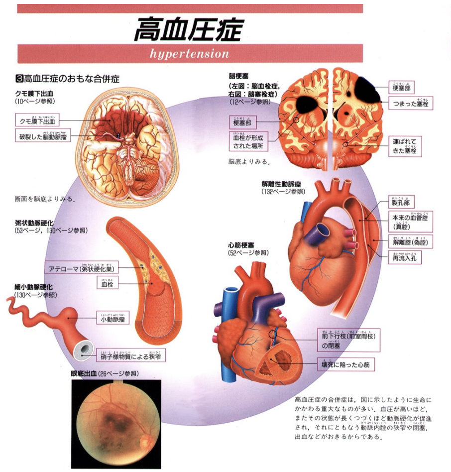  

## 5. 何故高血圧が治療されなければならないのか?
1) **長期的には、高血圧 -> 動脈硬化症の結果、脳血管障害・心血管障害・腎疾患のリスクが高まる**ため。
2) **高血圧の程度がひどい場合、高血圧性脳症が引き起こされる可能性がある**ため。

## 6. 動脈硬化とは
動脈硬化とは、**Atherosclerotic plaqueが形成される**状態。  
**コレステロールエステルが細胞内に蓄積** -> **macrophageや平滑筋細胞が変化** -> **foam cell形成** -> **collagenやfibrin蓄積して徐々に増大** -> **不安定なplaqueの破綻** -> **血小板の活性化** -> **血栓形成** -> **閉塞**。
### 6.1. 動脈硬化のrisk factors
- **脂質異常**
  - **LDL-chol ↑**
  - **HDL-chol ↓**
  - **TG（中性脂肪）↑**
- **高血圧**
- **糖尿病**
- **喫煙**
- **家族歴**
- **年齢**

## 7. 高血圧の治療の効果
高血圧の治療により、以下の効果の他にも、**冠動脈疾患件数↓**・**脳/心血管疾患死亡率↓**の効果があるとされる。
- **脳卒中**：35-40%↓
- **心筋梗塞**：20-25%↓
- **心不全**：50%↓  

## 8. 高血圧の病態
高血圧の原因は、以下の2つ。（血圧算出式より）
1. **心拍出量増加**
   1. **体液増加**
        - **NaCl摂取増加**
        - **体内NaCl量を増やすホルモン（アルドステロン／アルドステロン類似物質）増加**
   2. **心機能増加**  
        - **神経伝達物質/Ad/NAd↑** -> **交感神経系の上昇・副交感神経の低下** -> **心機能亢進**
        - **心機能亢進ホルモン（アドレナリン・ノルアドレナリン）↑**
2. **血管抵抗増加**
   1. **動脈硬化**
   2. **血管平滑筋の収縮傾向**  
        - **血管平滑筋収縮因子（Ad/NAd/アンジオテンシンII）の過剰**
        - **血管平滑筋弛緩因子の低下**
<p>

したがって、治療戦略の観点から言うと、高血圧の病態は以下のように表せる。  
1. **塩分摂取過多**
2. **交感神経系の活性上昇**
3. **レニン／アンギオテンシン系の活性上昇**
4. **血管平滑筋の収縮メカニズム（L型電位依存性Caチャネルの関与）**

### 8.1. レニン-アンジオテンシン-アルドステロン系
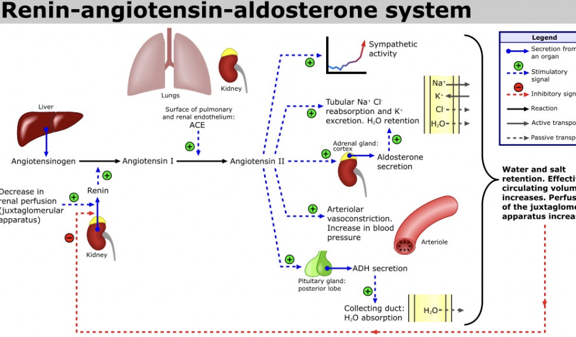  

### 8.2. ホルモンと自律神経系からみた血圧調節機構
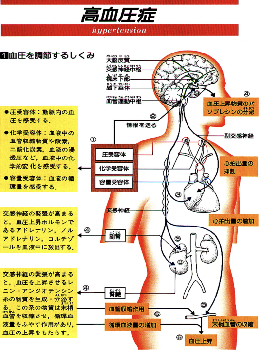  
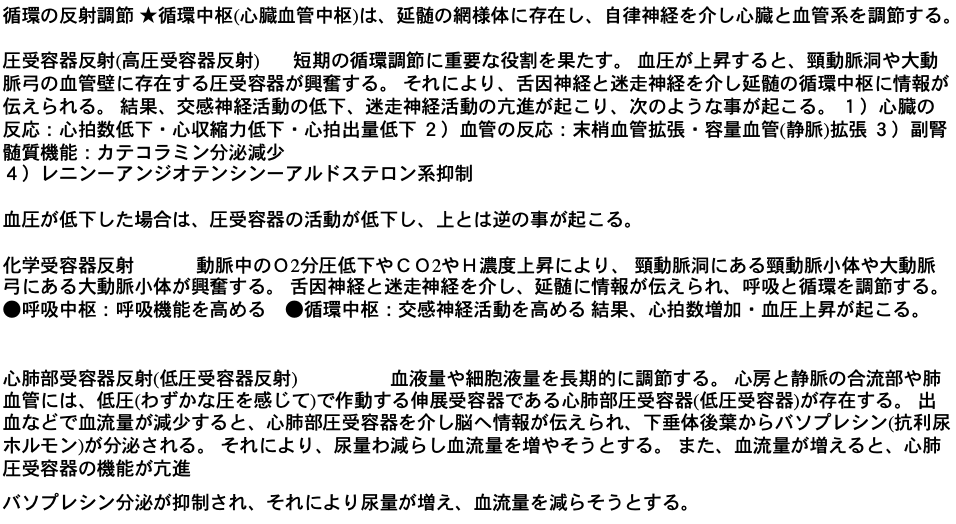

### 8.3. 交感神経終末部におけるＮＥ動態
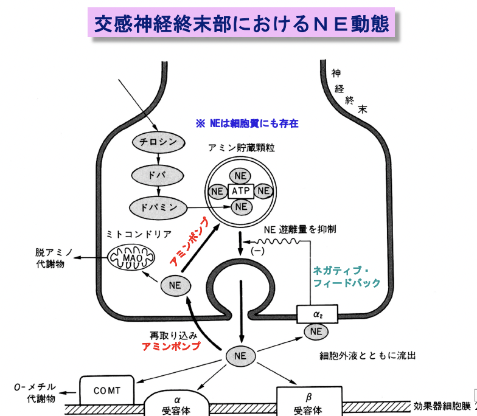
### 8.4. 血管平滑筋の収縮の最終段階の調節
- **ミオシン軽鎖のリン酸化** -> 血管平滑筋収縮
- **ミオシン軽鎖の脱リン酸化** -> 血管平滑筋弛緩
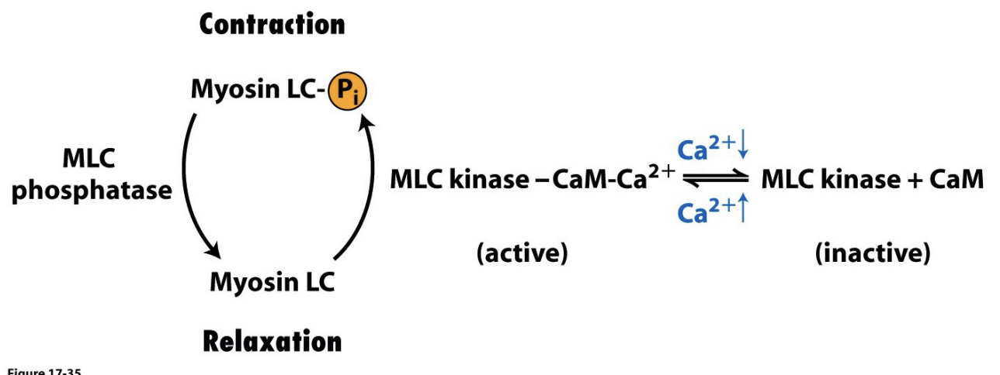  
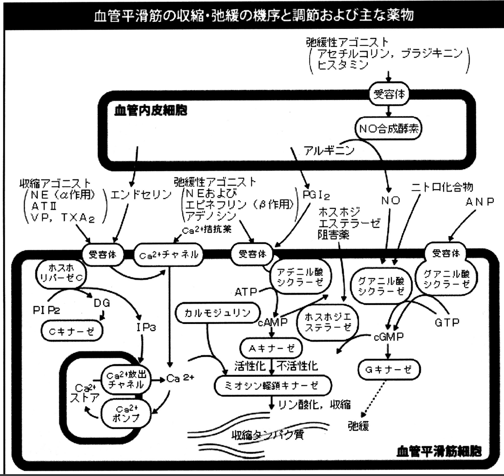

## 10. 本態性高血圧の病態
### 10.1. 本態性高血圧に関与する諸因子
- 収縮 
  - **α受容体**
  - **アンジオテンシン**
  - **カテコールアミン**
- 拡張
  - **β受容体**  
### 10.2. 本態性高血圧の治療法
Page のモザイク説により、**原因の複雑性**・**個人差**があることが分かっている。  
-> 治療は、**原因療法は成立せず、対症療法が中心となる**。  

再三申し上げるとおり、2次性高血圧は原因が唯一なので、その原因さえ取り除けばOK。
### 10.3. 本態性高血圧のメカニズム
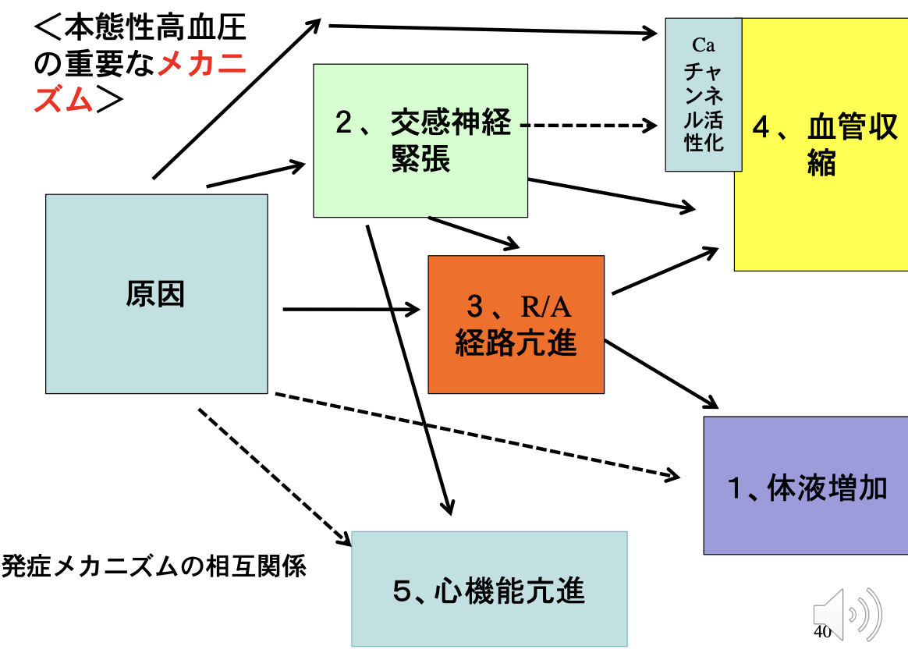

# 1017 高血圧治療薬　各論
## QUESTIONS
1. βブロッカーの降圧作用メカニズムを説明せよ
2. βブロッカーの副作用と禁忌を説明せよ
3. Caブロッカーの作用メカニズムを説明せよ
4. 3種類のCaブロッカーの作用の違いを説明せよ
5. ACE阻害薬とARBの作用メカニズムを説明せよ
6. ACE阻害薬とARBの使用禁忌を説明せよ
7. CYP3A4を介する薬物相互作用の例を挙げてそのメカニズムを説明せよ

## 高血圧治療薬の分類
- **利尿剤**
  - **Thiazide系利尿薬**： **トリクロルメチアジド**
  - **Thiazide類似薬**：**メフルシド**
  - **ループ利尿薬**：**フロセミド**
  - **カリウム保持性利尿薬**：**スピロノラクトン**
- **β遮断薬**
  - **非選択性**：**プロプラノロール**
  - **β1選択性**：**アテノロール**
- **α,β遮断薬**：**ラベタロール**
- **α遮断薬**
- **交感神経抑制薬**
  - **中枢性**：**メチルドパ**
  - **抹消性**
  - **節遮断性**
- **Ca拮抗薬**
  - **ジヒドロピリジン系**
  - **ベンゾチアゼピン系**
  - **ベラパミル系=フェニルアルキルアミン系**
- **ACE阻害薬**
- **アンギオテンシンII受容体拮抗薬**
- **血管平滑筋作用薬**：**ヒドララジン**

# 1. 利尿剤
利尿剤の基本作用である**Na+再吸収抑制**が、**体液増加**に対して有効。
## 1.1. 高血圧利尿剤の種類
高血圧治療薬としてとして用いられる利尿剤は、**Thiazide系利尿薬**と**アルドステロン受容体拮抗薬**である。  

- **Thiazide系利尿薬**
  - 作用点：**遠位尿細管**
  - 薬剤名
    - **トリクロルメチアジド**
    - ヒドロクロロチアジド
- **Thiazide類似薬**
  - 作用点：**遠位尿細管**
  - 薬剤名
    - **メフルシド**
- **ループ利尿薬**
  - 作用点：**ヘンレループ**
  - 薬剤名
    - **フロセミド**
    - エタクリン酸
    - トラセミド
- **カリウム保持性利尿薬**
  - 作用点：**集合管**
  - 薬剤名
    - **スピロノラクトン**
    - トリアムテレン
## 1.2. Thiazide系利尿剤の副作用発生のメカニズム
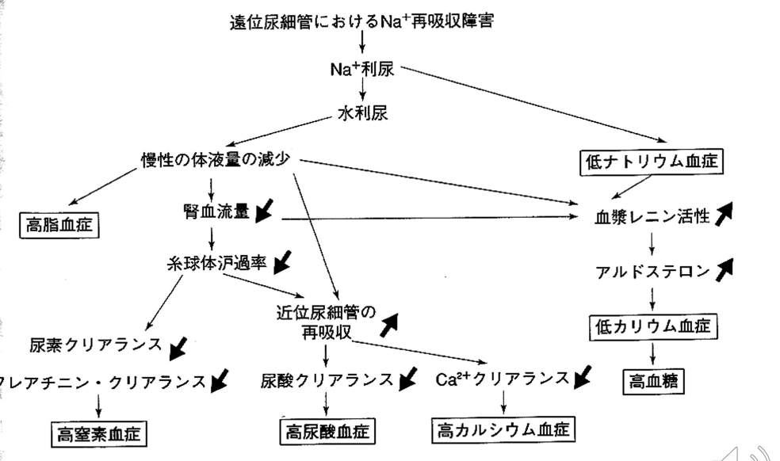  
**低カリウム血症**と**高尿酸血症**が重要。

# 2. 交感神経系に作用する薬剤群
## 2.1. 自律神経系による臓器調節
血管のアドレナリン受容体のサブタイプの復習
- 冠動脈：**β1 > α1/α2**
- 皮膚・粘膜：**α1/α2**
- 骨格筋：**β2 > α**
- 脳：**α1**
- 肺：**β2 > α1**
- 腹部内臓：**α1 > β2**
- 腎臓：**α1/α2 > β1/β2**
- 静脈：**α1/α2/β2**

## 2.2. βブロッカー
### 2.2.1. 作用メカニズム
1. **心臓の仕事量の抑制**
2. **投与開始7-10日後の血管抵抗の低下**

2に関しては、正確な機序は不明。しかし、仮説としては以下が考えられている。  
1) 心拍出量低下に対する適応
2) レニン遊離抑制
3) 中枢性β受容体のブロック
4) ノルアドレナリン遊離抑制
### 2.2.2. βブロッカーを使用する上で考慮すべきこと
1) **受容体の亜型** 
   -> **β1選択性**が望ましい  
    - why? **気管支にはβ2が存在する。気管支喘息患者に対し、β2をblockすると副作用に**。
2) **ISA intrinsic sympathomimetic activity**

### 2.2.3. β blockerの副作用
1) **心臓**関連：**徐脈**、**心伝導ブロック**、**心不全**
2) **β1非選択**の場合、**気管支喘息**
3) **末梢循環障害**
4) 低血糖症状の隠蔽・インスリン分泌抑制
5) ISA(-)の場合、脂質代謝異常

### 2.2.4. β blockerの禁忌
- **徐脈**
- **心伝導ブロック**
- **心不全（軽症を除く）**
- **β1非選択**の場合、**気管支喘息**
- **末梢血管閉塞症（閉塞性動脈硬化症）**
- **褐色細胞腫**
  
攣縮性狭心症、糖尿病、脂質代謝異常の場合も注意。

## 2.3. α1 blocker
### 2.3.1. α1 blockerの作用メカニズム
**末梢血管拡張**作用
### 2.3.2. a1 blockerの副作用
- **起立性低血圧**
- **頻脈**

## 2.4. α2刺激薬
### 2.4.1. α2刺激薬の作用メカニズム
神経節におけるノルアドレナリンの遊離阻害

## 2.5. 中枢性交感神経抑制薬
### 2.5.1. 中枢性交感神経抑制薬の作用メカニズム
**中枢のa2受容体を介して交感神経系を抑制する**。  
cf. **メチルドパ**は、**妊娠高血圧に対して安全性がが確立されている**。

# 3. Calcium Blocker
## 3.1. 高血圧治療用のCa blocker
- **ジヒドロピリジン系**
  - **ニフェジピン**
  - ニカルジピン
  - ニルバジピン
  - アムロジピン
  - ベニジピン
  - エホニジピン
- **ベンゾチアゼピン系**
  - **ジルチアゼム**
- **ベラパミル系=フェニルアルキルアミン系**
  - **ベラパミル**


薬理作用作用機序：**L型電位依存性Caチャネルの阻害**  
標的臓器は以下。
 - **末梢血管平滑筋**
 - **冠血管平滑筋**
 - **心臓心筋**
 - **心臓ペースメーカー**


## 3.2. Ca antagonist (blocker)の作用臓器と作用メカニズム
1) **心臓および骨格筋**の**L型膜電位依存性**Caチャネル  
   **ジヒドロピリジン受容体DHPRが脱分極を感知** -> **その情報を筋小胞体膜上のリアノジン受容体RyRに伝達** -> Ca2+放出を惹起。  
   **骨格筋**では**DHPR->RyRは直接作用する**が、**心筋**では**細胞外からのCa2+流入がCa2+放出のトリガー**となる。
2) **平滑筋細胞**の**L型膜電位依存性**Caチャネル  
   他の臓器の平滑筋と異なり、**血管の平滑筋は活動電位は発生しない場合が多い**が、**L型膜電位依存性カルシウムチャンネルがわずかながら持続的に活性化されてカルシウム流入が起きていて収縮の方向に向かっている**。
3) **心臓ペースメーカー細胞**の**L型膜電位依存性**Caチャネル  
   **活動電位の立ち上がり相**で**L型膜電位依存性カルシウムチャンネルを介するカルシウム電流**が必要である。
## 3.3. 各Calcium Blockerの薬理作用　薬剤ごとの薬効のオーダー
1) **末梢血管の拡張**：**ジヒドロピリジン系 > ベンゾチアゼピン系/ベラパミル系**
2) **冠血管の拡張**：**ジヒドロピリジン系 > ベンゾチアゼピン系/ベラパミル系**
3) **心収縮力の低下**：**ジヒドロピリジン系/ベンゾチアゼピン系/ベラパミル系**
4) **心臓ペースメーカーの抑制**：**ベンゾチアゼピン系/ベラパミル系**
## 3.4. Calcium Blockerはなぜ骨格筋には効果がないのか？
- 骨格筋では、**静止電位が深い**ため。
- 骨格筋では、**Caチャネルがセンサーとしてのみ機能している**ため。
## 3.5. Calcium blocker の副作用
- **ジヒドロピリジン系**：**心不全**、**動悸**、**頭痛**、**火照り**、歯肉増生
- ベンゾチアゼピン系
- **ベラパミル系=フェニルアルキルアミン系**：**徐脈**、**伝導障害**、**心不全**

## 3.6. Ca blocker の薬物相互作用
**ジヒドロピリジン系**薬剤は**経口**投与された場合、一定の割合で**小腸粘膜細胞**内の**CYP3A4**により、**不活性化**され、**代謝**される。これには、**グレープフルーツ**中の**フラボノイド**により、**一時的に不活性化**されるため、薬剤摂取前後にグレープフルーツ摂取のあと薬剤を服用すると**薬剤血中濃度が高まる**。

## 3.7. CYP3A4に関する薬物相互作用のまとめ
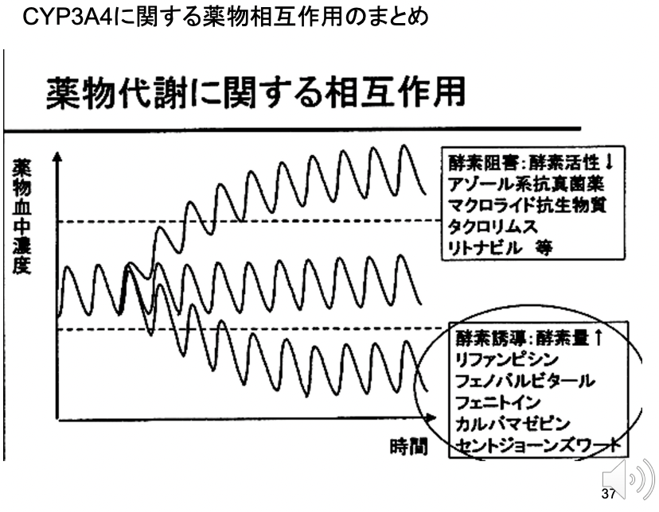

# 4. レニンーアンジオテンシン系に作用する薬剤
## 4.1. レニンーアンジオテンシン系に作用する薬剤の種類
- **ACE阻害薬 Angiotensin converting enzyme inhibitor**
  - カプトリル
  - エナラプリル
  - リシノプリル
  - アラセプリル
  - イミダプリル
  - テモカプリル
- **アンギオテンシンII受容体拮抗薬 ARB**
  - ロサルタン
  - カンデサルタンシレキセチル
  - バルサルタン
## 4.2. ACE inhibitor の作用メカニズム
ACEとは、**アンギオテンシンIからアンギオテンシンIIへの変換酵素**。  
1) **RAA系の抑制**  
   - 機序：ACE阻害 -> **アンジオテンシンIIの合成阻害** -> **血管収縮による末梢血管の拡大を阻害** & **アルドステロン分泌によるNa再吸収により生じるNa再吸収増加による血圧上昇作用を阻害**。
2) **ブラジキニンの分解阻害**  
   - **血管拡張を防ぐ**作用。
   - ただし、副作用として**空咳**を催すため、長期投与は非推奨。
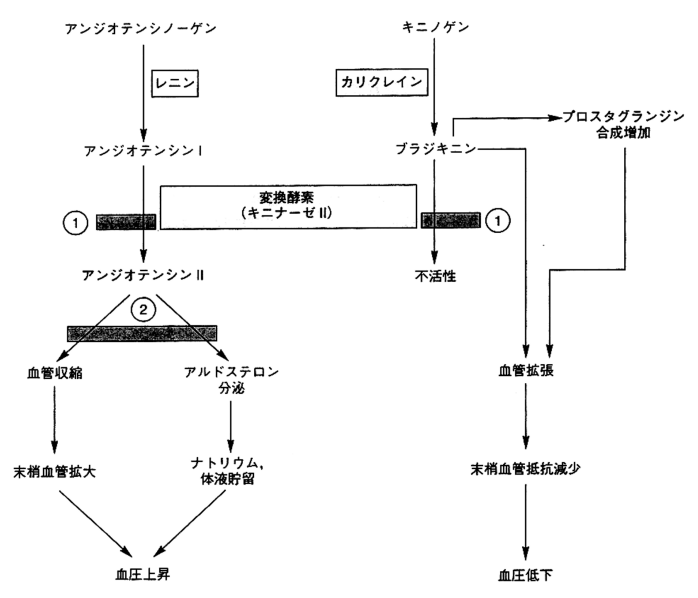  
## 4.3. ARBの作用メカニズム
- **AT1受容体**を介する作用
  - **昇圧作用**
    - **直接血管収縮作用**
    - **近位尿細管Na+再吸収増加**
  - **組織リモデリング促進作用**
- **AT2受容体**を介する作用
  - **組織リモデリング抑制作用**


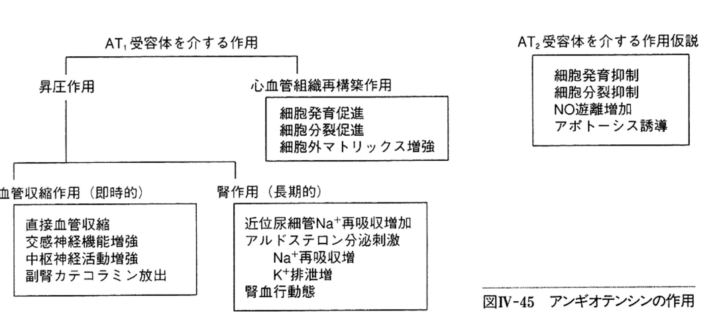  
## 4.4. ACE inhibitorの副作用
- 副作用
  - **空咳**（原因：**ブラジキニンの作用増強**）
  - **腎機能障害**（特に、**腎機能低下**; Cr 2mg/dLの際）
  - **カリウム上昇**
- 禁忌 
  - **妊婦**
  - **腎血管狭窄**（特に**両側**は絶対禁忌）
  - 血管浮腫
- 準禁忌 
  - 腎機能障害
  - 大動脈弁／僧帽弁閉鎖不全、
  - 閉塞性心肥大症
## 4.5. ARBの副作用
**動悸**、**めまい**
## 4.6. ACE inhibtorとARBの作用
1) **降圧作用**
2) **心肥大改善／心不全抑制**
3) **インスリン抵抗性改善・腎臓保護作用**
4) **脳循環改善作用/抗動脈硬化作用**

# 5. 合併症をもつ各種抗高血圧薬の選択の基本原則
- 禁忌であるもしくは慎重投与しなければならない合併疾患（状態）が存在するか否か検討する。
- これら合併疾患に使用可能な薬剤を選ぶ。  

以下、禁忌のみ覚える。
|               | 禁忌                             | 
| ------------- | -------------------------------- | 
| 利尿薬        | 痛風                             | 
| β遮断薬      | 喘息、房室ブロック、抹消循環障害 | 
| α遮断薬      | 起立性低血圧                     | 
| Ca blocker    | 房室ブロック                     | 
| ARB           | 妊娠、高K血症、両側腎動脈狭窄    | 
| ACE inhibitor | 妊娠、高K血症、両側腎動脈狭窄    | 

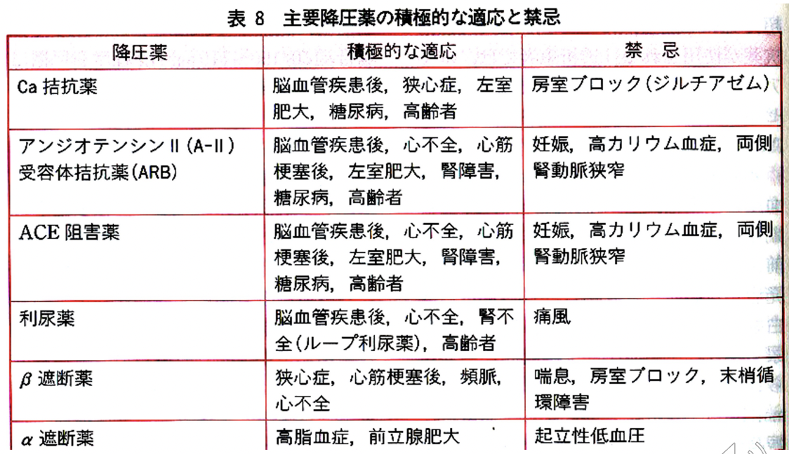  


