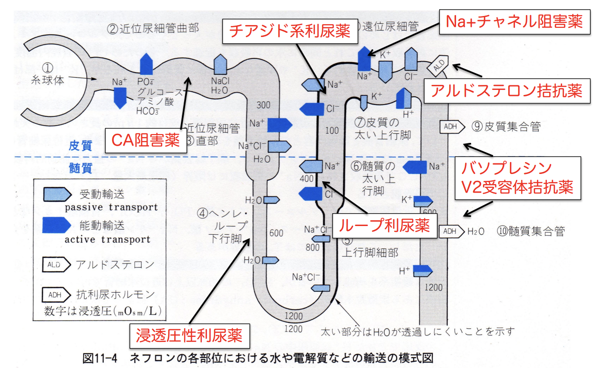

# 1017 利尿薬
# 1. 利尿とは？
- 尿量が増加すること
- 水とともに、Na+/Cl-の排泄が増加すること   
-> 利尿薬とは、Na+の尿中排泄を増加させることにより尿量を増加させる薬のこと。

# 2. 利尿薬使用の治療目的
 - 利尿効果のみを期待する場合
   - うっ血性心不全
   - 腎疾患や肝疾患による浮腫
   - 特発性浮腫
 - 降圧効果を期待する場合
   - 高血圧症

# 3. 腎臓
## 3.1. 腎臓の生理的機能
- 代謝産物の排泄
- 体内の電解質、pHの恒常性保持
- 血圧の保持
- 生理活性物質（eg. エリスロポエチン、レニン）の産生
## 3.2. 腎臓の機能単位
- ネフロン
  - 腎小体
    - ボウマン嚢
    - 糸球体
  - 尿細管
    - 近位尿細管：再吸収
    - ヘンレループ（下行脚、上行脚）：尿浸透圧調節
    - 遠位尿細管：再吸収、分泌
    - 集合管：再吸収

ネフロンの1つの長さは、平均5センチ。  
片方で約100万個存在するので、両方合わせて全長約100 km。  
血管の長さは10万km。

## 3.3. ネフロンでの尿生成過程
1) 糸球体濾過：限外濾過により120mL/分(170L/日)の原尿生成
2) 尿細管再吸収：原尿の99%の水分/Na+/栄養素の再吸収
3) 尿細管分泌：毛細血管から尿細管へのH+/K+/薬物の分泌
## 3.4. 尿生成機構
- 近位尿細管：75%再吸収
- ヘンレ・ループ下行脚：5%再吸収
- 遠位尿細管：15%再吸収
- 集合管：4%再吸収

# 4. 利尿薬の作用機序
1) 糸球体ろ過量（glomerular filtration rate GFR）の増加
2) 尿細管再吸収の抑制
## 4.1. GFRの増加
GFR増加の機序は以下。
1) 循環血液量の増加：ブドウ糖・尿素・マンニトールは血液浸透圧を高める -> 血液量増加 -> 腎血流量増加。
2) 循環機能の促進：強心配糖体（eg.ジキタリス）・キサンチン誘導体投与 -> 心機能亢進 -> 腎血流量増加
### 4.1.1. 浸透圧性利尿薬
- D-マンニトール
- グリセリン
- イソソルビド
#### 4.1.2.1. D-マンニトール
- 機序：尿浸透圧↑ -> 再吸収阻害 -> 尿量↑。
- 適用
  - 脳圧亢進の改善
  - 脳浮腫の予防・治療
  - 眼圧の是正
- 副作用
  - 大量投与で急性腎不全
  - 脳圧変動による頭痛・悪心・めまい
- 禁忌・慎重投与
  - うっ血性心不全（循環血流量増加のため）
  - 性頭蓋内出血は禁忌（再出血の恐れあり）
  - 尿閉、腎機能障害の患者には慎重投与

#### 4.1.2.2. グリセリン
- 機序・作用
  - 体液の浸透圧↑ -> 組織水分↓。
    - マンニトールよりも尿量に対する影響が少ないのがポイント
- 適応
  - 眼圧低下（血圧への影響なし）
  - 頭蓋内圧亢進
  - 頭蓋内浮腫
- 副作用
  - 消化器系症状（悪心・嘔吐、口渇、胸やけ、まれに一過性の下痢、急性胃炎、倦怠疲労感）
- 禁忌
  - なし。ただし、血糖値↑の可能性があるため、糖尿病患者には慎重投与。

#### 4.1.2.3. イソソルビド
- 機序
  - 水分を組織から血中へ -> GFR↑ -> 尿細管で再吸収されず、尿細管腔浸透圧↑ -> 水の再吸収を抑制。
- 適応
  - 頭蓋内圧
  - 眼圧低下
- 副作用
  - 消化器症状（悪心・嘔吐、食欲不振、下痢など）  
  -  中枢神経症状（不眠、頭痛）
- 禁忌
  - 急性頭蓋内出血時は禁忌（再出血の恐れあり）
- 備考
  - グリセリンよりも利尿作用が強いが、悪心・嘔吐などの副作用は弱く、高血糖も起こさない。

### 4.1.3. キサンチン誘導体
eg. テオフィリン、テオブロミン、カフェイン   
cf. アミノフィリン：テオフィリンは水に難容性の為、溶解補助剤として、エチレンジアミン(NH2-CH2-CH2-NH2)を加
えた製剤。
- 機序
  - 細胞内cAMP↑ -> 強心作用・腎血管平滑筋拡張作用 -> 腎血流量↑ -> GFR↑
  - 尿細管に直接作用 -> Na+/Cl-の再吸収を抑制 -> 水の排泄を促進。
- 副作用
  - 消化器系障害（悪心、嘔吐、食欲不振、下痢）
  - 神経系障害（頭痛、不眠、興奮、振戦）
  - 頻脈、呼吸促進など
- 禁忌
  - キサンチン系薬剤に重篤な副作用の既往歴がある場合。
- 備考
  - 利尿効果のオーダー：テオフィリン > テオブロミン >カフェイン

## 4.2. 尿細管再吸収の抑制
1. Na+-H+交換系の阻害 by 炭酸脱水酵素阻害薬
2. Na+-K+-2Cl共輸送系の阻害 by ループ利尿薬
3. Na+-Cl共輸送系の阻害 by チアジド系、チアジド類似利尿薬
4. 腎上皮Na+チャネルの阻害 by K+保持性利尿薬 トリアムテレン
5. アルドステロンの競合阻害 by K 保持性利尿薬　スピロノラクトン、カンレノ酸カリウム
6. バソプレシンV2受容体拮抗 by トルバプタン

### 4.2.1. Na+-H+交換系の阻害 by 炭酸脱水酵素阻害薬
- 作用部位：近位尿細管
- 代表的薬剤：アセタゾラミド
- 機序
  - 近位尿細管にて1と3で働くCAを阻害 -> 間接的にH+分泌抑制・Na+再吸収抑制 -> Na+・水の排泄促進
  - 遠位尿細管後半部におけるK+の分泌を促進
- 副作用
  - 低K血症
  - 代謝性アシドーシス
- 適応
  - 緑内障の眼圧低下、てんかんの小発作
    - 利尿効果が少ないため、臨床においては利尿薬としてはあまり用いられておらず、主に緑内障の治療薬として用いられている。

近位尿細管においては、「Na+・水の再吸収の 70%」、「Na+と共役したP・ブドウ糖・アミノ酸の再吸収」、「HCO3-の再吸収」が行われる。  
炭酸脱水酵素(CA)は `H2O + CO2 ⇄ H2CO3` という反応に関わるため、HCO3-の再吸収に直接関わり、Na+の再吸収に間接的に関わる。  
通常の再吸収メカニズムは次のように起こる。
1. 尿細管腔液にて、CAが `H2CO3 → H2O + CO2` 
2. CO2 は拡散によって、H2O はアクアポリンを通じて、尿細管細胞に再吸収される。
3. 細胞内にて、CAが`H2O + CO2 ⇄ H2CO3`
4. 非酵素的に、`H2CO3 → H+ + HCO3-`
5. Na+/H+交換輸送体により、H+の分泌と共役して Na+再吸収が行われる。

### 4.2.2. Na+-K+-2Cl共輸送系の阻害 by ループ利尿薬
- 作用部位：ヘンレループの太い上行脚 
- 代表的薬剤：フロセミド
- 機序
  - ヘンレループ上行脚において、Na+-K+-2Cl共輸送系阻害 -> Na+/Cl-再吸収の抑制
  - 遠位尿細管後半部において、K+分泌促進
  - プロスタグランジン産生 -> 腎血流量・糸球体ろ過量増加。
- 適応
  - うっ血性心不全
  - 浮腫
  - 本態性高血圧
- 副作用
  - 低K血症
  - 脱水
  - 血栓塞栓症
- 禁忌  
  - 無尿
  - 体液中のNa+/K+が明らかに減少している場合
- 備考：利尿効果は強力だが、降圧効果は比較的弱い。

### 4.2.3. Na+-Cl共輸送系の阻害 by チアジド系、チアジド類似利尿薬
- 作用部位：遠位尿細管 
- 代表的薬剤：ヒドロクロロサイアザイド 
- 機序
  - 遠位尿細管前半部において、Na+-Cl共輸送系を阻害 -> Na+とClの排泄増加
  - 遠位尿細管後半部において、K+の排泄増加。
  - 密集斑（遠位尿細管上皮細胞）で尿中のCl-濃度上昇を感知 -> 輸入細動脈が収縮 -> 腎血流量・糸球体ろ過量を減少させる。
  - 体液の酸塩基平衡の影響を受けない（= CAとの違い）
- 適応
  - 高血圧
  - 浮腫
- 副作用
  - 低カリウム血症
  - 高血糖
  - 高尿酸血症
  - 利尿作用による脱水
  - 降圧作用によるめまい、ふらつき
- 禁忌
  - 無尿の患者
  - 急性腎不全の患者

#### cf. チアジド類似薬物
チアジド系利尿薬と比べ、利尿効果は強いが、K+排泄量が少ない。しかし、低カリウム血症は注意。  
チアジド系利尿薬と化学的には異なるが、臨床的には同一種類の薬剤として用いられている。  
eg. インダパミド、トリパミド、クロルタリドン、メチクラン、メフルシド

### 4.2.4. 腎上皮Na+チャネルの阻害 by K+保持性利尿薬 トリアムテレン
- 作用部位：遠位尿細管後部
- 代表的薬剤：K+保持性利尿薬 トリアムテレン
- 機序
  - 遠位尿細管後部のNa+チャネルを阻害 -> Na+-K+交換系抑制 -> 利尿効果。
- 適応
  - 高血圧症
  - 浮腫
- 副作用
  - 急性腎不全
  - 高カリウム血症
- 禁忌  
  - 無尿
  - 急性腎不全
  - 高カリウム血症（特に腎機能低下例にて）
- 備考
  - K+保持作用を有するので、他利尿薬による低カリウム血症予防のため併用される。これにより、低カリウム血症を防止し、しかも利尿効果が増強する。

### 4.2.5. アルドステロンの競合阻害 by K+保持性利尿薬 スピロノラクトン, カンレノ酸カリウム
- 作用部位：遠位尿細管・集合管 
- 代表的薬剤
  - スピロノラクトン
  - カンレノ酸カリウム 
- 機序
  - アルドステロン依存性Na+-K+交換部位のアルドステロン受容体において、アルドステロンと競合的拮抗 -> Na+再吸収抑制・K+分泌抑制 -> K+保持 -> Na+利尿
- 適応
  - 高血圧症
  - 原発性 or 二次性アルドステロン症
- 副作用：高カリウム血症
- 禁忌
  - 無尿
  - 高カリウム血症
- 備考：単独では利尿効果が弱く、他の利尿薬と併用で用いられる。

### 4.2.6. バソプレシンV2受容体拮抗
- 代表的薬剤：トルバプタン  
- 適応
  - 心不全
  - 肝硬変による浮腫

バソプレシンV2受容体拮抗薬は、Na再吸収抑制ではなく、バソプレシンによる集合管での水の再吸収を抑制することで、利尿効果をもたらすものである。  
電解質の排泄を伴わないのがポイント。   

#### 4.2.6.1. バソプレシンADHによる水の再吸収  
バソプレシンADHは、以下の機序により、水の再吸収を行う。水の透過性を調節する。
1. ADHが集合管のV2受容体に結合する。
2. ACが活性化 -> cAMP上昇 -> AQP2を尿細管腔側細胞膜へ移動
3. 浸透圧勾配により水の再吸収↑ -> 尿量減少

#### 4.2.6.2. 尿崩症
- 機序：バソプレシンADHの分泌低下・作用障害 -> 集合間での再吸収の低下 -> 多尿（> 3L/day） -> 尿崩症。

尿崩症には以下の2種類がある。
- 中枢性尿崩症
  - 原因：視床下部や脳下垂体後葉機能異常
  - 治療：バソプレシン誘導体
- 腎性尿崩症
  - 原因：腎臓での作用障害
  - 治療：塩分制限 ＋ チアジド系利尿薬 -> 近位尿細管での再吸収促進

### 4.2.7. 利尿薬と血中カリウム濃度
- 低カリウム血症誘発タイプ
  - 炭酸脱水酵素阻害薬　
  - ループ利尿薬　
  - チアジド系利尿薬
- K+保持タイプ
  - 腎上皮Na+チャネル阻害薬
  - アルドステロン拮抗薬

### 4.2.8. 利尿作用と降圧作用の関係性
- 利尿作用：ループ利尿薬 ＞ チアジド系利尿薬 ＞ K+保持性利尿薬
- 降圧作用：チアジド系利尿薬 㲈 K＋保持性利尿薬 ＞ ループ利尿薬

### 4.2.9. 利尿薬使い分け
- チアジド系利尿薬
  - 塩分摂取が多い患者、レニン・アンギオテンシン系が活性化していなくARB/ACE阻害薬の効果が弱い患者に対して有効。
  - 腎機能低下患者にはNG。
- ループ利尿薬
  - 腎機能低下患者の降圧薬として有効。
  - 主に水分排出目的に利用。
- K+保持性利尿薬
  - 心保護作用があるので、心不全や心筋梗塞後に使用。
  - 他の利尿薬による低カリウム状態に併用すると良い。
  - ただし、ARB/ACE阻害薬との併用は高カリウム血症に注意。

# 5. SUMMARY

