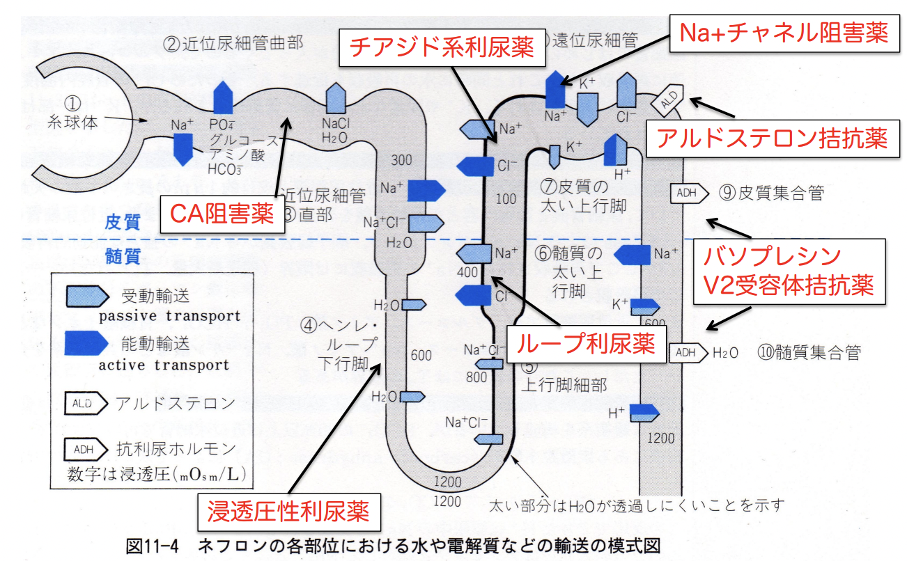

# 1017 利尿薬
# 1. 利尿とは？
- **尿量が増加する**こと
- **水とともに、Na+/Cl-の排泄が増加する**こと   
-> 利尿薬とは、**Na+の尿中排泄を増加させることにより尿量を増加させる薬**のこと。

# 2. 利尿薬使用の治療目的
 - **利尿効果のみ**を期待する場合
   - **うっ血性心不全**
   - **腎疾患や肝疾患による浮腫**
   - **特発性浮腫**
 - **降圧効果**を期待する場合
   - **高血圧症**

# 3. 腎臓
## 3.1. 腎臓の生理的機能
- 代謝産物の排泄
- 体内の電解質、pHの恒常性保持
- 血圧の保持
- 生理活性物質（eg. **エリスロポエチン**、**レニン**）の産生
## 3.2. 腎臓の機能単位
- ネフロン
  - **腎小体**
    - **ボウマン嚢**
    - **糸球体**
  - **尿細管**
    - **近位尿細管**：**再吸収**
    - **ヘンレループ（下行脚、上行脚）**：**尿浸透圧調節**
    - **遠位尿細管**：**再吸収、分泌**
    - **集合管**：**再吸収**

ネフロンの1つの長さは、平均**5cm**。  
片方で約**100万**個存在するので、両方合わせて全長約**100km**。  
※血管の長さは10万km。

## 3.3. ネフロンでの尿生成過程
1) **糸球体濾過**：**限外濾過**により**120mL**/分(**170L**/日)の**原尿**生成
2) **尿細管再吸収**：**原尿の99%の水分/Na+/栄養素の再吸収**
3) **尿細管分泌**：**毛細血管から尿細管へのH+/K+/薬物の分泌**
## 3.4. 尿生成機構
- 近位尿細管：**75**%再吸収
- ヘンレ・ループ下行脚：**5**%再吸収
- 遠位尿細管：**15**%再吸収
- 集合管：**4**%再吸収

# 4. 利尿薬の作用機序
1) **糸球体ろ過量（glomerular filtration rate GFR）の増加**
2) **尿細管再吸収の抑制**
## 4.1. GFRの増加
GFR増加の機序は以下。
1) **循環血液量の増加**：**ブドウ糖**・**尿素**・**マンニトール**は**血液浸透圧を高める** -> **血液量増加** -> **腎血流量増加**。
2) **循環機能の促進**：**強心配糖体**（eg.**ジキタリス**）・**キサンチン誘導体**投与 -> **心機能亢進** -> **腎血流量増加**
### 4.1.1. 浸透圧性利尿薬
- **D-マンニトール**
- **グリセリン**
- **イソソルビド**
#### 4.1.2.1. D-マンニトール
- 機序：**尿浸透圧↑** -> **再吸収阻害** -> **尿量↑**。
- 適用
  - **脳圧亢進の改善**
  - **脳浮腫の予防・治療**
  - **眼圧の是正**
- 副作用
  - 大量投与で**急性腎不全**
  - **脳圧変動**による**頭痛**・**悪心**・**めまい**
- 禁忌
  - **うっ血性心不全**（**循環血流量増加**のため）
  - **急性頭蓋内出血**（**再出血**の恐れあり）
- 慎重投与
  - **尿閉**患者
  - **腎機能障害**の患者

#### 4.1.2.2. グリセリン
- 機序・作用
  - **体液の浸透圧↑** -> **組織水分↓**。
    - マンニトールよりも**尿量に対する影響が少ない**のがポイント。
- 適応
  - **眼圧低下**（**血圧への影響なし**）
  - **頭蓋内圧亢進**
  - **頭蓋内浮腫**
- 副作用
  - **消化器系症状**（悪心・嘔吐、口渇、胸やけ、まれに一過性の下痢、急性胃炎、倦怠疲労感）
- 禁忌
  - **なし**。ただし、**血糖値↑**の可能性があるため、**糖尿病**患者には慎重投与。

#### 4.1.2.3. イソソルビド
- 機序
  - **水分を組織から血中へ** -> **GFR↑** -> **尿細管で再吸収されず、尿細管腔浸透圧↑** -> **水の再吸収を抑制**。
- 適応
  - **頭蓋内圧**
  - **眼圧低下**
- 副作用
  - **消化器症状**（悪心・嘔吐、食欲不振、下痢など）  
  - **中枢神経症状**（**不眠**、**頭痛**）
- 禁忌
  - **急性頭蓋内出血**（**再出血**の恐れあり）
- 備考
  - グリセリンよりも**利尿作用が強い**が、**悪心・嘔吐などの副作用は弱く、高血糖も起こさない**。

### 4.1.3. キサンチン誘導体
eg. **テオフィリン**、**テオブロミン**、**カフェイン**   
cf. アミノフィリン：テオフィリンは水に難容性の為、溶解補助剤として、エチレンジアミン(NH2-CH2-CH2-NH2)を加
えた製剤。
- 機序
  - **細胞内cAMP↑** -> **強心**作用・**腎血管平滑筋拡張**作用 -> **腎血流量↑** -> **GFR↑**
  - **尿細管に直接作用** -> **Na+/Cl-の再吸収を抑制** -> **水の排泄を促進**。
- 副作用
  - **消化器系障害**（悪心、嘔吐、食欲不振、下痢）
  - **神経系障害**（頭痛、不眠、興奮、振戦）
  - **頻脈**
  - **呼吸促進**
- 禁忌
  - **キサンチン系薬剤に重篤な副作用の既往歴がある**場合。
- 備考
  - 利尿効果のオーダー：**テオフィリン > テオブロミン > カフェイン**

## 4.2. 尿細管再吸収の抑制
1. **Na+-H+交換系の阻害** by **炭酸脱水酵素阻害薬**
2. **Na+-K+-2Cl共輸送系の阻害** by **ループ利尿薬**
3. **Na+-Cl共輸送系の阻害** by **チアジド系、チアジド類似利尿薬**
4. **腎上皮Na+チャネルの阻害** by **K+保持性利尿薬 トリアムテレン**
5. **アルドステロンの競合阻害** by **K+保持性利尿薬　スピロノラクトン、カンレノ酸カリウム**
6. **バソプレシンV2受容体拮抗** by **トルバプタン**

### 4.2.1. Na+-H+交換系の阻害 by 炭酸脱水酵素阻害薬
- 作用部位：**近位尿細管**
- 代表的薬剤：**アセタゾラミド**
- 機序
  - **近位尿細管**にてCAを阻害 -> **間接的にH+分泌抑制・Na+再吸収抑制** -> **Na+・水の排泄促進**
  - **遠位尿細管後半部**における**K+の分泌を促進**
- 副作用
  - **低K血症**
  - **代謝性アシドーシス**
- 適応
  - **緑内障の眼圧低下**、てんかんの小発作
    - **利尿効果が少ない**ため、臨床においては**利尿薬としてはあまり用いられておらず、主に緑内障の治療薬**として用いられている。

近位尿細管においては、「**Na+・水の再吸収の 70%**」、「**Na+と共役したP・ブドウ糖・アミノ酸の再吸収**」、「**HCO3-の再吸収**」が行われる。  
炭酸脱水酵素(CA)は **`H2O + CO2 ⇄ H2CO3`** という反応に関わるため、**HCO3-の再吸収**に直接関わり、**Na+の再吸収**に間接的に関わる。  
通常の再吸収メカニズムは次のように起こる。
1. **尿細管腔液**にて、**CA**が **`H2CO3 → H2O + CO2`** 
2. **CO2** は**拡散**によって、**H2O** は**アクアポリン**を通じて、**尿細管細胞に再吸収される**。
3. **細胞内**にて、**CA**が**`H2O + CO2 ⇄ H2CO3`**
4. **非酵素**的に、**`H2CO3 → H+ + HCO3-`**
5. **Na+/H+交換輸送体**により、**H+の分泌と共役**して、**Na+再吸収**が行われる。

### 4.2.2. Na+-K+-2Cl共輸送系の阻害 by ループ利尿薬
- 作用部位：**ヘンレループの太い上行脚** 
- 代表的薬剤：**フロセミド**
- 機序
  - **ヘンレループ上行脚**において、**Na+-K+-2Cl共輸送系阻害** -> **Na+/Cl-再吸収の抑制**
  - **遠位尿細管後半部**において、**K+分泌促進**
  - **プロスタグランジン産生** -> **腎血流量・糸球体ろ過量増加**。
- 適応
  - **うっ血性心不全**
  - **浮腫**
  - **本態性高血圧**
- 副作用
  - **低K血症**
  - **脱水**
  - **血栓塞栓症**
- 禁忌  
  - **無尿**
  - **体液中のNa+/K+が明らかに減少している**場合
- 備考：**利尿効果は強力だが、降圧効果は比較的弱い**。

### 4.2.3. Na+-Cl共輸送系の阻害 by チアジド系、チアジド類似利尿薬
- 作用部位：**遠位尿細管** 
- 代表的薬剤：**ヒドロクロロサイアザイド** 
- 機序
  - **遠位尿細管前半部**において、**Na+-Cl共輸送系を阻害** -> **Na+とClの排泄増加**
  - **遠位尿細管後半部**において、**K+の排泄増加**。
  - **密集斑（遠位尿細管上皮細胞）で尿中のCl-濃度上昇を感知** -> **輸入細動脈が収縮** -> **腎血流量・糸球体ろ過量を減少**。
- 適応
  - **高血圧**
  - **浮腫**
- 副作用
  - **低カリウム血症**
  - **高血糖**
  - **高尿酸血症**
  - **利尿**作用による**脱水**
  - **降圧**作用による**めまい**、**ふらつき**
- 禁忌
  - **無尿**の患者
  - **急性腎不全**の患者
- 備考
  - **体液の酸塩基平衡の影響を受けない**（= **CA**との違い）

#### cf. チアジド類似薬物
チアジド系利尿薬と比べ、**利尿効果は強いが、K+排泄量が少ない**。しかし、**低カリウム血症**には注意。  
チアジド系利尿薬と化学的には異なるが、臨床的には同一種類の薬剤として用いられている。  
eg. インダパミド、トリパミド、クロルタリドン、メチクラン、メフルシド

### 4.2.4. 腎上皮Na+チャネルの阻害 by K+保持性利尿薬 トリアムテレン
- 作用部位：**遠位尿細管後部**
- 代表的薬剤：**K+保持性利尿薬 トリアムテレン**
- 機序
  - **遠位尿細管後部のNa+チャネルを阻害** -> **Na+-K+交換系抑制** -> 利尿効果。
- 適応
  - **高血圧症**
  - **浮腫**
- 副作用
  - **急性腎不全**
  - **高カリウム血症**
- 禁忌  
  - **無尿**
  - **急性腎不全**
  - **高カリウム血症**（特に**腎機能低下**例にて）
- 備考
  - **K+保持**作用を有するので、**他利尿薬による低カリウム血症予防**のため併用される。これにより、**低カリウム血症を防止**し、しかも**利尿効果が増強する**。

### 4.2.5. アルドステロンの競合阻害 by K+保持性利尿薬 スピロノラクトン, カンレノ酸カリウム
- 作用部位：**遠位尿細管・集合管** 
- 代表的薬剤
  - **スピロノラクトン**
  - カンレノ酸カリウム 
- 機序
  - **アルドステロン依存性Na+-K+交換部位のアルドステロン受容体において、アルドステロンと競合的拮抗** -> **Na+再吸収抑制**・**K+分泌抑制** -> **K+保持** -> **Na+利尿**
- 適応
  - **高血圧症**
  - **原発性 or 二次性アルドステロン症**
- 副作用
  - **高カリウム血症**
- 禁忌
  - **無尿**
  - **高カリウム血症**
- 備考：**単独では利尿効果が弱く、他の利尿薬と併用で用いられる**。

### 4.2.6. バソプレシンV2受容体拮抗
- 代表的薬剤：**トルバプタン**  
- 適応
  - **心不全**
  - **肝硬変による浮腫**

バソプレシンV2受容体拮抗薬は、**Na再吸収抑制**ではなく、**バソプレシンによる集合管での水の再吸収を抑制**することで、利尿効果をもたらすものである。  
**電解質の排泄を伴わない**のがポイント。   

#### 4.2.6.1. バソプレシンADHによる水の再吸収  
バソプレシンADHは、以下の機序により、水の再吸収を行う。水の透過性を調節する。
1. **ADHが集合管のV2受容体に結合する**。
2. **ACが活性化** -> **cAMP上昇** -> **AQP2を尿細管腔側細胞膜へ移動**
3. **浸透圧勾配により水の再吸収↑** -> 尿量減少

#### 4.2.6.2. 尿崩症
- 機序：**バソプレシンADHの分泌低下・作用障害** -> **集合間での再吸収の低下** -> **多尿**（**> 3L**/day） -> 尿崩症。

尿崩症には以下の2種類がある。
- **中枢性尿崩症**
  - 原因：**視床下部や脳下垂体後葉機能異常**
  - 治療：**バソプレシン誘導体**
- **腎性尿崩症**
  - 原因：**腎臓での作用障害**
  - 治療：**塩分制限** ＋ **チアジド系利尿薬** -> **近位尿細管**での**再吸収促進**

### 4.2.7. 利尿薬と血中カリウム濃度
- **低カリウム血症誘発**タイプ
  - **炭酸脱水酵素阻害薬**　
  - **ループ利尿薬**　
  - **チアジド系利尿薬**
- **K+保持**タイプ
  - **腎上皮Na+チャネル阻害薬**
  - **アルドステロン拮抗薬**

### 4.2.8. 利尿作用と降圧作用の関係性
チアジド系利尿薬とループ利尿薬とK+保持性利尿薬をオーダーで並べると...？
- 利尿作用：**ループ利尿薬 ＞ チアジド系利尿薬 ＞ K+保持性利尿薬**
- 降圧作用：**チアジド系利尿薬 ＞ K＋保持性利尿薬 ＞ ループ利尿薬**

### 4.2.9. 利尿薬使い分け
- チアジド系利尿薬
  - **塩分摂取が多い**患者、**レニン・アンギオテンシン系が活性化していなくARB/ACE阻害薬の効果が弱い**患者に対して有効。
  - **腎機能低下**患者にはNG。
- ループ利尿薬
  - **腎機能低下患者の降圧薬**として有効。
  - 主に**水分排出**目的に利用。
- K+保持性利尿薬
  - **心保護**作用があるので、**心不全**や**心筋梗塞後**に使用。
  - **他の利尿薬による低カリウム状態に併用する**と良い。
  - ただし、**ARB/ACE阻害薬との併用**は**高カリウム血症**に注意。

# 5. SUMMARY

