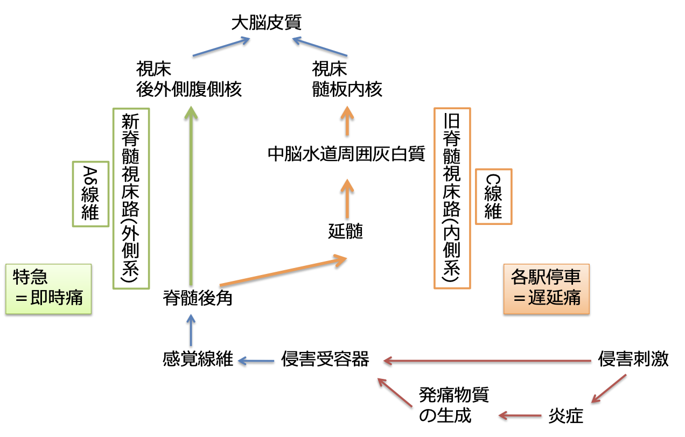
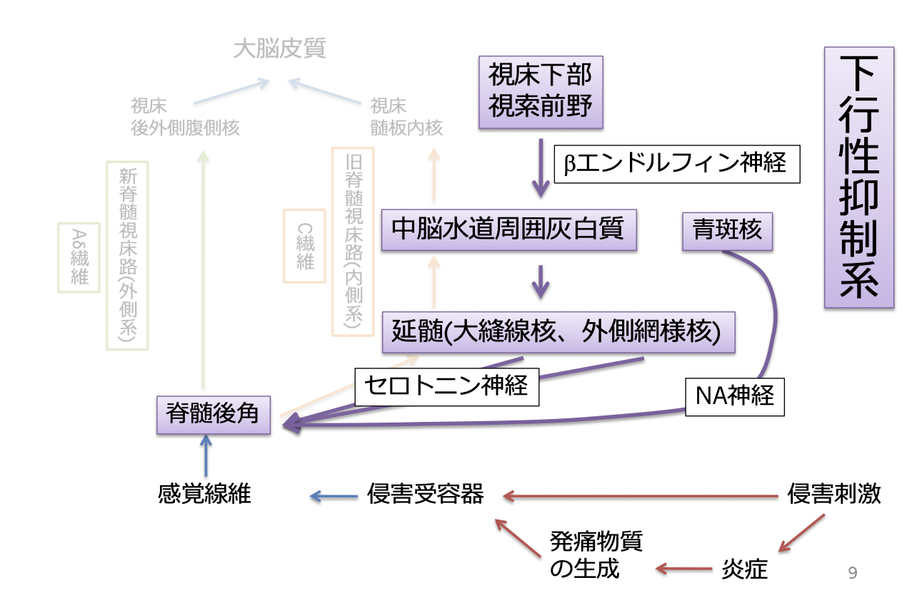
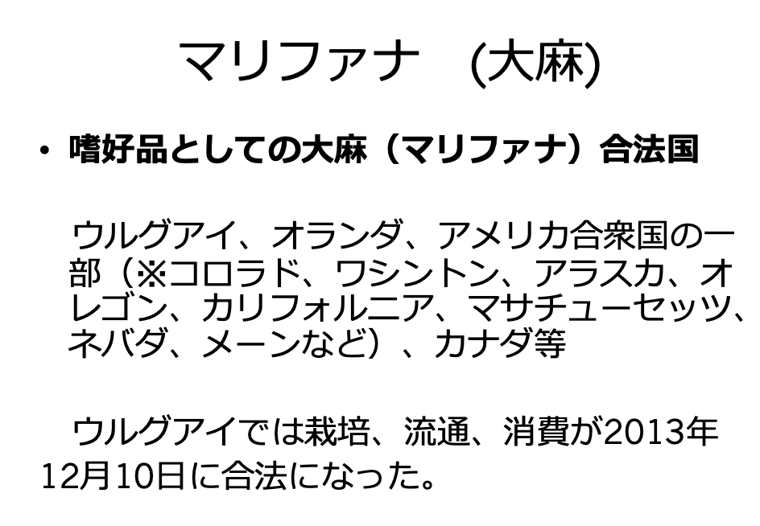
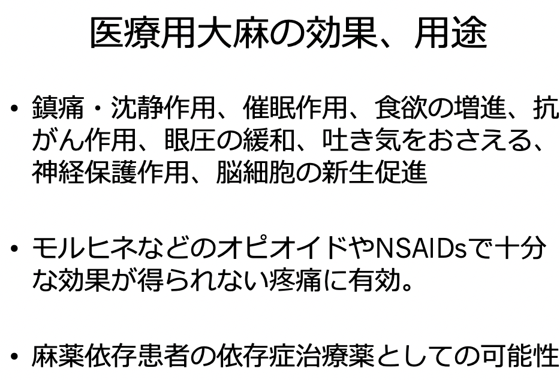
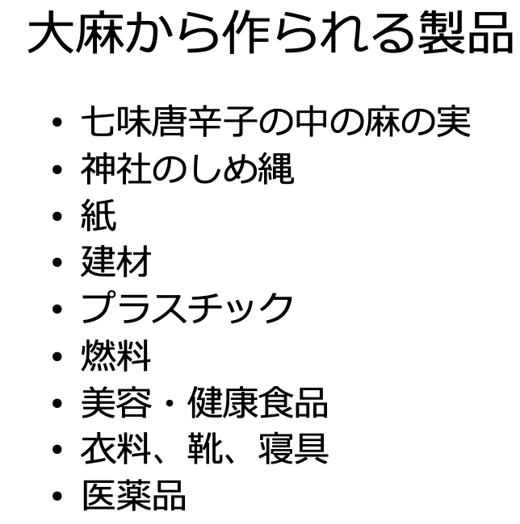

# 1025 鎮痛剤
# 1. 痛覚のメカニズム
## 1.1.  痛みの発生
痛みの発生の機序には、2種類ある。  
1. 侵害刺激 -> 侵害受容器
2. 侵害刺激 -> 内因性発痛物質 -> 侵害受容器

- 侵害刺激：冷却・熱、機械的刺激、化学的刺激 
- 内因性発痛物質：ブラジキニン、ヒスタミン、セロトニン、アセチルコリン、プロスタグランジンなど  
- 侵害受容器：知覚神経の⾃由終末によって受容されるとされている。  
    1. ⾼閾値圧受容器
    2. 温熱性侵害受容器
    3. ポリモーダル侵害受容器
## 1.2. 一次求心性感覚ニューロン
- 即時痛（eg. 刺痛）：Aδ線維（有髄、太い)
- 遅延痛（eg. 灼熱痛）：C線維 (無髄、細い)   
### 1.2.1. 痛みの伝導
  
### 1.2.2. 痛みの抑制

## 1.3. 仮性疼痛反応
痛みに伴う⼆次反応。  
以下のように場所によって反応が異なる。  
- 脊髄レベル：屈曲反射（tail-flick反射等）
- 脳幹レベル：啼鳴反応
- 視床下部・⼤脳辺縁系：⾎圧上昇・冷汗
- ⼤脳⽪質：意志が働いた攻撃、逃避、防御反応（かみつき反応、⾜なめ反応）
## 1.4. 内因性抑制系における神経伝達物質
- ノルアドレナリン
- セロトニン
- GABA
- オピオイドペプチド類（eg. エンケファリン、ダイノルファリン）：脳内モルヒネ

# 2. 各種鎮痛薬
## 2.1. NSAIDS
Non-Steroidal Antiinflammatory Drugs; ⾮ステロイド性抗炎症薬。  
NSAIDsは、アラキドン酸カスケードにおける、PGの産生に関わるシクロオキシゲナーゼ COXを阻害して、炎症を抑えようとする。  
【副作用】胃腸障害、腎障害、喘息、肝機能障害など。   
【適応】癌性疼痛の緩和、リウマチ性疾患、変形性関節症、腰痛、腱鞘炎、神経痛

## 2.2. 麻薬性鎮痛薬（オピオイド）
麻薬性鎮痛薬は、オピエートとオピオイドに分類されるが、近年は物質の性質や由来に関わらずオピオイド受容体に作用するあらゆる分子がオピオイドと呼ばれる傾向にある。  
オピオイドとは、中枢神経や末梢神経に存在するオピオイド受容体への結合を介して、モルヒネに類似する作⽤を持つ物質の総称。依存性があり、意識消失や睡眠の誘導を伴うことなく鎮痛作用を示す。   
オピオイドには、内因性のもの、植物由来の天然のもの、合成・半合成のものがある。   
このうち植物由来の天然のものは、アヘンアルカロイドと呼ばれ、ケシの種子から得られるアヘンに含まれるアルカロイドである。  
eg. フェナントレン誘導体、モルフィン（鎮痛薬）、コデイン（鎮咳薬）   

### 2.2.1. 内因性オピオイド
1. エンケファリン：δ受容体に作⽤する５つのアミノ酸からなるペプチド。
2. β−エンドルフィン：µ受容体に作⽤する31アミノ酸からなるペプチド。モルヒネ様作⽤を発揮する。ランナーズハイに関与。ストレスなどの侵害刺激により産⽣されて、鎮痛・鎮静に働き、強さはモルヒネの6.5倍。
3. ダイノルフィン：κ受容体に作⽤する様々な⻑さのペプチド。N末端にLeu-エンケファリン構造を含む。
   1. ダイノルフィンA(YGGFLRRIRIRPKLWDNQ)
   2. ダイノルフィンB(YGGFLRRQFKVVT)
### 2.2.2. オピオイド受容体
7回膜貫通型タンパク質。サブタイプとしては、μ/δ/κ が分かっている。  
Gi型で、電位依存性Ca2+チャネルの開⼝を抑制する作用がある。  
例えば、脊髄の1次求⼼性線維終末に作⽤すると、細胞内Ca2+濃度上昇が抑制され、神経伝達物質の放出量が減少する。
### 2.2.3. オピオイドの分類 
- アヘンアルカロイドおよび半合成アヘンアルカロイド
  - モルヒネ
  - リン酸コデイン
  - リン酸ジヒドロコデイン
  - ヘロイン
  - 塩酸オキシコドン
- 合成麻薬鎮痛薬
  - メサドン
  - 塩酸ペチジン
  - レボルファノール
  - クエン酸フェンタニル
## 2.3. モルヒネ
µ受容体に結合する。その他、κ/δアゴニスト活性もある。  
モルヒネには光学異性体が存在し、そのうちL体のみが活性を持つ麻薬である。  
作用点を末梢神経に持つNSAIDsに対し、モルヒネは作用点を中枢神経に持つ。
### 2.3.1. モルヒネの薬理作⽤
- 中枢興奮作用
  - 催吐作用：CTZのD2受容体に興奮的に作⽤して得られる。クロルプロマジンで拮抗される。
  - 縮瞳作⽤：中脳にある動眼神経核を刺激するため。副交感神経興奮 -> 瞳孔括約筋収縮。抗コリン作⽤薬（eg. アトロピンなど）で拮抗される。禁断時には逆に散瞳。この作⽤は耐性を⽣じないため、モルヒネ中毒診断に⽤いる。
  - ストリキニーネ様脊髄反射亢進作⽤：マウスにストラウブの挙尾反応（尾がS字になる）を起こす。-> モルヒネ様薬のスクリーニングに⽤いる。
- 中枢抑制作用
  - 鎮痛作用：他の感覚に影響を与えないで、痛みを選択的に抑える。ほとんど全ての疼痛除去に有効である。
  - 陶酔作用：不安・恐怖を消失させる。⿇薬中毒の原因。ヘロインが最強。
  - 鎮咳作用：延髄咳中枢の抑制による。気管支を収縮させる。作⽤はコデインより強い。
  - 呼吸抑制作用：延髄呼吸中枢の抑制による。急性中毒の死因はこれによる。
- 末梢作用
  - 平滑筋・括約筋収縮作⽤：オピオイド受容体を介して作⽤。ナロキソンで拮抗。  
      1. ⽌瀉作⽤（便秘)：腸内神経叢からのアセチルコリン遊離抑制作⽤ -> ぜん動運動減少。  
                       腸管壁からのセロトニ遊離促進作⽤ -> 消化管緊張亢進。  
                       胃の幽⾨括約筋を収縮 -> ⾷物は胃内に留まる -> 便秘
      2. 尿閉：膀胱括約筋が収縮し、尿路閉塞により尿が出にくくなる。
      3. 胆汁分泌抑制作⽤：Oddi括約筋収縮 -> 胆管内圧上昇、⼗⼆指腸への胆汁排出減少
  - 動静脈の緊張低下 -> 前負荷軽減 -> 肺うっ⾎減少（急性⼼筋梗塞に⽤いる）
  - ヒスタミン遊離作用：血管拡張 -> 起立性低血圧

### 2.3.2. モルヒネに関するその他の情報（参考程度）
1. 感受性：ヒトでは⼩児および⽼⼈に作⽤が強く出易い。
2. 種差：鎮痛量投与によって作用が異なる。  
      - 鎮静作⽤を⽰す種︓ヒト、サル、イヌ、ウサギ、ラット
      - 興奮を⽰す種：ネコ、マウス、ウマ、ヒツジ
3. 吸収、代謝、その他：⽪膚、粘膜、消化管から吸収される。⼤部分がグルクロン酸抱合（60-70%）、未変化体（20%）、N-脱メチル化（残り）され、ノルモルヒネになる。胎盤を通過、また乳汁にも排泄されるので、妊婦、授乳婦への投与には注意する。
### 2.3.3. モルヒネの適応・禁忌
- 適応
  - 術後疼痛、末期がんの疼痛、⼼筋梗塞の疼痛
  - 急性肺⽔腫、急性左室不全に伴う呼吸困難、肺浮腫、肺うっ⾎による激しい咳
- 禁忌：気管⽀喘息・肺気腫（why？ -> ヒスタミン遊離による気管収縮）
### 2.3.4. モルヒネの中毒とその治療法
##### 2.3.4.1. 急性中毒   
致死量は100mgで、呼吸不全により死亡する。  
急性中毒による症状は以下。 
1. 呼吸抑制 -> ⼈⼯呼吸 + 競合的拮抗薬（レバロルファン or ナロキソン）により解毒する。　　
2. 錯乱・せん妄 -> 減量・中⽌により解毒する。   
##### 2.3.4.2. 慢性中毒  
1. 耐性発現：耐性は中枢抑制作⽤に⽣じ、中枢興奮作⽤、⽌瀉作⽤には⽣じない。
2. 精神的・⾝体的依存：精神的不安から使⽤を続けると精神的依存が⾼まり、さらに使⽤し続けると⾝体依存が⽣じ連⽤の急激な中⽌により禁断症状を呈する。（eg. あくび、くしゃみ、流涙、悪⼼・嘔吐、振戦、不安、不眠、散瞳、せん妄）　　

がん患者では依存性・耐性の形成は健常者より起こりにくい。  
解毒法については、①漸減療法と②メサドン代替療法の併⽤がベスト。慢性中毒者にナロキソンなどの⿇薬拮抗薬を投与すると、禁断症状を現すため危険である。
### 2.4. モルヒネ以外のアヘンアルカロイド
- アヘンアルカロイドおよび半合成アヘンアルカロイド
  - リン酸コデイン：主に鎮咳薬として使⽤。鎮痛、激しい下痢にも⽤いる。
  - リン酸ジヒドロコデイン：主に鎮咳薬として⽤いる。強さはモルヒネとコデインの中間位。
  - ヘロイン：製造・所持・使⽤は禁⽌されている。
  - 塩酸オキシコドン：主に鎮咳薬として⽤いる。作⽤はモルヒネとコデインの中間位。
- 合成麻薬鎮痛薬
  - メサドン：鎮痛作用あり。モルヒネ慢性中毒時の代替療法。
  - 塩酸ペチジン：鎮痛（痙攣性内蔵痛に有効)、⿇酔前投薬、無痛分娩。鎮咳・嘔吐・便秘作⽤はほとんどない。
  - レボルファノール：鎮痛、モルヒネの鎮痛効果の5倍。嘔吐、便秘は少ない。
  - クエン酸フェンタニル：速効性で作⽤は短い。モルヒネの50倍の鎮痛⼒をもつ。
 ### 2.4.1. 家庭⿇薬
⿇薬及び向精神薬取締法(⿇向法) 第1章 第⼆条 五 別表第⼀第七⼗六号イに規定する物をいう。  
「イ 千分中⼗分以下のコデイン、ジヒドロコデイン⼜はこれらの塩類を含有する物であつて、これら以外の前各号に掲げる物を含有しないもの」   
-> コデイン、ジヒドロコデインの含有量は1％まで。
## 2.5. ⿇薬拮抗性鎮痛薬
⿇薬拮抗性鎮痛薬は、⿇薬拮抗薬であるが、単独使⽤で鎮痛効果を発現する。すなわち、それ⾃体鎮痛作⽤を有するが、モルヒネとの併⽤によってモルヒネの鎮痛作⽤に拮抗する。  
【特徴】
- オピオイドのκ受容体に親和性の⾼いものが多い。
- tail-flick法では鎮痛作⽤を検出しにくいが、ブラジキニン動脈内注射や圧刺激による試験法では強い鎮痛作⽤を⽰す。
- 依存性が弱いので⿇薬には指定されていない。
【種類】
- ペンタゾシン：若⼲、耐性、精神的依存有り。各種癌における鎮痛。
- ブプレノルフィン：鎮痛作⽤はモルヒネ、ペンタゾシンより強い。術後、各種癌、⼼筋梗塞症における鎮痛。⿇酔補助。
- ブトルファノール：モルヒネの1.4〜20倍、ペンタゾシンの3〜40倍。術後、各種癌における補助。
## 2.6. ⿇薬拮抗薬
【特徴】
 それ⾃体鎮痛作⽤をほとんど⽰さず、モルヒネなどの⿇薬鎮痛作⽤を特異的に遮断する。   

【オピオイド受容体との親和性】
- オピオイドµ受容体との親和性が⾼い。
- δ, κ受容体にも弱いながら拮抗 -> 拮抗性鎮痛薬の作⽤にも拮抗する。  

【適用】
- ⿇薬鎮痛薬の呼吸抑制ならびに覚醒遅延の改善

【種類】
- ナロキソン：μ/δ/κ受容体antagonist（μ > δ, κ）
- ナルトレキソン：作⽤持続が⻑い
- レバロルファン：µ受容体antagonist、k作動性
## 2.7. 大麻（参考程度） 

## 2.8. がん性疼痛
- がん⾃体が原因：がん性疼痛の6〜8割。がんの増殖による組織障害といった侵害受容性の痛み。
- がんに関連した痛み：リンパ浮腫、便秘、褥瘡などによる。
- がん治療に関連した痛み：術後の痛み、神経障害性疼痛
- 併発したがん以外の疾患による痛み：もともとあった腰痛、関節痛など
### 2.8.1. がん疼痛緩和の基本⽅針
- 速やかな治療の開始
- ⼗分な副作⽤対策
- 患者が満⾜出来る痛みからの解放
- がん⾃体が直接の原因となる痛みでは、オピオイド鎮痛薬を中⼼とした薬物療法が基本となる。
- がん疼痛に対する薬物療法はWHO式がん疼痛治療法に則って実施されることが基本である。
## 2.9. 精神依存形成
通常、GABA作動性神経によってドパミン作動性神経は抑制されている。  
しかし、モルヒネを投与すると、モルヒネがGABA作動性神経上のµ受容体に作⽤し、抑制性GABA神経を抑制し、GABA遊離を抑制する（= 脱抑制）。その結果、ドパミン神経系が活性化され、側坐核でドパミンが過剰遊離し、精神依存が引き起こされる。   
ただし、慢性疼痛下（特に炎症性疼痛下）ではダイノルフィン神経系が賦活化され、その結果ドパミン遊離が抑制されるため、精神依存が形成されにくくなると考えられる。神経性疼痛下では、ダイノルフィン神経系の亢進に加えβエンドルフィンの持続的な遊離によってµ受容体機能が低下し、ドパミン神経系の活性化が起こりにくくなるため精神形成依存が形成されにくくなると考えられる。   
cf. 側坐核にはκ受容体が豊富に分布しており、ここに投射しているダイノルフィン神経系により、中脳辺縁ドパミン神経系の活性化を抑制的に調節している。
