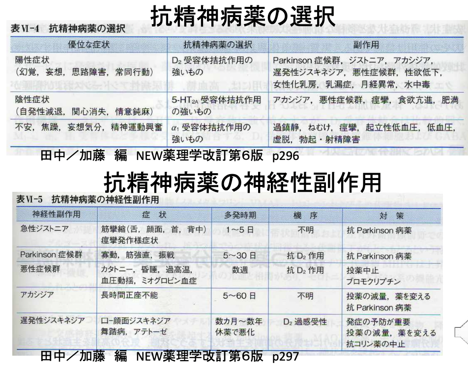
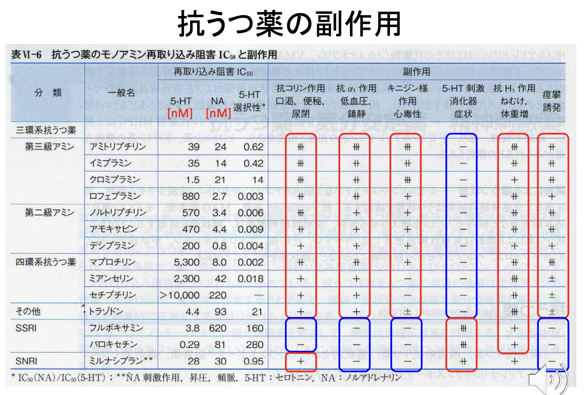
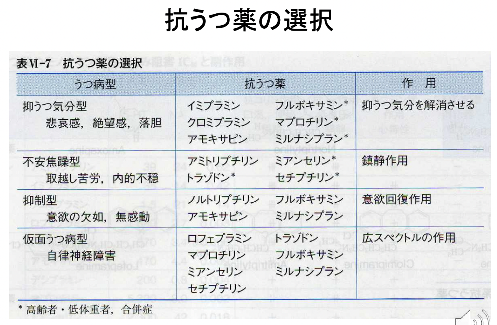

# 1025 精神・神経変性疾患の病態生理と治療薬 〜躁病・うつ病・双極性障害〜
- うつ病と躁病の治療の基本を述べ、薬物治療に用いる代表的な薬物名、作用機序、副作用を述べよ。
- 統合失調症の治療の基本を述べ、薬物治療に用いる代表的な薬物名、作用機序、副作用を述べよ。

# 1. 躁病
## 1.1. 躁病の病態生理
躁うつ病の躁病相と同義に使われることが多いが、うつ病相を伴わない純粋の躁も稀ではあるが存在する。躁病（躁うつ病）の発生率はおよそ0.5％前後、時点有病率は約0.2％といわれる。感情障害全体でみると女性に多いが、躁うつ病（躁病）では男女の比率は変わらない。発病年齢は、20～30代がピーク。
- 症状
  - 躁性気分障害：爽快気分、高揚した気分が中心だが、易刺激性や易怒性を伴うことも多い。
  - 観念奔逸：思考面にて次々と観念がわき起こるため、話がまとまらず一定の目標に向かって話すことができない。
  - 誇大妄想
  - 行為心迫：多弁多動。 ※程度が強くなると、精神運動興奮。
  - 性的・社会的逸脱
  - 睡眠欲求の減少・早朝覚醒などの睡眠障害。
  - 食欲・性欲の亢進
  - 体重減少
## 1.2. 躁状態の原因となる身体的要因
1. 薬物の副作用：アンフェタミン類、抗うつ薬、抗うつ薬からの離脱、コカイン、コルチコステロイド薬、レボドパ
2. 感染症：エイズ、脳炎、インフルエンザ、梅毒（晩期）
3. ホルモンの病気：甲状腺ホルモンの過剰
4. 結合組織の病気：eg. 全身性エリテマトーデス
5. 神経の病気：脳腫瘍、頭部外傷、ハンチントン舞踏病、多発性硬化症、脳卒中、側頭葉てんかん
## 1.3. 躁病薬：炭酸リチウム 《記述》 
### 1.3.1. 炭酸リチウムの作用機序
1. 神経伝達物質遊離の抑制：NAd・セロトニン・ドーパミンの遊離抑制。
2. PI代謝回転の抑制
3. glycogen synthase kinase-3b; GSK3bの阻害
   1. 細胞核内にβ-cateninが蓄積する。 
   2. JunのDNA結合が増加し、CREB; cAMP-response-elementbinding proteinの活性が低下する。 
   3. MAP; microtuble-associated protenとtauのリン酸化が減少する。 
   4. 神経細胞形態構築の変化。 
   5. glycogenの生合成量が増加し、イノシトールの生成が低下する。 
   6. inositol-3-phosphate系とdiacylglycerol系が抑制される。
### 1.3.2. 炭酸リチウムの作用と副作用
- リチウムの作用：気分安定作用、催眠作用
- リチウムの急性中毒：嘔吐、下痢、意識障害、けいれん、小脳失調、心不全、腎不全
- リチウムの長期投与による副作用：腎性尿崩症、甲状腺機能低下症

# 2. 鬱病
## 2.1. 鬱病の病態生理
鬱病の頻度は一般人口の2～3％。鬱病相に加えて躁病相をもつ双極性障害は0.5～1％。平均発症年齢は、20歳代後半～30歳代。  
自殺の主要な原因とされている。
- 症状
  - 抑鬱気分：憂鬱感、悲哀感、不安・焦燥感、自責感など。朝方が悪い。
  - 思考の異常：思考遅延、自己過小評価、とりこし苦労など。
  - 意欲・行動の異常：集中力・決断力の低下、動作緩慢、ときに不安焦燥による徘徊、自殺企図など。
  - 身体症状
    - 早朝覚醒
    - 中途覚醒
    - 食欲低下 
    - 精神運動制止
## 2.2. 鬱の原因
生物学的仮説は、薬物の有効性から考え出されたモノアミン仮説、MRIなどの画像診断所見に基づく仮説などがあり、2010年現在も活発に研究が行われている。モノアミン仮説のうち、近年はSSRIとよばれるセロトニンの代謝に関係した薬物の売り上げ増加に伴い、セロトニン仮説がよく語られる。また近年、海馬の神経損傷も話題となっている。ただ、臨床的治療場面を大きく変えるほどの影響力のある生物学的な基礎研究はなく、決定的な結論は得られていない。  
心理学的・精神病理学的仮説としては、フーベルトゥス・テレンバッハの唱えたメランコリー親和型性格の仮説が有名である。これは、几帳面・生真面目・小心な性格を示すメランコリー親和型性格を持つ人が、職場での昇進などをきっかけに、責任範囲が広がると、すべてをきっちりやろうと無理を重ね、うつ病が発症するという仮説である。

## 2.3. 抗うつ薬の作用機序
1. 抗うつ薬がモノアミントランスポーターに結合し、前神経終末へのセロトニンやNAdの再取り込みを阻害する。
2. 投与直後にシナプス間隙における神経伝達物質濃度が上昇する。ただし、効果の発現には1-2週間が必要である。作用発現には、神経伝達物質以降のシグナル伝達の改善や神経の可塑性変化が必要と考えられている。
3. セロトニンやNAdがシナプス後膜受容体を刺激し、セカンドメッセンジャーが変化し、抗うつ効果を発揮する。

上記の作用機序により抗うつ薬は抗うつ作用を示す一方で、抗うつ薬が神経終末受容体（EG. α2受容体、5-HT1D受容体）に作用して、セロトニンとNAdの生合成・遊離が抑制されると、縫線核樹状突起の5-HT1A受容体を介して神経活動が抑制されるため、シナプス後受容体刺激は現れにくKUなる。  
しかし、抗うつ薬を長期投与することで、以下の機序により効果が確実なものとなる。
1. 持続的にセロトニンとNAd濃度が上昇する。
2. 抑制性自己受容体がdown-regulation（脱感作）を起こす。
3. negative-feedbackが解除される。
4. 開口分泌により、シナプス間隙におけるセロトニンとNAdの遊離が上昇する。
5. セロトニンとNAdによるシナプス伝達が亢進する。

## 2.3. 鬱病薬① SSRI or SNRI《記述》
単極性鬱病では、SSRI; Selective serotonin reuptake inhibitor もしくは SNRI; Serotonin and norepinephrine reuptake inhibitor を投与するのが基本。   
これらは、副作用の出現は速やかである一方で、抗うつ効果の出現には数週間を要するという特徴を持つ。      
【重大な副作用】  
- セロトニン症候群：脳内のセロトニン濃度が急激に高まって生じる不安・焦燥・反射亢進・ミオクローヌスなど -> 直ちに薬剤を中止。
- 悪性症候群：高熱・筋固縮など著しい錐体外路症状・発汗などの自律神経症状・意識障害などが見られる。抗精神病薬との併用時に現れることが多い。。
- 抗利尿ホルモン不適合分泌症候群 SIADH  

【共通の併用禁忌】MAO阻害剤  
【退薬(離脱)症状】 長期投与後に突然中止すると、めまい、運動失調、悪心、嘔吐、インフルエンザ様症状、知覚異常などの退薬症状が現れる。投与を中止する際は、徐々に減量していくこと。

## 2.4. 鬱病薬② 三環系うつ病薬
- イミプラミン・クロミプラミン・アミトリプチリン  
    -> セロトニンとNAdの再取り込みを阻害する。
- トリミプラミン  
    -> NAdの再取り込みを阻害する。中枢/末梢抗コリン作用、鎮静作用、血圧下降作用や心臓作用が強い。
- ロフェプラミン・ドスレピン  
    -> 抗コリン作用等の副作用が比較的少ない。
- ルトリミプラミン・アモキサピン  
    -> NAdの取り込みを阻害する。  
       抗うつ作用と意識賦活化作用がある。  
       副作用としては、抗コリン作用、中枢/末梢NAd作用が現れることがある。  
       特にアモキサピンは速効性である。
### 2.4.1 三環系うつ病薬の作用と臨床適応
【薬理作用】
- 抗うつ作用
  - 内因性うつ病患者に投与すると60〜70％の患者で2〜3週間後にはうつ状態の改善がみられる。MAO monoamine oxidase阻害剤でみられるような多幸感を伴う賦活作用ではない。
  - 健常者に抗うつ薬を投与すると、情動の賦活化はみられず、鎮静作用や抗コリン作用が現れ、不快感、不安の増悪、行動テストの悪化などがみられる。
- 睡眠障害に対する治療
  - 鎮静作用が、うつ状態患者の不眠の初期治療に有用。REM期が減少し、第4期睡眠が増す。
- 動物行動に対する作用
  - 自発運動の抑制、体温下降、運動失調など  

【臨床適応】  
内因性鬱病の60-70%に有効。抗うつ作用、意欲増進作用、抗不安・焦燥作用があるのでそれぞれの薬物の副作用の特徴、作用発現までの時間などを考慮し使い分けることが大切。  
- 初老期・老年期うつ病患者 -> ドスレピン
- 外来患者 -> ロフェプラミン、アモキサピン（速効性で副作用が少ないため。）
  
【体内動態・代謝】イミプラミンは、消化管からよく吸収され、脱メチル化・酸化・水酸化によって代謝される。  
   
【副作用】  
以下のように作用点から、副作用を考えることができる。 
- H1受容体遮断 -> 眠気 、鎮静作用。
- ムスカリン受容体遮断 -> 抗コリン性副作用 （EG. 口渇、眼圧の上昇など）。特にアミトリプチンを投与する場合に投与する場合に顕著。
- α1受容体遮断 -> 起立性低血圧、反射性頻拍症、鎮静作用。
- D2受容体遮断 -> 高プロラクチン血症を伴う乳汁分泌、錐体外路症状、悪性症候群。
## 2.5. 鬱病薬③ 四環系抗うつ薬
- マプロチリン  
    -> NAdの取り込み阻害。   
    抑うつ気分と精神運動抑制に対して4日前後で効果が発現する。不安、不眠、食欲抑制に対して有効である。  
    速効性でかつ半減期が長いので１日１回投与が可能であり、汎用されている。

## 2.6. 鬱病薬④　ノルアドレナリン作動性・特異的セロトニン作動性抗うつ薬 NaSSA 
NaSSAの代表例は、ミルタザピン。  
【重大な副作用】セロトニン症候群、SIADH  
【併用禁忌】MAO阻害薬  
【補足】シナプス前α２アドレナリン自己受容体およびヘテロ受容体にアンタゴニストとして作用し、脳内ノルアドレナリンとセロトニンの遊離を増大させ、５−HT２および５−HT３受容体拮抗作用により選択的に５−HT−１A受容体への刺激を増強する。副作用としてセロトニン症候群、無顆粒球症、好中球減少症、痙攣、肝機能障害、黄疸、抗利尿ホルモン不適合分泌症候群があげられている。投与初期に強い眠気がある。

# 3. 統合失調症
## 3.1. 統合失調症の定義
妄想や幻覚などの多様な症状を示す症候群で精神疾患の一つ。幻覚や妄想などの症状を呈し、生活能力が失われる病である。双極性障害とならび、二大精神疾患とされている。  
## 3.2. 統合失調症の病態生理
思春期から青年期（20歳代）に発症することが多く、小児期の発症や老年期での発症もみられる。一般に破瓜型（解体型）に比べて妄想型は発症年齢が遅いとされ、30-40代での発病が多い。男性と比較して女性は平均発症年齢が遅く、閉経後にも小さな発症のピークがある。  
生涯発病率は約0.85% （120人に1人）であり、まれな病気ではない。  
発病率に性差なし。  
統合失調症の患者は関節リウマチに罹患しにくいことが知られている。最近の研究によれば、およそ4倍前後の差があるとされる。
## 3.3. 統合失調症の原因仮説
- ドーパミン仮説
  - 中脳辺縁系におけるドーパミンの過剰が、幻覚や妄想といった陽性症状に関与しているという仮説。実際にドーパミンD2受容体遮断作用をもつ抗精神病薬が陽性症状に有効であること、死後脳研究、陽電子放出断層撮影（PET）などの脳機能画像を用いた研究からも支持されている。
- グルタミン酸仮説
  - 麻酔薬として開発され、のちに精神異常の副作用の為使用が断念されたフェンサイクリジンを投与すると、統合失調症様の陽性症状及び陰性症状がみられたこと、フェンサイクリジンがグルタミン酸受容体（NMDA受容体）の遮断薬であることがのちに判明し、グルタミン酸受容体（NMDA受容体）の異常が統合失調症の発症に関与しているという仮説。実際に欧米を中心に従来の抗精神病薬とグルタミン酸受容体（NMDA受容体）作動薬であるグリシン、D-サイクロセリン、D-セリンを併用投与すると抗精神病薬単独投与より陰性症状や認知機能障害の改善度が高くなることが報告されている。将来的に、グルタミン酸受容体に作用する抗精神病薬の開発が期待されている。
- ストレス脆弱性仮説
  - 統合失調症へのかかりやすさ、弱さ（脆弱性）が元々ある人がストレスにさらされると、うまく対処出来ずに発症するというモデル。

## 3.4. 統合失調症治療薬
1.  定型抗精神病薬　　【作用】D2受容体遮断
2.  非定型的抗精神病薬　　 【作用】D2受容体遮断、セロトニン5HT2受容体遮断
### 3.4.1. 定型抗精神病薬 
定型抗精神病薬は、D2受容体遮断作用を持つ。  
従来からある抗精神病薬。陽性症状（eg. 幻覚、妄想など)は改善するが、陰性症状には効かない。副作用である錐体外路症状の出現頻度が高い。いずれもエピネフリン投与中は禁忌。
- 定型抗精神病薬
    1.  フェノチアジン系　　eg. クロルプロマジン  
        - 中枢神経系に対して、①鎮静作用　②抗精神病作用　③錐体外路症状　④制吐作用　⑤体温降下作用を持つ。精神依存や禁断症状はないが、相互作用を起こす。
    2.  ブチロフェノン系　　eg. ハロペリドール  
#### 3.4.1.1. フェノチアジン系
フェノチアジン誘導体の代表例は、クロルプロマジン。
【薬理作用】
- 中枢神経系
    1. 鎮静作用
    2. 抗精神病作用：D2・5-HT2A受容体拮抗作用による。
    3. 錐体外路症状
    4. 制吐作用
    5. 体温降下作用
- 自律神経系：D2受容体遮断・α1・ムスカリン・5-HT2A・H1受容体拮抗作用による。
- 心血管系：健常者に静注すると、中枢作用と末梢α1受容体拮抗作用によって起立性低血圧と反射性頻脈が起こる。
- 内分泌系：下垂体前葉のD2受容体遮断によりプロラクチン分泌が亢進する。一方、ゴナドトロピン・成長ホルモン・ACTH・後葉ホルモンの分泌が抑制される。  

【耐性・相互作用】精神依存・禁断症状はないが、アルコール・催眠薬・モルヒネ様鎮痛薬・麻酔薬・降圧薬・抗コリン作用薬・抗ヒスタミン薬などの作用を増強させる。  

【体内動態】経口投与後2〜4時間で最大血中濃度に達し、血中半減期は平均9時間。血中濃度がプラトーに達するまで数日かかる。抗精神病作用が現れるのには1〜3週間を要する。  
【代謝】肝臓で代謝される。グルクロン抱合を受け尿中および胆汁中に排泄される。
### 3.4.1.2. ブチロフェノン誘導体
ブチロフェノン誘導体の代表例は、ハロペリドール。
陽性症状に最も有効で、昏迷・無為・自閉症状にも効果がある。  
### 3.4.3. 非定型抗精神病薬  
新しい抗精神病薬。陽性症状に加えて、陰性症状(eg. 感情平板化、意欲減退)にも有効。第一選択薬。副作用（錐体外路症状）の出現頻度が低い。いずれもエピネフリン投与中は禁忌。
1. セロトニン/ドパミンアンタゴニスト  
   - eg. リスペリドン、ペロスピロン、プロナンセリン
   - 作用機序：強力な興奮性5-HT2A受容体拮抗作用と比較的弱い抑制性D2受容体抑制作用が併存。  
   - -> 幻覚・妄想等の陽性症状の抑制とともに自閉、感情鈍麻等の陰性症状、認知障害にも効果がある。錐体外路性副作用は比較的軽微。ペロスピロンには5-HA1A受容体部分アゴニスト効果があり軽度の抗不安・抗うつ効果がある。
2. 多元受容体作用抗精神病薬 MARTA  
   - eg. クロザピン
   - 作用機序：D4受容体と5-HT2A受容体に強く結合する。強力な抗精神病薬で陽性症状・陰性症状・認知障害を改善する。
   - D2受容体遮断による副作用（遅発性ジスキネジアやプロラクチン値上昇など）が少ない。しかし、重篤な副作用（無顆粒症など）があるので、他の抗精神病薬で効果のない治療抵抗性統合失調症にのみ用いる。

  
### 3.4.4. 統合失調症治療薬の副作用
抗精神病薬の重要な副作用として、錐体外路症状があるが、これに対しては、抗コリン薬を併用する。
- アキネジア：随意運動能力が低下し、身体の動きが鈍くなる。
- アカシジア：落ち着きが無くなり、足をもぞもぞ動かし、じっとしていられなくなる。
- 振戦：手の震えが起こる。
- 急性ジストニア:身体の筋肉がひきつれを起こし、首が横に向いたり、体を反転させたりする。
- 遅発性ジスキネジア：まばたきが多くなる、口や舌の異常な運動、四肢体幹の不随意運動。長期服用時に多い。  

滝のような発汗・発熱・筋強剛がみられる場合は、生命に関わるので、直ちに投薬を中止すること。  

# 4. 神経変性疾患
神経変性疾患とは...
1. 原因と発症機序が不明である。
2. 疾患と空間特異的な神経細胞死。
3. 家族性疾患遺伝子が同定されている。
4. 概ね加齢がリスクファクター。
5. 有効な治療法が少ない。
6. 多くの先進国で社会問題となっている。
## 4.1. ポリグルタミン病
別名、CAGリピート病。  
球脊髄性筋萎縮症(SBMA)、ハンチントン病(HD)、脊髄小脳変性症1型 (SCA1), SCA2, Machado-Joseph病 (MJD,SCA3とも呼ばれる)、SCA6, SCA7、歯状核赤核・淡蒼球ルイ体萎縮症 (DRPLA)の8疾患が見いだされている。  
### 4.1.1. ポリグルタミン病の病態仮説
ポリグルタミン鎖の異常伸長により変異タンパク質の構造が不安定になって凝集しやすくなり、その結果、脳や脊髄内の神経細胞内に封入体として蓄積し、最終的に神経細胞死を引き起こす。
### 4.1.2. ハンチントン病
四肢末端に始まり、やがて全身に及ぶ。   
常染色体優性遺伝形式の進行性の神経変性疾患である。  
病因遺伝子は4番染色体短腕4p16.3のIT15（interesting transcript 15）領域に位置するハンチンチン huntingtinタンパク質をコードするHTT遺伝子であり、第1エクソンコーディング領域のCAGリピートの伸長によって起こる。リピート数は正常では35以下で、患者では36以上である。この境界は必ずしも厳密ではなく、人種やほかの遺伝的バックグラウンドによって若干のずれが生じうる。   
【古典的主症状】
1. 舞踏運動 choreaを中心とする不随意運動
2. 易怒性や易刺激性などの性格変化
3. 注意力や記銘力低下などの認知機能障害
4. 幻覚・妄想などの精神障害  

【分子レベルでの影響】
- ハンチンチンの断片化
- プロテアソーム機能異常
- オートファジー機能異常
- 転写制御異常
- 細胞内輸送の障害
- エネルギー代謝の障害
- 興奮毒性  

【治療薬】テトラベナジン  
現在のところ個々の症状に対する対症療法のみで、有効性が示された根本療法はない。不随意運動に対する対症療法としてチアプリドやハロペリドール、ペルフェナジン（ドパミン受容体遮断する向精神薬）。  
2008年にFDAにより、テトラベナジンが承認された。モノアミン小胞トランスポーター2（VMAT2）の選択的阻害剤。線条体神経終末でドパミンを枯渇させることで不随意運動を抑制する。無作為化比較試験にて不随意運動の減少効果が認められ、テトラベナジンは米国神経学会による治療ガイドラインでは第一選択に位置付けられている。本邦でも2012年12月に承認された。

## 4.2. 筋萎縮性側索硬化症 ALS: amyotrophic lateral sclerosis
【ALSの概念】上位運動神経と下位運動神経が選択的進行性におかされ、数年で呼吸不全を呈して死亡する運動ニューロン疾患である。  
【ALSの治療薬】興奮性アミノ酸による毒性の抑制と神経保護作用が作用機序のリルゾールによる病勢の遅延。