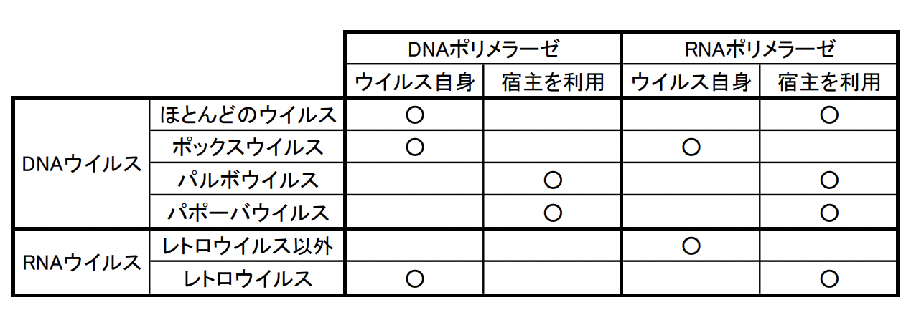

# 1028 抗ウイルス薬
# 1. ウイルスについて
## 1.1. 環境の微生物
地球上にはおよそ100万〜1000万種類の生物が存在していると考えられているが、その3/4が微生物であり、微生物の大半は細菌であると言われている。これらの微生物はそのほとんど全てがヒトや動物の生体には依存しない環境中の栄養を利用した独立の環境圏を有している。しかし、100 種程の微生物は水・食物や土壌、空気、昆虫、節足動物、野生動物、伴侶動物など、または性行為などを介してヒトに感染して病気を起こす。したがって、病原微生物が環境中のどこに生息または存在し、どのような感染経路を持っているかを理解することは感染症予防には重要である。
## 1.2. 感染と発病
微生物などの寄生体がヒトまたは動物など生体の体表や体内に付着、侵入して増殖し始めることを感染といい、この時のヒトまたは動物を宿主という。この結果、宿主に病理組織学的な病変や自覚的、他覚的な症状が生じた場合を発病といい、感染によって起こされた疾病を感染症という。また、潜在的に宿主を発病させる能力をもつ寄生体を病原体という。  
感染はしているがまだ発病していない状態を潜伏感染といい、感染から発病に至るまでの期間を潜伏期間という。また発病を伴わず無症状に経過するような感染を不顕性感染という。発病後、症状を示さないが、なお病原体を保有してこれを体外に排出し続けるような者を保菌者とよぶ。また、正常な宿主はほとんど発病しないが、抵抗力の低下した宿主では発病するような感染を日和見感染といい、そのような宿主を易感染性宿主という。
## 1.3. ウイルスの分離と定義
### 1.3.1. ウイルスの分離
Dmitri Ivanowskiは、タバコモザイク病の病原体の分離を通じて、ろ過性ウイルスを発見。後に、口蹄疫ウイルスの分離、バクテリオファージの分離に続いて、タバコモザイクウイルスの結晶化にも成功した。これは、このような病原体は非常に単純な高分子のみからなっていることを意味した。
### 1.3.2. ウイルスの定義
ウイルスは現代の生物の定義においては、核酸とタンパク質からなる粒子であり、非生物に分類されている。ウイルスは、生物と同様に複製することができるが、増殖に必要なエネルギーを自ら産生することができない。すなわちウイルスは、動物や植物の細胞に寄生して、宿主細胞のエネルギーを利用して自身のゲノムを複製し、粒子を構成する成分を合成して増殖する。このように生きている細胞（生細胞）に寄生してその細胞の中でのみ増殖が可能な寄生体を偏性細胞内寄生体という。
### 1.3.3. 生物の定義
1. 細胞膜：全ての生物は細胞膜を持つ。
2. 異化作用：全ての生物は、外的な栄養を分解してエネルギーを得ることができる。
3. 同化作用：全ての生物は、自ら産生したエネルギーによって細胞成分を合成することができる。
4. 複製：全ての生物は、ゲノムを複製して娘細胞に遺伝することができる。
5. 進化と適応：全ての生物は、遺伝子の変異によって進化と適応を行うことができる。

ウイルスには1, 2, 3（,4）が当てはまらない。
## 1.4. ウイルスの基本構造
ウイルスの形態は、球対称型、らせん対称型、および複合型であり、特に正二十面体対称のものが多い。  
ウイルスの大きさは、最大300nm（痘瘡ウイルス）から最小10nmの範囲にあり、他の微生物に比較すると小さい。  
ウイルス粒子は、ゲノムとカプシドから構成されている。  
まずゲノムについては、ウイルスによって、DNAを持つものto
RNAを持つもののどちらかに分類され、両方持つウイルスは存在しない。また、ウイルスゲノムは、DNA型/RNA型の区別だけではなく、直鎖状/環状、非分節型/分節型か、二本鎖/一本鎖などの
点でも異なり、これらの特徴はウイルスの分類の基準にもなっている。一本鎖のRNAウイルスの場合、ゲノムRNAがそのままmRNAになるものを(+)鎖RNAといい、ゲノムRNAの相補的なRNAがmRNAになるものを(-)鎖RNAという。  
カプシドとは、ゲノムを包むタンパク質であり、ウイルスの形態を決めたり、感染組織や器官の特異性を決める役割を持ち、カプソメアと呼ばれるユニットタンパク質が集合したものである。カプソメアの数はウイルスによって異なる。ゲノムとカプシドを合わせてヌクレオカプシドと呼ぶ。カプシドはエンベロープと呼ばれる膜に包まれている場合が多い。エンベロープはウイルスが増殖過程で細胞から放出される時に、宿主細胞の膜（細胞膜、小胞体膜、ゴルジ体膜、核膜など）から形成される。エンベロープを持たないウイルスが放出される時には、細胞膜が破壊されて、宿主細胞は死に至る。また、エンベロープにはスパイクと呼ばれる突起物を持っているウイルスもある。ウイルスのスパイクは、ウイルスの細胞への吸着や細胞からの放出に重要な物質である。　 
## 1.5. ウイルスの分類
ウイルスゲノムの構造とmRNA（すなわち、直接タンパク質生合成反応の鋳型となる得る鎖）の生成機構との関連性に基づいて、7つの大きなグループに分けられる。  
1. dsDNA：ポックスウイルス科、ヘルペスウイルス科、アデノウイルス科、パポバウイルス科
2. ssDNA：パルボウイルス科
3. 部分dsDNA：ヘパドナウイルス科
4. (+)ssRNA：コロナウイルス科、トガウイルス科、フラビウイルス科、ピコルナウイルス科
5. (-)ssRNA：パラミクソウイルス科、ブニヤウイルス科、オルソミクソウイルス科、アレナウイルス科、ラブドウイルス科、フィロウイルス科
6. ssRNA-RT 1本鎖RNA逆転写ウイルス：レオウイルス科
7. dsDNA-RT 2本鎖DNA逆転写ウイルス：レトロウイルス科
## 1.6. ウイルスの増殖
### 1.6.1. ウイルスの増殖様式
ウイルスは、一段増殖して一度に多数の粒子が形成される。ウイルスの感染後、ゲノムやカプシドなど粒子構成成分の合成が起こっている間は、細胞内に粒子が見出せない。この期間を暗黒期という。また、感染してから粒子が放出されるまでの期間を潜伏期といい、ウイルスの場合はおよそ5時間（長くても数日）である。細胞外に放出される粒子数の平均をバーストサイズといい、動物細胞中では 10^3〜10^5個/細胞のウイルスが産生される。
### 1.6.2. ウイルスの増殖過程
ウイルスの増殖過程は、下記3段階に分けられる。
1. 初期段階（感染性細胞への吸着、脱殻、侵入）
2. ウイルス成分の生合成（ウイルスゲノムの複製、転写、翻訳）
3. ウイルス粒子の集合（アセンブリー）と細胞からの遊離
## 1.7. ウイルスゲノムの発現と複製  

### 1.7.1. mRNA合成とウイルスゲノムの複製
mRNA合成およびウイルスゲノムの複製は、ウイルス由来の酵素または宿主由来の酵素のいずれか、あるいは両方によって触媒されるが、どちらの酵素に依存するかは、ウイルスの種類や合成される核酸分子種により異なる。
#### 1.7.1.1. DNAウイルスの場合
- mRNA合成：ssDNAウイルスと部分dsDNAウイルスを例外として、動物DNAウイルスはdsDNAをそのゲノムとして持つ。しかし、ウイルスmRNA合成は、前2者も含めてdsDNAを鋳型として宿主細胞のDNA依存RNAポリメラーゼ（pol II）によって触媒される（ただし、ポックスウイルス科は例外で、自分自身のゲノムでコードするDNA依存RNAポリメラーゼを用いる）。
- ウイルスゲノムの複製：ほとんどのDNAウイルスは、ウイルスゲノムでコードされたDNAポリメラーゼを生成するが、パルボウイルス科とパポバウイルス科は、宿主細胞のDNAポリメラーゼを利用する。
#### 1.7.1.2. (+)RNAウイルスの場合
- mRNA合成：(+)RNAウイルスは一本鎖(+)鎖RNAをウイルスゲノムとして持ち、細胞内に入るとウイルスゲノムRNAはmRNAとして機能し、RNAポリメラーゼなどを含むタンパク質の合成を行う。
- ウイルスゲノムの複製：合成されたRNAポリメラーゼの作用によって、(+)RNA -> (-)RNA -> (+)RNAの順でウイルスゲノムは複製され、(+)鎖RNAを生成するとともに、それ自身がさらにmRNAとしても機能する。
#### 1.7.1.3. (-)RNAウイルスの場合
- mRNAウイルス：一本鎖(-)RNAゲノムはそのままmRNAとして機能しないので、細胞内に侵入したウイルスゲノムが発現するためには、ウイルスmRNAがまず合成されなければならない。(-)RNAウイルスは、その粒子内にRNA依存RNAポリメラーゼを持ち、これがウイルスゲノムRNAを鋳型としてmRNAを合成する。
- ウイルスゲノムの複製：ウイルスゲノムの(-)RNAを鋳型としてウイルスのRNA依存RNAポリメラーゼにより(+)RNAが合成された後、再度この(+)RNAを鋳型として(-)RNAが合成され、ウイルス粒子に組み込まれる。
#### 1.7.1.4. dsRNAウイルスの場合
- mRNA合成：ウイルスゲノムのdsRNAは相互に相補的な塩基配列を持ち、細胞に侵入した後、ウイルス粒子に含まれるRNA依存 RNAポリメラーゼがゲノム二本鎖 RNAの(-)RNAを鋳型としてゲノム全長を転写して(+)鎖RNA（=mRNA）を合成する。(+)鎖RNA の一部はそのままmRNAとして機能する。
- ウイルスゲノムの複製：(+)鎖RNAを鋳型としてRNA依存RNAポリメラーゼによりゲノム二本鎖RNAを生ずる。
#### 1.7.1.5. レトロウイルスの場合
- mRNA合成とウイルスゲノムの複製：レトロウイルスは、ウイルス粒子中に組み込まれているRNA依存DNAポリメラーゼ（逆転写酵素）がssRNAゲノムを鋳型として、まず、そのdsDNAコピー（complementary DNA: cDNA）を合成する（RNAを鋳型としたDNA合成 -> (+)RNAの消化 -> DNAを鋳型としたDNA合成）。次に、ウイルスcDNAは宿主染色体DNAの組み込まれた後（プロウイルス）、宿主のDNA依存RNAポリメラーゼ（pol II）によって転写され、ウイルスmRNAとウイルスゲノムRNAを生ずる。   

レトロウイルスは一般には４つの遺伝子、gag、pro、pol、envからなっている。gag遺伝子はウイルス粒子の内部殻（カプシドタンパク質、コアタンパク質）を形成する3〜4種類のタンパク質へと分断されるポリタンパク質をコードする。pro遺伝子はポリタンパク質のプロセシングに関与するプロテアーゼをコードしている。pol遺伝子は逆転写酵素と宿主ゲノムへウイルスDNAを挿入する時に必要なインテグラーゼを含むポリタンパク質をコードしている。env遺伝子はウイルスのエンベロープを構成するタンパク質が含まれているポリタンパク質をコードしている。  
### 1.7.2. ウイルスタンパク質の合成
ウイルスタンパク質の合成は、完全に宿主のタンパク質合成装置に依存する。  

# 2. 抗ウイルス薬
## 2.1. 抗ウイルス薬の特徴
ウイルス薬の開発は、抗菌薬の開発より困難である。  
その理由は、①ウイルスは宿主の代謝機構を利用して増殖するため、ウイルス独自の代謝・
酵素機構が少ないため、②多くのウイルス疾患ではその最大の増殖が臨床症状発現時またはそれ以前に起こっているので、抗ウイルス薬の効果を十分に発揮するためには、薬物を無症状の潜伏期または感染のごく早期に投与する必要があるためである。  
## 2.2. 抗ウイルス薬の作用機序
まず、ウイルスの増殖過程を細かく見ると以下のようになる。
1. 吸着・侵入 attachment・penetration
2. 脱殻 uncoating
3. ゲノムの複製 replication
4. 転写と翻訳による遺伝子発現 translation/transcription 
5. ゲノムとタンパクの組み立て assembly, maturation 
6. 発芽 budding
7. 放出 release

抗ウイルス薬の作用機序は、上記の各段階を阻害するものになっている。治療戦略は以下のようになる。
1. ウイルスの吸着阻害
2. ウイルスの脱殻阻害
3. ウイルスの核酸合成阻害
4. RNAウイルスの逆転写酵素阻害、インテグラーゼ阻害
5. ウイルスのプロテアーゼ阻害
6. ウイルスの出芽阻害
7. 抗ウイルスタンパク質の誘導
8. 抗ウイルスT 細胞活性増加
## 2.3. ヘルペスウイルス感染症治療薬
ヘルペスウイルスはdsDNAである。  
### 2.3.1. ヘルペスウイルスの概要
以下の2種類が存在。
1. ヘルペスウイルス感染症  
   - 病原ウイルス：単純ヘルペスウイルス（HSV-1、HSV-2）
   - 感染経路：接触感染、⺟⼦感染
   - 症状：粘膜（⽪膚、⼝、唇、⾓膜、性器）に⽔泡状発疹、脳炎
   - 特徴：種々の原因で再活性化または再発する。
2. ⽔痘、帯状疱疹  
   - 病原ウイルス：⽔痘・帯状疱疹ウイルス（VZV）
   - 感染経路：⾶沫感染
   - 症状：⽔痘、帯状疱疹
   - 特徴：種々の原因で再活性化、再発
### 2.3.2. 抗ヘルペスウイルス薬の種類
- アシクロビル
- バラシクロビル
- ファムシクロビル
- ビダラビン
- アメナメビル
### 2.3.3. 抗ヘルペスウイルス薬の作用機序
抗ヘルペスウイルス薬は、dGTPの材料と構造が類似しているため、dGTPと競合することでウイルスDNA合成を阻害する。
## 2.4. インフルエンザウイルス感染症治療薬
### 2.4.1. インフルエンザウイルスの概要
- 疾患：インフルエンザウイルス感染症
- 病原ウイルス：インフルエンザウイルスA型、B型（、C型）
- 感染経路：⾶沫感染、接触感染
- 症状：⿐⽔、咳、くしゃみ、⾼熱、頭痛、筋⾁痛、倦怠感
- 特徴：HA、NAのタイプにより複数の抗原性が存在する。
### 2.4.2. インフルエンザウイルスの変異
インフルエンザウイルスは、ヘマグルチニン HAおよびノイラミニダーゼ NAを変異させて、宿主の防御機構から逃避する。変異の仕方は以下の2種類がある。  
- 不連続変異：分節間での組換え
- 連続変異：点突然変異  
### 2.4.3. インフルエンザウイルスの増殖過程
脱殻したインフルエンザウイルスの一本鎖(-)RNAゲノムは核内に移行し、ウイルス粒子中に存在しているRNA依存RNAポリメラーゼによって自己の(-)鎖RNAを鋳型として(+)鎖RNAを合成する。このRNAは細胞質に移行してmRNAして働き、カプシドタンパク質などウイルスタンパク質が合成される。一方、核内では(+)鎖を鋳型として再び(-)鎖RNAが複製される。細胞質で合成されたカプシドタンパク質は核内に移行してウイルスのゲノム(-)鎖RNAと集合してウイルス粒子が組み立てられる。このウイルス粒子は、小胞体を経由して細胞膜に輸送されて、細胞外に放出される時にエンベロープを被って出芽する。  
インフルエンザウイルスの吸着は、エンベロープのスパイクを構成するHA が宿主細胞表面レセプターのシアル酸と結合することによって開始する。A型インフルエンザウイルスでは、吸着後、エンドサイトーシスによりウイルス粒子は宿主細胞内に取り込まれ、エンベロープタンパク質の一つであるM2タンパク質の働きにより脱殻が促される。一方、スパイクを構成するNAは、シアル酸を切断する加水分解酵素であり、ウイルスの出芽の段階でHAとシアル酸との結合を切り放してウイルス粒子の細胞からの遊離を容易にしている。
### 2.4.4. 抗インフルエンザウイルス薬
1. 脱核・侵入阻害剤
  - 作用：インフルエンザウイルスA型が細胞内に取り込まれてからエンベロープを脱殻する過程に必須のM2チャネルを阻害する。
  - eg.
    - アマンタジン（経口剤）
2. 出芽阻害剤
  - 作用：NA阻害薬であり、新しく形成されたウイルス粒子が感染細胞から遊離することを阻害することによりウイルスの増殖を抑制する（感染細胞から未感染細胞に拡散するのを抑制する）。
  - eg. 
    - オセルタミビル（経口タミフル®）
    - ザナミビル（吸入リレンザ®）
    - ラニナミビルオクタン酸エステル（吸入剤（1回））
    - ペラミビル（点滴静注剤）
3. RNA合成阻害剤
  - type1：RNAポリメラーゼを阻害する。
    - eg. ファビピラビル：動物実験において催奇形性が確認されているため、緊急時のみ投与。
  - type2：キャップ依存性エンドヌクレアーゼ活性を阻害する。
    - eg. バロキサビル（経口剤（1回））
## 2.5. ヒト免疫不全ウイルス HIV感染症治療薬
### 2.5.1. HIVの疾患の概要
- 疾患：ヒト免疫不全ウイルス感染症
- 病原ウイルス：ヒト免疫不全ウイルス-1, -2
- 感染経路：血液、体液、母子感染
- 症状：後天性免疫不全症候群（AIDS）
- 特徴：耐性ウイルスが出現しやすい。
### 2.5.2. HIVの増殖過程
HIVのエンベロープタンパク質gp120がT細胞のCD4分子に結合するとウイルスと細胞膜の脂質二重膜との融合が引き起こされてウイルスは細胞内に侵入する。ウイルスゲノムはウイルス粒子中に存在するRNA依存DNAポリメラーゼ（逆転写酵素）によって細胞質内でDNAに転写される。このウイルスDNAは核に移行し、細胞の染色体DNAに組み込まれる。ウイルスの産生はウイルスDNAが細胞の酵素系によって転写されてmRNAやウイルスタンパク質の合成が進行することによる。  
HIVの吸着には、CD4分子以外に、マクロファージやT細胞に発現しているケモカイン受容体であるCCR5およびCXCR4が関与することが明らかとなっている。このことは、HIVがマクロファージやT細胞に選択的に感染する一因となっている。また、ケモカイン受容体の多型・変異は、HIV感染感受性を決定している。例えば、CCR5の変異によりHIV感染の高いリスク下にあっても、15年以上AIDSを発症しない者もいる。
### 2.5.3. 抗HIVウイルス薬
1. 逆転写酵素阻害薬
   1. ヌクレオチド系
        - 作用：dNTPの構造に類似しており、逆転写酵素により伸長しつつあるウイルスDNA鎖に取り込まれ、3'水酸基がないためDNA鎖合成を停止させる。  
        - 例：ジドブジン（アジドチミジン）、テノホビル、ラミブジン、エムトリシタビン、アバカビル
   2. 非ヌクレオチド系  
        - 作用：逆転写酵素の活性部位近傍に結合して、逆転写酵素活性を阻害する。
        - 例：エファビレンツ、ネビラピン、エトラビリン、リルピビリン、ドラビリン
2. プロテアーゼ阻害剤  
   - 作用：ウイルスタンパク質の成熟過程に必須なプロテアーゼを阻害し、ウイルス増殖を阻害する。
   - 例：リトナビル、ホスアンプレナビル、ロピナビル、アタザナビル、ダルナビル
3. インテグラーゼ阻害剤  
   - 作用：ウイルスcDNAの宿主染色体DNAへの組み込みを行うインテグラーゼを阻害する。
   - 例：ラルテグラビル、ドルテグラビル、エルビテグラビル、ビクテグラビル
4. 吸着・侵入阻害剤  
   - 作用：HIVが細胞に侵入する際に利用する補受容体のケモカイン受容体CCR5を阻害する薬剤である。HIVがCD4陽性細胞に侵入する際、まずHIVエンベロープ糖蛋白のgp120がCD4と結合する。続いて、gp120-CD4複合体がCD4陽性細胞の細胞膜上にあるケモカイン受容体CCR5またはCXCR4に選択的に結合する。マラビロクは、CCR5に選択的に結合してその立体構造を変化させ、gp120-CD4複合体とCCR5の結合を阻害することで、HIVの細胞内への吸着・侵入を阻害する。
   - 例：マラビロク
## 2.6. サイトメガロウイルス感染症治療薬
### 2.6.1. 疾患の概要
- 病原ウイルス：サイトメガロウイルス
- 感染経路：性的接触、⾮性的接触
- 症状：網膜炎、脳炎、潰瘍
- 特徴：種々の原因で再活性化、および再発する。
### 2.6.2. 抗サイトメガロウイルス薬
1. DNA合成阻害剤
   - type1：dGTPと構造が酷似しているため、dGTPと競合してウイルスDNA合成を阻害する。
     - 例
       - ガンシクロビル
       - バルガンシクロビル：ガンシクロビルのプロドラッグ。
   - type2：サイトメガロウイルスのDNAポリメラーゼに結合し、DNAポリメラーゼ活性を阻害する。
     - 例：ホスカルネット水和物
2. DNAターミナーゼ複合体阻害剤
   - 作用：複製されたウイルスゲノムDNAはターミナーゼと呼ばれるサイトメガロウイルスのタンパク質によって、ターミナーゼ複合体を経由してカプシド内に格納される。この際、ターミナーゼは複製されたDNAを細かく切断してカプシド内に格納するが、レテルモビルは、DNAの切断及びパッケージングに必要なDNAターミナーゼ複合体を選択的に阻害することで、一単位長のゲノム生成及びカプシドへのパッケージングを抑制し、ウイルス粒子の形成を阻害する。
   - 例：レテルモビル
## 2.7. 肝炎ウイルス感染症治療薬
### 2.7.1. 疾患の概要
症状は、⾷欲不振、全⾝倦怠感、感冒様の発熱、消化器症状、肝細胞逸脱酵素上昇、肝腫⼤、⻩疸。   
感染経路と慢性化の可能性は、病原ウイルスによって異なる。
- A型肝炎ウイルス
  - 感染経路：経⼝感染（汚染された⽔や⾷品）
  - 慢性化：(-)
- B型肝炎ウイルス
  - 感染経路：⾮経⼝感染（血液、体液）
  - 慢性化：(+)
- C型肝炎ウイルス
  - 感染経路：⾮経⼝感染（血液）
  - 慢性化：(++)
### 2.7.2. 抗肝炎ウイルス薬
1. インターフェロン  
   - 作用：インターフェロンの抗ウイルス作用は、感染細胞内の2-5AS（2’, 5’オリゴアデニル酸合成酵素）を誘導し、不活性型のRNaseを活性化して、ウイルスmRNAを分解する機序でウイルスのタンパク質合成を阻害することが作用機序の一つとして考えられている。ペグインターフェロンは、インターフェロン分子に高分子のポリエチレングリコール（PEG）を共有結合させたもので、インターフェロンの血漿半減期を著しく延長させた製剤である。  
2. B型肝炎ウイルス逆転写酵素阻害剤  
   - 作用：dNTPの材料に構造が酷似しており、RNAからDNAを複製する逆転写反応を阻害するとともに、DNAに取り込まれ、DNA鎖の伸長を停止させることにより抗ウイルス作用を示す。  
   - 例
     - ラミブジン
     - アデホビル
     - アデホビルピボキシル：アデホビルのプロドラッグ
     - テノホビル
     - エンテカビル  
3. C型肝炎ウイルスゲノム複製阻害剤  
   - NTPの材料に構造が酷似しており、、RNAへ取り込まれ、RNAウイルスのゲノムの変異を誘導することで突然変異を誘発させて抗ウイルス作用を示すと考えられている。
   - 例
     - リバビリン
     - ソホスブビル
4. C型肝炎非構造タンパク質阻害剤  
   - NS3-4Aプロテーゼ阻害剤：アスナプレビル、グラゾプレビル、グレカプレビル
   - NS5A阻害剤：ダクラタスビル、エルバスビル、レジパスビル、ベルパタスビル、ピブレンタスビル
   - NS5Bポリメラーゼ阻害剤（核酸型）：ソホスブビル
5. 肝庇護剤  
   - 作用：肝臓が破壊されるのを防ぎ、肝機能を改善させる。
   - 例
     - 強力ネオミノファーゲンシー
     - ネオファーゲン
     - ウルソデオキシコール酸
6. 機序不明な漢方材  
   - 小柴胡湯
   - 茵蔯五苓散
   - 柴苓湯
   - 小建中湯  
## 2.8. その他の抗ウイルス薬
- 生体防御
  - 能動免疫
    - 人口免疫：ワクチン
    - 自然免疫：発病後の治癒、不顕性感染
  - 受動免疫
    - 人口免疫：抗ヒト免疫グロブリン
    - 自然免疫：母体からの抗体
### 2.8.1. 抗ウイルス免疫増強薬
代表例は、イノシンプラノベクス。
作用は、リンパ球の分裂増殖の促進、抗体産生の増強。
### 2.8.2. ワクチン/ウイルス特異性抗体
ワクチンは3種類。
1. 弱毒生ワクチン：弱毒化した病原体をそのまま接種する。
2. 不活化ワクチン：病原体を加熱やホルマリンで不活化して接種する。
3. 成分ワクチン：感染防御に必要な抗原成分だけを接種する。

|          | 生物学的製剤         | 感染症                             | 
| -------- | -------------------- | ---------------------------------- | 
| 能動免疫 | 弱毒生ワクチン       | 流行性耳下腺炎（ムンプスウイルス） | 
| 能動免疫 | 弱毒生ワクチン       | 麻疹                               | 
| 能動免疫 | 弱毒生ワクチン       | 風疹                               | 
| 能動免疫 | 弱毒生ワクチン       | 水痘                               | 
| 能動免疫 | 弱毒生ワクチン       | 黄熱                               | 
| 能動免疫 | 不活化ワクチン       | 日本脳炎                           | 
| 能動免疫 | 不活化ワクチン       | 狂犬病                             | 
| 能動免疫 | 不活化ワクチン       | 急性灰白髄炎（ポリオウイルス）     | 
| 能動免疫 | 不活化ワクチン       | A型肝炎                            | 
| 能動免疫 | 成分ワクチン         | インフルエンザ                     | 
| 能動免疫 | 成分ワクチン         | B型肝炎                            | 
| 受動免疫 | 抗ヒト免疫グロブリン | B型肝炎                            | 
### 2.8.3. 新型コロナウイルス感染症治療薬
- 病原ウイルス：SARS-CoV-2
- 感染経路：飛沫感染、接触感染など
- 症状：発熱・喉の痛み・咳・痰など、肺炎などの重症例あり
- ワクチン：mRNAワクチン、ウイルスベクターワクチン、組換えタンパク質ワクチン