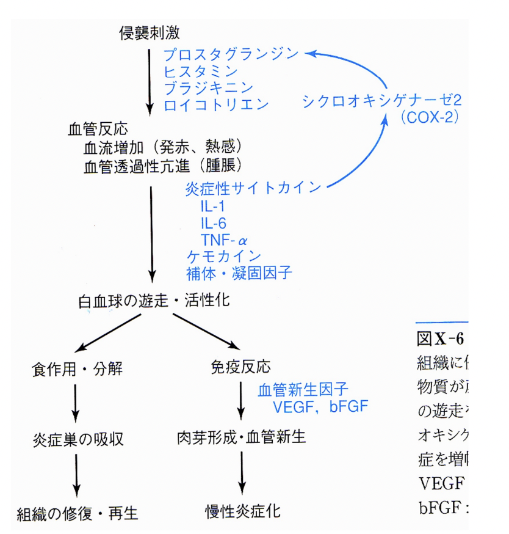

# 1108 抗炎症剤（鎮痛解熱剤）
抗炎症剤（鎮痛解熱剤）と抗アレルギー薬は作用機序における共通性があるため、一体として理解する。
## QUESTIONS
1. NSAIDsの3作用を説明せよ。
2. NSAIDsの副作用を説明せよ
3. アラキドン酸カスケードに言及して、NSAIDsの作用メカニズムを説明せよ。
4. NSAIDsの副作用を回避する投与方法を説明せよ。
# 1. 炎症 Inflammationの病態生理  
## 1.1. 炎症の症状
炎症の肉眼的病理所見：発赤、熱感、腫脹、疼痛  
その他の症状として、咳、下痢、呼吸困難も。
炎症とは、侵襲に対する防御反応である。  
しかし過剰になると、生体にとって不利益な状態になる。この『過剰な生体反応』を抑制することはトータルとしては生体にとて利益になる（過剰な症状を抑制する治療はいわゆる対症療法の一つである） 。  
### 1.1.1. 炎症症状に対する対症療法
1. 発熱 -> NSAIDs
2. 疼痛 -> NSAIDs
3. 咳 -> 鎮咳剤
4. 下痢 -> 止痢剤
5. 呼吸困難 -> 酸素吸入と原因療法。薬物的緩和は不可能。
## 1.2. 炎症の原因
- 機械的な刺激・組織破壊
- 異物（微生物を含む）に対する防御
- 原因不明の炎症 (Sarcoidosis, Wegener Granuloma etc)
- 自己免疫反応（eg. 膠原病）
- 自己障害性のアレルギー反応
## 1.3. 異物に対する炎症の経過
1. 前期 Innate Response
2. 後期 Immune Response：抗原抗体反応が中心。
## 1.4. 炎症の経過
以下に示す順に反応が進む。
1. 生理活性物質Chemical Mediators の放出
2. 血管反応
3. 細胞（eg. 顆粒球、macrophage, mast cell）による反応  
4. antibodyの産生 / T cells（特にTh1, Th2）の活性化

   
PGを産生する際に用いられる酵素COX-2が重要。
## 1.5. 炎症の病態構成因子
1. 生理活性物質 Chemical Mediators
2. 血管反応
3. 細胞反応 （eg. 顆粒球、macrophage, mast cell）
4. 免疫反応 （eg. antibody; B cells, T cells）

# 2. 抗炎症剤
抗炎症剤は、生理活性物質をターゲットとする。
## 2.1. 炎症に関連する生理活性物質
アレルギーの生理活性物質と共通なものが多い。
1. エイコサノイド Eicosanoid
   1. プロスタノイド Prostanoid / プロスタグランジンprostaglandin：アレルギー ＜ 炎症（※ 例外：TxA2）。
   2. ロイコトリエン Leukotriene：アレルギー ＞ 炎症。
2. ヒスタミン Histamine：アレルギー ＞ 炎症
3. Bradykinin, PAF platelet activatig factor：アレルギー ＝ 炎症
4. その他：NO, chemokine, cytokine
## 2.2. Eicosanoids
C20の不飽和脂肪酸という意味。  
【作用】
1. 血管収縮
2. 血管拡張
3. 浮腫
4. 走化性と好中球の接着
5. 血管透過性の亢進
6. 疼痛と痛覚過敏
7. 局所熱と全身発熱
  
上記作用の特徴は、以下の3点になる。
1. 一つの現象に多種類の物質が関与する。
2. 相反する作用を示す場合がある。
3. 炎症のみならずアレルギーにも関与する。
### 2.2.1. Eicosanoidsの合成   
アラキドン酸カスケードによって合成される。（下図を描けるようにすること）    
  
NSAIDsは、このCyclooxygenase COXを阻害する薬剤。

# 3. NSAIDs; Non-steroidal antiinflammatory drugs ＝ 非ステロイド系抗炎症剤
## 3.1. NSAIDsのターゲット
臨床で使われるNSAIDsのほとんどは、COXを阻害する。これによりPG産生が抑制される。  
## 3.2. NSAIDsの作用
特に、1-3が重要である。
1. 抗炎症
2. 鎮痛
3. 解熱
4. 抗リウマチ作用（関節炎抑制作用）
5. 抗血栓作用 (血小板凝集抑制作用）

NSAIDsは、PGが関係する全ての現象を抑制する。したがって副作用の出現も当然想定される。
## 3.2.1. 鎮痛作用    
炎症によって引き起こされる感作の機序は以下である。  
「炎症 -> COX2活性化 -> PG産生↑ -> PGが神経終末のPGE2受容体に作用 -> 感作」  
NSAIDsは、上記機序においてPGを抑えることで、中枢性感作と末梢性感作の機序の両方を抑制する。  
cf. 痛覚感覚の受容に関連するのは、Aδ侵害受容器とC侵害受容器である。    
cf. 痛覚神経伝導にはNa+, K+, Ca2+チャネルが関与する。  

## 3.2.2. 解熱作用
炎症による発熱のメカニズムは以下である。  
「炎症 -> サイトカイン上昇 -> 視床下部の体温中枢においてPGs（特にPGEs）が産生 -> 発熱」  
NSAIDsは、上記機序における、PGによる「視床下部の体温調節中枢の体温セットポイント上昇作用」を解除する。
## 3.3. NSAIDsの副作用
1. 胃腸障害（胃潰瘍の1/3を占める）
2. 血小板機能異常 -> 出血傾向
3. 腎機能障害
4. 浮腫
5. 気管支喘息誘発
6. Reye症候群・インフルエンザ脳炎の悪化
7. 肝障害
## 3.4. NSAIDsの副作用を減じるための工夫
1. 座薬等へ投与経路変更
2. プロドラッグ
3. Cox2-selective Drugs
## 3.5. NSAIDsの種類  
1.  COX1 & COX2 inhibitor
    1. サリチル酸系：アスピリン
    2. アリールプロピオン系：イブプロフェン、ロキソプロフェン(ロキソニン®︎)
    3. アリール酢酸系：インドメタシン、ジクロフェナック
    4. オキシカム系：ピロキシカム
2.  COX2 selective inhibitor  eg. celecoxib
3.  アセトアミノフェン（カロナール®︎）