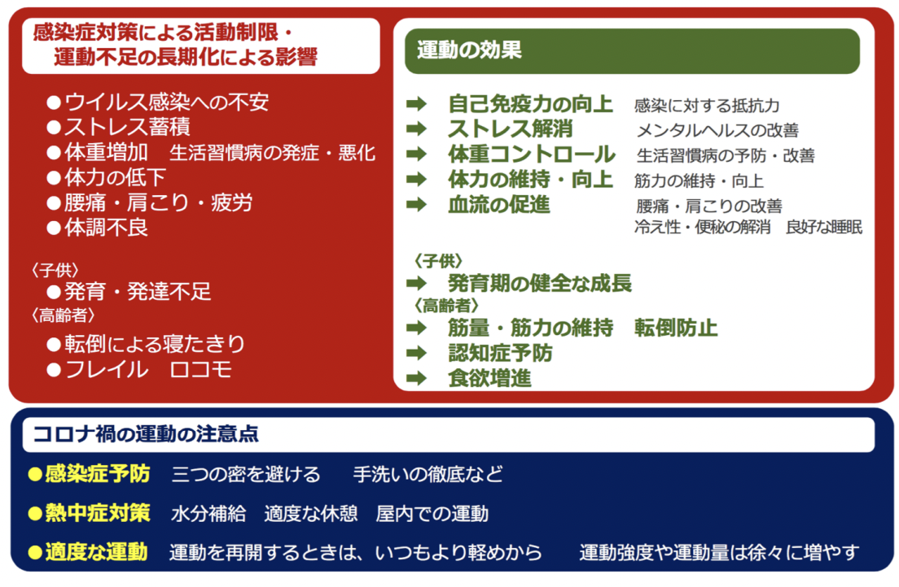
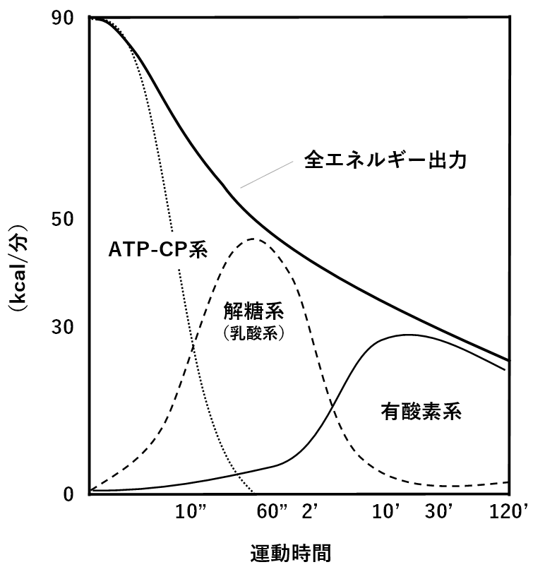
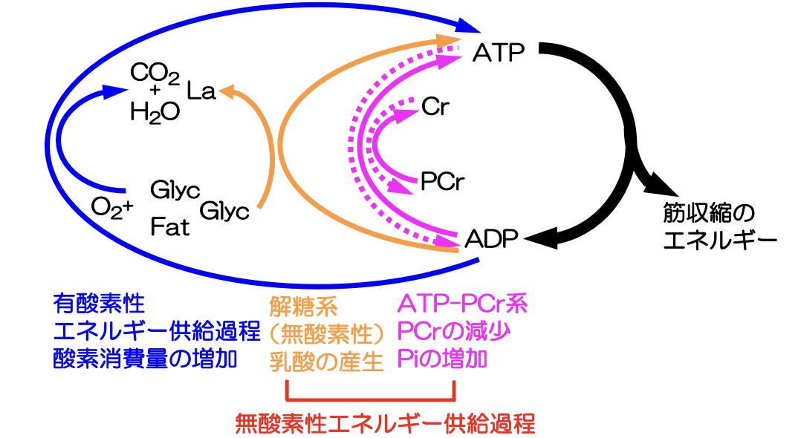
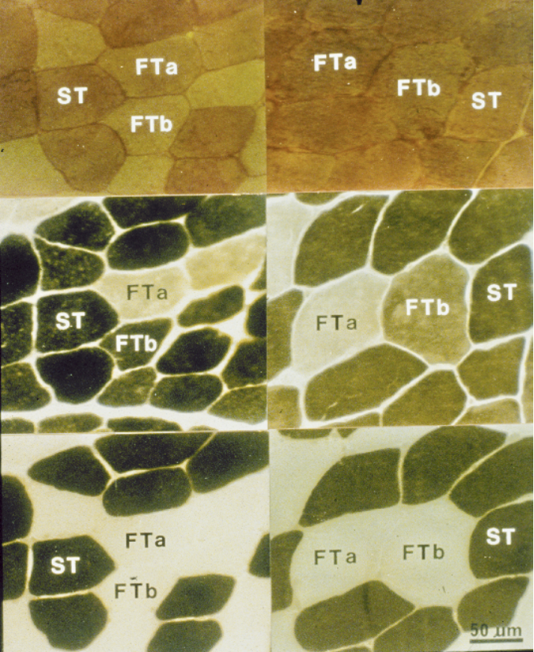
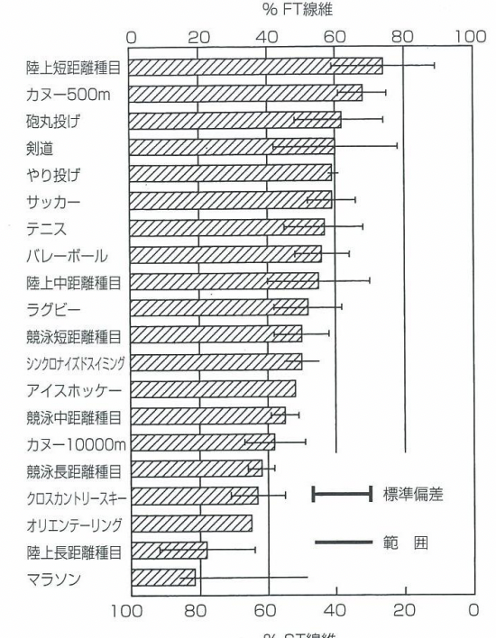
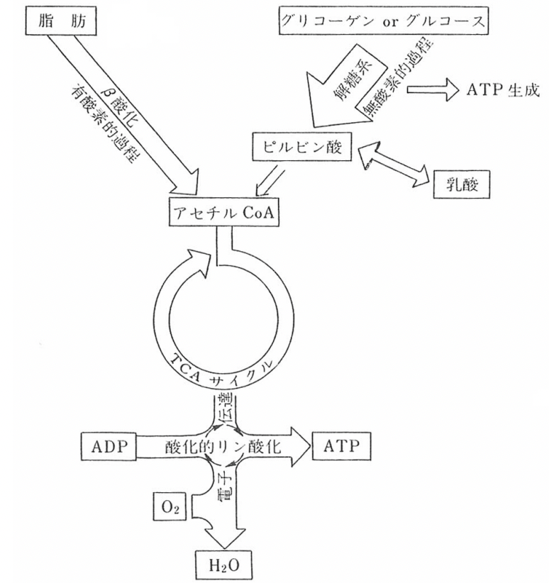

# 0921 筋線維組成と筋エネルギー代謝
## 新しい生活様式におけるスポーツのあり方 コロナ禍の健康二次被害
   

## "Exercise is Medicine"

## 筋の種類
- 随意筋
  - 骨格筋：横紋筋
- 不随意筋
  - 心筋：横紋筋
  - 平滑筋

## 筋エネルギー
生体内で用いられるすべてのエネルギーは、ATPの加水分解によって得られる。  
ATPの枯渇はすなわち死を意味するので、このATPを絶えず再合成する必要がある。  
### 生体内でのATP供給系
- 貯蔵されているATP：ほとんどない
- クレアチンリン酸 PCrの分解
- 解糖系による無酸素的合成
- ミトコンドリアでの酸化的リン酸化反応

### エネルギー供給の限界とパワー
エネルギーの容量：酸化的リン酸化反応 > 解糖系 > クレアチンリン酸系  
エネルギー供給の速さ：クレアチンリン酸系 > 解糖系 > 酸化的リン酸系  
単位時間あたりに莫大なエネルギーが必要な運動時は、クレアチンリン酸によってATPが供給されている。  
酸素を使わずに全力で運動できる時間（理論値）は40秒。  

### 最大運動時の各種エネルギー供給機構の時間的/量的関係  
  

#### cf. 木目の論文
最大努力でハンドグリップ運動を10秒間実施した際の筋酸素消費量の変化を調査したところ、筋酸素消費量は安静時に比べて平均で25.4%まで増加した。  

### 短時間運動時でも有酸素性代謝は亢進する  
以前は30秒以内の運動における主たるエネルギー供給系は無酸素系で、酸化的リン酸化系はほとんど動員されないと報告されていた。  
しかし、現在は最大運動開始後9秒以内に最大有酸素ATP合成率の85%まで増加するとされている。  
短時間高強度運動の場合は、これまでに報告されている以上に骨格筋酸素消費量が増加することが明らかになった。   

### エネルギー供給過程

## 筋肉
### 筋生検（**Muscle Biopsy** in English）のATP染色

### 筋線維タイプ
|                    | 遅筋線維 Slow Twitch Fiber / I | 速筋線維A Fast Twitch A Fiber / IIA | 速筋線維B Fast Twitch B Fiber / IIB / IIX | 
| ------------------ | --------------------------------- | -------------------------------------- | -------------------------------------------- | 
| 収縮速度           | 遅い                              | 速い                                   | 速い                                         | 
| 持続時間           | 長い                              | やや長い                               | 短い                                         | 
| 酸化的酵素         | 高い                              | やや高い                               | 低い                                         | 
| 解糖系酵素         | 低い                              | 高い                                   | 高い                                         | 
| 疲労               | 疲労しにくい                      | 中等度                                 | 疲労しやすい                                 | 
| 筋線維の太さ       | 細い                              | 中等度                                 | 太い                                         | 
| 色                 | 赤い                              | 赤い                                   | 白い                                         | 
| ミオグロビン含量   | 多い                              | 多い                                   | 少ない                                       | 
| ミトコンドリア     | 多い                              | 多い                                   | 少ない                                       | 
| 解糖能             | やや低い                          | 中等度                                 | 高い                                         | 
| グリコーゲン含有量 | 少ない →脂肪も使うから        | 多い                                   | 多い                                         | 
| ATPの供給源        | TCA回路・電子伝達系               | TCA回路・電子伝達系+解糖               | 解糖                                         | 

### 一流の競技スポーツ選手の筋線維組成

### ヒトの外側広筋における筋線維組成の分布
遅筋線維と速筋線維の割合は、性差なく50:50であった。  
※中にはどちらか一方に極端に偏った組成を持つ者もみられた。

### ヒト骨格筋の筋線維組成を決定する因子
- 遺伝要因：45%
- 環境要因：40%
- サンプリング、測定技術の要因：15%  

筋に含まれる遅筋線維と速筋線維の割合は遺伝的に決定しており、大きく変化することはない。

####　一卵性双生児と二卵性双生児のペア間の筋線維組成  
二卵性より一卵性の方が、ペア間の筋線維組成は相似している。  

#### 持久トレーニングによる筋線維組成の変化
持久的トレーニングを継続して行うと、typeIIA線維の割合が徐々に増加し、それに次いでtypeIIB線維の割合が減少する。

#### 持久的トレーニングによる筋線維のタイプ移行
トレーニングを行うと、typeIIB線維のいくつかはtypeIIA線維に移行する。  
しかし、トレーニングを中止すると再びtypeIIB線維に戻ってしまう。

### ATP合成過程概念図
  

持久的能力の向上により、脂肪が蓄積しにくい体へと変化する。

1. 健常成人が短時間高強度運動（1分間の全カペダリング運動）を実施した。運動終了時における血糖値変化（上昇、下降、変化なし）およびそのメカニズムについて説明しなさい。
2. 動的負荷に比べて静的負荷の方で平均動脈血圧が上昇しやすいのは何故か。カッコ内の言葉を必ず用いて説明しなさい。（心拍出量、末梢循環抵抗）